### **Topic 6: Balanced Search Trees**
<span class="badge badge-pill badge-info">Binary Search Tree</span>
<span class="badge badge-pill badge-info">Balanced Search Trees</span>
<span class="badge badge-pill badge-info">k-d Tree</span>


Binary Search Tree have poor worst-case performance. Balanced Search Trees are *guaranteed* to be logarithmic, no matter what sequence of keys is used to construct them.

### 2-3 Search Trees

!!! Definition
    
    A 2-3 *search tree* is a tree that is either empty or 

    * A 2-*node*, with one key (and associated value) and two links, a left link to a 2-3 search tree with smaller keys, and a right link to a 2-3 search tree with larger keys
    * A 3-*node*, with two keys (and associated values) and three links, a left link to a 2-3 search tree with smaller keys, a middle link to a 2-3 search tree with keys between the node’s keys, and a right link to a 2-3 search tree with larger keys
    
    As usual, we refer to a link to an empty tree as a *null link.*
    
    A **perfectly balanced** 2-3 search tree is one whose null links are all the same distance from the root.

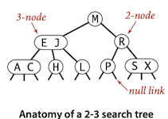


#### Search 

To determine whether a key is in the tree, we compare it against the keys at the root. If it is equal to any of them, we have a search hit; otherwise, we follow the link from the root to the subtree corresponding to the interval of key values that could contain the search key. If that link is null, we have a search miss; otherwise we recursively search in that subtree.


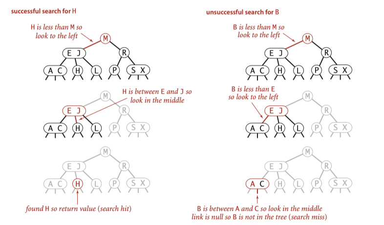


#### Insert into a 2-node

If the search terminates as a 2-node: we just replace the node with a 3-node containing its key and the new key to be inserted.

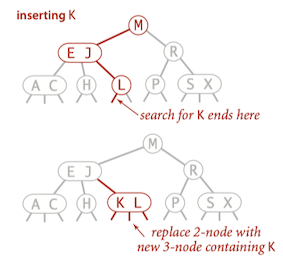

#### Insert into a tree consisting of a single 3-node.

To insert into a tiny 2-3 tree consisting of just a single 3-node, we temporarily put the new key into a 4-*node*, which has 3 keys and four links. It is easy to convert a 4-*node* into a 2-3 tree made up of three 2-nodes, one with the middle key (at the root), one with the smallest of the three keys (pointed to by the left link of the root), and one with the largest of the three keys (pointed to by the right link of the root).

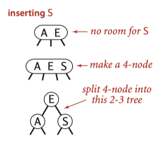

#### Insert into a 3-node whose parent is a 2-node

Making a temporary 4-node, then splitting the 4-node instead of creating a new node to hold the middle key, we move the middle key to the node's parent.

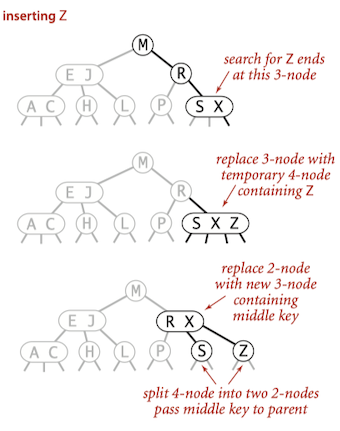

#### Insert into a 3-node whose parent is a 3-node.

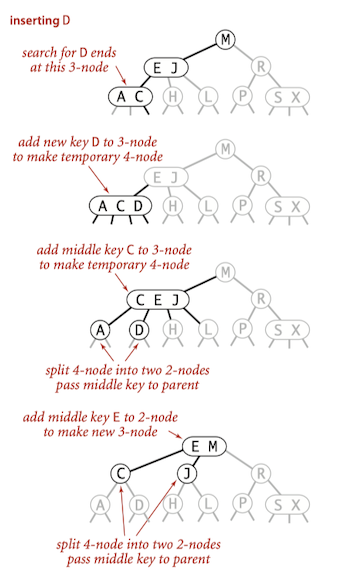


#### Global properties

Moreover, these *local* transformations preserve the global properties that the tree is ordered and perfectly balanced: the number of links on the path from the root to any null link is the same.

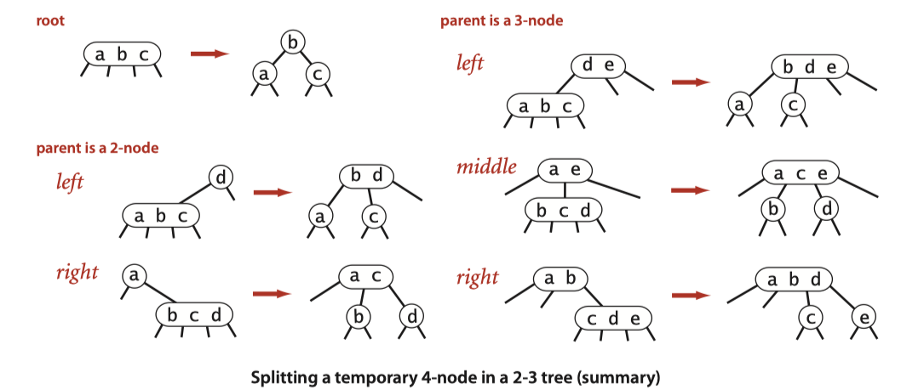

Unlike standard BSTs, which grow down from the top, 2-3 trees grow *up from the bottom*.


#### Analysis 

Search and insert operations in a 2-3 tree with *N* keys are *guaranteed* to visit at most $\lg N$ nodes.

### Red-black BSTs

Although 2-3 search tree guarantee good worst-case performance, it is inconvenient to implement because there are numerous different cases to be handled.

* maintain two different types of nodes, 
* compare search keys against each of the keys in the nodes,
* copy links and other information from one type of node to another
* convert nodes from one type to another, and so forth.

In this section, We will consider a simple representation of 2-3 search tree known as a *red-black* BST that leads to a natural implementation.

!!! Definition

    Red-black BSTs is BSTs having red and black links and satisfying the following three restrictions:
    
    * Red links lean left. 
    * No node has two red links connected to it. 
    * The tree has *perfect black balance*: every path from the root to a null link has the same number of black links.


#### Encoding 3-nodes

The basic idea behind red-black BSTs is to encode 2-3 trees by starting with standard BSTs (which are made up of 2-nodes) and adding extra information to encode 3-nodes. We think of the links as being of two different types: 

* red links, which bind together two 2-nodes to represent 3-nodes, 
* black links, which bind together the 2-3 tree. 

Specifically, we represent 3-nodes as two 2-nodes connected by a single red link that leans left. We refer to BSTs that represent 2-3 trees in this way as red-black BSTs.

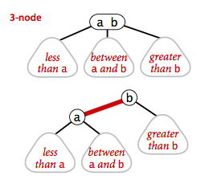


#### A 1-1 correspondence

If we draw the red links horizontally in a red-black BST, all of the null links are the same distance from the root, and if we then collapse together the nodes connected by red links, the result is a 2-3 tree. 

Conversely, if we draw 3-nodes in a 2-3 tree as two 2-nodes connected by a red link that leans left, then no node has two red links connected to it, and the tree has perfect black balance, since the black links correspond to the 2-3 tree links, which are perfectly balanced by definition.


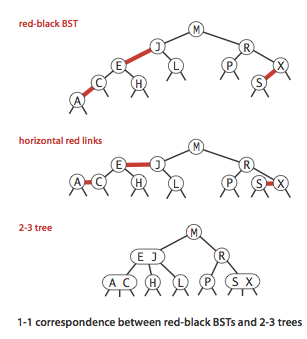


#### Color representation

Since each node is pointed to by precisely one link (from its parent), we encode the color of links in *nodes*, by adding a <C>boolean</C> instance variable <C>color</C> to our <C>Node</C> data type, which is <C>true</C> if the link from the parent is red and <C>false</C> if it is black. By convention, null links are black.


```Java
private static final boolean RED = true;
private static final boolean BLACK = false;

private class Node {
    private Key key;           // key
    private Value val;         // associated data
    private Node left, right;  // links to left and right subtrees
    private boolean color;     // color of parent link
    private int size;          // subtree count

    public Node(Key key, Value val, boolean color, int size) {
        this.key = key;
        this.val = val;
        this.color = color;
        this.size = size;
    }
}

private boolean isRed(Node x) {
    if (x == null) return false;
    return x.color == RED;
}
```

#### Rotations

The implementation that we will consider might allow right-leaning red links or two red-links in a row during an operation, but it always corrects these conditions before completion, through judicious use of an operation called *rotation* that switches orientation of red links. 

If the right child is red and the left child is black, rotate left. If both the left child and its left child are red, rotate right.

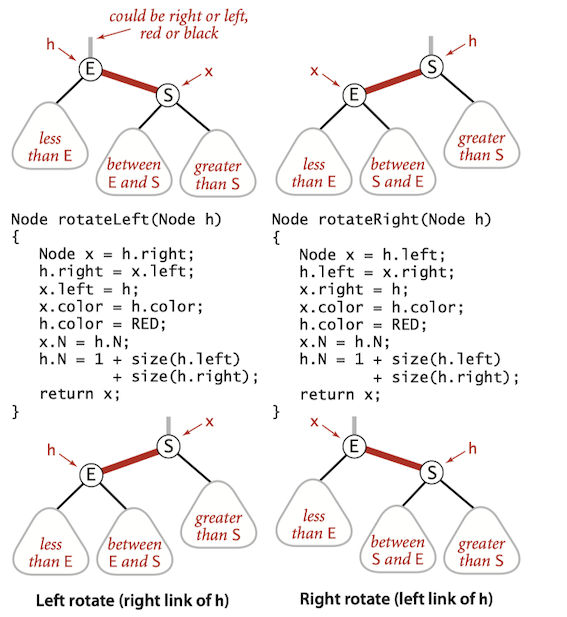


#### Flipping colors

The implementation that we will consider might also allow a black parent to have two red children. The color flip operation flips the colors of the the two red children to black and the color of the black parent to red.

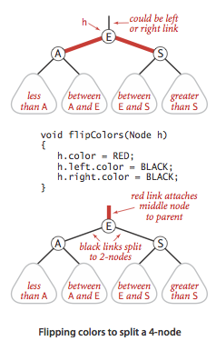


#### Implementation: put()

The code for the recursive <C>put()</C> for red-black BSTs is identical to <C>put()</C> in elementary BSTs except for the three <C>if</C> statements after the recursive calls, which provide near-perfect balance in the tree by maintaining a 1-1 correspondence with 2-3 trees, on the way up the search path.

* The first rotates left any right-leaning 3-node (or a right-leaning red link at the bottom of a temporary 4-node); 
* The second rotates right the top link in a temporary 4-node with two left-leaning red links;
* The third flips colors to pass a red link up the tree (see text).

```java
// Red-black tree insertion.
public void put(Key key, Value val) {
    root = insert(root, key, val);
    root.color = BLACK;
    assert check();
}

private Node put(Node h, Key key, Value val) { 
    if (h == null) {
        n++;
        return new Node(key, val, RED);
    }

    int cmp = key.compareTo(h.key);
    if      (cmp < 0) h.left  = put(h.left,  key, val); 
    else if (cmp > 0) h.right = put(h.right, key, val); 
    else              h.val   = val;

    // fix-up any right-leaning links
    if (isRed(h.right) && !isRed(h.left))      h = rotateLeft(h);
    if (isRed(h.left)  &&  isRed(h.left.left)) h = rotateRight(h);
    if (isRed(h.left)  &&  isRed(h.right))     flipColors(h);

    return h;
}
```

### Application : Kd Tree

k-d Tree is invented in 1970s by Jon Bentley. Its name originally meant "3d-trees, 4d-trees", where k was the number of dimensions. Its Idea is simple: Each level of the tree compares against 1 dimension.


#### Insert

The algorithms for search and insert are similar to those for BSTs, but at the level $cd$(cut dimension) we use the $cd$th coordinate (if the point to be inserted has a smaller coordinate than the point at the root, go left; otherwise go right);


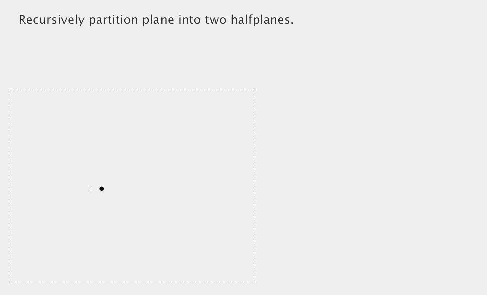

```Java
// Insert a point
public void put(Point p) {
    root = put(p, root, 0);
}

// put a point into current subtree.
// @param p: the point to put
// @param x: the root of the current subtree
// @param cd: cut dim
private KDNode put(Point p, KDNode x, int cd) {
    if (x == null) { size++;  return new KDNode(p); }
    if (p.equals(x.p))   ; // the point repeats, only contain one copy
    else if (p.get(cd) < x.p.get(cd)) 
        x.left = put(p, x.left, (cd + 1) % dim);
    else 
        x.right = put(p, x.right, (cd + 1) % dim);
    return x;
}
```

#### Nearest Neighbor

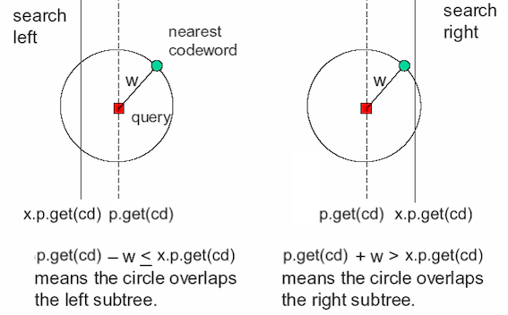

```Java
/**
 * A nearest neighbor in the set to point p; null if the set is empty
 * @param p: an point
 * @return a nearest neighbor, null if the set is empty
 */
public Point nearestNeighbor(Point p) {
    minDistanceSquared = Double.POSITIVE_INFINITY;
    nearestPoint = null;
    nearestNeighbor(p, root, 0);
    return nearestPoint;
}

private void nearestNeighbor(Point p, KDNode x, int cd) {
    // if this bounding box is too far, do nothing
    if (x == null) return;

    // if this point is better than the best:
    double distanceSquared = p.distanceSquaredTo(x.p);
    if (distanceSquared < minDistanceSquared) {
        minDistanceSquared = distanceSquared;
        nearestPoint = x.p;
    }

    // visit subtrees is most promising order:
    if (p.get(cd) < x.p.get(cd)) {
        nearestNeighbor(p, x.left, (cd + 1) % dim);
        if (p.get(cd) + distanceSquared > x.p.get(cd))
            nearestNeighbor(p, x.right, (cd + 1) % dim);
    }
    else{
        nearestNeighbor(p, x.right, (cd + 1) % dim);
        if (p.get(cd) - distanceSquared <= x.p.get(cd))
            nearestNeighbor(p, x.right, (cd + 1) % dim);
    }
}
```