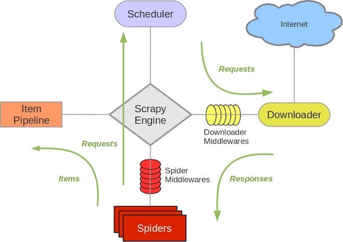

### **Python3网络爬虫开发实战 - Scrapy框架的使用**

### Scrapy框架介绍
[Scrapy](https://scrapy.org/)是一个基于[Twisted](https://twistedmatrix.com/trac/)的异步处理框架，是纯Python实现的爬虫框架，其架构清晰，模块之间的耦合程度低，可扩展性极强，可以灵活完成各种需求。



* Engine。 引擎，处理整个系统的数据流处理、触发事务，是整个框架的核心。
* Item。 项目，它定义了爬取结果的数据结构，爬取的数据会被赋值成该Item对象。 
* Scheduler。调度器，接受引擎发过来的请求并将其加入队列中，在引擎再次请求的时候将请求提供给引擎。
* Downloader。下载器，下载网页内容，并将网页内容返回给蜘蛛。
* Spiders。 蜘蛛，其内定义了爬取的逻辑和网页的解析规则，结果和新的请求。 
* Item Pipeline。 项目管道, 负责处理由蜘蛛从网页中抽取的项目，它主要负责解析响应并生成提取. 它的主要任务是清洗 、验证和存储数据。 
* Downloader Middlewares。 下载器中间件, 位于引擎和下载器之间的组件，主要处理引擎与下载器之间的请求及响应。 
* Spider Middlewares。 蜘蛛中间件，位于引擎和蜘蛛之间的组件，主要处理蜘蛛输入的响应和输出的结果及新的请求。

Scrapy中的数据流由引擎控制，数据流的过程如下。

1. Engine 首先打开一个网站， 找到处理该网站的 Spider ，并向该 Spider 请求第一个要爬取的 URL。
2. Engine从Spider中获取到第一个要爬取的URL，并通过Scheduler以<C>Request</C>的形式调度 。
3. Engine向Scheduler请求下一个要爬取的URL。
4. Scheduler返回下一个要爬取的URL给Engine, Engine将URL通过Downloader Middlewares转发给 Downloader下载。 
5. 一旦页面下载完毕， Downloader生成该页面的<C>Response</C>， 并将其通过Downloader Middlewares发送给Engine。
6. Engine从下载器中接收到<C>Response</C> ， 并将其通过Spider Middlewares发送给Spider处理。
7. Spider处理 Response，并返回爬取到的Item及新的<C>Request</C>给Engine。
8. Engine将Spider返回的Item给ItemPipeline，将新的Request给Scheduler。
9. 重复第（2）步到第（8 ）步， 直到Scheduler中没有更多的<C>Request</C> , Engine关闭该网站， 爬取结束。

### Scrapy入门

创建一个Scrapy项目，项目文件可以直接用scrapy命令生成

```bash
scrapy startproject projectname
```

创建之后，项目文件结构如下所示 ：

```
scrapy.cfg 
project/
    __init__. py
    items.py 
    pipelines.py
    settings.py 
    middlewares.py 
    spiders/
        init.py 
```

Spider是自己定义的类， scrapy用它来从网页里抓取内容， 并解析抓取的结果。 不过这个类必须继承scrapy提供的Spider类<C>scrapy.Spider</C>， 还要定义Spider的名称和起始请求， 以及怎样处理爬取后的结果的方法。

也可以使用命令行创建一个Spider。 比如要生成Quotes这个Spider，可以执行如下命令： 

```
cd projectname 
scrapy genspider quotes quotes.toscrape.com
```
genspider命令的第一个参数是Spider的名称， 第二个参数是网站域名。执行完毕之后，spiders文件夹中多了一个quotes.py，它就是刚刚创建的Spider, 内容如下所示： 

```
class QuotesdemoSpider(scrapy.Spider):
    name = 'quotesdemo'
    allowed_domains = ['quotes.toscrape.com']
    start_urls = ['http://quotes.toscrape.com/']

    def parse(self, response):
        pass
```
这里有三个属性 -- <C>name</C>, <C>allowed_domains</C>, <C>start_urls</C>, 还有一个方法 <C>parse</C>。

* <C>name</C>, 它是每个项目唯一的名字， 用来区分不同的Spider。
* <C>allowed_domains</C>, 它是允许爬取的域名，如果初始或后续的请求链接不是这个域名下的，则请求链接会被过滤掉。 
* <C>start_urls</C>，它包含了Spider在启动时爬取的url列表，初始请求是由它来定义的 。 
* <C>parse</C>，它是<C>Spider</C>的一个方法。 默认情况下，被调用时<C>start_urls</C>里面的链接构成的请求完成下载执行后， 返回的响应就会作为唯一的参数传递给这个函数。 该方法负责解析返回的响应、提取数据或者进一步生成要处理的请求。

### Scrapy对接Selenium

Scrapy抓取页面的方式和requests库类似，都是直接模拟HTTP请求，所以Scrapy也不能抓取JavaScript动态渲染的页面。直接用Selenium模拟浏览器进行抓取，可见即可爬。

本节以抓取淘宝商品信息为例子，演示Scrapy框架如何对接Selenium。首先新建项目和Spider，修改`settings.py`中的`ROBOTSTEXT_OBEY=False`。

```bash
scrapy startproject scrapyseleniumtest
scrapy genspider taobao www.taobao.com
```

然后定义Item对象，名为<C>ProductItem</C>

```python
class ProductItem(scrapy.Item):
    # define the fields for your item here like:
    # name = scrapy.Field()
    collection = 'products'
    image = scrapy.Field()
    price = scrapy.Field()
    deal = scrapy.Field()
    titlte = scrapy.Field()
    shop = scrapy.Field()
    location = scrapy.Field()
```

这里我们定义了6个<C>Field</C>，然后定义了一个<C>collection</C>属性，即此<C>Item</C>保存的MongoDB的<C>Collection</C>名称。

初步实现Spider的<C>start_requests()</C>方法:

```python
class TaobaoSpider(scrapy.Spider):
	name = 'taobao'
	allowed_domains = ['taobao.com']
	base_url = ['https://s.taobao.com/search?q=']

	def start_requests(self):
		for keyword in self.settings.get("KEYWORDS"):
			for page in range(1, self.settings.get("MAX_PAGE") + 1):
				url = self.base_url + quote(keyword)
				yield scrapy.Request(url=url, callback=self.parse, 
				    meta={'page': page}, dont_filter=True)
```

首先定义了商品列表的URL-<C>base_url</C>, 其后拼接一个搜索关键字就是该关键字在淘宝搜索结果商品列表页面。关键字用KEYWORDS标识，定义为一个列表，最大翻页页码用MAX_PAGE表示。他们统一定义在`settings.py`里面，

```Python
KEYWORDS = ['iPad']
MAX_PAGE = 100
```

接下来我们需要处理这些请求的抓取：对接Selenium进行抓取，采用Downloader Middleware来实现。在Middleware里面的<C>process_request()</C>方法里对每个抓取请求进行处理，启动浏览器并进行页面渲染，再将渲染后的结果构造一个<C>HtmlResponse</C>对象返回。

 ```Python
 ```


