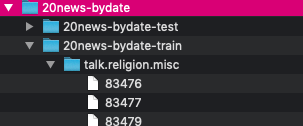

### **面向程序员的数据挖掘指南 - 6 朴素贝叶斯算法和非结构化文本**

**结构化数据**是指数据集中的每条数据（上表中的一行）由多个特征进行描述。例如前面章节涉及的比马印第安人糖尿病数据集。

**非结构化数据**指的是诸如电子邮件文本、推特信息、博客、新闻等。这些数据至少第一眼看起来是无法用一张表格来展现的。

### 自动判别文本中的感情色彩

假设我们要构建一个自动判别文本感情色彩的系统，它有什么作用呢？比如说有家公司是售卖健康检测设备的，他们想要知道人们对这款产品的反响如何。他们投放了很多广告，顾客是喜欢(我好想买一台)还是讨厌(看起来很糟糕)呢？

假设我要从文本中区分顾客对某些食品的喜好，可能就会列出一些表达喜欢的词语，以及表达厌恶的词：

* 表达喜欢的词：美味、好吃、不错、喜欢、可口 
* 表达厌恶的词：糟糕、难吃、不好、讨厌、恶心

我们的训练集是一组文本，又称为**语料库**。每个文本(即每条记录)是一条推文，并被标记为喜欢和讨厌两类。

<hh>训练阶段</hh>

首先，我们统计所有文本中一共出现了多少个不同的单词，记作“|Vocabulary|”（总词汇表）。

对于每个单词$w_k$ ，我们将计算$P(w_k|h_i)$，每个$h_i$(喜欢和讨厌两种)的计算步骤如下：

1. 将该分类下的所有文章合并到一起；
2. 统计每个分类中单词数量，记为$n_i$；
3. 对于总词汇表中的单词$w_k$，统计他们在本类文章中出现的次数$n_k$
4. 最后计算概率：$P(w_k|h_i)=\large \frac{n_k+1}{n_i+|\text{Vocabulary}|}$

<hh>分类阶段</hh>

分类阶段比较简单，直接应用贝叶斯公式就可以了。

比如下面这句话，要如何判断它是正面还是负面的呢？“I am stunned by the hype over gravity.” 我们需要计算的是下面两个概率，并选取较高的结果：

```
P(like)×P(I|like)×P(am|like)×P(stunned|like)×...
P(dislike)×P(I|dislike)×P(am|dislike)×P(stunned|dislike)×...
```


### Application: 20 Newsgroups

20newsgroups数据集是用于文本分类、文本挖据和信息检索研究的国际标准数据集之一。数据集收集了大约20,000左右的新闻组文档，分为20个不同主题的新闻组集合。


下载下来后，文档格式如下：




#### 停用词

**停用词**指的是那些没有意义的、组成语法结构的单词，它们产生会很多噪音。这些单词一般并不会对分类结果产生大的影响。有专门的停用词表可供使用。

去除停用词的好处：

1. 能够减少需要处理的数据量；
2. 这些词的存在会对分类效果产生负面影响。

中文的常用停用词表可以在[这里](https://github.com/goto456/stopwords)找到。
[英文的停用词表](http://www.ranks.nl/stopwords)

#### 常用词和停词

虽然像the、a这种单词的确没有意义，但有些**常用词**如work、write、school等在某些场合下还是有作用的，如果将他们也列进停词表里可能会有问题。

#### Python代码

分类器的初始化代码要完成以下工作：

1. 读取停词列表；
2. 获取训练集中各目录（分类）的名称；
3. 对于各个分类，调用train方法，统计单词出现的次数；
4. 计算各个单词出现的概率

```python
class BayesText:

	def __init__(self, trainingdir, stopwordlist):
		"""
		This class implements a naive Bayes approach to text
		classification.
		:param trainingdir, is the training data. Each subdirectory of
			trainingdir is titled with the name of the classification
			category -- those subdirectories in turn contain the text
			files for that category.
		:param stopwordlist, is a list of words (one per line) will be
			removed before any counting takes place.
		"""
		self.vocabulary = {}
		self.prob = {}
		self.totals = {}
		self.stopwords = {}
		f = codecs.open(stopwordlist, mode='r', encoding="utf-8")
		for line in f:
			self.stopwords[line.strip()] = 1
		f.close()
		categories = os.listdir(trainingdir)
		# filter out files that are not directories
		self.categories = [filename for filename in categories
		                   if os.path.isdir(trainingdir + filename)]
		print("Counting ...")
		for category in self.categories:
			print('    ' + category)
			(self.prob[category],
			 self.totals[category]) = self.train(trainingdir, category)

		# I am going to eliminate any word in the vocabulary
		# that doesn't occur at least 3 times
		toDelete = []
		for word in self.vocabulary:
			if self.vocabulary[word] < 3:
				# mark word for deletion
				# can't delete now because you can't delete
				# from a list you are currently iterating over
				toDelete.append(word)
		# now delete
		for word in toDelete:
			del self.vocabulary[word]

		# now compute probabilities
		vocabLength = len(self.vocabulary)
		print("Computing probabilities:")
		for category in self.categories:
			print('    ' + category)
			denominator = self.totals[category] + vocabLength
			for word in self.vocabulary:
				if word in self.prob[category]:
					count = self.prob[category][word]
				else:
					count = 1
				self.prob[category][word] = (float(count + 1)
				                             / denominator)
		print("DONE TRAINING\n\n")

	def train(self, trainingdir, category):
		"""
		counts word occurrences for a particular category
		"""
		currentdir = trainingdir + category
		files = os.listdir(currentdir)
		counts = {}
		total = 0
		for file in files:
			f = codecs.open(currentdir + '/' + file, 'r', 'iso8859-1')
			for line in f:
				tokens = line.split()
				for token in tokens:
					# get rid of punctuation and lowercase token
					token = token.strip('\'".,?:-')
					token = token.lower()
					if token != '' and not token in self.stopwords:
						self.vocabulary.setdefault(token, 0)
						self.vocabulary[token] += 1
						counts.setdefault(token, 0)
						counts[token] += 1
						total += 1
			f.close()
		return (counts, total)

	def classify(self, filename):
		"""
		classify files
		:param filename: a file
		:return: classification result
		"""
		results = {}
		for category in self.categories:
			results[category] = 0
		f = codecs.open(filename, 'r', 'iso8859-1')
		for line in f:
			tokens = line.split()
			for token in tokens:
				# print(token)
				token = token.strip('\'".,?:-').lower()
				if token in self.vocabulary:
					for category in self.categories:
						if self.prob[category][token] == 0:
							print("%s %s" % (category, token))
						results[category] += math.log(
							self.prob[category][token])
		f.close()
		results = list(results.items())
		results.sort(key=lambda tuple: tuple[1], reverse=True)
		# for debugging I can change this to give me the entire list
		return results[0][0]

	def testCategory(self, directory, category):
		"""
		test all files for the category in this directory
		:param directory: a directory containing category
		:param category: a categeory folder contains files 
		"""
		files = os.listdir(directory)
		total = 0
		correct = 0
		for file in files:
			total += 1
			result = self.classify(directory + file)
			if result == category:
				correct += 1
		return (correct, total)

	def test(self, testdir):
		"""
		Test all files in the test directory--that directory is
		organized into subdirectories--each subdir is a classification
		category
		:param testdir: test directory
		"""
		categories = os.listdir(testdir)
		# filter out files that are not directories
		categories = [filename for filename in categories if
		              os.path.isdir(testdir + filename)]
		correct = 0
		total = 0
		for category in categories:
			print(".", end="")
			(catCorrect, catTotal) = self.testCategory(
				testdir + category + '/', category)
			correct += catCorrect
			total += catTotal
		print("\n\nAccuracy is  %f%%  (%i test instances)" %
		      ((float(correct) / total) * 100, total))
```
	
### 朴素贝叶斯与情感分析
	
情感分析的目的是判断作者的态度或意见。情感分析的例子之一是判断一篇评论是正面的还是反面的，我们可以用朴素贝叶斯算法来实现。

Pang&Lee 2004的[电影评价数据](http://www.cs.cornell.edu/people/pabo/movie-review-data/)集包含1000个正面和1000个负面的评价。