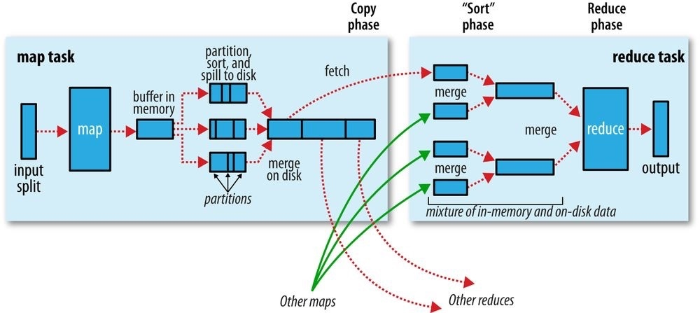
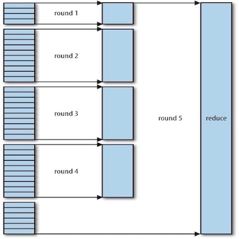

### **Hadoop: The Definitive Guide 7 - How MapReduce Works**

### 1 Anatomy of a MapReduce Job Run

#### Job Submission

#### Job Initialization

#### Task Assignment

#### Task Execution

#### Progress and Status Updates

#### Job Completion

### 2 Failures
### 3 Shuffle and Sort

MapReduce makes the guarantee that the input to every reducer is **sorted by key**. The process by which the system performs the sort — and transfers the map outputs to the reducers as inputs — is known as the **shuffle**. In many ways, the shuffle is the heart of MapReduce and is where the “magic” happens.

#### The Map Side

* Each map task has a circular memory buffer that it writes the output to. 
* When the contents of the buffer reach a certain threshold size, a background thread will start to spill the contents to disk.
* Before it writes to disk, the thread first divides the data into partitions corresponding to the reducers that they will ultimately be sent to. 
* Within each partition, the background thread performs an in-memory sort by key, and if there is a combiner function, it is run on the output of the sort.
* Before the task is finished, the spill files are merged into a single partitioned and sorted output file.
* It is often a good idea to compress the map output as it is written to disk, because doing so makes it faster to write to disk, saves disk space, and reduces the amount of data to transfer to the reducer.

#### The Reduce Side

* the ***copy phase*** of the reduce task: The map tasks may finish at different times, so the reduce task starts copying their outputs as soon as each completes.
    * Map outputs are copied to the reduce task JVM’s memory if they are small enough; otherwise, they are copied to disk.
* As the copies accumulate on disk, a background thread merges them into larger, sorted files. This saves some time merging later on.
* When all the map outputs have been copied, the reduce task moves into the ***sort phase*** (which should properly be called the ***merge phase***, as the sorting was carried out on the map side), which merges the map outputs, maintaining their sort ordering.
    * This is done in rounds.(Figure below) 
* For the last merge, directly feeding the reduce function in what is the last phase: the reduce phase.
* The output of the last phase is written directly to the output filesystem, typically HDFS.

#### Configuration Tuning

### 4 Task Execution