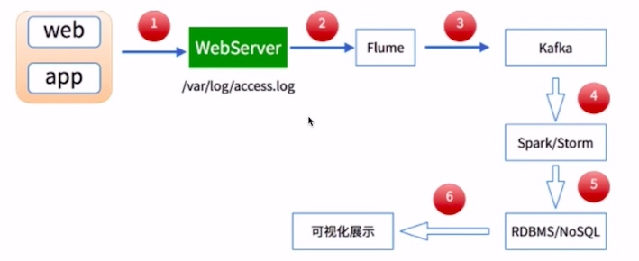
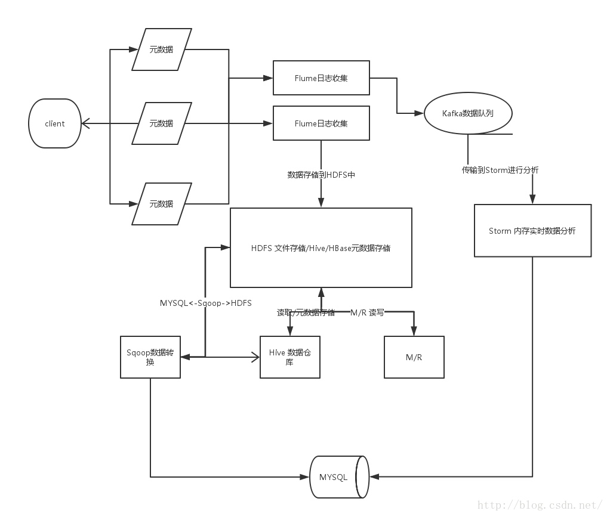
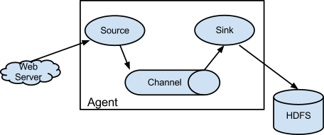
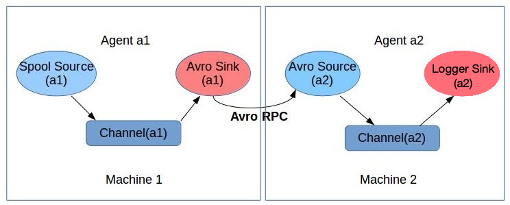
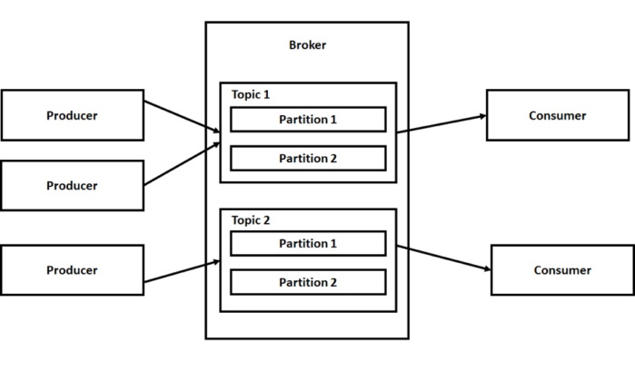
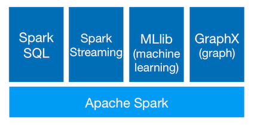
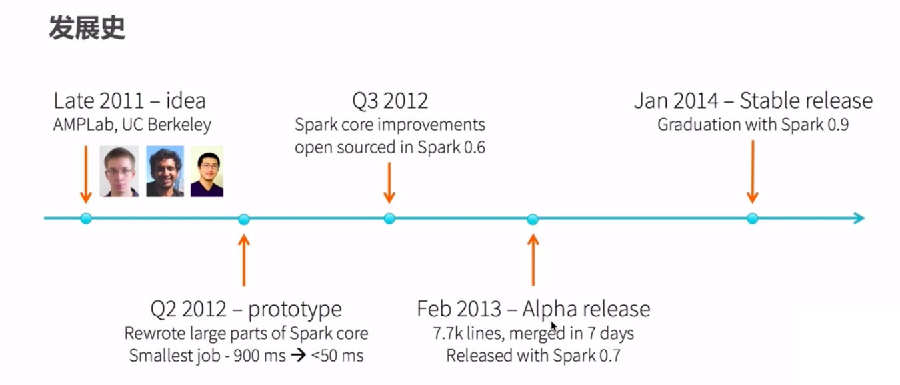

### **Spark Streaming实时流处理项目**


该项目从实时数据产生和流向的不同环节出发，通过集成主流的分布式日志收集框架Flume、分布式消息队列Kafka、分布式列式数据库HBase、以及Spark Streaming实现实时流处理。

###1 初识实时流处理

#### 业务现状分析

需求：统计主站每个（指定）课程访问的客户端、地域信息分布

==> 如上两个操作：采用离线（spark/mapreduce）的方式进行统计

实现步骤：
 
* 课程编号，ip信息，user-agent
* 进行相应的统计分析操作：MapReduce/Spark

项目架构：

* 日志收集：Flume
* 离线分析：MapReduce/Spark
* 统计结果图形化展示

问题：
    
* 小时级别
* 10分钟
* 秒级别


#### 实时流处理产生背景

* 时效性高
* 数据量大

#### 实时流处理概述

https://www.oreilly.com/ideas/the-world-beyond-batch-streaming-101

* 实时计算 apache storm
* 流式计算
* 实时流式计算

#### 离线计算与实时计算对比

* 数据来源
    * 离线：来自HDFS上的历史数据，数据量比较大
    * 实时：来自消息队列(Kafka)，是实时新增/修改记录过来的某一笔数据
* 处理过程
    * 离线：MapReduce, map + reduce
    * 实时: Spark(DStream/SS) 
* 处理速度
    * 离线：幔
    * 实时：快速 
* 进程
    * 离线：进程有启动+销毁的过程
    * 实时： 7*24小时运行

#### 实时流处理框架对比

* [Apache Storm](http://storm.apache.org/)

> Apache Storm is a free and open source distributed **realtime** computation system. Storm makes it easy to reliably process unbounded streams of data, doing for realtime processing what Hadoop did for batch processing. Storm is simple, can be used with any programming language, and is a lot of fun to use!

* [Apache Spark Streaming](https://spark.apache.org/streaming/)

> 实际上是微批处理（批处理间隔非常小)

* [Apache kafka](http://kafka.apache.org/)
* [Apache Flink](https://flink.apache.org/)

> Apache Flink is a framework and distributed processing engine for stateful computations over unbounded and bounded data streams. Flink has been designed to run in all common cluster environments, perform computations at in-memory speed and at any scale.


#### 实时流处理架构和技术选型




加一层flume消息队列，主要为了减轻压力，起到缓冲作用




#### 实时流处理在企业中的应用

* 电信行业： 你的手机套餐流量用完，收到短信提示
* 电商行业：搜索商品时，进行推荐

### 2 分布式日志收集框架Flume

see detail in Hadoop: definitive Guide, [Chapter 14](../hadoop/ch14/)

#### 业务现状分析

You have a lot of servers and systems

* network devices
* operating system
* web servers
* applications

And they generate large amount of logs and other data.

Problem: Since you have a business idea, how to implement the idea?

OPTION: You may move logs and data generated to hadoop hdfs directly.

但是存在问题：

* 如何做监控
* 如何保证时效性
* 直接传送文本数据，开销太大
* 容错
* 负载均衡

SOLUTION: 使用Flume，基本上写配置文件就OK了，Flume自动解决以上问题。

#### Flume概述

> Flume is a distributed, reliable, and available service for efficiently **collecting, aggregating, and moving large amounts of log data**. It has a simple and flexible architecture based on streaming data flows. It is robust and fault tolerant with tunable reliability mechanisms and many failover and recovery mechanisms. It uses a simple extensible data model that allows for online analytic application. [[Apache Flume](http://flume.apache.org/)]


#### Flume架构及核心组件



see detail in Hadoop: definitive Guide, [Chapter 14](../hadoop/ch14/)


#### Flume实战

<hh>需求： 从指定网络端口采集数据<hh>

使用Flume的关键就是写配置文件

* 配置Source, Channel, Sink
* 把以上三个组件串起来

```
http://flume.apache.org/FlumeUserGuide.html#example-2
# example.conf: A single-node Flume configuration

# Name the components on this agent
a1.sources = r1
a1.sinks = k1
a1.channels = c1

# Describe/configure the source
a1.sources.r1.type = netcat
a1.sources.r1.bind = localhost
a1.sources.r1.port = 44444

# Describe the sink
a1.sinks.k1.type = logger

# Use a channel which buffers events in memory
a1.channels.c1.type = memory
a1.channels.c1.capacity = 1000
a1.channels.c1.transactionCapacity = 100

# Bind the source and sink to the channel
a1.sources.r1.channels = c1
a1.sinks.k1.channel = c1
```

> <CB>netcat source</CB>: A netcat-like source that listens on a given port and turns each line of text into an event. It opens a specified port and listens for data. The expectation is that the supplied data is newline separated text. Each line of text is turned into a Flume event and sent via the connected channel. [[NetCat TCP Source](http://flume.apache.org/FlumeUserGuide.html#netcat-tcp-source)]


> <CB>logger sink</CB>: Logs event at INFO level. Typically useful for testing/debugging purpose.  [[Logger Sink](http://flume.apache.org/FlumeUserGuide.html#logger-sink)]

> <CB>memory channel</CB>: The events are stored in an in-memory queue with configurable max size. It’s ideal for flows that need higher throughput and are prepared to lose the staged data in the event of an agent failures. [[memory channel](http://flume.apache.org/FlumeUserGuide.html#memory-channel0)]

```bash
## 启动flume
$ flume-ng agent \
--name a1 \  # agent name
--conf $FLUME_HOME/conf \ # use configs in <conf> directory
--conf-file  example.conf \ # specify a config file
-Dflume.root.logger=INFO,console # sets a Java system property value

## 在另外一个terminal用telnet模拟数据源
$ telnet localhost 44444 
Trying 127.0.0.1...
Connected to localhost.
Escape character is '^]'.
hello
OK
hellomy
OK
```


<hh>需求： 监控一个文件实时采集新增的数据输出到控制台<hh>

Agent选型： exec source + memory channel + logger sink


```
# filename: exec-memeory-logger.conf

# Name the components on this agent
a1.sources = r1
a1.sinks = k1
a1.channels = c1

# Describe/configure the source
a1.sources.r1.type = exec
a1.sources.r1.command = tail -F /tmp/data.log

# Describe the sink
a1.sinks.k1.type = logger

# Use a channel which buffers events in memory
a1.channels.c1.type = memory
a1.channels.c1.capacity = 1000
a1.channels.c1.transactionCapacity = 100

# Bind the source and sink to the channel
a1.sources.r1.channels = c1
a1.sinks.k1.channel = c1
```

> <CB>exec source</CB> runs a given Unix command on start-up and expects that process to continuously produce data on standard out (stderr is simply discarded, unless property logStdErr is set to true). If the process exits for any reason, the source also exits and will produce no further data. This means configurations such as cat [named pipe] or tail -F [file] are going to produce the desired results where as date will probably not - the former two commands produce streams of data where as the latter produces a single event and exits. [[exec source](http://flume.apache.org/FlumeUserGuide.html#exec-source)]


将内容输入到`/tmp/data.log`文件中：

```bash
$ echo "hello" > data.log
$ echo "hello" > data.log
```

<hh>需求： 将A服务器上的日志实时采集到B服务器<hh>

日志收集过程：

* 机器1上监控一个文件，当我们访问主站时会有用户行为日志记录到`access.log`中。
* avro sink把新产生的日志输出到对应的avro source指定的hostname和port上。
* 通过avro对应的agent将我们的日志输出到控制台。




> <CB>avro sink</CB>: forms one half of Flume’s tiered collection support. Flume events sent to this sink are turned into Avro events and sent to the configured hostname / port pair. [[Avro sink](http://flume.apache.org/FlumeUserGuide.html#avro-sink)]


```text fct_label="exec-memeory-avro.conf"
# filename: exec-memeory-avro.conf

# Name the components on this agent
a1.sources = exec-source
a1.sinks = avro-sink
a1.channels = memory-channel

# Describe/configure the source
a1.sources.exec-source.type = exec
a1.sources.exec-source.command = tail -F /tmp/data.log

# Describe the sink
a1.sinks.avro-sink.type = avro
a1.sinks.avro-sink.hostname = localhost
a1.sinks.avro-sink.port = 44444

# Use a channel which buffers events in memory
a1.channels.memory-channel.type = memory
a1.channels.memory-channel.capacity = 1000
a1.channels.memory-channel.transactionCapacity = 100

# Bind the source and sink to the channel
a1.sources.exec-source.channels = memory-channel
a1.sinks.avro-sink.channel = memory-channel
```

```text fct_label="avro-memeory-logger.conf"
# filename: avro-memeory-logger.conf

# Name the components on this agent
a2.sources = avro-source
a2.sinks = logger-sink
a2.channels = memory-channel

# Describe/configure the source
a2.sources.avro-source.type = avro
a2.sources.avro-source.bind = localhost
a2.sources.avro-source.port = 44444

# Describe the sink
a2.sinks.logger-sink.type = logger

# Use a channel which buffers events in memory
a2.channels.memory-channel.type = memory
a2.channels.memory-channel.capacity = 1000
a2.channels.memory-channel.transactionCapacity = 100

# Bind the source and sink to the channel
a2.sources.avro-source.channels = memory-channel
a2.sinks.logger-sink.channel = memory-channel
```

启动flume， 注意两个agent的启动顺序

```bash
$ flume-ng agent \
--name a2 \
--conf $FLUME-HOME/conf \
--conf-file avro-memory-logger.conf \
-Dflume.root.logger=INFO,console

$ flume-ng agent \
--name a1 \
--conf $FLUME-HOME/conf \
--conf-file exec-memory-avro.conf \
-Dflume.root.logger=INFO,console
```

将内容输入到`/tmp/data.log`文件中：

```bash
$ echo "welcome" > data.log
$ echo "welcome" > data.log
```

### 3 分布式消息队列Kafka

First a few concepts:

* Kafka is run as a cluster on one or more servers that can span multiple datacenters.
* The Kafka cluster stores streams of *records* in categories called ***topic***s.
* Each record consists of a key, a value, and a timestamp.
* ***Broker***s are the Kafka processes that manage topics and partitions and serve producer and consumer request.




#### Kafka部署及使用

<hh>单节点单Broker部署及使用</hh>


```bash 
# 启动Zookeeper
$ zkServer.sh start
# 启动kafka
$ kafka-server-start.sh $KAFKA_HOME/config/server.properties
# 创建名为test的topic(single partition and only one replica)
$ kafka-topics.sh --create --zookeeper localhost:2181 --replication-factor 1 --partitions 1 --topic test
# 查看topic
$ kafka-topics.sh --list --zookeeper localhost:2181
### 启动生产者, 9092是server监听端口
$ kafka-console-producer.sh --broker-list localhost:9092 --topic test
> This is a message
> This is another message
### 启动消费者 --from-beginning从头开始接收消息
$ kafka-console-consumer.sh --bootstrap-server localhost:9092 --topic test --from-beginning
This is a message
This is another message
### 查看所有topics的详细信息
$ kafka-topics.sh --describe --zookeeper localhost:2181
### 查看指定topic的详细信息
$ kafka-topics.sh --describe --zookeeper localhost:2181 --topic test
```


<hh>单节点多Broker部署及使用</hh>

```bash
cp $KAFKA_HOME/config/server.properties $KAFKA_HOME/config/server-1.properties
cp $KAFKA_HOME/config/server.properties $KAFKA_HOME/config/server-2.properties
```

修改配置文件如下

```
config/server-1.properties:
    broker.id=1
    listeners=PLAINTEXT://:9093
    log.dirs=/tmp/kafka-logs-1
 
config/server-2.properties:
    broker.id=2
    listeners=PLAINTEXT://:9094
    log.dirs=/tmp/kafka-logs-2
```

启动kafka

```bash
# 启动ZooKeeper
$ zkServer.sh start
# 启动kafka server
$ kafka-server-start.sh $KAFKA_HOME/config/server.properties &
$ kafka-server-start.sh $KAFKA_HOME/config/server-1.properties &
$ kafka-server-start.sh $KAFKA_HOME/config/server-2.properties &
# 创建topic, 1个分区，三个副本
$ kafka-topics.sh --create --zookeeper localhost:2181 \
    --replication-factor 3 --partitions 1 --topic my-replicated-topic
# 查看topic信息
$ kafka-topics.sh --describe --zookeeper localhost:2181 --topic my-replicated-topic
Topic:my-replicated-topic	PartitionCount:1	ReplicationFactor:3	Configs:
	Topic: my-replicated-topic	Partition: 0	Leader: 2	Replicas: 2,0,1	Isr: 2,0,1
# 启动生产者
$ kafka-console-producer.sh --broker-list localhost:9092, localhost:9093, localhost:9094 --topic my-replicated-topic
# 启动消费者
$ kafka-console-consumer.sh --bootstrap-server localhost:9092 --from-beginning --topic my-replicated-topic
```

#### Kafka Java 编程

使用命令行总是不方便的，下面我们尝试着使用Kafka Java API编程，实际操作内容和上一节是一摸一样的，所以直接附上代码了。注意这里使用的API是0.8.2版本以后的，之前版本与之后版本的API相差非常大。


```java fct_label="Producer"
import org.apache.kafka.clients.producer.KafkaProducer;
import org.apache.kafka.clients.producer.ProducerRecord;
import java.util.Properties;
/**
 * Kafka生产者
 * 见官方文档
 * http://kafka.apache.org/20/javadoc/index.html?org/apache/kafka/clients/producer/KafkaProducer.html
 */
public class MyKafkaProducer implements Runnable {
    private String topic;
    private KafkaProducer<String, String> producer;

    public MyKafkaProducer(String topic) {
        this.topic = topic;
        Properties props = new Properties();
        props.put("bootstrap.servers", "localhost:9092");
        props.put("acks", "all");
        props.put("key.serializer", "org.apache.kafka.common.serialization.StringSerializer");
        props.put("value.serializer", "org.apache.kafka.common.serialization.StringSerializer");
        producer = new KafkaProducer<String, String>(props);
    }

    public void run() {
        int messageNumber = 1;
        while (true) {
            String message = "message" + messageNumber;
            producer.send(new ProducerRecord<String, String>(topic, message));
            messageNumber++;
            try{
                Thread.sleep(5000);
            } catch (Exception ex) {
                ex.printStackTrace();
            }
        }
    }
}
```


```java fct_label="Consumer"
import org.apache.kafka.clients.consumer.ConsumerRecord;
import org.apache.kafka.clients.consumer.ConsumerRecords;
import org.apache.kafka.clients.consumer.KafkaConsumer;

import java.time.Duration;
import java.util.Arrays;
import java.util.List;
import java.util.Properties;
import java.util.concurrent.atomic.AtomicBoolean;

/**
 * Kafka消费者
 * 官方文档
 * http://kafka.apache.org/20/javadoc/index.html?org/apache/kafka/clients/consumer/KafkaConsumer.html
 */
public class MyKafkaConsumer implements Runnable {
    private final AtomicBoolean closed = new AtomicBoolean(false);
    private String topic;
    private KafkaConsumer<String, String> consumer;
    private ConsumerRecords<String, String> records;

    public MyKafkaConsumer(String topic) {
        this.topic = topic;
        Properties props = new Properties();
        // connect to cluster
        props.put("bootstrap.servers", "localhost:9092");
        //  subscribing to the topics- test
        props.put("group.id", "test");
        //  offsets are committed automatically
        props.put("enable.auto.commit", "true");
        // specify how to turn bytes into objects
        props.put("key.deserializer", "org.apache.kafka.common.serialization.StringDeserializer");
        props.put("value.deserializer", "org.apache.kafka.common.serialization.StringDeserializer");
        consumer = new KafkaConsumer<>(props);

    }

    public void run() {
        try {
            // subsribes to topic
            consumer.subscribe(Arrays.asList(topic));
            while (!closed.get()) {
                records = consumer.poll(Duration.ofMillis(10000));
                for (ConsumerRecord<String, String> record : records)
                    System.out.printf("offset = %d, key = %s, value = %s%n", record.offset(), record.key(), record.value());
            }
        } catch (Exception e) {
            // Ignore exception if closing
            if (!closed.get()) throw e;
        } finally {
            consumer.close();
        }

    }

    // Shutdown hook which can be called from a separate thread
    public void shutdown() {
        closed.set(true);
        consumer.wakeup();
    }

}
```

```java fct_label="Clientapp"
public class ClientApp {
    public static void main(String[] args) {
        Thread job = new Thread(new MyKafkaProducer("test"));
        job.start();
        Thread job2 = new Thread(new MyKafkaConsumer("test"));
        job2.start();
    }
}
```

#### 整合Flume和Kafka完成实时数据采集

为了将Flume的输出到Kafka，可以将agent2的logger sink替换成Kafka Sink。然后启动一个Kafka consumer从Kafka sink订阅消息。


> <CB>kafka sink</CB> can publish data to a Kafka topic. One of the objective is to integrate Flume with Kafka so that pull based processing systems can process the data coming through various Flume sources. [[Kafka Sink](http://flume.apache.org/FlumeUserGuide.html#kafka-sink)]

下面是agent2对应的Kafka配置文件，在这里agent2改名为`avro-memory-kafka`。

```
# filename: avro-memeory-kafka.conf

# Name the components on this agent
avro-memory-kafka.sources = avro-source
avro-memory-kafka.sinks = kafka-sink
avro-memory-kafka.channels = memory-channel

# Describe/configure the source
avro-memory-kafka.sources.avro-source.type = avro
avro-memory-kafka.sources.avro-source.bind = localhost
avro-memory-kafka.sources.avro-source.port = 44444

# Describe the sink
avro-memory-kafka.sinks.kafka-sink.type = org.apache.flume.sink.kafka.KafkaSink
avro-memory-kafka.sinks.kafka-sink.kafka.bootstrap.servers = localhost:9092
avro-memory-kafka.sinks.kafka-sink.kafka.topic = test


# Use a channel which buffers events in memory
avro-memory-kafka.channels.memory-channel.type = memory
avro-memory-kafka.channels.memory-channel.capacity = 1000
avro-memory-kafka.channels.memory-channel.transactionCapacity = 100

# Bind the source and sink to the channel
avro-memory-kafka.sources.avro-source.channels = memory-channel
avro-memory-kafka.sinks.kafka-sink.channel = memory-channel
```

下面是具体的操作流程，同样需要注意两个agent的启动顺序：

```bash
## 启动zookeeper, kafka，省略
## 启动agent
$ flume-ng agent \
--name avro-memory-kafka \
--conf $FLUME-HOME/conf \
--conf-file avro-memory-kafka.conf \
-Dflume.root.logger=INFO,console

$ flume-ng agent \
--name a1 \
--conf $FLUME-HOME/conf \
--conf-file exec-memory-avro.conf \
-Dflume.root.logger=INFO,console

## 启动消费者 
$ kafka-console-consumer.sh --bootstrap-server localhost:9092 --topic test
```

### 4 Spark Streaming 入门

> Spark Streaming is an extension of the core Spark API that enables scalable, high-throughput, fault-tolerant stream processing of live data streams. Data can be ingested from many sources like Kafka, Flume, Kinesis, or TCP sockets, and can be processed using complex algorithms expressed with high-level functions like <C>map</C>, <C>reduce</C>, <C>join</C> and <C>window</C>. Finally, processed data can be pushed out to filesystems, databases, and live dashboards. In fact, you can apply Spark’s machine learning and graph processing algorithms on data streams. [[ref](http://spark.apache.org/docs/latest/streaming-programming-guide.html)]


>  Spark Streaming receives live input data streams and divides the data into **batches**, which are then processed by the Spark engine to generate the final stream of results in batches.


#### 应用场景

 * React to anomalies in sensors in real-time

#### Spark Streaming集成Spark生态系统的使用



* Join data streams with static data sets

```scala
// create data set from hadoop file
val dataset = sparkContext.hadoopFile("file")
// join each batch in stream with the dataset
kafakaStream.transform{batchRDD=>
    batchRDD.join(dataset).filter(...)
}
```

* Learn models offline, apply them online

```scala
//Learn model offline
val model = KMeans.train(dataset,...)

//apply model online on stream
kafkaStream.map{event=? model.predict(event.feature)
}
```

* Interactively query streaming data with SQL

```scala
// Register each batch in stream as table
kafkaStream.map{ batchRDD =? batchRDD.registerTempTable("lastestEvents")
}
//INteractively query table
sqlContext.sql("select * from latestEvents")
```

#### 发展史



#### Example: 词频统计

<hh>spark-submit执行</hh>

使用spark-submit来提交应用程序

```shell
$ spark-submit --master local \
    --class org.apache.spark.examples.streaming.JavaNetworkWordCount \
    --name NetworkWordCount \
    spark-examples_2.11-2.3.1.jar localhost 9999
```
<hh>spark-shell执行</hh>

使用spark-submit来测试应用程序


