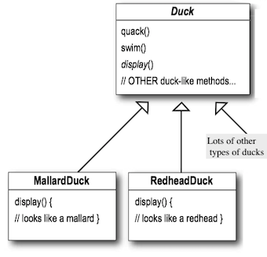
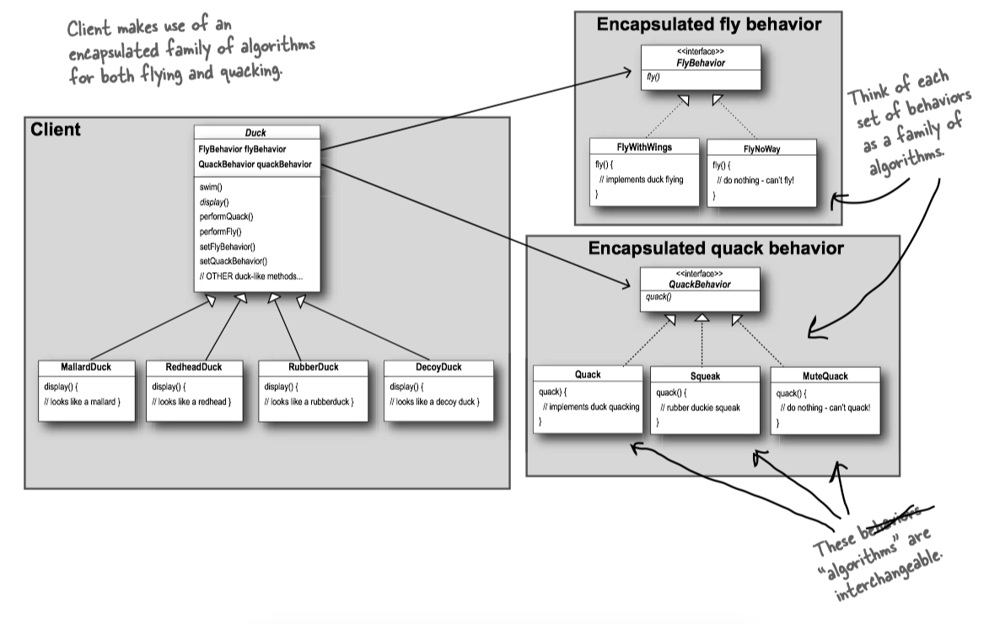
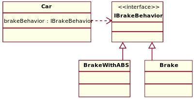
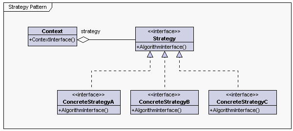

### **Head First Design Patterns 1 - Strategy Pattern**

Instead of *code* reuse, with patterns you get *experience* reuse.


### 1 Problem statement


A <C>Duck</C> pond simulation game, *SimUDuck*, which can show a large variety of <C>Duck</C> species swimming and making quacking sounds. The initial designers of the system used standard OO techniques and created one <C>Duck</C> superclass from which all other <C>Duck</C> types inherit. Now the executives decides that ducks shall fly in the simulator.



ONE OPTION: inheritance, add a <C>fly</C> method in the <C>Duck</C> class and then all the ducks will inherit it. HOWEVER, by putting <C>fly</C> in the superclass, you give flying ability to ALL ducks, including those that shouldn't.

-> you may want to override the <C>fly</C> method in the objects that shouldn't fly, such as rubber duck. HOWEVER, if you add many objects that can't fly

ANOTHER OPTION: interface, make a <C>Flyable()</C> interface with a <C>fly()</C> method, make a <C>Quackable()</C> interface with a quack() method, override <C>fly()</C> and <C>quack()</C> for every new <C>Duck</C> subclass that’s ever added to the program. HOWEVER, how are you gonna feel when you need to make a little change to the flying behavior... in all of the flying <C>Duck</C> subclasses.


### 2 Strategy Pattern

> The Strategy Pattern defines a family of algorithms, encapsulates each one, and makes them interchangeable. Strategy lets the algorithm vary independently from clients that use it.

> 策略模式定义了算法簇，分别封装起来，让他们之间可以相互替换。策略模式让算法的变化独立于使用算法的客户。

> **Design Principle**: identify the aspects of your application that vary and separate them from what stays the same.

> 设计原则：找出应用中可能需要变化之处，把他们独立出来，不要和那些不需要变化的代码混在一起。 

All patterns provide a way to let *some part of a system vary independently of all other parts*.

We know that <C>fly()</C> and <C>quack()</C> are the parts of the <C>Duck</C> class that vary across ducks.

To separate these behaviors from the <C>Duck</C> class, we’ll pull both methods out of the <C>Duck</C> class and create a new set of classes to represent each behavior.

So how are we going to design the set of classes that implement the fly and quack behaviors?

> **Design Principle**: Program to an interface, not an implementation.


#### An Example: SimUDuck

We’ll use an interface to represent each behavior – for instance, <C>FlyBehavior</C> and <C>QuackBehavior</C> – and each implementation of a behavior will implement one of those interfaces.


With this design, other types of objects can reuse our fly and quack behaviors because these behaviors are no longer hidden away in our <C>Duck</C> classes!

And we can add new behaviors without modifying any of our existing behavior classes or touching any of the Duck classes that use flying behaviors.


```Java fct_label="Duck"
public abstract class Duck {
	FlyBehavior flyBehavior;
	QuackBehavior quackBehavior;

	public Duck() {
	}

	public void setFlyBehavior(FlyBehavior fb) {
		flyBehavior = fb;
	}

	public void setQuackBehavior(QuackBehavior qb) {
		quackBehavior = qb;
	}

	abstract void display();

	public void performFly() {
		flyBehavior.fly();
	}

	public void performQuack() {
		quackBehavior.quack();
	}

	public void swim() {
		System.out.println("All ducks float, even decoys!");
	}
}
```

```Java fct_label="FlyBehavior"
public interface FlyBehavior {
	public void fly();
}

public class FlyNoWay implements FlyBehavior {
	public void fly {
		System.out.println("I can't fly");
	}
}

public class FlyWithWings implements FlyBehavior {
	public void fly {
		System.out.println("I'm flying!!");
	}
}
```

```Java fct_label="QuackBehavior"
public interface QuackBehavior {
	public void quack();
}

public class Quack implements QuackBehavior {
	public void quack() {
		System.out.println("Quack");
	}
}

public class MuteQuack implements QuackBehavior {
	public void quack() {
		System.out.println("<< Silence >>");
	}
}

public class Squeak implements QuackBehavior {
	public void quack() {
		System.out.println("Squeak");
	}
}
```

```Java fct_label="MallardDuck"
public class MallardDuck extends Duck {

	public MallardDuck() {

		quackBehavior = new Quack();
		flyBehavior = new FlyWithWings();

	}

	public void display() {
		System.out.println("I'm a real Mallard duck");
	}
}
```

```Java fct_label="DuckSimulator"
public class MiniDuckSimulator {
 
	public static void main(String[] args) {
 
		MallardDuck	mallard = new MallardDuck();
		RubberDuck	rubberDuckie = new RubberDuck();
		DecoyDuck	decoy = new DecoyDuck();
 
		Duck	 model = new ModelDuck();

		mallard.performQuack();
		rubberDuckie.performQuack();
		decoy.performQuack();
   
		model.performFly();	
		model.setFlyBehavior(new FlyRocketPowered());
		model.performFly();
	}
}
```

#### The big picture

The Big Picture on encapsulated behaviors:



#### HAS-A can be better than IS-A

HAS-A can be better than IS-A: The HAS-A relationship is an interesting one: each duck has a <C>FlyBehavior</C> and a <C>QuackBehavior</C> to which it delegates flying and quacking.

When you put two classes together like this you’re using ***composition*** . Instead of inheriting their behavior, the ducks get their behavior by being *composed* with the right behavior object.

> **Design Principle**: Favor composition over inheritance.

#### An Example: GameCar





```Java fct_label="Car"
/* Client that can use the algorithms above interchangeably */
public abstract class Car {
    protected IBrakeBehavior brakeBehavior;

    public void applyBrake() {
        brakeBehavior.brake();
    }

    public void setBrakeBehavior(final IBrakeBehavior brakeType) {
        this.brakeBehavior = brakeType;
    }
}

/* Client 1 uses one algorithm (Brake) in the constructor */
public class Sedan extends Car {
    public Sedan() {
        this.brakeBehavior = new Brake();
    }
}

/* Client 2 uses another algorithm (BrakeWithABS) in the constructor */
public class SUV extends Car {
    public SUV() {
        this.brakeBehavior = new BrakeWithABS();
    }
}
```

```Java fct_label="IBrakeBehavior"
/* Encapsulated family of Algorithms
 * Interface and its implementations
 */
public interface IBrakeBehavior {
    public void brake();
}

public class BrakeWithABS implements IBrakeBehavior {
    public void brake() {
        System.out.println("Brake with ABS applied");
    }
}

public class Brake implements IBrakeBehavior {
    public void brake() {
        System.out.println("Simple Brake applied");
    }
}
```

```Java fct_label="CarExample"
/* Using the Car example */
public class CarExample {
    public static void main(final String[] arguments) {
        Car sedanCar = new Sedan();
        sedanCar.applyBrake();  // This will invoke class "Brake"

        Car suvCar = new SUV();
        suvCar.applyBrake();    // This will invoke class "BrakeWithABS"

        // set brake behavior dynamically
        suvCar.setBrakeBehavior( new Brake() );
        suvCar.applyBrake();    // This will invoke class "Brake"
    }
}
```


#### UML




#### Example: Collections.sort()

<C>Collection.sort(List, Comparator)</C> method, where <C>Comparator</C> is Strategy and <C>Collections.sort()</C> is Context. Because of this pattern your sort method can sort any object, the object which doesn't exists when this method was written. As long as, Object will implement <C>Comparator</C> interface (Strategy interface), <C>Collections.sort()</C> method will sort it.

