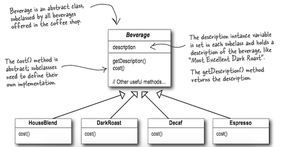
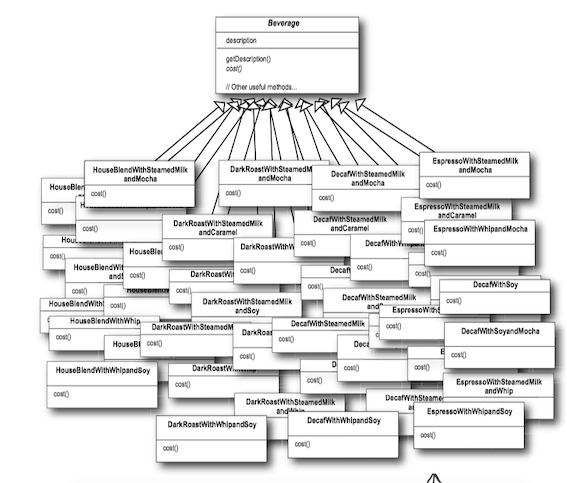
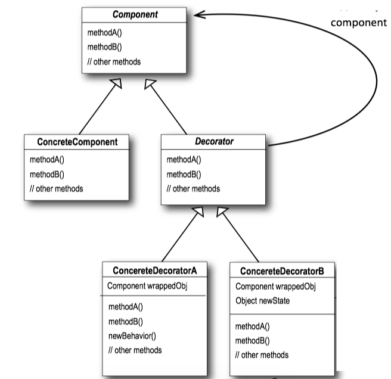
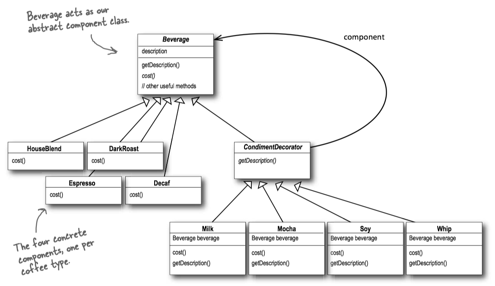
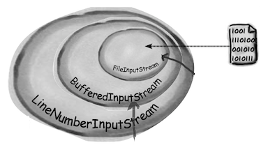
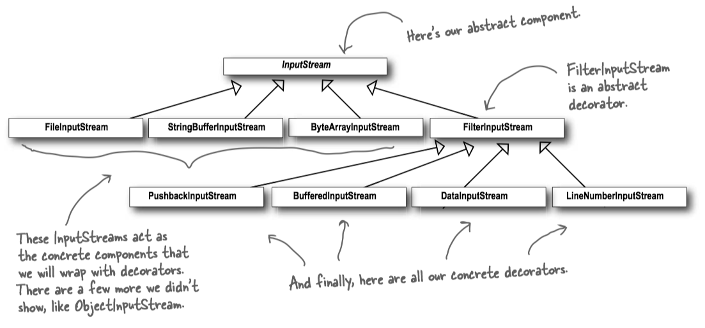

### **Head First Design Patterns 3 - Decorator Pattern**

### 1 Starbuzz Coffee

Starbuzz Coffee has made a name for itself as the fastest growing coffee shop around. Because they've grown so quickly, they're scrambling to update their ordering systems to match their beverage offerings. When they first went into business they designed their classes like this...



In addition to coffee, one can also ask for several condiments like steamed milk, soy, and mocha (otherwise known as chocolate), and have it all topped off with whipped milk.

Here’s their first attempt...




#### The Open-Closed Principle

> **Design Principle**: Classes should be open for extension, but closed for modification.
> 
### 2 Decorator Pattern

> The Decorator Pattern attaches additional responsibilities to an object dynamically. Decorators provide a flexible alternative to subclassing for extending functionality.

> 装饰器模式动态地将额外的责任附加到对象上。装饰器提供了比继承功能更灵活的替代方案。 

* Think of decorator objects as "wrappers".
* Decorators have the same supertype as the objects they decorate.
* You can use one or more decorators to wrap an object.
* Given that the decorator has the same supertype as the object it decorates, we can pass around a decorated object in place of the original (wrapped) object.
* The decorator adds its own behavior either before and/or after delegating to the object it decorates to do the rest of the job.
* Objects can be decorated at any time, so we can decorate objects dynamically at runtime with as many decorators as we like.

#### Class Diagram



* Each component can be used on its own, or wrapped by a decorator.
* The <C>ConcreteComponent</C> is the object we're going to dynamically add new behavior to. It extends <C>component</C>.
* Each decorator HAS-A (wraps) a component, which means the decorator has an instance variable that holds a reference to a component.
* Decorators implement the same interface or abstract class as the component they are going to decorate.
* The <C>ConcreteDecorator</C> has an instance variable for the thing it decorate (the <C>Component</C> the <C>Decorator</C> wraps).
* Decorators can add new methods; however, new behavior is typically added by doing computation before or after an existing method in the component.

#### decorating beverages



```Java fct_label="Beverage"
public abstract class Beverage {
	String description = "Unknown Beverage";
  
	public String getDescription() {
		return description;
	}
 
	public abstract double cost();
}

public class HouseBlend extends Beverage {
	public HouseBlend() {
		description = "House Blend Coffee";
	}
 
	public double cost() {
		return .89;
	}
}

public class Espresso extends Beverage {
  
	public Espresso() {
		description = "Espresso";
	}
  
	public double cost() {
		return 1.99;
	}
}

public class Decaf extends Beverage {
	public Decaf() {
		description = "Decaf Coffee";
	}
 
	public double cost() {
		return 1.05;
	}
}
```

```Java fct_label="CondimentDecorator"
public abstract class CondimentDecorator extends Beverage {
	public abstract String getDescription();
}

public class Milk extends CondimentDecorator {
	Beverage beverage;

	public Milk(Beverage beverage) {
		this.beverage = beverage;
	}

	public String getDescription() {
		return beverage.getDescription() + ", Milk";
	}

	public double cost() {
		return .10 + beverage.cost();
	}
}

public class Mocha extends CondimentDecorator {
	Beverage beverage;
 
	public Mocha(Beverage beverage) {
		this.beverage = beverage;
	}
 
	public String getDescription() {
		return beverage.getDescription() + ", Mocha";
	}
 
	public double cost() {
		return .20 + beverage.cost();
	}
}
```

```Java fct_label="StarBuzzCoffee"
public class StarbuzzCoffee {
 
	public static void main(String args[]) {
		Beverage beverage = new Espresso();
		System.out.println(beverage.getDescription() 
				+ " $" + beverage.cost());
 
		Beverage beverage2 = new DarkRoast();
		beverage2 = new Mocha(beverage2);
		beverage2 = new Mocha(beverage2);
		beverage2 = new Whip(beverage2);
		System.out.println(beverage2.getDescription() 
				+ " $" + beverage2.cost());
 
		Beverage beverage3 = new HouseBlend();
		beverage3 = new Soy(beverage3);
		beverage3 = new Mocha(beverage3);
		beverage3 = new Whip(beverage3);
		System.out.println(beverage3.getDescription() 
				+ " $" + beverage3.cost());
	}
}
```

### 3 Decorators in Java I/O

The <C>java.io</C> package is largely based on decorator. Here’s a typical set of objects that use decorators to add functionality to reading data from a file:







Java I/O also points out one of the ***downsides*** of the Decorator Pattern: designs using this pattern often result in a large number of small classes that can be overwhelming to a developer trying to use the Decorator-based API.