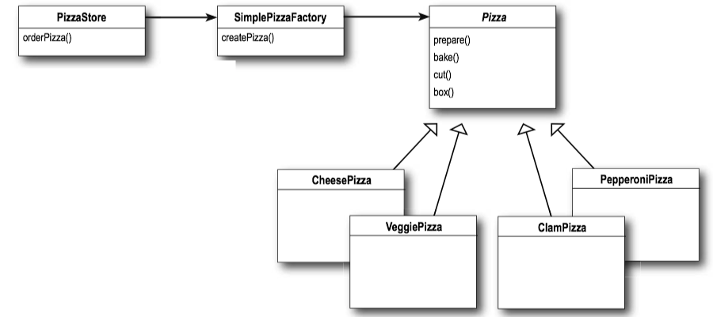
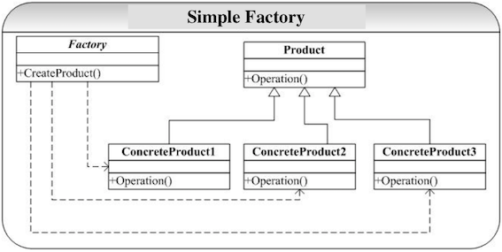
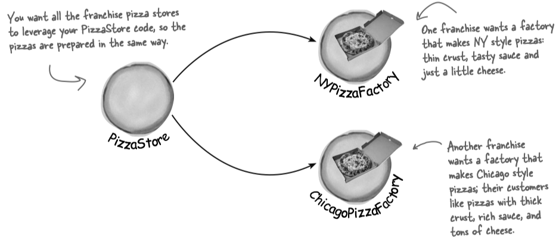
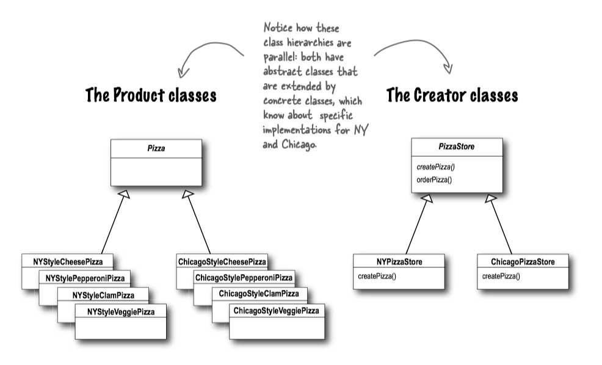
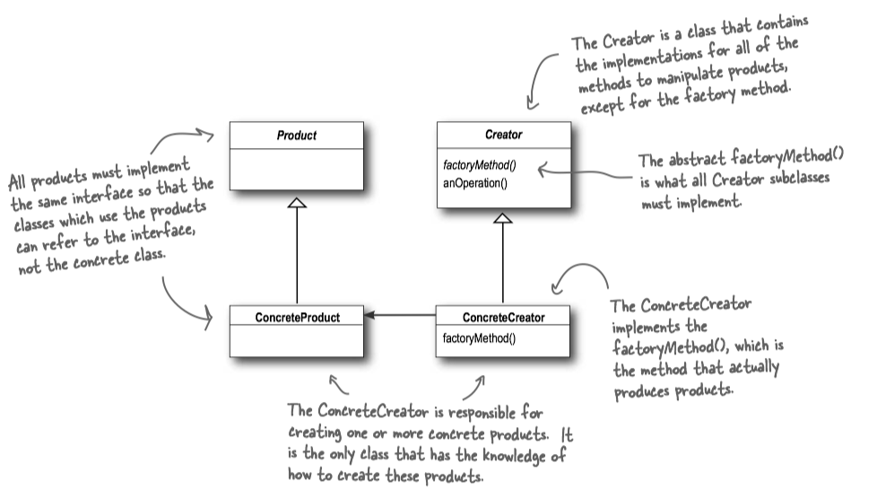
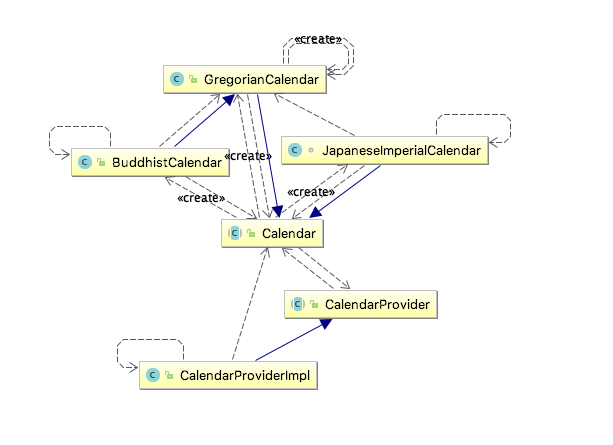
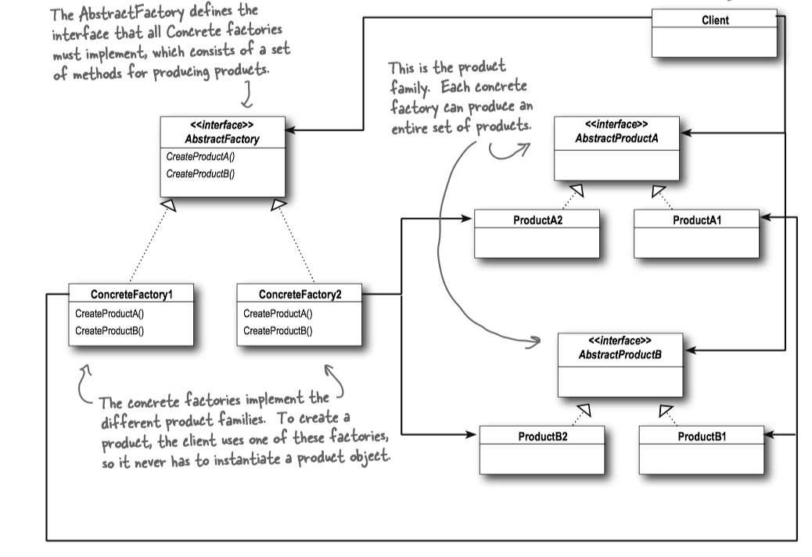
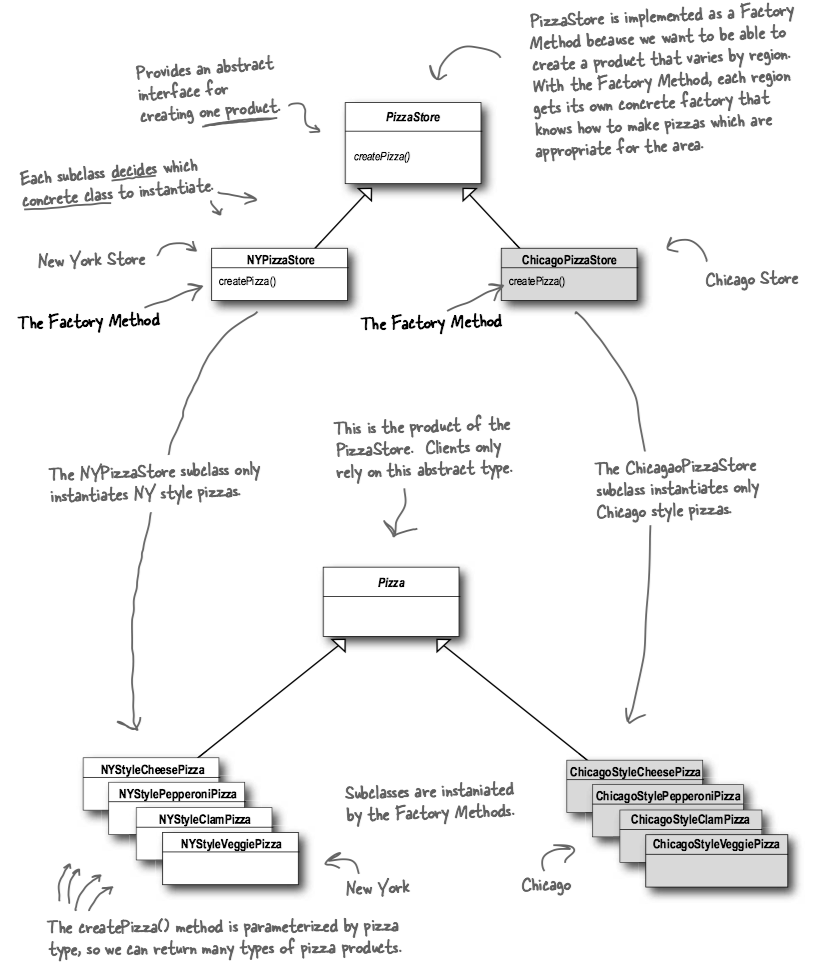

### **Head First Design Patterns 4 - Factory Pattern**

### 1 Simple Factory

Let’s say you have a pizza shop, and as a cutting-edge pizza store owner in Objectville you might end up writing some code like this:

```Java
Pizza orderPizza() { 
    // For flexibility, we really want this to be an  abstract class or interface,
    // but we can't directly instantiate either of those.
    Pizza pizza = new Pizza();
    pizza.prepare(); 
    pizza.bake(); 
    pizza.cut(); 
    pizza.box(); 
    return pizza;
}
```

But you need more than one type of pizza...

```Java
Pizza orderPizza(String type) { 
    Pizza pizza;

    if (type.equals(“cheese”)) { 
        pizza = new CheesePizza(); } 
    else if (type.equals(“greek”) {
        pizza = new GreekPizza(); 
    } else if (type.equals(“pepperoni”) {
        pizza = new PepperoniPizza(); 
    }
    // Once we have a Pizza, we prepare it 
    // (you know, roll the dough, put on the sauce and add the toppings & cheese), 
    // then we bake it, cut it and box it!
    pizza.prepare(); 
    pizza.bake(); 
    pizza.cut(); 
    pizza.box(); 
    return pizza;
}
```

But the pressure is on to add more pizza types...


#### Encapsulating object creation

Factories handle the details of object creation. Once we have a <C>SimplePizzaFactory</C>, our <C>orderPizza()</C> method just becomes a client of that object.


```Java fct_label="SimplePizzaFactory"
public class SimplePizzaFactory {
    public Pizza createPizza(String type)
    {
        Pizza pizza = null;
        if (type.equals(“cheese”)) { 
            pizza = new CheesePizza(); } 
        else if (type.equals(“pepperoni”)) { 
            pizza = new PepperoniPizza(); 
        } else if (type.equals(“clam”)) {
            pizza = new ClamPizza(); 
        } else if (type.equals(“veggie”)) {
            pizza = new VeggiePizza(); 
        }  // end if
        return pizza;   
    } // end createPizza
}
```

```Java fct_label="PizzaStore"
public class PizzaStore {
  // Now we give PizzaStore a reference to a SimplePizzaFactory.
	SimplePizzaFactory factory;
	// PizzaStore gets the factory passes to it in the constructor.
	public PizzaStore(SimplePizzaFactory factory) {
		this.factory = factory;
	}
 
	public Pizza orderPizza(String type) {
		Pizza pizza;
		pizza = factory.createPizza(type);
		pizza.prepare();
		pizza.bake();
		pizza.cut();
		pizza.box();
		return pizza;
	}
}
```



#### Class Diagram
> The Simple Factory is **NOT actually a Design Pattern**; it’s more of a programming IDIOM. But it is commonly used.





### 2 Factory Method Pattern

Your Objectville PizzaStore has done so well that you’ve trounced the competition and now everyone wants a PizzaStore in their own neighborhood.

And now each franchise might want to offer different styles of pizzas (New York, Chicago, and California, etc), depending on where the franchise store is located and the tastes of the local pizza connoisseurs.



```Java fct_label="PizzaStore"
public abstract class PizzaStore {
 
	abstract Pizza createPizza(String item);
 
	public Pizza orderPizza(String type) {
		Pizza pizza = createPizza(type);
		System.out.println("--- Making a " + pizza.getName() + " ---");
		pizza.prepare();
		pizza.bake();
		pizza.cut();
		pizza.box();
		return pizza;
	}
}

public class NYPizzaStore extends PizzaStore {

	Pizza createPizza(String item) {
		if (item.equals("cheese")) {
			return new NYStyleCheesePizza();
		} else if (item.equals("veggie")) {
			return new NYStyleVeggiePizza();
		} else if (item.equals("clam")) {
			return new NYStyleClamPizza();
		} else if (item.equals("pepperoni")) {
			return new NYStylePepperoniPizza();
		} else return null;
	}
}

public class NYPizzaStore extends PizzaStore {

	Pizza createPizza(String item) {
		if (item.equals("cheese")) {
			return new NYStyleCheesePizza();
		} else if (item.equals("veggie")) {
			return new NYStyleVeggiePizza();
		} else if (item.equals("clam")) {
			return new NYStyleClamPizza();
		} else if (item.equals("pepperoni")) {
			return new NYStylePepperoniPizza();
		} else return null;
	}
}
```

```Java fct_label="Pizza"
public abstract class Pizza {
	String name;
	String dough;
	String sauce;
	ArrayList<String> toppings = new ArrayList<String>();
 
	void prepare() {
		System.out.println("Prepare " + name);
		System.out.println("Tossing dough...");
		System.out.println("Adding sauce...");
		System.out.println("Adding toppings: ");
		for (String topping : toppings) {
			System.out.println("   " + topping);
		}
	}
  
	void bake() {
		System.out.println("Bake for 25 minutes at 350");
	}
 
	void cut() {
		System.out.println("Cut the pizza into diagonal slices");
	}
  
	void box() {
		System.out.println("Place pizza in official PizzaStore box");
	}
 
	public String getName() {
		return name;
	}

	public String toString() {
		StringBuffer display = new StringBuffer();
		display.append("---- " + name + " ----\n");
		display.append(dough + "\n");
		display.append(sauce + "\n");
		for (String topping : toppings) {
			display.append(topping + "\n");
		}
		return display.toString();
	}
}

public class NYStyleCheesePizza extends Pizza {

	public NYStyleCheesePizza() { 
		name = "NY Style Sauce and Cheese Pizza";
		dough = "Thin Crust Dough";
		sauce = "Marinara Sauce";
 
		toppings.add("Grated Reggiano Cheese");
	}
}

public class ChicagoStyleClamPizza extends Pizza {
	public ChicagoStyleClamPizza() {
		name = "Chicago Style Clam Pizza";
		dough = "Extra Thick Crust Dough";
		sauce = "Plum Tomato Sauce";
 
		toppings.add("Shredded Mozzarella Cheese");
		toppings.add("Frozen Clams from Chesapeake Bay");
	}
 
	void cut() {
		System.out.println("Cutting the pizza into square slices");
	}
}
```


```Java fct_label="PizzaTestDrive"
public class PizzaTestDrive {
 
	public static void main(String[] args) {
		PizzaStore nyStore = new NYPizzaStore();
		PizzaStore chicagoStore = new ChicagoPizzaStore();
 
		Pizza pizza = nyStore.orderPizza("cheese");
		System.out.println("Ethan ordered a " + pizza.getName() + "\n");
 
		pizza = chicagoStore.orderPizza("cheese");
		System.out.println("Joel ordered a " + pizza.getName() + "\n");

		pizza = nyStore.orderPizza("clam");
		System.out.println("Ethan ordered a " + pizza.getName() + "\n");
 
		pizza = chicagoStore.orderPizza("clam");
		System.out.println("Joel ordered a " + pizza.getName() + "\n");

		pizza = nyStore.orderPizza("pepperoni");
		System.out.println("Ethan ordered a " + pizza.getName() + "\n");
 
		pizza = chicagoStore.orderPizza("pepperoni");
		System.out.println("Joel ordered a " + pizza.getName() + "\n");

		pizza = nyStore.orderPizza("veggie");
		System.out.println("Ethan ordered a " + pizza.getName() + "\n");
 
		pizza = chicagoStore.orderPizza("veggie");
		System.out.println("Joel ordered a " + pizza.getName() + "\n");
	}
}
```





#### Definition

> The **Factory Method** Pattern defines an interface for creating an object, but lets subclasses decide which class to instantiate. Factory Method lets a class defer instantiation to subclasses.

#### Class Diagram



#### Example: Calendar

<C>java.util.Calendar</C> is an abstract class that provides methods for converting between a specific instant in time and a set of calendar fields such as <C>YEAR</C>, <C>MONTH</C>, <C>DAY_OF_MONTH</C>, <C>HOUR</C>, and so on.


<C>Calendar</C> provides a class method, <C>getInstance</C>, for getting a generally useful object of this type. <C>Calendar</C>'s <C>getInstance</C> method returns a <C>Calendar</C> object whose calendar fields have been initialized with the current date and time: `:::Java Calendar rightNow = Calendar.getInstance();`.

 



#### Dependency inversion principle

> The Dependency Inversion Principle: Depend upon abstractions. Do not depend upon concrete classes.

 
A few guidelines to help you follow the Principle:

* No variable should hold a reference to a concrete class.
* No class should derive from a concrete class.
* No method should override an implemented method of any of its base classes.


### 3 Abstract Factory Pattern

#### Definition

> The **Abstract Factory Pattern** provides an interface for creating families of related or dependent objects without specifying their concrete classes.

#### Class Diagram



#### Factory Method and Abstract Factory compared


