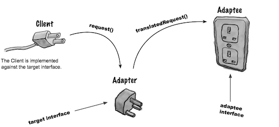
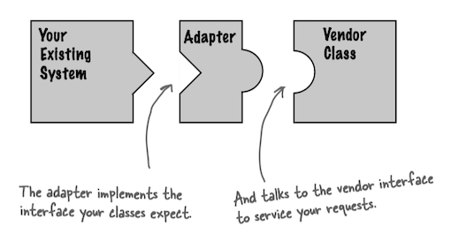
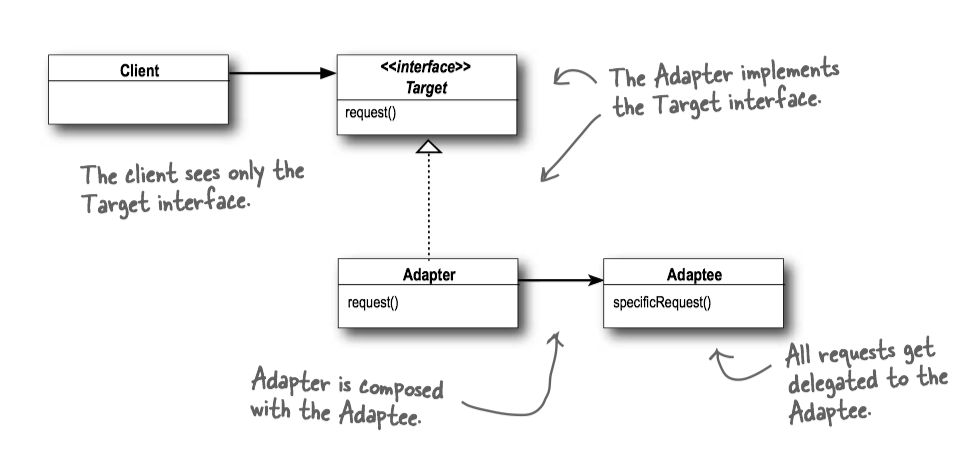
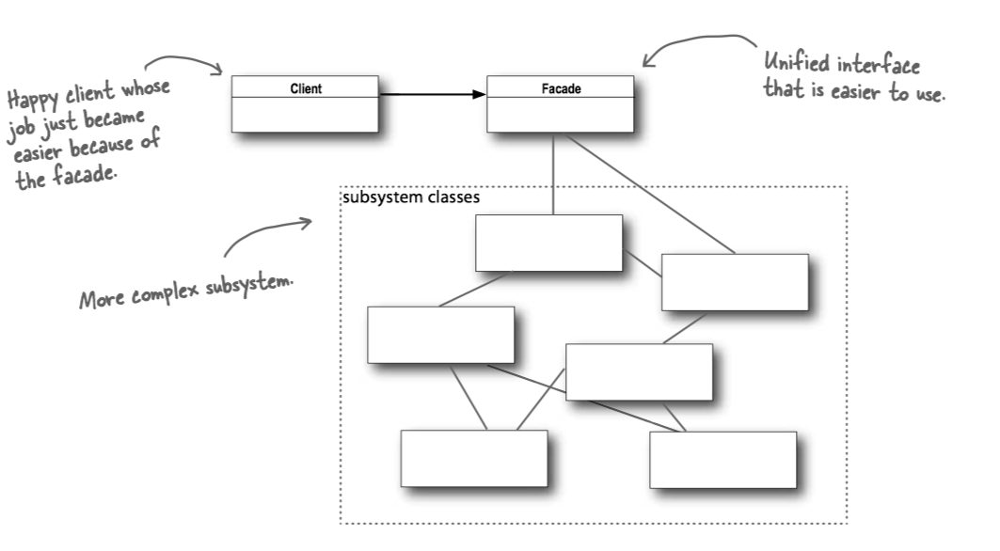
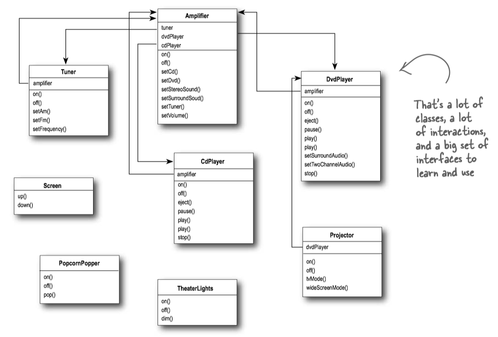
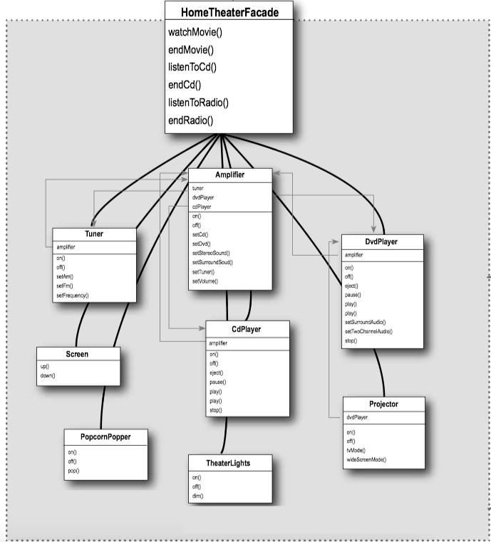

### **Head First Design Patterns 7 - Adapter and Facade Pattern**

### 1 Adapter Pattern
#### The Adapter Pattern explained

Here's an example: Have you ever needed to use an US-made laptop in a European country? Then you’ve probably needed an AC power adapter...



You can write a class that adapts the new vendor interface into the one you’re expecting.




#### Adapter Pattern Defined

> The Adapter Pattern(适配器模式) converts the interface of a class into another interface the clients expect. Adapter lets classes work together that couldn’t otherwise because of incompatible interfaces.

It acts to decouple the client from the implemented interface, and if we expect the interface to change over time, the adapter encapsulates that change so that the client doesn’t have to be modified each time it needs to operate against a different interface.

#### Class Diagram



#### Example - Collections.enumeration()

<C>enumeration()</C> returns an enumeration over the specified collection.  This provides interoperability with legacy APIs that require an enumeration as input.
 
```Java
//java.utils.Collections
public static <T> Enumeration<T> enumeration(final Collection<T> c) {
        return new Enumeration<T>() {
            private final Iterator<T> i = c.iterator();
            public boolean hasMoreElements() {
                return i.hasNext();
            }
            public T nextElement() {
                return i.next();
            }
        };
    }
```

The <C>Enumeration</C> interface is defined as follows:


```Java
public interface Enumeration<E> {
        boolean hasMoreElements();
        E nextElement();
        default Iterator<E> asIterator() {...
        };
    }
}
```

#### Example - Arrays.asList()

<C>Arrays.asList()</C> returns a fixed-size list backed by the specified array. This method acts as bridge between array-based and collection-based APIs, in combination with <C>Collection.toArray</C>.
     
```Java
// <T>, the class of the objects in the array
// a, the array by which the list will be backed
// return a list view of the specified array
public static <T> List<T> asList(T... a) {
        return new ArrayList<>(a);
}
```

### 2 Facade Pattern

#### Facade Pattern Defined

> The Facade Pattern(外观模式) provides a unified interface to a set of interfaces in a subsystem. Facade defines a higher-level interface that makes the subsystem easier to use.

* Facades don’t “encapsulate” the subsystem classes; they merely provide a simplified interface to their functionality. The subsystem classes still remain available for direct use by clients that need to use more specific interfaces.

Adapter Pattern v.s. Facade Pattern

* The Adapter Pattern changes the interface of one or more classes into one interface that a client is expecting.  Likewise, a Facade may provide a simplified interface to a single class with a very complex interface.
* The intent of the Adapter Pattern is to **alter** an interface so that it **matches** one a client is expecting. The intent of the Facade Pattern is to **provide** a **simplified** interface to a subsystem.


#### Facade Pattern Class Diagram



#### The Principle of Least Knowledge

> Principle of Least Knowledge: talk only to your immediate friends.

It means when you are designing a system, for any object, be careful of the number of classes it interacts with and also how it comes to interact with those classes.

This principle prevents us from creating designs that have a large number of classes coupled together so that changes in one part of the system cascade to other parts. When you build a lot of dependencies between many classes, you are building a fragile system that will be costly to maintain and complex for others to understand.


#### Example - Home Theater

You want to build your own home theater. Check out all the components you’ve put together:



**If you want a movie** (the hard way)

Pick out a DVD, relax, and get ready for movie magic. Oh, there’s just one thing – to watch the movie, you need to perform a few tasks:

* Turn on the popcorn popper 
* Start the popper popping 
* Dim the lights 
* Put the screen down 
* Turn the projector on 
* Set the projector input to DVD 
* Put the projector on wide-screen mode 
* Turn the sound amplifier on 
* Set the amplifier to DVD input 
* Set the amplifier to surround sound 
* Set the amplifier volume to medium 
* Turn the DVD Player on 
* Start the DVD Player playing

OK, time to create a Facade for the home theater system. To do this we create a new class <C>HomeTheatherFacade</C>, which exposes a few simple methods such as <C>watchMovie()</C>.





```Java fct_label="HomeTheaterFacade"
public class HomeTheaterFacade {
	Amplifier amp;
	Tuner tuner;
	DvdPlayer dvd;
	CdPlayer cd;
	Projector projector;
	TheaterLights lights;
	Screen screen;
	PopcornPopper popper;
 
	public HomeTheaterFacade(Amplifier amp, 
				 Tuner tuner, 
				 DvdPlayer dvd, 
				 CdPlayer cd, 
				 Projector projector, 
				 Screen screen,
				 TheaterLights lights,
				 PopcornPopper popper) {
 
		this.amp = amp;
		this.tuner = tuner;
		this.dvd = dvd;
		this.cd = cd;
		this.projector = projector;
		this.screen = screen;
		this.lights = lights;
		this.popper = popper;
	}
 
	public void watchMovie(String movie) {
		System.out.println("Get ready to watch a movie...");
		popper.on();
		popper.pop();
		lights.dim(10);
		screen.down();
		projector.on();
		projector.wideScreenMode();
		amp.on();
		amp.setDvd(dvd);
		amp.setSurroundSound();
		amp.setVolume(5);
		dvd.on();
		dvd.play(movie);
	}
 
 
	public void endMovie() {
		System.out.println("Shutting movie theater down...");
		popper.off();
		lights.on();
		screen.up();
		projector.off();
		amp.off();
		dvd.stop();
		dvd.eject();
		dvd.off();
	}

	public void listenToCd(String cdTitle) {
		System.out.println("Get ready for an audiopile experence...");
		lights.on();
		amp.on();
		amp.setVolume(5);
		amp.setCd(cd);
		amp.setStereoSound();
		cd.on();
		cd.play(cdTitle);
	}

	public void endCd() {
		System.out.println("Shutting down CD...");
		amp.off();
		amp.setCd(cd);
		cd.eject();
		cd.off();
	}

	public void listenToRadio(double frequency) {
		System.out.println("Tuning in the airwaves...");
		tuner.on();
		tuner.setFrequency(frequency);
		amp.on();
		amp.setVolume(5);
		amp.setTuner(tuner);
	}

	public void endRadio() {
		System.out.println("Shutting down the tuner...");
		tuner.off();
		amp.off();
	}
}
```

```Java fct_label="HomeTheaterTestDrive"
public class HomeTheaterTestDrive {
	public static void main(String[] args) {
		Amplifier amp = new Amplifier("Top-O-Line Amplifier");
		Tuner tuner = new Tuner("Top-O-Line AM/FM Tuner", amp);
		DvdPlayer dvd = new DvdPlayer("Top-O-Line DVD Player", amp);
		CdPlayer cd = new CdPlayer("Top-O-Line CD Player", amp);
		Projector projector = new Projector("Top-O-Line Projector", dvd);
		TheaterLights lights = new TheaterLights("Theater Ceiling Lights");
		Screen screen = new Screen("Theater Screen");
		PopcornPopper popper = new PopcornPopper("Popcorn Popper");
		
		HomeTheaterFacade homeTheater = 
				new HomeTheaterFacade(amp, tuner, dvd, cd, 
						projector, screen, lights, popper);
 
		homeTheater.watchMovie("Raiders of the Lost Ark");
		homeTheater.endMovie();
	}
}
```
	
	
	