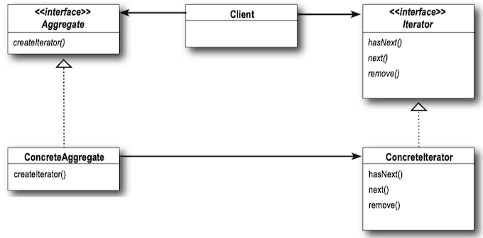
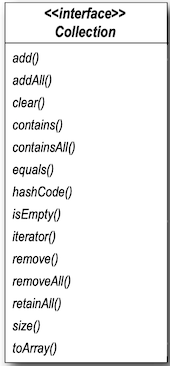
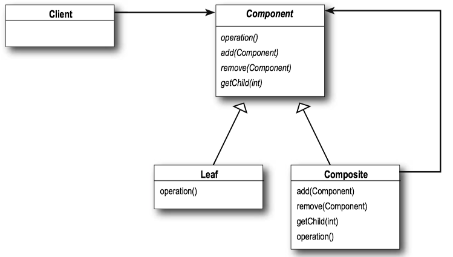
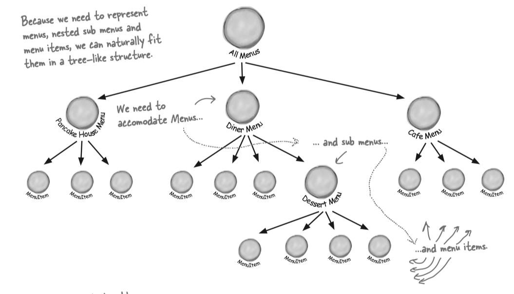
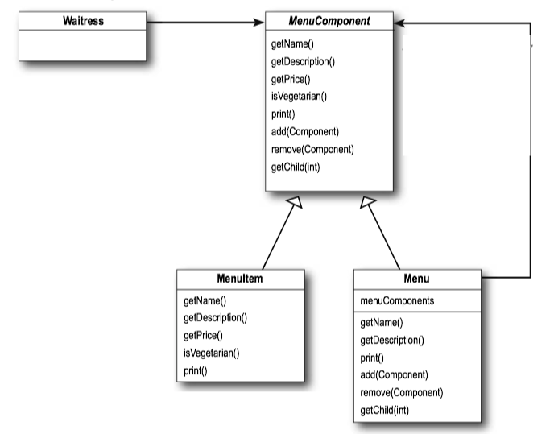
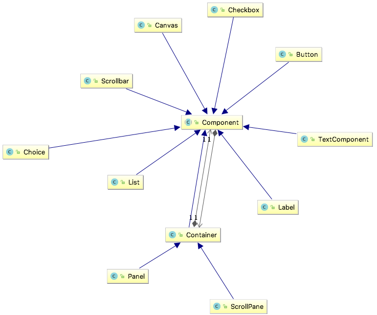

### **Head First Design Patterns 9 - Iterator and Composite Pattern**


### 1 Iterator Pattern

#### Iterator Pattern Defined

> The Iterator Pattern(迭代器模式) provides a way to access the elements of an aggregate object sequentially without exposing its underlying representation.

Iterator Pattern takes the responsibility of traversing elements and gives that responsibility to the iterator object, not the aggregate object.

#### Iterator Pattern Class Diagram




* The <C>ConcreteAggregate</C> has  a collection of objects and implements the method that returns an <C>Iterator</C> for its collection.
* The <C>Iterator</C> interface provides the interface that all iterators must implement, and a set of methods for traversing over elements of a collection.


!!! Note
    Java’s Collection Framework provides another type of iterator interface called <C>java.util.ListIterator</C>. This iterator adds <C>previous()</C> and a few other methods to the standard <C>java.util.Iterator</C> interface. It is supported by any <C>Collection</C> that implements the <C>List</C> interface.
    
    
    
#### Design Principle - Single Responsibility

> Design Principle - Single Responsibility : A class should have only one reason to change.


Every responsibility of a class is an area of potential change. More than one responsibility means more than one area of change.

#### Example - Café Menu

```Java fct_label="CafeMenu"
public interface Menu {
	public Iterator<MenuItem> createIterator();
}


public class CafeMenu implements Menu {
	HashMap<String, MenuItem> menuItems = new HashMap<String, MenuItem>();
  
	public CafeMenu() {
		addItem("Veggie Burger and Air Fries",
			"Veggie burger on a whole wheat bun, lettuce, tomato, and fries",
			true, 3.99);
		addItem("Soup of the day",
			"A cup of the soup of the day, with a side salad",
			false, 3.69);
		addItem("Burrito",
			"A large burrito, with whole pinto beans, salsa, guacamole",
			true, 4.29);
	}
 
	public void addItem(String name, String description, 
	                     boolean vegetarian, double price) 
	{
		MenuItem menuItem = new MenuItem(name, description, vegetarian, price);
		menuItems.put(menuItem.getName(), menuItem);
	}
 
	public Map<String, MenuItem> getItems() {
		return menuItems;
	}
  
	public Iterator<MenuItem> createIterator() {
		return menuItems.values().iterator();
	}
}
```

```Java fct_label="waitress"
public class Waitress {
	Menu cafeMenu;
 
	public Waitress(Menu cafeMenu) {
		this.cafeMenu = cafeMenu;
	}
 
	public void printMenu() {
		Iterator<MenuItem> cafeIterator = cafeMenu.createIterator();
		printMenu(cafeIterator);
	}
 
	private void printMenu(Iterator<MenuItem> iterator) {
		while (iterator.hasNext()) {
			MenuItem menuItem = iterator.next();
			System.out.print(menuItem.getName() + ", ");
			System.out.print(menuItem.getPrice() + " -- ");
			System.out.println(menuItem.getDescription());
		}
	}
}
```

```Java fct_label="TestDrive"
public class MenuTestDrive {
	public static void main(String args[]) {
		CafeMenu cafeMenu = new CafeMenu();
		Waitress waitress = new Waitress(pancakeHouseMenu, dinerMenu, cafeMenu);
		waitress.printMenu();
		}
}
```


#### Iterators and Collections

Each <C>Collection</C> object knows how to create its own <C>Iterator</C>.





Java 5 includes a new form of the for statement, called <C>for/in</C>, that lets you iterate over a collection or an array without creating an iterator explicitly.

To use for/in, you use a for statement that looks like:

```Java
for (Object obj: collection) {
    ...
}
```

* Iterates over each object in the Collection
* <C>obj</C> is assigned to the next element in the collection each time through the loop.


### 2 Composite Pattern

#### Composite Pattern Defined

> The Composite Pattern(组合模式) allows you to compose objects into tree structures to represent part-whole hierarchies. Composite lets clients treat individual objects and compositions of objects uniformly.

The Composite Pattern create a part-whole hierarchy; that is, a tree of objects that is made of parts (e.g. menus and menu items) but that can be treated as a whole. (i.e. treat “individual objects and compositions uniformly.”)


**Cohesion** is a term you’ll hear used as a measure of how closely a class or a module supports a single purpose or responsibility. We say that a module or class has high cohesion when it is designed around a set of related functions, and we say it has low cohesion when it is designed around a set of unrelated functions.


####  Composite Pattern Class Diagram




#### Example - Menus

We try to design a menu that support menus with menus. For example, we want to make the dessert menu an element of the DinerMenu collection.




Composite pattern gives us a way to create a tree structure that can handle a nested group of menus and menu items in the same structure.




* The <C>Waitress</C> is going to use the <C>MenuComponent</C> interface to access both <C>Menus</C> and <C>MenuItems</C>.
* <C>MenuComponent</C> represents the interface for both <C>MenuItem</C> and <C>Menu</C>. We've used an abstract class here because we want to provide default implementations for these methods.

```Java fct_label="MenuComponent"
/** MenuComponent provides default implementation for every method.
 *
 */
public abstract class MenuComponent {

    public String getName(){
        throw new UnsupportedOperationException();
    }

    public String getDescription(){
        throw new UnsupportedOperationException();
    }

    public double getPrice() {
        throw new UnsupportedOperationException();
    }


    public boolean isVegetarian() {
        throw new UnsupportedOperationException();
    }

    public void print() {
        throw new UnsupportedOperationException();
    }

    public void add(MenuComponent menuComponent) {
        throw new UnsupportedOperationException();
    }

    public void remove(MenuComponent menuComponent) {
        throw new UnsupportedOperationException();
    }

    public MenuComponent getChild(int index) {
        throw new UnsupportedOperationException();
    }
}
```

```Java fct_label="MenuItem"
public class MenuItem extends MenuComponent {
    String name;
    String description;
    boolean isVegetarian;
    double price;

    public MenuItem(String name, String description, boolean vegetarian, double price) {
        this.name = name;
        this.description = description;
        this.isVegetarian = vegetarian;
        this.price = price;
    }


    @Override
    public String getName() {
        return name;
    }


    @Override
    public String getDescription() {
        return description;
    }


    @Override
    public boolean isVegetarian() {
        return isVegetarian;
    }

    @Override
    public double getPrice() {
        return price;
    }

    @Override
    public void print() {
        System.out.print(" " + getName());
        if (isVegetarian()) {
            System.out.print("(v)");
        }
        System.out.println(", " + getPrice());
        System.out.println(" -- " + getDescription());
    } // END PRINT
}
```


```Java fct_label="Menu"
public class Menu extends  MenuComponent {
    private String name;
    private String description;

    private ArrayList<MenuComponent> menuComponents = new ArrayList<>();

    public Menu(String name, String description) {
        this.name = name;
        this.description = description;
    }


    @Override
    public String getName() {
        return name;
    }

    @Override
    public String getDescription() {
        return description;
    }


    @Override
    public void add(MenuComponent menuComponent) {
        menuComponents.add(menuComponent);
    }

    @Override
    public void remove(MenuComponent menuComponent) {
        menuComponents.remove(menuComponent);
    }

    @Override
    public MenuComponent getChild(int index) {
        return menuComponents.get(index);
    }


    @Override
    public void print() {
        System.out.print("\n" + getName());
        System.out.println(","  + getDescription());
        System.out.println("---------------------");
        Iterator<MenuComponent> iterator = menuComponents.iterator();

        while(iterator.hasNext()) {
            MenuComponent nextMenuComponent = iterator.next();
            nextMenuComponent.print();
        }
    }
}
```

```Java fct_label="MenuTestDrive"
public class MenuTestDrive {
    public static void main(String args[]) {
        MenuComponent pancakeHouseMenu =
                new Menu("PANCAKE HOUSE MENU", "Breakfast");
        MenuComponent dinerMenu =
                new Menu("DINER MENU", "Lunch");
        MenuComponent cafeMenu =
                new Menu("CAFE MENU", "Dinner");
        MenuComponent dessertMenu =
                new Menu("DESSERT MENU", "Dessert of course!");
        MenuComponent coffeeMenu = new Menu("COFFEE MENU", "Stuff to go with your afternoon coffee");

        MenuComponent allMenus = new Menu("ALL MENUS", "All menus combined");

        allMenus.add(pancakeHouseMenu);
        allMenus.add(dinerMenu);
        allMenus.add(cafeMenu);

        pancakeHouseMenu.add(new MenuItem(
                "K&B's Pancake Breakfast",
                "Pancakes with scrambled eggs, and toast",
                true,
                2.99));
        pancakeHouseMenu.add(new MenuItem(
                "Regular Pancake Breakfast",
                "Pancakes with fried eggs, sausage",
                false,
                2.99));
        pancakeHouseMenu.add(new MenuItem(
                "Blueberry Pancakes",
                "Pancakes made with fresh blueberries, and blueberry syrup",
                true,
                3.49));
        pancakeHouseMenu.add(new MenuItem(
                "Waffles",
                "Waffles, with your choice of blueberries or strawberries",
                true,
                3.59));

        dinerMenu.add(new MenuItem(
                "Vegetarian BLT",
                "(Fakin') Bacon with lettuce & tomato on whole wheat",
                true,
                2.99));
        dinerMenu.add(new MenuItem(
                "BLT",
                "Bacon with lettuce & tomato on whole wheat",
                false,
                2.99));
        dinerMenu.add(new MenuItem(
                "Soup of the day",
                "A bowl of the soup of the day, with a side of potato salad",
                false,
                3.29));
        dinerMenu.add(new MenuItem(
                "Hotdog",
                "A hot dog, with saurkraut, relish, onions, topped with cheese",
                false,
                3.05));
        dinerMenu.add(new MenuItem(
                "Steamed Veggies and Brown Rice",
                "Steamed vegetables over brown rice",
                true,
                3.99));

        dinerMenu.add(new MenuItem(
                "Pasta",
                "Spaghetti with Marinara Sauce, and a slice of sourdough bread",
                true,
                3.89));

        dinerMenu.add(dessertMenu);

        dessertMenu.add(new MenuItem(
                "Apple Pie",
                "Apple pie with a flakey crust, topped with vanilla icecream",
                true,
                1.59));

        dessertMenu.add(new MenuItem(
                "Cheesecake",
                "Creamy New York cheesecake, with a chocolate graham crust",
                true,
                1.99));
        dessertMenu.add(new MenuItem(
                "Sorbet",
                "A scoop of raspberry and a scoop of lime",
                true,
                1.89));

        cafeMenu.add(new MenuItem(
                "Veggie Burger and Air Fries",
                "Veggie burger on a whole wheat bun, lettuce, tomato, and fries",
                true,
                3.99));
        cafeMenu.add(new MenuItem(
                "Soup of the day",
                "A cup of the soup of the day, with a side salad",
                false,
                3.69));
        cafeMenu.add(new MenuItem(
                "Burrito",
                "A large burrito, with whole pinto beans, salsa, guacamole",
                true,
                4.29));

        cafeMenu.add(coffeeMenu);

        coffeeMenu.add(new MenuItem(
                "Coffee Cake",
                "Crumbly cake topped with cinnamon and walnuts",
                true,
                1.59));
        coffeeMenu.add(new MenuItem(
                "Bagel",
                "Flavors include sesame, poppyseed, cinnamon raisin, pumpkin",
                false,
                0.69));
        coffeeMenu.add(new MenuItem(
                "Biscotti",
                "Three almond or hazelnut biscotti cookies",
                true,
                0.89));

        Waitress waitress = new Waitress(allMenus);

        waitress.printMenu();
    }
}
```


#### Example - java.awt.Container

* component: <C>Component</C>
* leaf: <C>Checkbox</C>, <C>Button</C>, <C>Label</C>...
* composite: <C>Container</C>




<C>java.awt.Container.add()</C> add a <C>Component</C> to a <C>Container</C>.

```Java
public class Container extends Component {
    public Component add(Component comp) {...}
    public void remove(Component comp) {...}
```