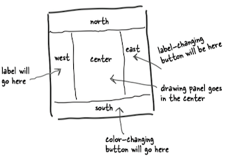
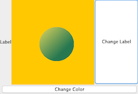

### **Chapter 12 Getting GUI**

### 1 Your First GUI

A `JFrame` is the object that represents a window on the screen.

* It's where you put all the interface things like buttons, checkboxes, text fields, and so on.
* There are a ton of Swing components(`JButton`, `JRadioButton`, `JCheckBox`, `JLabel`, `JList`, `JScrollPane`, `JSlider`, `JTextArea`, `JTextField`, etc) you can add.

A button on a frame:
    
```Java
import javax.swing.*;

public class AButton {
    public static void main(String[] args){
        // make a frame and a button
        JFrame frame = new JFrame();
        JButton button = new JButton("Click me");
    
        // Makes the program quit as soon as you close the window
        // If you leave this out it will just sit there on the screen forever
        frame.setDefaultCloseOperation(JFrame.EXIT_ON_CLOSE);
        // add the button  to the frame's content pane
        frame.getContentPane().add(button);
        // give the frame a size, in pixels
        frame.setSize(300, 300);
        //finally, make it visible
        // if you forget this step, you won't see anything when you run this code.
        frame.setVisible(true);
    
    }
}
```
    
### 2 Events, Sources, and Listeners

In Java, the process of getting and handling a user event is called ***event-handling**.

* There are many different event types in Java, although most involve GUI user actions.
* e.g. If the user clicks a button, that's an event.


#### Event Listeners

If you care about the button’s events, {==implement an interface==} that says, "I’m <i>{==listening for==}</i> your events."

A **listener interface** is the bridge between the **listener** and **event source**.

* An **event source**(事件源, e.g. a button) is an object that can turn user actions (e.g. click a mouse) into events.
* An **event** is an object, and you can scan through `java.awt.event` package in the API, to find a bunch of event classes.
* An **event source** creates an **event object** when the user does something matters(like *click* the button).
* Every event type has a *matching* listener interface.(e.g. If your class wants to know about a button's ActionEvents, you implement the ActionListener.)

**Jobs of Listeners, Sources, and Events**:

* As a listener, my job is to *implement* the interface, *register* with the button, and *provide* the event-handling.
* As an event source, my job is to *accept* registrations (from listeners), *get* events from the user. and *call* the listener’s event-handling method (when the user clicks me).
* As an event object, I’m the *argument* to the event call-back method (from the interface) and my job is to *carry data* about the event back to the listener.

### 3 Making a drawing panel

If you want to put your own graphics on the screen, your best bet is to make your own paintable widget.

**Make a subclass of JPanel and override one method, paintComponent()**.

#### paintComponent()

* All of your graphics code goes inside the `paintComponent()` method.
* Anytime the JVM thinks the display need *refreshing*, your `paintComponent()` method will be called.
* And ***you never call this method yourself!***. However, you *can* ask the system to refresh the display (`repaint()`), which ultimately leads to `paintComponent()` being called.

The argument to `paintComponent()` is declared as type Graphics (`java.awt.Graphics`).

```Java
public void paintComponent(Graphics g){}
```

<i><b>The object referenced by the 'g' parameter is actually an instance of the <big>Graphics2D</big> class.</b></i>


If you need to use a method from the Graphics2D class, you can't *use* the paintComponent parameter 'g' straight from the method. But you can *cast* it with a new Graphics2D variable.

```Java
Graphics2D g2d = (Graphics2D) g;
```

Paint a randomly-colored circle on a black background:

```Java
import javax.swing.*;
import java.awt.*;
import java.util.Random;
    
// Make a subclass of JPanel,
// a widget that you can add to a frame just like anything else
public class RandomColoredCircle extends JPanel {
    
    
    public void paintComponent(Graphics g){
        Graphics2D g2d = (Graphics2D) g;
        g2d.setColor(Color.orange);
        // fill the entire panel with black (the default color)
        g.fillRect(0,0,this.getWidth(), this.getHeight());
    
        Random random = new Random();
    
        Color startColor = new Color(random.nextInt(256), random.nextInt(256), random.nextInt(256));
        Color endColor = new Color(random.nextInt(256), random.nextInt(256), random.nextInt(256));
        GradientPaint gradient = new GradientPaint(70, 70, startColor, 150, 150, endColor);
    
        g2d.setPaint(gradient);
        g.fillOval(70,70,100, 100);
    }
}
    
public class plot {
    public static void main(String[] args){
        RandomColoredCircle coloredCircle = new RandomColoredCircle();
        JFrame frame = new JFrame();
        frame.setDefaultCloseOperation(JFrame.EXIT_ON_CLOSE);
        frame.getContentPane().add(coloredCircle);
        frame.setSize(300, 300);
        frame.setVisible(true);
    }
}
```
    
    Output: 

### 4 Multiple Listeners

What if we add a second button in the east region, which changes the text on a label in the west region?



So We need to get TWO events. How do you get *two* events when you have only *one* `actionPerformed()` method?

**Option one** - Implement two `actionPerformed()` methods: You can't. It won't compile.

**Option two** - Register the same listener with *both* buttons.

```Java
public void actionPerformed(ActionEvent event) { 
    // Query the event object to find out which button actually fired it, and use that to decide what to do
    if (event.getSource() == colorButton) { 
        frame.repaint(); 
    } else { 
    label.setText(“That hurt!”); 
    } 
}
```

*Flaw: this does work, but in most cases it's not very OO.*. Usually, it hurts maintainability and extensibility.

**Option three** - Create two *separate* ActionListener classes.

```Java
class MyGui { 
    JFrame frame; 
    JLabel label; 
    void gui() { 
        // code to instantiate the two listeners and register one 
        // with the color button and the other with the label button } 
} // close class

class ColorButtonListener implements ActionListener { 
    public void actionPerformed(ActionEvent event){ 
    frame.repaint(); 
    }
}

class LabelButtonListener implements ActionListener { 
    public void actionPerformed(ActionEvent event) {
        label.setText(“That hurt!”); 
    } 
}
```

*Flaw: these classes won’t have access to the variables they need to act on, ‘frame’ and ‘label’.*


#### Inner Class

<b><big>SOLUTION</big>: Inner class to the rescue!</b>

* All inner class can use all the methods and variables of the outer class, ***even the private ones***.
* An inner class instance must be ***tied*** to an outer class instance.

```Java
import javax.swing.*;
import java.awt.*;
import java.awt.event.ActionEvent;
import java.awt.event.ActionListener;

public class PLOT {
    JFrame frame;
    JLabel label;
    RandomColoredCircle coloredCircle;

    public void go(){
        // instead of passing (this) to the button's listener registration method,
        // pass a new instance of the appropriate listener class.
        JButton colorButton = new JButton("Change Color");
        colorButton.addActionListener(new ColorButtonListener());

        JButton labelButton = new JButton("Change Label");
        labelButton.addActionListener(new LabelButtonListener());

        label = new JLabel("Label");
        coloredCircle = new RandomColoredCircle();

        frame = new JFrame();
        frame.setDefaultCloseOperation(JFrame.EXIT_ON_CLOSE);
        frame.getContentPane().add(BorderLayout.CENTER, coloredCircle);
        frame.getContentPane().add(BorderLayout.SOUTH, colorButton);
        frame.getContentPane().add(BorderLayout.EAST, labelButton);
        frame.getContentPane().add(BorderLayout.WEST, label);
        frame.setSize(400, 300);
        frame.setVisible(true);
    }

    public static void main(String[] args) {
        PLOT plt = new PLOT();
        plt.go();
    }

    // a button that changes a label
    class LabelButtonListener implements ActionListener {
        @Override
        public void actionPerformed(ActionEvent e) {
            label.setText("Ouch!");
        }
    }

    // a button that changes the color of  an oval
    class ColorButtonListener implements ActionListener{
        @Override
        public void actionPerformed(ActionEvent e) {
            frame.repaint();
        }
    }
}
```

output: 


