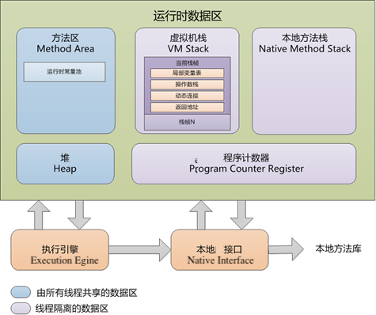
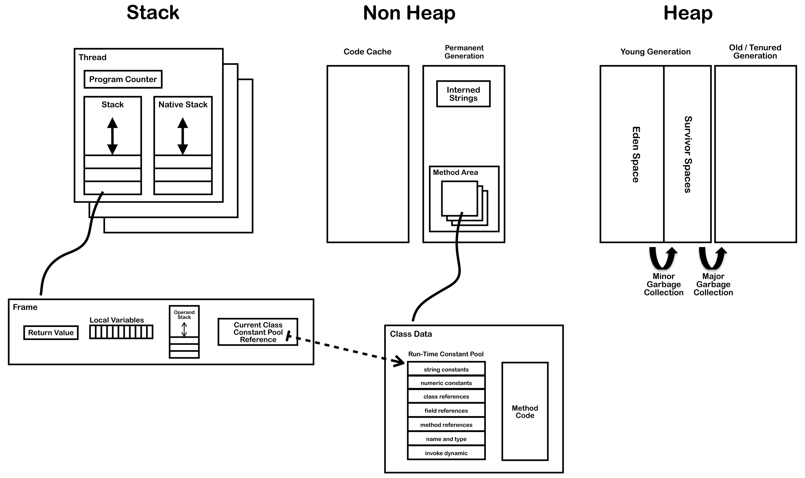
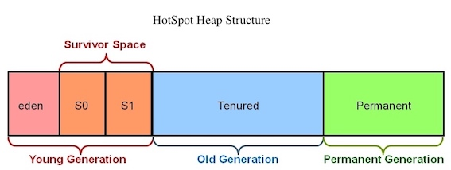

### **深入理解Java虚拟机 2 - Java内存区域与内存溢出正常**

### 1 概述

本章将从概念上介绍Java虚拟机内存的各个区域，讲解这些区域的作⽤、服务对象以及其中可能产⽣的问题。

### 2 运行时数据区域

根据《Java虚拟机规范(Java SE 7版)》的规定， Java虚拟机所管理的内存将会包括以下⼏个运⾏时数据区域。




[http://blog.jamesdbloom.com/JVMInternals.html]



#### 程序计数器

程序计数器(Program Counter Register)是一块较小的内存空间，它可以看作是当前线程所执行的字节码的行号指示器。每条线程都有⼀个独⽴的程序计数器，各条线程之间计数器互不影响，独⽴存储。

如果线程正在执行的是Java方法，那么这个计数器的值就是正在执行的虚拟机字节码指令的地址；如果正在执行的是<C>Native</C>方法，这个计数器值为空(undefined)。此内存区域是唯一一个在Java虚拟机规范中没有规定任何<C>OutOfMemoryError</C>情况的区域。

#### Java虚拟机栈

Java虚拟机栈是线程私有的，它的生命周期与线程相同。每个方法执行的同时都会创建一个栈帧(Stack Frame)用于存储局部变量表、操作数栈、动态链接、方法出口等信息。

局部变量表存放了编译期可知的各种基本数据类型(<C>boolean</C>、<C>byte</C>、<C>char</C>、<C>short</C>、<C>int</C>、<C>float</C>、<C>long</C>、<C>double</C>)、对象引用(<C><C>Reference</C></C>类型)和<C>returnAddress</C>类型（指向了一条字节码指令的地址）。

其中64位长度的<C>long</C>和<C>double</C>类型的数据会占用2个局部变量空间(Slot)，其余的数据类型占1个。局部变量表所需的内存空间在编译期间分配完成，当进入一个方法时，这个方法需要在帧中分配多大的局部变量空间是完全确定的，在方法运行期间不会改变局部变量表的大小。

在Java虚拟机规范中，对这个区域规定了两种异常状况：

* 如果线程请求栈的深度大于虚拟机所允许的深度，将抛出<C>StackOverflowError</C>异常。
* 如果虚拟机栈可以动态扩展（当前⼤部分的Java虚拟机都可动态扩展，只不过Java虚拟机规范中也允许固定长度的虚拟机栈），如果扩展时⽆法申请到⾜够的内存，就会抛出抛出<C>OutOfMemoryError</C>异常。

#### 本地方法栈

**本地方法栈**(Native Method Stack)与虚拟机栈所发挥的作用是非常相似的，它们之间的区别不过是虚拟机栈为虚拟机执行java方法，而本地栈则为虚拟机使用到的<C>native</C>方法服务。

#### Java堆

Java**堆**(Heap)是线程共享的，在虚拟机启动时创建。Java堆的唯一目的就是存放对象实例，几乎所有的对象实例都在这里分配内存。

Java堆是垃圾收集器管理的主要区域，因此很多时候也被称作"GC堆"(Garbage Collected Heap)。由于现在收集器基本都采用分代收集算法，所以Java堆中还可以细分为：新生代和老年代；再细致一点的有Eden空间、From Survivor空间、To Survivor空间等。

Java堆在实现时，既可以实现成固定大小的，也可以是可扩展的，不过当前主流的虚拟机都是按照可扩展来实现的。

#### 方法区（永久代）

**⽅法区**(Method Area)是各个线程共享的内存区域，它⽤于存储已被虚拟机加载的类信息、常量、静态变量、即时编译器编译后的代码等数据。

对于HotSpot虚拟机来说，它也叫做**永久代**(Permanent Generation, **PermGen**)。这是因为HotSpot虚拟机把GC分代收集扩展⾄⽅法区，或者说使⽤永久代来实现⽅法区，这样HotSpot的垃圾收集器可以像管理Java堆⼀样管理这部分内存，能够省去专门为⽅法区编写内存管理代码的⼯作。对于其他虚拟机（如BEA JRockit、IBM J9等）来说是不存在永久代的概念的。

由于永久代内可能会发生内存泄露或溢出等问题而导致的<C>java.lang.OutOfMemoryError: PermGen</C>，JEP小组从JDK1.7开始就筹划移除永久代([JEP 122: Remove the Permanent Generation](http://openjdk.java.net/jeps/122))，并且在JDK 1.7中把字符串常量，符号引用等移出了永久代。到了Java 8，永久代被彻底地移出了JVM，取而代之的是**元空间**(Metaspace)：

> In JDK 8, classes metadata is now stored in the **native heap**(本地对内存) and this space is called **Metaspace**.


根据Java虚拟机规范的规定，当⽅法区⽆法满⾜内存分配需求时，将抛出<C>OutOfMemoryError</C>异常。



* Young Generation 新生代
    * Eden: where new objects get instantiated
    * S0, S1 (Survivor space): hold live objects during minor GC
        * S0: from Survivor
        * S1: to Survivor
* Old Generation (Tenured) 老年代
* Permanent Generation 永久代

#### 运行时常量池

**运⾏时常量池**(Runtime Constant Pool）是⽅法区的⼀部分。Class文件中除了有类的版本、字段、方法、接口等描述信息外，还有一项信息就是常量池(Constant Pool)，用于存放编译期生成的各种字面量和符号引用。这部分内容将在类加载后进入方法区的运行时常量池中存放。

JDK 1.7开始，字符串常量和符号引用等就被移出永久代：

* 符号引用迁移至系统堆内存(Native Heap)
* 字符串字面量迁移至Java堆(Java Heap)


Interned String:

> In JDK 7, interned strings are no longer allocated in the permanent generation of the Java heap, but are instead allocated in the main part of the **Java heap** (known as the young and old generations), along with the other objects created by the application. This change will result in more data residing in the main Java heap, and less data in the permanent generation, and thus may require heap sizes to be adjusted. Most applications will see only relatively small differences in heap usage due to this change, but larger applications that load many classes or make heavy use of the String.intern() method will see more significant differences. <small>[[Java SE 7 Features and Enhancements
](http://www.oracle.com/technetwork/java/javase/jdk7-relnotes-418459.html#jdk7changes)]</small>


#### 直接内存

**直接内存**(Direct Memory)不是虚拟机运行时数据区的一部分。但是这部分内存也被频繁地使用，而且也可能导致<C>OutOfMemoryError</C>异常出现。

在JDK1.4中新加入了NIO类，引入了一种基于通道与缓存区(buffer)的I/O方式，它可以使用<C>Native</C>函数库直接分配堆外内存，然后通过一个存储在Java堆中的<C>DirectByteBuffer</C>对象作为这块内存的引用进行操作。这样能在一些场景中显著提高性能，因为避免了在Java堆和<ative</C>堆中来回复制数据。

### 3 HotSpot虚拟机对象探秘

本节以常⽤的虚拟机HotSpot和常⽤的内存区域Java堆为例，深⼊探讨HotSpot虚拟机在Java堆中对象分配、布局和访问的全过程。

#### 对象的创建

(1) 虚拟机遇到一个<C>new</C>指令时，首先去检查这个指令的参数是否能在常量池中定位到一个类的符号引用，并且检查这个符号引用代表的类是否已经被加载、解析和初始化过。如果没有，那必须先执行相应的类加载过程。

(2)在类加载检查通过后，接下来虚拟机将为新⽣对象分配内存。对象所需内存的⼤⼩在类加载完成后便可完全确定，为对象分配空间的任务等同于把⼀块确定⼤⼩的内存从Java堆中划分出来。如果Java堆是绝对规整的(所有⽤过的内存都放在⼀边， 空闲的内存放在另⼀边，中间放着⼀个指针作为分界点的指⽰器)，那么将使用**指针碰撞**(Bump the Pointer)的分配方式: 把那个指针向空闲空间那边挪动⼀段与对象⼤⼩相等的距离。 如果Java堆中的内存并不是规整的，已使⽤的内存和空闲的内存相互交错，那就没有办法简单地进⾏指针碰撞了，虚拟机就必须维护⼀个列表，记录上哪些内存块是可⽤的，在分配的时候从列表中找到⼀块⾜够⼤的空间划分给对象实 例，并更新列表上的记录，这种分配⽅式称为**空闲列表**(Free List)。


但是内存的分配是同步的，如果一个线程刚分配一个对象内存，但是还没有修改指针所指向的位置，那么另一个线程分配对象的时候可能就出错了。解决方法有两个:

* 对分配内存空间的动作进行同步处理（CAS方式）。
* 把内存分配的动作按照线程划分在不同的空间进行，每个线程在java堆中预分配一小块内存，称为本地线程分配缓冲(TLAB)。只有TLAB用完并分配新的TLAB时，才需要同步。JVM是否开启TLAB功能，可通过-XX:+/-UseTLAB参数来设定。

(3) 内存分配完之后，初始化零值（不包括对象头），如果使用TLAB，这一工作过程也可以提前至TLAB分配时进行。

(4) 接下来，JVM对对象进行必要的设置，例如这个对象是哪个类的实例、如何才能找到类的元数据信息、对象的哈希码、对象的GC分代年龄等信息。这些信息存放在对象的对象头中，根据JVM当前运行状态不同，如是否启用偏向锁等，对象头会有不同的设置方式。

在上⾯⼯作都完成之后，从虚拟机的视⾓来看，⼀个新的对象已经产⽣了，但从Java程序的视⾓来看，对象创建才刚刚开始——<init>⽅法还没有执⾏，所有的字段都还为零。所以，⼀般来说（由字节码中是否跟随invokespecial指令所决定），执⾏<C>new</C>指令之后会接着执⾏<init>⽅法，把对象按照程序员的意愿进⾏初始化，这样⼀个真正可⽤的对象才算完全产⽣出来。


#### 对象的内存布局

在HotSpot虚拟机中，对象在内存中存储的布局可以分为3块区域：对象头(Object Header)、实例数据(Instance Data)和对齐填充(Padding)。

HotSpot虚拟机的对象头包括两部分信息:

* MarkWord: 用于存储对象自身的运行时数据（哈希码、GC分代年龄、锁状态标志、线程持有的锁、偏向线程ID、偏向时间戳等）
* Klass pointer: 类型指针（即对象指向它的类元数据的指针，JVM通过这个指针来确定这个对象是哪个类的实例）。
* 另外，如果对象是⼀个Java数组，那在对象头中还必须有⼀块⽤于记录数组长度的数据，因 为虚拟机可以通过普通Java对象的元数据信息确定Java对象的⼤⼩，但是从数组的元数据中却⽆法确定数组的⼤⼩。


HotSpot虚拟机`markOop.cpp`中的代码（注释）⽚段，它描述了32bit下Mark Word的存储状态。[source](http://hg.openjdk.java.net/jdk7/jdk7/hotspot/file/9b0ca45cd756/src/share/vm/oops/markOop.hpp)

```C
enum { age_bits                 = 4,
       lock_bits                = 2,
       biased_lock_bits         = 1,
       max_hash_bits            = BitsPerWord - age_bits - lock_bits - biased_lock_bits,
       hash_bits                = max_hash_bits > 31 ? 31 : max_hash_bits,
       cms_bits                 = LP64_ONLY(1) NOT_LP64(0),
       epoch_bits               = 2
  };
```

接下来的实例数据是对象真正存储的有效信息，也是在程序代码中所定义的各种类型的字段内容。⽆论是从⽗类继承下来的，还是在⼦类中定义的，都需要记录起来。在父类中定义的变量会出现在子类之前，如果CompactFields参数值为true，那么子类中较窄的变量也可能会插入到父类变量的空隙之中。

对齐填充并不是必然存在的，也没有特别的含义，它仅仅起着占位符的作⽤。由于HotSpot VM的⾃动内存管理系统要求对象起始地址必须是8字节的整数倍，换句话说，就是对象的⼤⼩必须是8字节的整数倍。⽽对象头部分正好是8字节的倍数(1倍或者2倍)，因此，当对象实例数据部分没有对齐时，就需要通过对齐填充来补全。

#### 对象的访问定位

我们的Java程序需要通过栈上的<C>Reference</C>数据来操作堆上的具体对象。目前主流的对象访问方式有两种：句柄(handle)和直接指针。

* 如果直接使用句柄访问，java堆中将会划分出一块内存来作为句柄池，<C>Reference</C>中存储的是对象的句柄地址，而句柄中包含了对象数据与类型数据各自的具体地址信息。

> In computer programming, a handle is an abstract reference to a resource.


* 如果使用直接指针访问，那么java堆对象的布局中就必须考虑如何放置访问类型数据的相关信息，而<C>Reference</C>中存储的直接就是对象地址，如下图所示。


这两种对象访问方式各有优势：

* 使用句柄来访问的最大好处是<C>Reference</C>中存储的是稳定的句柄地址，在对象被移动时只会改变句柄中的实例数据指针，而<C>Reference</C>本身不需要修改。
* 使用直接指针访问方式的最大好处就是速度更快，它节省了一次指针定位的时间开销。由于对象的访问在Java中⾮常频繁，因此这类开销积少成多后也是⼀项⾮常可观的执⾏成本

HotSpot虚拟机使用的是直接指针访问的方式。但各种语⾔和框架使⽤句柄来访问的情况也⼗分常见。

### 4 实战：OutOfMemoryError异常

主要是为了学习之前学的各种内存区域的内容，还有就是以后遇到内存错误的时候，能够根据异常的信息快速判读是哪个区域的内存溢出，知道是什么样的代码可能会导致这些区域内存溢出，以及出现这些异常后，该如何处置。

!!! note
    常见的HotSpot JVM参数
    
    * `-Xms` 初始堆大小	
    * `-Xmx`	最大堆大小	
    * `-Xmn	` 年轻代大小
    * `-XX: MaxPermSize`	设置持久代最大值
    * `-Xss`	每个线程的堆栈大小	


#### Java堆溢出

Java堆⽤于存储对象实例，只要不断地创建对象，并且保证GC Roots到对象之间有可达路径来避免垃圾回收机制清除这些对象，那么在对象数量到达最⼤堆的容量限制后就会产⽣内存溢出异常。

Java堆内存溢出异常测试:

```Java
//VM Args：-Xms20m -Xmx20m -XX: +HeapDumpOnOutOfMemoryError 
// 限制Java堆的⼤⼩为20MB，不可扩展（将堆的最⼩值-Xms参数与最⼤值-Xmx参数设置为⼀样即可避免堆⾃动扩展）
// -XX: +HeapDumpOnOutOfMemoryError可以让虚拟机在出现内存溢 出异常时Dump出当前的内存堆转储快照以便事后进⾏分析
import java.util.ArrayList;
public class HeapOOM{
    static class OOMObject{ }
    public static void main(String[] args){
        ArrayList<OOMObject> list=new ArrayList<OOMObject>();
        while(true){
            list.add(new OOMObject());
        }
    }
}
```

结果

```
java.lang.OutOfMemoryError: Java heap space
Dumping heap to java_pid46106.hprof ...
Heap dump file created [29129293 bytes in 0.350 secs]
```

要解决这个区域的异常，⼀般的⼿段是先通过内存映像分析⼯具对Dump出来的堆转储快照进⾏分析，重点是确认内存中的对象是否是必要的，也就是要先分清楚到底是出现了内存泄漏(Memory Leak)还是内存溢出(Memory Overflow)。

!!! note
    可以使用Eclipse Memory Analyzer打开堆转储快照⽂件。The Eclipse Memory Analyzer is a fast and feature-rich Java heap analyzer that helps you find memory leaks and reduce memory consumption.[Official Website](http://www.eclipse.org/mat/)
    
    


如果是内存泄漏，可进一步通过工具查看泄漏对象到GC Roots的引用链。于是就能找到泄露对象是通过怎样的路径与GC Roots相关联并导致垃圾收集器无法自动回收它们的。掌握了泄露对象的类型信息及GC Roots引用链的信息，就可以比较准确地定位出泄露代码的位置。

如果不存在泄露，换句话说，就是内存中的对象确实都还必须存活着，那就应当检查虚拟机的堆参数（-Xmx与-Xms），与机器物理内存对比看是否还可以调大，从代码上检查是否存在某些对象生命期过长、持有状态时间过长的情况，尝试减少程序运行期的内存消耗。

#### 虚拟机栈和本地方法栈溢出

由于HotSpot虚拟机中并不区分虚拟机栈和本地方法栈，因此，对于HotSpot来说，虽然`-Xoss`参数（设置本地方法栈大小）存在，但实际上是没有效果的，栈容量只由`-Xss`参数设置。关于虚拟机栈和本地方法栈，在Java虚拟机规范中描述了两种异常：

* 如果线程请求的栈深度大于虚拟机所允许的最大深度，将抛出<C>StackOverflowError</C>异常。
* 如果虚拟机在扩展栈时无法申请到足够的内存空间，将抛出<C>OutOfMemoryError</C>异常。

虚拟机栈和本地⽅法栈OOM测试（仅作为第1点测试程序）:
　
```Java
//VM args: -Xss128k
// -Xss128k 减小栈内存至128k
public class JavaVMStackOverFlowError {
    private int stackLength = 1;
    public void stackLeak(){
        stackLength++;
        stackLeak();
    }
    public static void main(String[] args){
        JavaVMStackOverFlowError sof = new JavaVMStackOverFlowError();
        try{
            sof.stackLeak();
        }catch(Throwable e){
            System.out.println("stackLength: "+sof.stackLength);
            throw e;
        }
    }
}
```
　
```
stackLength: 17600
Exception in thread "main" java.lang.StackOverflowError
	at JavaVMStackOverFlowError.stackLeak(JavaVMStackOverFlowError.java:5)
...
```

这两种异常其实存在着一些互相重叠的地方。实验结果表明：在单个线程下，无论是由于栈帧太大还是虚拟机栈容量太小，当内存无法分配的时候，虚拟机抛出的都是<C>StackOverflowError</C>异常。如果测试时不限于单线程，通过不断地建立线程的方式倒是可以产生内存溢出异常。

如果是建立过多线程导致内存溢出，在不能减少线程数或者更换64位虚拟机的情况下，就只能通过减少最大堆和减少栈容量来换取更多的线程。


#### 方法区和运行时常量池溢出


<C>String.intern()</C>是一个<C>Native</C>方法，他的作用是：如果字符串常量池中已经包含一个等于此<C>String</C>常量的字符串，则返回代表池中这个字符串的<C>String</C>对象；否则，将此<C>String</C>对象包含的字符串添加到常量池中，并且返回此<C>String</C>对象的引用。在JDK1.6及之前的版本中，由于常量池分配在永久代内，我们可以通过-XX:PermSize和-XX:MaxPermSize限制方法区大小，从而间接限制其中的常量池的容量。

这意味着重复调用<C>String.intern()</C>在JDK1.6之前的版本中会抛出方法区(PermGen space) <C>OutOfMemoryError</C>，而在JDK1.7中，不会出现。

```Java
 //VM args:-XX:PermSize10M -XX:MaxPermSize=10M
 // PermSize 方法区大小
import java.util.ArrayList;
import java.util.List;
public class RuntimeContantPoolOutOfMemoryError {

    public static void main(String[] args) {
        //保存对常量池字符串的应用，避免Full GC回收常量池的行为
        List<String> list = new ArrayList<String>();
        //10M在int的范围足够产生OutOfMemoryError
        int i = 0;
        while(true){
            list.add(String.valueOf(i++));
        }
    }
}
```

#### 本机直接内存溢出

<C>DirectMemory</C>容量可以通过`-XX:Max<C>DirectMemory</C>Size`指定，如果不指定，则默认与Java堆最大值（`-Xmx`  指定）一样。代码清单越过了<C>DirectByteBuffer</C>类，直接通过反射获取Unsafe实例进行内存分配（Unsafe类的getUnsafe方法限制了只有引导类加载器才会返回实例，也就是设计者希望只有`rt.jar`中的类才能使用Unsafe的功能）。因为，虽然使用<C>DirectByteBuffer</C>分配内存也会抛出内存异常，但它抛出异常时并没有真正向操作系统申请内存分配，而是通过计算得知内存无法分配，于是手动抛出异常，真正申请分配内存的方法是<C>unsafe.allocateMemory</C>.

```Java
/**
 * VM Args: -Xmx20M -XX:Max<C>DirectMemory</C>Size=10M
 */
public class <C>DirectMemory</C>OOM {
    private static final int _1MB = 1024*1024;
    public static void main(String[] args) throws IllegalAccessException {
        Field unsafeField = Unsafe.class.getDeclaredFields()[0];
        unsafeField.setAccessible(true);
        Unsafe unsafe = (Unsafe) unsafeField.get(null);
        while(true) {
            unsafe.allocateMemory(_1MB);
        }
    }
}
```

由<C>DirectMemory</C>导致的内存溢出，一个明显的特征是在Heap Dump文件中不会看见明显的异常，如果读者发现OOM之后Dump文件很小，而程序中又直接或者间接使用了NIO，那就可以考虑检查一下是不是这方面的原因。