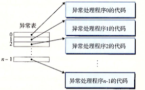
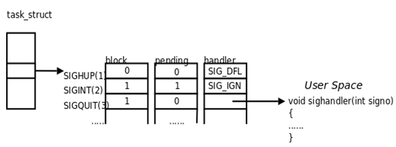

### **Chapter 8 异常控制流**

从给处理器加电开始，直到你断电为止，程序计数器假设成一个值的序列

$$a_0, a_1, ..., a_{n-1}$$

其中，每个\(a_k\)是某个相应的指令\(I_k\)的 _地址_ 。每次从\(a_k\)到\(a_{k+1}\)的过渡称为**控制转移**(control transfer)。这样的控制转移序列叫做处理器的**控制流**(control flow)。

现在系统通过使控制流发生突变来应对系统状态的变化(eg.缺页异常，网络等待)，把这些突变称为**异常控制流**(Exceptional Control Flow, ECF)。


### 1 异常

#### 异常的处理

系统为每**类**可能的异常都分配了一个唯一的非负整数的**异常号**(exception number)。在系统启动时，操作系统分配和初始化一张称为**异常表**的跳转表，使得表目\(k\)包含异常\(k\)的处理程序的地址。




当检测到发生了一个事件，并且确定了相应的异常号\(k\)，处理器触发异常，执行间接过程调用，通过异常表的表目\(k\)，转到相应的处理程序。

#### 异常的类别

异常(exceptions)可以分为四类：中断(interrupt)、陷阱(trap)、故障(fault)和终止(abort)。


* **中断**是异步发生的，是来自处理器外部的I/O设备的信号的结果。
* **陷阱**是有意的异常，是执行一条指令的结果。
    * 其用途是在用户程序和内核之间提供一个像过程一样的接口(系统调用)
* **故障**是由错误情况引起的，可能能够被故障处理程序修正。
    * 例如缺页异常
* **终止**是不可恢复的致命错误造成的结果，通常是一些硬件错误。   

### 2 进程

**进程**(Process)的经典定义就是 _一个执行中程序的实例_ (A process is a program in execuation) 。系统中的每个程序都运行在某个进程的上下文(context)中。上下文是由程序正确运行所需的状态组成的。这个状态包括存放在内存中的程序的代码和数据，它的栈、通用目的寄存器的内容、程序计数器、环境变量以及打开文件描述符的集合。

进程提供了应用程序两个关键抽象：

* 一个**独立**的逻辑控制流，它提供一个假象，好像我们的程序独占地使用处理器。
* 一个**私有**的地址空间，它提供一个假象，好像我们的程序独占地使用内存系统。


#### 逻辑控制流

**逻辑控制流**(Logical Control Flow，简称逻辑流)是PC值的序列。

#### 并发流

一个逻辑流的执行在时间上与另一个流重叠，称为**并发流**(concurrent flow)，这两个流被称为**并发地运行**。

#### 私有地址空间

进程为每个程序提供它自己的**私有地址空间**。一般而言，和这个空间中某个地址相关联的那个内存字节是不能被其他进程读或者写的，从这个意义上说，这个地址空间是私有的。

#### 用户模式和内核模式

处理器通常是用某个控制寄存器中的一个**模式位**(mode bit)来控制用户/内核模式。当设置了模式位时，进程就运行在**内核模式**中，否则运行在**用户模式**中。

运行在内核模式的进程可以执行指令集中的任何指令，可以访问任何内存位置。用户模式中的进程不允许执行特权指令，也不允许直接引用地址空间中内核区的代码和数据。

### 3 系统调用错误处理

### 4 进程控制

进程控制包括获取进程ID、创建和终止进程、回收子进程、让进程休眠、加载并运行程序等。这一节将描述Unix提供了控制进程的系统调用。

#### 获取进程ID

每一个进程都有一个唯一的整数(非零)进程ID(PID)。`getpid`函数返回调用进程的PID。`getppid`函数返回它的父进程的PID。

```c
#include <sys/types.h>
#include <unistd.h>

pid_t getpid(void);
pit_t getppid(void);
```

#### 创建和终止进程

**父进程**通过调用fork函数创建一个新的运行的**子进程**。

```c
#include <sys/types.h>
#include <unistd.h>

pid_t fork(void);
```
新创建的子进程几乎但不完全与父进程相同：

* **相同但是独立的地址空间**：子进程获得父进程虚拟地址空间的一份副本
* **共享文件**：子进程获得父进程打开文件描述符相同的副本
* 子进程与父进程pid不同

#### 回收子进程

进程在终止后，并不会被内核从系统中清除，而是保持这种状态，直到被它的父进程**回收**(reaped)。
* 一个终止了但还未被回收的进程称为**僵死进程**(zombie)。
* 即使僵死进程没有运行，它仍然消耗系统的内存资源。

通过调用`waitpid`函数来等待子进程终止或者停止。

#### 进程休眠

`sleep`函数将一个进程挂起一段制定的时间。

```c
#include <unistd.n>
unsigned int sleep(unsigned int secs);
```


#### 加载并运行程序

`execve`函数在当前进程的上下文中加载并运行一个新程序。
* `execve`调用一次并从不返回。


### 5 信号


Linux**信号**，通知进程系统中发生一个某种类型的事件。每种信号类型都对应于某种系统事件。低层的硬件异常是由内核异常处理程序处理的，正常情况下，对用户进程而言是不可见的。下面是Linux系统上常见的信号：

**常见的信号**：

| 编号 |  名称 | 默认动作 | 对应事件 |
| --- | --- | --- | --- |
| 2 | SIGINT | 终止 | 来自键盘的中断CTRL+C |
| 3 | SIGQUIT | 终止 | 来自键盘的退出CTRL+\ |
| 9 | SIGKILL | 终止 | 杀死程序 `\bin\kill -9` |
| 11 | SIGSEGV | 终止并转储内存 | 段故障(无效的内存引用) |
| 15 | SIGTERM | 终止 | 软件终止信号`\bin\kill` |
| 17 | SIGCHLD | 忽略 | 子进程停止或终止 |
| 18 | SIGCONT | 忽略 | 继续进程如果该进程停止 |
| 20 | SIGTSTP | 停止直到下一个SIGCONT | 用户输入CTRL+Z |

详细信息可以通过`man 7 signal`查询。

#### 发送/接收信号

传送一个信号到目的进程由发送、接收信号两个步骤组成：

* 发送信号。内核通过更新目的进程上下文中的某个状态，发送(递送)一个信号给目的进程。
* 接收信号。当目的进程被内核强迫已某种方式对信号的发送做出反应时，它就接收了信号。进程可以忽略这个信号，终止或者通过执行一个称为**信号处理程序**的用户层函数捕获这个信号。

#### 发送信号

发送信号可以由以下原因引起：

 * 用户：用户能够通过输入`CTRL+c`(`SIGINT`)、`Ctrl+z`(`SIGTSTP`)，或者是终端驱动程序分配给信号控制字符的其他任何键来请求内核产生信号；
 * 内核：当进程执行出错时，内核会给进程发送一个信号，例如非法段存取(内存访问违规)、浮点数溢出等；
 * 进程：一个进程可以通过系统调用kill给另一个进程或自己发送信号。

#### 接收信号

当内核把进程\(p\)从内核模式切换到用户模式时，它会检查进程\(p\)的未被阻塞的待处理信号的集合(`pending&~blocked`,见下文)，如果集合非空，那么内核强制\(p\)接收信号，触发进程采取某种行为。

进程接收到信号以后，可以有如下3种选择进行处理：

* 接收默认处理：接收默认处理的进程通常会导致进程本身消亡。例如连接到终端的进程，用户按下CTRL+c，将导致内核向进程发送一个SIGINT的信号，进程如果不对该信号做特殊的处理，系统将采用默认的方式处理该信号，即终止进程的执行；
* 忽略信号：进程可以通过代码，显示地忽略某个信号的处理，例如：`signal(SIGINT,SIGDEF)`；但是某些信号是不能被忽略的，
* 捕获信号并处理：当接收到信号时，由信号处理程序自动捕获并且处理信号。

```C
sighandler_t signal(int signum, sighandler_t handler);
```

有两个信号既不能被忽略也不能被捕获，它们是`SIGKILL`和`SIGSTOP`。即进程接收到这两个信号后，只能接受系统的默认处理，即终止线程。


#### 阻塞信号和进程回收

一个发出而没有被接受的信号叫做**未处理信号**（Pending Signal）。进程可以选择阻塞（Block）某个信号。被阻塞的信号产生时将保持在未处理状态，直到进程解除对此信号的阻塞，才执行接收的动作。阻塞和忽略是不同的，**只要信号被阻塞就不会接收**，而忽略是在接收之后可选的一种处理动作。

Linux提供阻塞信号的隐式和显式机制:

* **隐式阻塞机制**：内核默认阻塞任何当前处理程序正在处理信号类型的待处理的信号。如果在进程解除对某信号的阻塞之前这种信号产生过多次，只计一次。因为每个信号只有一个bit的未处理标志(如下图)，非0即1，不记录该信号产生了多少次，阻塞标志也是这样表示的。
* **显式阻塞机制**：应用`sigprocmask`函数，明确地阻塞和解除阻塞选定的信号。

内核为每个进程在**pending位向量**中维护着待处理信号的集合，而在**blocked位向量**中维护着被阻塞的信号集合。信号在内核中的表示可以看作是这样的：




每个信号都有两个标志位分别表示阻塞和未处理，还有一个函数指针表示处理动作。信号产生时，内核在进程控制块中设置该信号的未处理标志，直到信号接收才清除该标志。在上图的例子中，

* SIGHUP信号未阻塞也未产生过，当它接收时执行默认处理动作。
* SIGINT信号产生过，但正在被阻塞，所以暂时不能接收。虽然它的处理动作是忽略，但在没有解除阻塞之前不能忽略这个信号，因为进程仍有机会改变处理动作之后再解除阻塞。
* SIGQUIT信号未产生过，一旦产生SIGQUIT信号将被阻塞，它调用信号处理程序`sighandler`。


#### 隐式阻塞机制

当多个未处理信号(`pending signal`)到达时，由于信号并不会产生排队等待这样的情况，所以产生的效果仅相当于一个未处理信号(也就是对应的`pending`位标记为1，例如上图中的`SIGINT`信号)。

这样带来几个问题：

* 不能用信号来对其他进程中发生的事件计数，这是显而易见的
* 在回收子进程时，要回收尽可能多的子进程。例如下面这个例子。

```C
void handler1(int sig)   
{  
    pid_t pid;  
  
    if ((pid = waitpid(-1, NULL, 0)) < 0)  
        unix_error("waitpid error");  
    printf("Handler reaped child %d\n", (int)pid);  
    Sleep(2);  
    return;  
}  

/* $begin signal2 */
void handler2(int sig) 
{
    int olderrno = errno;

    while (waitpid(-1, NULL, 0) > 0) {
        Sio_puts("Handler reaped child\n");
    }
    // waitpid()函数有可能因为找不到子进程而报ECHILD错误
    if (errno != ECHILD)
        Sio_error("waitpid error");
    Sleep(1);
    errno = olderrno;
}
/* $end signal2 */

int main() 
{
    int i, n;
    char buf[MAXBUF];

    if (signal(SIGCHLD, handler2) == SIG_ERR) //handler2 或者 handler1
        unix_error("signal error");

    /* Parent creates children */
    for (i = 0; i < 3; i++) {
        if (Fork() == 0) {
            printf("Hello from child %d\n", (int)getpid());
            exit(0);
        }
    }

    /* Parent waits for terminal input and then processes it */
    if ((n = read(STDIN_FILENO, buf, sizeof(buf))) < 0)
        unix_error("read");

    printf("Parent processing input\n");
    while (1)
        ;

    exit(0);
}
```

在上面这个例子中，父进程创建一些子进程，这些子进程各自独立运行一段时间，然后终止。用`SIGCHLD`处理程序来回收子进程，其中`handler1`是错误的，会产生僵死子进程。`handler2`是安全的。原因是在`handler1`中，可能存在子进程先被执行，产生`SIGCHLD`信号；但是在子进程还未被回收之前，又有多个子进程被执行，产生多个`SIGCHLD`信号。于是多余的未处理`SIGCHLD`信号就被抛弃，只相当于一个`SIGCHLD`信号。最终会造成有的子进程未被回收，产生僵死子进程。

执行的可能结果如下，可以看到父进程只回收了两个子进程。

```text
Hello from child 5617
Hello from child 5616
Hello from child 5618
Handler reaped child
Handler reaped child

Parent processing input
```


#### 显式阻塞机制

有时候不希望在发送信号后就立即去接收、处理信号，同时也不希望忽略该信号，那么可以通过`sigprocmask`显式地阻塞信号从而实现延迟接收信号。

函数`sigprocmask`可以更改当前阻塞的信号集合(即blocked位向量):

```C
int sigprocmask(int how, const sigset_t *set, sigset_t *oldset);
```
其具体行为依赖于how值：

```
SIG_BLOCK, blocked = blocked | set //添加set信号
SIG_UNBLOCK, blocked = blocked & ~set //删除set信号
SIG_SETMASK, block = set //设置set信号为阻塞的信号
```


阻塞的信号集合其实就是一个无符号整型数组(在x86-64上，数组长度是16)。

```C
/* A `sigset_t' has a bit for each signal.  */
# define _SIGSET_NWORDS	(1024 / (8 * sizeof (unsigned long int)))
typedef struct
{
    unsigned long int __val[_SIGSET_NWORDS];
} sigset_t;
```

还有其他的一些函数可以对信号集进行操作：

```C
int sigfillset(sigset_t *set); // 信号集初始化, 然后把所有的信号加入到此信号集里
int sigemptyset(sigset_t *set); //信号集初始化为空
int sigaddset(sigset_t *set, int signo); //将信号signo添加到信号集中  
```

下面看个例子, 是一个具有细微同步错误的SHELL程序。如果子进程在父进程能够开始运行前就结束了，那么
`addjob()` 和 `deletejob()` 会以错误的方式被调用。这个程序希望父进程在一个作业列表中记录着它的当前子进程，每个作业条目。 `addjob()` 和 `deletejob()` 分别想这个作业列表添加和从中删除作业。当父进程创建一个新的子进程时，它就把这个子进程添加到作业列表中。当父进程在`SIGCHLD` 处理程序中回收一个终止的（僵死）子进程时，它就从作业列表中删除这个子进程。乍一看，这段代码是对的。不幸的是，可能发生下面的情况：

* 1. 父进程执行`fork()`，内核调度新创建的子进程运行，而不是父进程
* 2. 在父进程能够再次运行之前，子进程就终止，并且变成一个僵死进程，使得内核传递一个`SIGCHLD`信号给父进程
* 3. 后来，当父进程再次变成可运行但又在它执行之前，内核注意到待处理的`SIGCHLD`信号，并通过在父进程中运行处理程序接收这个信号
* 4. 处理程序回收终止的子进程，并调用`deletejob()`，这个函数什么都不做，因为父进程还没有把该子进程添加到列表中
* 5. 在处理程序运行结束后，内核运行父进程，父进程从`fork()`返回，通过调用`addjob()` 错误地把（不存在的）子进程添加到作业列表中

```C
void handler(int sig)
{
        pid_t pid;
        while ((pid = waitpid(-1, NULL, 0)) > 0) /* Reap a zombie child */
                deletejob(pid); /* Delete the child from the job list */
        if (errno != ECHILD)
                unix_error("waitpid error");
}

int main(int argc, char **argv)
{
        int pid;

        Signal(SIGCHLD, handler);
        initjobs();             /* Initialize the job list */

        while (1) {
                /* Child process */
                if ((pid = Fork()) == 0) {
                        Execve("/bin/date", argv, NULL);
                }

                /* Parent process */
                addjob(pid);    /* Add the child to the job list */
        }

        exit(0);
}
```


正确的做法应该如下,  通过在调用 `fork()` 之前，阻塞 `SIGCHLD` 信号，然后在我们调用了 `addjob()` 之后就取消阻塞这些信号，我们保证了在子进程被添加到作业列表之后回收该子进程。注意，子进程继承了它们父进程的被阻塞集合，所以我们必须在调用 `execve()` 之前，小心地解除子进程中阻塞的 `SIGCHLD` 信号。这样，父进程保证在相应的 `deletejob()` 之前执行 `addjob()`。

```C
int main(int argc, char **argv)
{
    int pid;
    sigset_t mask_all, mask_one, prev_one;

    Sigfillset(&mask_all);
    Sigemptyset(&mask_one);
    Sigaddset(&mask_one, SIGCHLD);
    Signal(SIGCHLD, handler);
    initjobs(); /* Initialize the job list */

    while (1) {
        Sigprocmask(SIG_BLOCK, &mask_one, &prev_one); /* Block SIGCHLD */
        if ((pid = Fork()) == 0) { /* Child process */
            Sigprocmask(SIG_SETMASK, &prev_one, NULL); /* Unblock SIGCHLD */
            Execve("/bin/date", argv, NULL);
        }
        Sigprocmask(SIG_BLOCK, &mask_all, NULL); /* Parent process */  
        addjob(pid);  /* Add the child to the job list */
        Sigprocmask(SIG_SETMASK, &prev_one, NULL);  /* Unblock SIGCHLD */
    }
    exit(0);
}
```

#### 信号处理程序

信号处理程序(signal handler)是重要且棘手的一个问题。其难点在：

* 处理程序与主程序并发运行，共享同样的全局变量，因此可能与主程序和其他处理程序相互干扰；
* 如何以及何时接收信号的规则常常违背人的直觉。

### 7 操作进程的工具

Linux系统提供了大量的监控和操作进程的有用工具。

* STRACE： 打印一个正在运行的程序和它的子进程调用的每个系统调用的轨迹
* PS：列出当前系统中的进程(包括僵尸进程)
* TOP: 打印出关于当前进程资源使用的信息