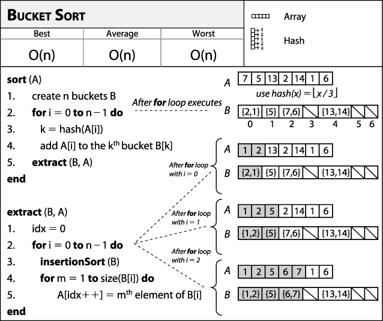

[Algorithms in a Nutshell](https://www.oreilly.com/library/view/algorithms-in-a/9780596516246/ch04s08.html)

Given a set of $n$ elements, Bucket Sort constructs a set of $n$ buckets into which the elements of the input set are partitioned; If a hash function, $hash(A_i)$, is provided that uniformly partitions the input set of $n$ elements into these $n$ buckets, then Bucket Sort can sort, in the worst case, in $O(n)$ time.

You can use Bucket Sort if the following two properties hold:

* Uniform distribution: The input data must be uniformly distributed for a given range. Based on this distribution, $n$ buckets are created to evenly partition the input range.

* Ordered hash function: The buckets must be ordered. That is, if $i < j$, then elements inserted into bucket $b_i$ are lexicographically smaller than elements in bucket $b_j$.





```Java
// Performs a bucket sort of an array in which all the elements are
// bounded in the range [min, max]. For bucket sort to give linear
// performance the elements need to be uniformly distributed
public static void bucketSort(int[] nums, final int min, final int max) {
    if (nums == null || nums.length == 0 || min == max) return;

    // N is number elements and M is the range of values
    final int N = nums.length, M = max - min, NUM_BUCKETS = M / N + 1;
    List<List<Integer>> buckets = new ArrayList<>(NUM_BUCKETS);
    for (int i = 0; i < NUM_BUCKETS; i++) buckets.add(new ArrayList<>());

    // Place each element in a bucket
    for (int i = 0; i < N; i++) {
        int bi = (ar[i] - min) / M;
        buckets.get(bi).add(nums[i]);
    }

    // Sort buckets and stitch together answer
    for (int bi = 0, j = 0; bi < NUM_BUCKETS; bi++){
        List<Integer> bucket = buckets.get(bi);
        if (bucket != null)
            Collections.sort(bucket);
            for (int num : bucket)
                nums[j++] = num;
    }
}
```