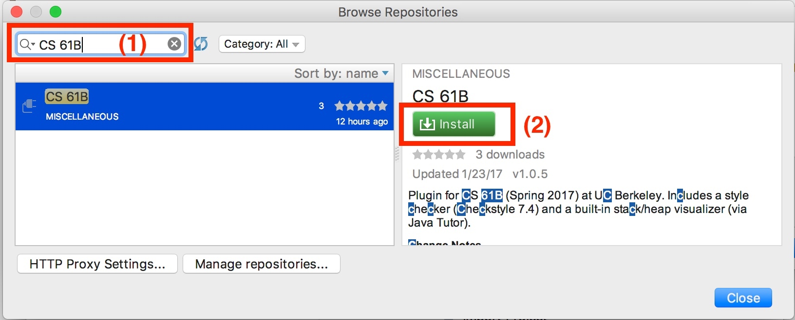
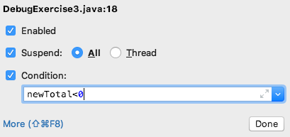

### **Lab 2: Unit Testing with JUnit and IntLists**
### 1 Lab 2 setup: Setting Up IntelliJ

Installing the IntelliJ CS 61B Plugin after installation of IntelliJ.



Getting Java Libraries

```Java
git submodule update --init
```

### 2 Lab 2: Unit Testing with JUnit and IntLists
#### Introduction

In this lab, you will learn about basic IntelliJ features, Destructive vs NonDestructive methods, and IntLists.

#### Breakpoints and Step Into

While print statements can be very useful for debugging, they have a few disadvantages: 

* They require you to modify your code (to add print statements). 
* They require you to explicitly state what you want to know (since you have to say precisely what you want to print). 
* And they provide their results in a format that can be hard to read, since it’s just a big blob of text in the execution window.

The IntelliJ debugger allows you to pause the code in the middle of execution, step the code line by line, and even visualize the organization of complex data structures like linked lists.


The “step over” button allows us to complete a function call without showing the function executing

#### Conditional Breakpoints and Resume

An even faster approach is to make our breakpoint conditional. To do this, right (or two-finer) click on the red breakpoint dot. Here, you can set a condition for when you want to stop.



####  Destructive vs. Non-Destructive

By destructive, we mean that the original list changes. The term “mutative” is also sometimes used. By contrast a non-destructive method  does not affect the original list.


#### Implementing Destructive vs. Non-destructive Methods

```Java
package com.berkeycs61b.lab2.Intlist;

import java.util.Formatter;

/**
 * A naked recursive list of integers, similar to what we saw in lecture 3, but
 * with a large number of additional methods.
 *
 * @author P. N. Hilfinger, with some modifications by Josh Hug and melaniecebula
 *         [Do not modify this file.]
 */
public class IntList {
    /**
     * First element of list.
     */
    public int first;
    /**
     * Remaining elements of list.
     */
    public IntList rest;

    /**
     * A List with first FIRST0 and rest REST0.
     */
    public IntList(int first0, IntList rest0) {
        first = first0;
        rest = rest0;
    }

    /**
     * A List with null rest, and first = 0.
     */
    public IntList() {
    /* NOTE: public IntList () { }  would also work. */
        this(0, null);
    }

    /**
     * Returns a list equal to L with all elements squared. Destructive.
     */
    public static void dSquareList(IntList L) {

        while (L != null) {
            L.first = L.first * L.first;
            L = L.rest;
        }
    }

    /**
     * Returns a list equal to L with all elements squared. Non-destructive.
     */
    public static IntList squareListIterative(IntList L) {
        if (L == null) {
            return null;
        }
        IntList res = new IntList(L.first * L.first, null);
        IntList ptr = res;
        L = L.rest;
        while (L != null) {
            ptr.rest = new IntList(L.first * L.first, null);
            L = L.rest;
            ptr = ptr.rest;
        }
        return res;
    }

    /**
     * Returns a list equal to L with all elements squared. Non-destructive.
     */
    public static IntList squareListRecursive(IntList L) {
        if (L == null) {
            return null;
        }
        return new IntList(L.first * L.first, squareListRecursive(L.rest));
    }

    /** DO NOT MODIFY ANYTHING ABOVE THIS LINE! */


    /**
     * Returns a list consisting of the elements of A followed by the
     * *  elements of B.  May modify items of A. Don't use 'new'.
     */

    public static IntList dcatenate(IntList A, IntList B) {
        //TODO:  fill in method
        IntList A_location = A;
        while (A_location.rest!=null) {
            A_location = A_location.rest;
        }
        A_location.rest = B;

        return A;
    }

    /**
     * Returns a list consisting of the elements of A followed by the
     * * elements of B.  May NOT modify items of A.  Use 'new'.
     */
    public static IntList catenate(IntList A, IntList B) {
        //TODO:  fill in method
        IntList res = new IntList(A.first, null);
        IntList res_location = res;
        IntList A_location = A.rest;
        while (A_location.rest!=null) {
            res_location.rest = new IntList(A_location.first, null);
            A_location = A_location.rest;
            res_location = res_location.rest;
        }

        res_location.rest = new IntList(A_location.first, null);
        res_location = res_location.rest;


        IntList B_location = B;
        while (B_location.rest!=null) {
            res_location.rest = new IntList(B_location.first, null);
            B_location = B_location.rest;
            res_location = res_location.rest;
        }
        res_location.rest =  new IntList(B_location.first, null);
        return res;
    }


    /**
     * DO NOT MODIFY ANYTHING BELOW THIS LINE! Many of the concepts below here
     * will be introduced later in the course or feature some form of advanced
     * trickery which we implemented to help make your life a little easier for
     * the lab.
     */

    @Override
    public int hashCode() {
        return first;
    }

    /**
     * Returns a new IntList containing the ints in ARGS. You are not
     * expected to read or understand this method.
     */
    public static IntList of(Integer... args) {
        IntList result, p;

        if (args.length > 0) {
            result = new IntList(args[0], null);
        } else {
            return null;
        }

        int k;
        for (k = 1, p = result; k < args.length; k += 1, p = p.rest) {
            p.rest = new IntList(args[k], null);
        }
        return result;
    }

    /**
     * Returns true iff X is an IntList containing the same sequence of ints
     * as THIS. Cannot handle IntLists with cycles. You are not expected to
     * read or understand this method.
     */
    public boolean equals(Object x) {
        if (!(x instanceof IntList)) {
            return false;
        }
        IntList L = (IntList) x;
        IntList p;

        for (p = this; p != null && L != null; p = p.rest, L = L.rest) {
            if (p.first != L.first) {
                return false;
            }
        }
        if (p != null || L != null) {
            return false;
        }
        return true;
    }

    /**
     * If a cycle exists in the IntList, this method
     * returns an integer equal to the item number of the location where the
     * cycle is detected.
     * <p>
     * If there is no cycle, the number 0 is returned instead. This is a
     * utility method for lab2. You are not expected to read, understand, or
     * even use this method. The point of this method is so that if you convert
     * an IntList into a String and that IntList has a loop, your computer
     * doesn't get stuck in an infinite loop.
     */

    private int detectCycles(IntList A) {
        IntList tortoise = A;
        IntList hare = A;

        if (A == null) {
            return 0;
        }

        int cnt = 0;


        while (true) {
            cnt++;
            if (hare.rest != null) {
                hare = hare.rest.rest;
            } else {
                return 0;
            }

            tortoise = tortoise.rest;

            if (tortoise == null || hare == null) {
                return 0;
            }

            if (hare == tortoise) {
                return cnt;
            }
        }
    }

    @Override
    /** Outputs the IntList as a String. You are not expected to read
     * or understand this method. */
    public String toString() {
        Formatter out = new Formatter();
        String sep;
        sep = "(";
        int cycleLocation = detectCycles(this);
        int cnt = 0;

        for (IntList p = this; p != null; p = p.rest) {
            out.format("%s%d", sep, p.first);
            sep = ", ";

            cnt++;
            if ((cnt > cycleLocation) && (cycleLocation > 0)) {
                out.format("... (cycle exists) ...");
                break;
            }
        }
        out.format(")");
        return out.toString();
    }
}
```

