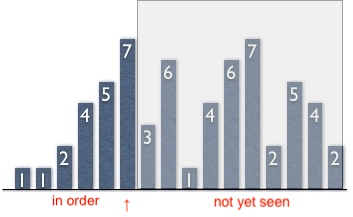
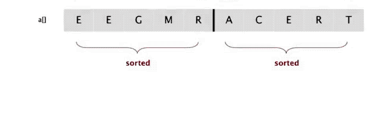
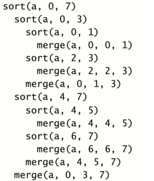
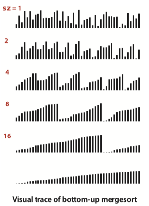
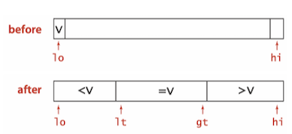
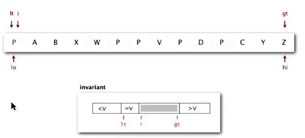
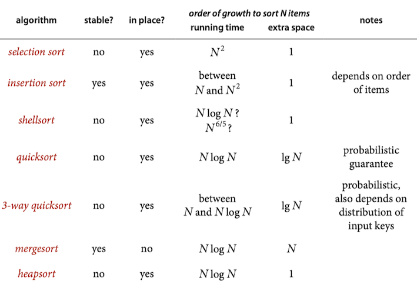
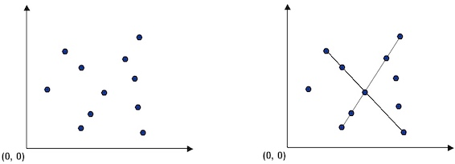

### Selection Sort

* In iteration $i$, find index $min$ of smallest remaining entry. 
* Swap $a[i]$ and $a[min]$.


Animation:


```Java
public class Selection {
    public static void sort(Comparable[] a) {
        int N = a.length;
        for (int i = 0; i < N; i++) {
            int min = i;

            for (int j = i + 1; j < N; j++)
                if (less(a[j], a[min])) min = j;
            exch(a, i, min);
        }
    }
}
```

#### Analysis

Selection sort uses $(N-1)+(N-2)+...+1\sim N^2/2$ compares and $N$ exchanges.

### Insertion Sort

Animation:


* In iteration $i$, swap $a[i]$ with each larger entry to its left.


Invariants.

* ↑ scans from left to right.
* Entries to the left of ↑ (including ↑) are in ascending order.
* Entries to the right of ↑ have not yet been seen.



```Java
public class Insertion {
    public static void sort(Comparable[] a) {
        for (int i = 1; i < a.length; i++) {
            int j = i;
            while (j > 0 && less(a[j], a[j-1])) {
                exch(a, j, j -1);
                j--;
            }
        }
    }

    @SuppressWarnings("unchecked")
    private static boolean less(Comparable a, Comparable b) {
        return a.compareTo(b) < 0;
    }

    private static void exch(Comparable[] a, int i, int j) {
        Comparable temp = a[i];
        a[i] = a[j];
        a[j] = temp;
    }
}
```

#### Analysis
Insertion sort uses $\sim N^2/4$ compares and $\sim N^2/4$ exchanges to sort a randomly ordered array of length $N$ with distinct keys, on the average. The worst case is $\sim N^2/2$ compares and $\sim N ^2/2$ exchanges and the best case is $N-1$ compares and 0 exchanges.

### Shell Sort

### Shuffling

Our goal is to rearrange array so that result is a **uniformly random** permutation.

#### Shuffle sort

* Generate a random real number for each array entry.
* Sort the array based on generated random numbers.


#### Knuth shuffle

* In iteration $i$, pick integer $r$ between 0 and $i$ uniformly at random. 
* Swap $a[i]$ and $a[r]$.

```Java
public class KnuthShuffle {
    public static void shuffle(Object[] a) {
        Random random = new Random();
        for (int i = 0; i < a.length; i++) {
            //In iteration i, pick integer r between 0 and i uniformly at random.
            int r = random.nextInt(i + 1);
            // Swap a[i] and a[r].
            exch(a, i, r);
        }
    }
}
```

Knuth shuffling algorithm produces a uniformly random permutation of the input array in **linear** time.


### Merge Sort

> Mergesort : to sort an array, divide it into two halves, sort the two halves (recursively), and then merge the results.

Basic plan:

* Divide array into two halves.
* <font color="red">Recursively</font> sort each half.
* Merge two halves.


```Java
public static void sort(Comparable[] a) {
    Comparable[] aux = new Comparable[a.length];
    sort(a, aux, 0, a.length - 1);
}

private static void sort(Comparable[] a, Comparable[] aux, 
                            int lo, int hi) {
    if (hi <= lo) return;   
    int mid = lo + (hi - lo) / 2;
    sort(a, aux, lo, mid);          // Sort left half.
    sort(a, aux, mid + 1, hi);      // Sort right half.
    merge(a, aux, lo, mid, hi);     // Merge results
}
```
#### In-place Merge




<C>merge(a, lo, mid, hi)</C> puts the result of merging the subarrays a[lo..mid] with a[mid+1..hi] into a single ordered array, leaving the result in a[lo..hi]. 


```Java
// Merge a[lo..mid] with a[mid+1..hi].
private static void merge(Comparable[] a, Comparable[] aux, 
                                int lo, int mid, int hi) {
    for (int k = lo; k <= hi; k++)  // Copy a[lo..hi] to aux[lo..hi].          
        aux[k] = a[k]; 
    int i = lo, j = mid + 1;
    for (int k = lo; k <= hi; k++) {  // Merge back to a[lo..hi].
        if (i > mid)                            a[k] = aux[j++];
        else if (j > hi)                        a[k] = aux[i++];
        else if (aux[j].compareTo(aux[i]) < 0)  a[k] = aux[j++];
        else                                    a[k] = aux[i++];
    }
}
```

#### Top-down mergesort

Algorithm described so far is a recursive mergesort implementation based on in-place merge. It is one of the best-known examples of the utility of the divide-and-conquer paradigm for efficient algorithm design.

To understand Top-down mergesort, it is worthwhile to consider carefully the dynamics of the method calls, shown in the trace below. To sort a[0..7], the <C>sort()</C> method calls itself to sort a[0..3] then calls itself to sort a[0..1] before finally doing the first merge of a[0] with a[1] after calling itself to sort a[0] and then a[1]（for brevity, we omit the calls for the base-case 1-entry sorts in the trace）. Then the next merge is a[2] with a[3] and then a[0..1] with a[2..3] and so forth. From this trace, we see that the sort code simply provides an organized way to sequence the calls to the <C>merge()</C> method.




Top-down mergesort uses $N\lg N$ compares to sort any array of length $N$.

<hh>Practical Improvements</hh>

* Use insertion sort for small subarrays. Mergesort has too much overhead for tiny subarrays. Cutoff to insertion sort for ≈ 7 items

```Java
if (hi <= lo + CUTOFF - 1) {
    Insertion.sort(a, lo, hi);
    return; 
}
```

* Stop merging if already sorted. Is biggest item in first half ≤ smallest item in second half? Helps for partially-ordered arrays.

```Java
if (a[mid+1].compareTo(a[mid]) >= 0) return;
```

* Eliminate the copy to the auxiliary array. Save time (but not space) by switching the role of the input and auxiliary array in each recursive call.


#### Bottom-up mergesort

Bottom-up mergesort is a simple and *non-recursive* version of mergesort.

Basic plan:

* Pass through array, merging subarrays of size 1. 
* Repeat for subarrays of size 2, 4, 8, 16, ....




```Java
public static void sort(Comparable[] a) {
    int n = a.length;
    Comparable[] aux = new Comparable[n];
    for (int len = 1; len < n; len += len) {      //len: subarray size
        for (int lo = 0; lo < n - len; lo += len+len) {
            int mid  = lo + len - 1;
            int hi = Math.min(lo + len + len - 1, n - 1);
            merge(a, aux, lo, mid, hi);
        }
    }
}
```


### Quick Sort

Quicksort honored as one of *top 10 algorithms* of 20th century in science and engineering. 

Quicksort is popular because it is not difficult to implement, works well for a variety of *different* kinds of input data, and is substantially *faster* than any other sorting method in typical applications.


Basic plan.

* <font color="red">Shuffle</font> the array.
* <font color="red">Partition</font> so that, for some $j$ 
    * entry $a[j]$ is in place
    * no larger entry to the left of $j$
    * no smaller entry to the right of $j$ 
* <font color="red">Sort</font> each piece recursively.


```Java
public class Quick {
    public static void sort(Comparable[] a) {
        // shuffle needed for performance guarantee
        StdRandom.shuffle(a);
        sort(a, 0, a.length - 1);
    }

    private static void sort(Comparable[] a, int lo, int hi) {
        if (hi <= lo) return;
        int j = partition(a, lo, hi);
        sort(a, lo, j-1);
        sort(a, j+1, hi);
    }
}
```

ANIMATION:


!!! note
    
    <hh>Quicksort and Mergesort</hh> Quicksort is a divide-and-conquer method for sorting. Quicksort is complementary to mergesort: 
    
    * for mergesort, we break the array into two subarrays to be sorted and then combine the ordered subarrays to make the whole ordered array; for quicksort, we rearrange the array such that, when the two subarrays are sorted, the whole array is ordered. 
    * for mergesort, we do the two recursive calls before working on the whole array; for quicksort, we do the two recursive calls after working on the whole array. 
    * for mergesort, the array is divided in half; for quicksort, the position of the partition depends on the contents of the array.


#### Partitioning


The crux of the quick sort is the partitioning process, which rearranges the array to make the following three conditions hold:

*  The entry $a[j]$ is in its final place in the array, for some $j$.
*  No entry in $a[lo]$ through $a[j-1]$ is greater than $a[j]$. 
*  No entry in $a[j+1]$ through $a[hi]$ is less than $a[j]$.


* First, we arbitrarily choose $a[lo]$ to be the partitioning item—the one that will go into its final position. 
* Next, we scan from the left end of the array until we find an entry greater than (or equal to) the partitioning item, and we scan from the right end of the array until we find an entry less than (or equal to) the partitioning item. 
* The two items that stopped the scans are out of place in the final partitioned array, so we exchange them.
* Continuing in this way, when the scan indices cross, all that we need to do is to exchange the partitioning item $a[lo]$ with the rightmost entry of the left subarray ($a[j]$) and return its index $j$.


```Java
private static int partition(Comparable a[], int lo, int hi) {
    int i = lo, j = hi + 1;
    while (true) {
        // find item on left to swap
        while (less(a[++i], a[lo]))
            if (i == hi) break;
        // find item on right to swap
        while (less(a[lo], a[--j]))
            if (j == lo) break;
        // check if pointers cross
        if (i >= j) break;
        // swap
        exch(a, i, j);
    }

    // swap with partitioning item
    exch(a, lo, j);
    // return index of item now known to be in place.
    return j;       // with a[lo..j-1] <= a[j] <= a[j+1..hi].
}
```

!!! note
    为什么<C>partition</C>要使用++i，而不是i++，例如
    
    ```Java
    while (i < hi && less(a[i], a[lo])) i++
    ```
    这是因为当数组元素相同时，例如[3,3,3,3,3,3,3,3,3]，i++的做法永远无法前进，会选入死循环。或者采用如下写法：
    
    ```Java
    private int partition(int[] nums, int lo, int hi) {
        int pivot = nums[lo];
        // 注意i, j的起始点也变了
        int i = lo + 1, j = hi;
        while (true) {
            // 把 < 改成 <=
            while (i < hi && nums[i] <= pivot) i++;
            while (j > lo && nums[j] >= pivot) j--;
            if (i >= j) break;
            swap(nums, i, j);
        }
        swap(nums, lo, j);
        return j;
    }
    ```

#### Analysis

* Best case. Number of compares is $\sim N \lg N$.
* Worst case. Number of compares is $\sim \frac{1}{2} N^2$.
* The average number of compares $C_N$ to quicksort an array of $N$ distinct keys is ~ $2N\ln N$ (and the number of exchanges is $\sim\frac{1}{3}N \ln N$).


Quicksort is an **in-place** sorting algorithm, but is **not stable**.

!!! note

    Quicksort is the **fastest** general-purpose sort.
    
    Evidence: This hypothesis is supported by countless implementations of quicksort on countless computer systems since its invention decades ago. Generally, the reason that quicksort is fastest is that it has only a few instructions in its inner loop (and it does well with cache memories because it most often references data sequentially) so that its running time is $\sim c N \lg N$ with the value of c smaller than the corresponding constants for other linearithmic sorts. With 3-way partitioning, quicksort becomes linear for certain key distributions likely to arise in practice, where other sorts are linearithmic.
 
 
#### 3-Way Partition
   
Problem: With duplicate keys, quickSort goes quadratic unless partitioning stops on equal keys!

Solution: 3-way partitioning.


Goal. Partition array into 3 parts so that:

* Entries between $lt$ and $gt$ equal to partition item $v$. 
* No larger entries to left of $lt$.
* No smaller entries to right of $gt$.




Let $v$ be partitioning item $a[lo]$. Scan $i$ from left to right.

* ($a[i] < v$): exchange $a[lt]$ with $a[i]$; increment both $lt$ and $i$
* ($a[i] > v$): exchange $a[gt]$ with $a[i]$; decrement $gt$
* ($a[i] == v$): increment $i$





```Java
private static void quick3WaySort(Comparable[] a, int lo, int hi) { 
    if (hi <= lo) return; 
    int lt = lo, i = lo + 1, gt = hi; 
    Comparable v = a[lo]; 
    while (i <= gt) { 
        int cmp = a[i].compareTo(v); 
        if (cmp < 0)        exch(a, lt++, i++); 
        else if (cmp > 0)   exch(a, i, gt--); 
        else i++; 
    } // Now a[lo..lt-1] < v = a[lt..gt] < a[gt+1..hi]. 
    sort(a, lo, lt - 1); 
    sort(a, gt + 1, hi);
}
```


### Quick-select

Goal. Given an array of $N$ items, find a $k$th smallest item.
 
Partition array so that:
 
* Entry $a[j]$ is in place.
* No larger entry to the left of $j$. 
* No smaller entry to the right of $j$.
 
Repeat in one subarray, depending on $j$; finished when $j$ equals $k$.
 
```Java
public Comparable quickSelect(Comparable[] a, int k) { 
    StdRandom.shuffle(a); 
    int lo = 0, hi = a.length - 1; 
    while (hi > lo) {
        int j = partition(a, lo, hi);
        if      (j < k)     lo = j + 1; 
        else if (j > k)     hi = j - 1;
        else                return a[k]; 
    } 
    return a[k];
}
```

#### Analysis

Quick-select takes *linear time* on average.
 
### Java System Sorts

<C>Arrays.sort()</C>

* Has different method for each primitive type.
* Has a method for data types that implement <C>Comparable</C>.
* Has a method that uses a <C>Comparator</C>.
* Uses tuned quicksort for primitive types; tuned mergesort for objects.

### Which Algorithms should I use?




### Application: Line Recognition

Given a set of $n$ distinct points in the plane, find every (maximal) line segment that connects a subset of 4 or more of the points.




**A faster, sorting-based solution**. Given a point $p$, the following method determines whether $p$ participates in a set of 4 or more collinear points.

* Think of $p$ as the origin.
* For each other point $q$, determine the slope it makes with $p$.
* Sort the points according to the slopes they makes with $p$.
* Check if any 3 (or more) adjacent points in the sorted order have equal slopes with respect to $p$. If so, these points, together with $p$, are collinear.

An immutable data type <C>Point</C> that represents a point in the plane.

```Java
public class Point implements Comparable<Point> {
    private final int x;     // x-coordinate of this point
    private final int y;     // y-coordinate of this point

    // Initializes a new point.
    public Point(int x, int y) {
        this.x = x;
        this.y = y;
    }

    //  Returns the slope between this point and the specified point.
    public double slopeTo(Point that) {
        // points are equal
        if ((x == that.x) && (y == that.y)) return Double.NEGATIVE_INFINITY;
        // line segment connecting the two points is horizontal
        if (y == that.y) return (1-1)/1; // positive zero
        // line segment connecting the two points is vertical
        if (x == that.x) return Double.POSITIVE_INFINITY;
        return ((double) that.y - y)/(that.x - x);
    }

    // Compares two points by y-coordinate, breaking ties by x-coordinate.
    // Formally, the invoking point (x0, y0) is less than the argument point
    // (x1, y1) if and only if either y0 < y1 or if y0 = y1 and x0 < x1.
    public int compareTo(Point that) {
        if ((x == that.x) && (y == that.y)) return 0;
        if ((y < that.y) || ((y == that.y) && (x < that.x))) return -1;
        return 1;
    }

    // Compares two points by the slope they make with this point.
    public Comparator<Point> slopeOrder() {
        return Comparator.comparing(this::slopeTo);
    }
}
```

To represent line segments in the plane, use the data type <C>LineSegment</C>.
 
```Java
 public class LineSegment {
    private final Point p;   // one endpoint of this line segment
    private final Point q;   // the other endpoint of this line segment
    // Initializes a new line segment.
    public LineSegment(Point p, Point q) {
        this.p = p;
        this.q = q;
    }
}
```

<C>FastCollinearPoints</C> implements the algorithm.

```Java
public class FastCollinearPoints {
    private Point[] points;     // array for points;
    private List<LineSegment> lineSegments; //line segments
    // Finds all line segments containing 4 points.
    public FastCollinearPoints(Point[] pointsIn) {
        // make a copy of points, make it immutable
        points = pointsIn.clone();
        // check null
        for (Point point : points)
            if (point == null)
                throw new IllegalArgumentException();

        // check for duplicity
        Arrays.sort(points);
        for (int i = 0; i < points.length - 1; i++)
            if (points[i].compareTo(points[i + 1]) == 0)
                throw new 
                IllegalArgumentException("Some of Points are repeat.");

        // find line segments
        lineSegments = new ArrayList<>();
        // array used for points sort by slope
        Point[] pointsSortedBySlope;
        // for every point p, find line segments containing p.
        for (Point p : points) {
            // initialize pointSort
            pointsSortedBySlope = points.clone();
            // sort by Comparator based on slopes
            Arrays.sort(pointsSortedBySlope, p.slopeOrder());
            findLineSegment(lineSegments, pointsSortedBySlope, p);
        }
    }

    //  For point p, find line Segment containing p.
    private void findLineSegment(List<LineSegment> lineSegments,
                    Point[] pointsSortedBySlope, Point p) {
        // sliding window (start, end), where start, end is inclusive
        int start = 0, end;
        while (start < pointsSortedBySlope.length - 2) {
            end = start + 1;
            // when the slope is the same, keep extending the sliding window
            while (end < pointsSortedBySlope.length
                    && p.slopeTo(pointsSortedBySlope[start]) ==
                            p.slopeTo(pointsSortedBySlope[end]))
                end++;
            // find line segments which have at leat 4 points
            if (end - start >= 3) {
                // sort points based on their x, y coordinates
                Arrays.sort(pointsSortedBySlope, start, end);

                // We store a linesegment in the array 
                // only if the point which is iterating in the outside loop
                // is the smallest point in the line segment.
                // And this solve the problem without extra memory
                // or the use of hash set.
                if (p.compareTo(pointsSortedBySlope[start]) < 0)
                    lineSegments.add(new LineSegment(p, 
                                pointsSortedBySlope[end - 1]));
                // jump to unvisited points
                start = end - 3;
            } // end if
            start++;
        } // end while
    }

    // Return the number of line segments
    public int numberOfSegments() {
        return lineSegments.size();

    // Return line segments.
    public LineSegment[] segments() {
        return lineSegments.toArray(new LineSegment[0]);
    }
}
```