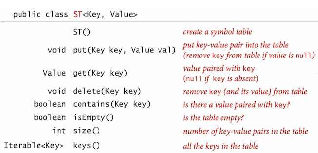
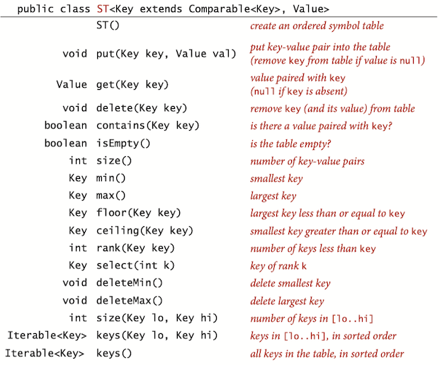
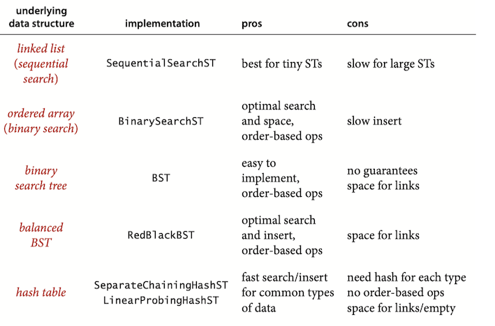
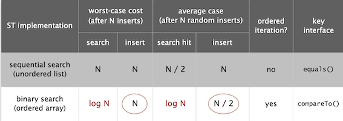
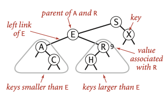
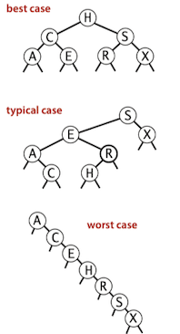
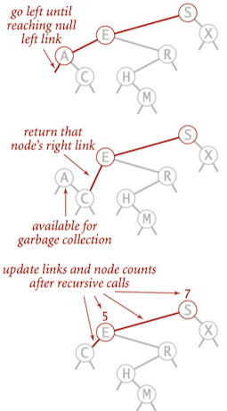

### Symbol Tables

> Definition. A *symbol table*(符号表) is a data structure for key-value pairs that supports two operations: <BC>insert</BC> (put) a new pair into the table and <BC>search</BC> for (get) the value associated with a given key.

key-value pair abstraction.

* **insert** a value with specified key.
* Given a key, **search** for the corresponding value.

#### Basic Symbol Table API

API for a generic basic symbol table:



#### Ordered symbol tables API

Specifically, for applications where keys are <C>Comparable</C>, we implement the following API.



#### Preview

We shall consider six symbol-table implementations in this section, so a brief preview is in order.

Pros and cons of symbol-table implementations:




### Elementary Implementations


#### Sequential Search

Sequential search in a linked list:

* Maintain an (unordered) linked list of key-value pairs.
* **Search**: Scan through all keys until find a match.
* **Insert**: Scan through all keys until find a match; if no match add to front.


??? Implementation
    
    ```Java
    public class SequentialSearchST<Key, Value> {
        private Node first;
        private int size;
    
        // create a symbol table
        public SequentialSearchST() {
        }
    
        // put key-value pair into the table.
        public void put(Key key, Value val) {
            // if key is null
            if (key == null) 
                throw new IllegalArgumentException("Key is null");
            // Search for key.
            // Update value if found; grow table if new.
            for (Node cur = first; cur != null; cur = cur.next) {
                if (cur.key.equals(key)) {
                    cur.value = val; // Search hit: update val.
                    return;
                }
            }
            // Search miss: add new node.
            first = new Node(key, val, first); 
            size++;
        }
    
        //  Value paired with key.
        public Value get(Key key) {
            // Search for key
            for (Node cur = first; cur != null; cur = cur.next)
                if (cur.key.equals(key))
                    return cur.value; // search hit
            return null; // search miss
        }
    
        // remove key (and its value) from table
        public void delete(Key key) {
            // if key is null
            if (key == null) 
                throw new IllegalArgumentException("Key is null");
    
            // delete first
            if (first.key.equals(key)) {
                Node toDelete = first;
                first = first.next;
                first.next = null; // prevent loitering
                size--;
                return;
            }
    
            // search for key in the rest of the linkedlist
            for (Node cur = first; cur.next != null; cur = cur.next) {
                if (cur.next.key.equals(key)) { // search hit
                    Node toDelete = cur.next;
                    cur.next = cur.next.next;
                    toDelete.next = null; // prevent loitering
                    size--;
                    return;
                }
            }
        }
    
        //  is there a value paired with key?
        public boolean contains(Key key) {
            return get(key) == null;
        }
    
        // is the table empty?
        public boolean isEmpty() {
            return size() == 0;
        }
    
        // number of key-value pairs in the table
        public int size() {
            return size;
        }
    
        // all the keys in the table
        public Iterable<Key> keys() {
            List<Key> keyList = new ArrayList<>();
            for (Node cur = first; cur != null; cur = cur.next)
                keyList.add(cur.key);
            return keyList;
        }
    
        // Node for LinkedList
        private class Node {
            Key key;
            Value value;
            Node next;
            Node(Key key, Value value, Node next) {
                this.key = key;
                this.value = value;
                this.next = next;
            }
        }
    }
    ```


#### Binary Search

Next, we consider a full implementation of our ordered symbol-table API. The underlying data structure is a pair of parallel arrays, one for the keys and one for the values.

* The heart of the implementation is the <C>rank()</C> method, which returns the number of keys smaller than a given key.
* For <C>get()</C>, the rank tells us precisely where the key is to be found if it is in the table (and, if it is not there, that it is not in the table).
* For <C>put()</C>, the rank tells us precisely where to update the value when the key is in the table, and precisely where to put the key when the key is not in the table.

??? Implementation

    ```Java
    public class BinarySearchST<K extends Comparable<K>, V> {
    
        private K[] keys;
        private V[] vals;
        private int size;
    
        /**
         * create a symbol table.
         * @param capacity: the size of the symbol table
         */
        @SuppressWarnings("unchecked")
        public BinarySearchST(int capacity) {
            keys = (K[]) new Comparable[capacity];
            vals = (V[]) new Object[capacity];
        }
    
        /**
         * put key-value pair into the table.
         * remove key from table if value is null.
         * @param key: key
         * @param val: value
         * @throws IllegalArgumentException if key is null
         */
        public void put(K key, V val) {
            // search for key.
            int i = rank(key);
            // update value if found
            if (i < size && keys[i].compareTo(key) == 0) {
                vals[i] = val;
                return;
            }
            // grow table if new
            for (int j = size; j > i; j--) {
                keys[j] = keys[j-1];
                vals[j] = vals[j-1];
                size++;
            }
        }
    
        /**
         * V paired with key.
         * (null if key is absent)
         * @param key: key
         * @return V paired with key
         */
        public V get(K key) {
            if (isEmpty()) return null;
            int i = rank(key);
            if (i < size && keys[i].compareTo(key) == 0)
                return vals[i]; // search hit
            return null; // search miss
        }
    }
    ```

<hh>Binary Search</hh>

The reason that we keep keys in an ordered array is so that we can use array indexing to dramatically reduce the number of compares required for each search, using the classic and venerable **binary search** algorithm.

To search, we compare the search key against the key in the middle of the subarray. If the search key is less than the key in the middle, we search in the left half of the subarray; if the search key is greater than the key in the middle, we search in the right half of the  subarray; otherwise the key in the middle is equal to the search key.

Recursive Binary Search:

```Java
private int rank(K key, int lo, int hi) {
    if (hi < lo) return lo;
    int mid = (lo + hi)/2;
    int cmp = key.compareTo(keys[mid]);
    if (cmp < 0) return rankRecursive(key, lo, mid - 1);
    else if (cmp > 0) return  rankRecursive(key, mid + 1, hi);
    else return mid;
}
```


Non-Recursive Binary Search:

```Java
private int rank(K key) {
    int lo = 0, hi = size - 1;
    while (lo <= hi) {
        int mid = (lo + hi)/2;
        int cmp = key.compareTo(keys[mid]);
        if (cmp < 0) hi = mid - 1;
        else if (cmp > 0) lo = mid + 1;
        else return mid;
    }
    return lo;
}
```


#### Analysis




Inserting $N$ distinct keys into an initially empty linked-list symbol table uses $\sim N^2 /2$ compares.

Inserting a new key into an ordered array of size $N$ uses $\sim 2N$ array accesses in the worst case, so inserting $N$ keys into an initially empty table uses $\sim N^2$ array accesses in the worst case.

The central question is whether we can devise algorithms and data structures that achieve logarithmic performance for both search and insert.

### Binary Search Trees

> Definition. A *binary search tree* (BST) is a binary tree where each node has a <CB>Comparable</CB> key (and an associated value) and satisfies the restriction that the key in any node is larger than the keys in all nodes in that node’s left subtree and smaller than the keys in all nodes in that node’s right subtree.





Each node contains a key, a value, a left link, a right link, and a node count.


```Java
private class Node {
    private Key key;           // sorted by key
    private Value val;         // associated data
    private Node left, right;  // left and right subtrees
    private int size;          // number of nodes in subtree

    public Node(Key key, Value val, int size) {
        this.key = key;
        this.val = val;
        this.size = size;
    }
}
```
#### Basic Implementation

<hh>get()</hh>

A recursive algorithm to search for a key in a BST follows immediately from the recursive structure: if the tree is empty, we have a *search miss*; if the search key is equal to the key at the root, we have a *search hit*. Otherwise, we search (recursively) in the appropriate subtree, moving left if the search key is smaller, right if it is larger.

```Java
// Return value associated with key in the subtree rooted at x; 
// Return null if key not present in subtree rooted at x.
private Value get(Node x, Key key) { 
    if (x == null) return null; 
    int cmp = key.compareTo(x.key); 
    if (cmp < 0) return get(x.left, key); 
    else if (cmp > 0) return get(x.right, key); 
    else return x.val; 
}
```

<hh>put()</hh>

A more important essential feature of BSTs is that <C>put</C> is not much more difficult to implement than <C>get</C>. Indeed, a search for a key not in the tree ends at a null link, and all that we need to do is replace that link with a new node containing the key.

```Java
// Search for key. Update value if found; grow table if new.
public void put(Key key, Value val) { 
    root = put(root, key, val); 
}

// Change key’s value to val if key in subtree rooted at x.
// Otherwise, add new node to subtree associating key with val.
private Node put(Node x, Key key, Value val) {
    if (x == null) return new Node(key, val, 1); 
    int cmp = key.compareTo(x.key); 
    if (cmp < 0)        x.left = put(x.left, key, val); 
    else if (cmp > 0)   x.right = put(x.right, key, val); 
    else                x.val = val;  // update value
    x.N = size(x.left) + size(x.right) + 1;  // update count
    return x;
}
```

<hh>Analysis</hh>

The running times of algorithms on binary search trees depend on the shapes of the trees, which, in turn, depend on the order in which keys are inserted. In the best case, a tree with $N$ nodes could be perfectly balanced, with $\sim \log N$ nodes between the root and each null link. In the worst case there could be $N$ nodes on the search path. The balance in typical trees turns out to be much closer to the best case than the worst case.




> Insertions, search miss and search hits in a BST built from $N$ random keys require $\sim 2 ln N$ (about 1.39 $\lg N$) compares, on the average.

#### Order-based methods and deletion

An important reason that BSTs are widely used is that they allow us to *keep the keys in order*.

<hh>min</hh>

If the left link of the root is null, the smallest key in a BST is the key at the root; if the left link is not null, the smallest key in the BST is the smallest key in the subtree rooted at the node referenced by the left link.


```Java
public Key min() {
    return min(root).key; 
}

private Node min(Node x) {
    if (x.left == null) return x;
    return min(x.left); 
}
```

<hh>floor</hh>

<C>floor()</C> gives the largest key in the BST less than or equal to key. 

* If a given key is less than the key at the root of a BST, then the floor of key must be in the left subtree. 
* If key is greater than the key at the root, then the floor of key could be in the right subtree, but only if there is a key smaller than or equal to key in the right subtree; 
* if not (or if key is equal to the key at the root), then the key at the root is the floor of key.

```Java
public Key floor(Key key) {
    Node x = floor(root, key);
    if (x == null) return null;
    return x.key; 
}

private Node floor(Node x, Key key) {
    if (x == null) return null; 
    int cmp = key.compareTo(x.key); 
    if (cmp == 0) return x; 
    if (cmp < 0) return floor(x.left, key); 
    Node t = floor(x.right, key); 
    if (t != null) return t;
    else return x;
}
```

<hh>rank</hh>


<C>rank()</C> gives number of keys in the tree less than key: 

* If the given key is equal to the key at the root, we return the number of keys $t$ in the left subtree; 
* If the given key is less than the key at the root, we return the rank of the key in the left subtree (recursively computed); 
* If the given key is larger than the key at the root, we return $t$ plus one (to count the key at the root) plus the rank of the key in the right subtree (recursively computed).

```Java
public int rank(Key key) {
    return rank(key, root);
} 

// Number of keys in the subtree less than key.
private int rank(Key key, Node x) {
    if (x == null) return 0; 
    int cmp = key.compareTo(x.key); 
    if      (cmp < 0) return rank(key, x.left); 
    else if (cmp > 0) return 1 + size(x.left) + rank(key, x.right); 
    else              return size(x.left); 
} 
```
<hh>Subtree counts</hh>

Each node stores the number of nodes in the subtree rooted at that node; to implement <C>size()</C>, return the count at the root.

```Java
// Returns the number of key-value pairs in bst.
public int size() {
    return size(root);
}

// return number of key-value pairs in BST rooted at x
private int size(Node x) {
    if (x == null) return 0;
    else return x.size;
}
```


#### Delete

<hh>Deleting the minimum</hh>

<C>deleteMin()</C> removes the key-value pair with the smallest key.

* Go left until finding a node with a null left link. 
* Replace that node by its right link.
* Update subtree counts.
* 


```Java
// Removes the key-value pair with the smallest key.
// throws NoSuchElementException if the bst is empty
public void deleteMin() {
    if (isEmpty()) throw new NoSuchElementException("BST is empty");
    deleteMin(root);
}

private Node deleteMin(Node x) {
    if (x.left == null) return x.right;
    x.left = deleteMin(x.left);
    x.size = size(x.left) + size(x.right) + 1;
    return x;
}
```


#### Analysis

In a BST, all operations take time proportional to the height of the tree, in the worst case.


