### 1 Minimum Spanning Tree

> A <font color='red'>spanning tree</font> of $G$ is a subgraph $T$ that is both a <font color='red'>tree</font> (connected and acyclic) and <font color='red'>spanning</font> (includes all of the vertices). A <font color='red'>minimum spanning tree</font> (MST) of an edge-weighted graph is a spanning tree whose weight (the sum of the weights of its edges) is minimum.

#### Cut property

> A <font color='red'>cut</font> of a graph is a partition of its vertices into two nonempty disjoint sets. A <font color='red'>crossing edge</font> of a cut is an edge that connects a vertex in one set with a vertex in the other.

Given any cut in an edge-weighted graph, the crossing edge of minimum weight is in the MST of the graph.

Pf. Suppose min-weight crossing edge $e$ is not in the MST.

* Adding $e$ to the MST creates a cycle.
* Some other edge $f$ in cycle must be a crossing edge. 
* Removing $f$ and adding $e$ is also a spanning tree. 
* Since weight of $e$ is less than the weight of $f$, that spanning tree is lower weight.
* Contradiction.

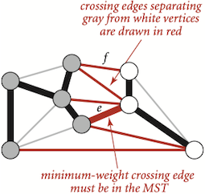

#### Greedy MST algorithm

* Start with all edges colored gray.
* Find cut with no black crossing edges; color its min-weight edge black. 
* Repeat until V - 1 edges are colored black.

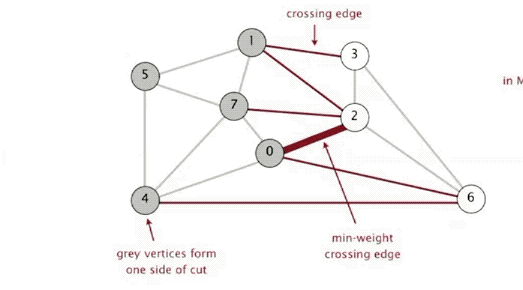

Efficient implementations. Choose cut? Find min-weight edge? 

* Ex 1. Kruskal's algorithm.
* Ex 2. Prim's algorithm

#### Edge-Weighted Graph

Edge abstraction needed for weighted edges:


```Java
public class Edge implements Comparable<Edge> { 
    private final int v, w;
    private final double weight;

    // Initializes an edge between vertices v and w of
    // the given weight
    public Edge(int v, int w, double weight) {
        this.v = v;
        this.w = w;
        this.weight = weight;
    }

    // Returns the weight of this edge.
    public double weight()
    { return weight; }

    // Returns either endpoint of this edge.
    public int either() {
    { return v; }

    // Returns the endpoint of the edge different from the given vertex.
    public int other(int vertex) {
        if      (vertex == v) return w;
        else                  return v;
    }

    // Compares two edges by weight.
    @Override
    public int compareTo(Edge that) {
        return Double.compare(this.weight, that.weight);
    }
}
```

The API if <C>EdgeWeightedGraph</C> is very similar to the API for <C>Graph</C>. The two important differences are that it is based on <C>Edge</C> and that it adds the <C>edges()</C> method at right, which iterates through to all the graph’s edges (ignoring any self-loops).

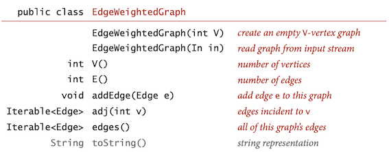

The implementation maintains a vertex-indexed array of lists of edges. As with <C>Graph</C>, every edge appears twice: if an edge connects $v$ and $w$, it appears both in $v$’s list and in $w$’s list. The <C>edges()</C> method puts all the edges in a <C>Bag</C>.

```Java
public class EdgeWeightedGraph {
    private final int V;
    private int E;
    private Bag<Edge>[] adj;
    
    // Initializes an empty edge-weighted graph with V vertices and 0 edges.
    public EdgeWeightedGraph(int V) {
        this.V = V;
        this.E = 0;
        adj = (Bag<Edge>[]) new Bag[V];
        for (int v = 0; v < V; v++)
            adj[v] = new Bag<Edge>();
    }
    // Returns the number of vertices.
    public int V()
    { return V; }
    
    // Returns the number of edges
    public int E()
    { return E; }

    // Adds the undirected edge e.
    public void addEdge(Edge e) {
        int v = e.either();
        int w = e.other(v);
        adj[v].add(e);
        adj[w].add(e);
        E++;
    }

   // Returns the edges incident on vertex
    public Iterable<Edge> adj(int v)
    { return adj[v]; }

    // Returns all edges in this edge-weighted graph.
    public Iterable<Edge> edges() {
        Bag<Edge> list = new Bag<Edge>();
        for (int v = 0; v < V; v++) {
            int selfLoops = 0;
            for (Edge e : adj(v)) {
                if (e.other(v) > v)
                    list.add(e);
                // add only one copy of each self loop 
                // (self loops will be consecutive)
                else if (e.other(v) == v)
                    if (selfLoops % 2 == 0) list.add(e);
                    selfLoops++;
            }
        }
        return list;
    }
}
```

#### MST API

How to represent the MST?


#### Kruskal's Algorithm

* Consider edges in ascending order of weight.
* Add next edge to tree $T$ unless doing so would create a cycle.


Pf. Kruskal's algorithm is a special case of the greedy MST algorithm.

* If the next edge to be considered does not form a cycle with black edges, it crosses a cut defined by the set of vertices connected to one of the edge’s vertices by tree edges (and its complement). 
* Since the edge does not create a cycle, it is the only crossing edge seen so far.
* Since we consider the edges in sorted order, it is a crossing edge of minimum weight. 
* Thus, the algorithm is successively taking a minimal-weight crossing edge, in accordance with the greedy algorithm.


The implementation of Kruskal’s algorithm uses a queue to hold MST edges, a priority queue to hold edges not yet examined, and a [union-find](unionfind.md) data structure for identifying ineligible edges.

```Java
public class KruskalMST {
    private double weight;                        // weight of MST
    private Queue<Edge> mst = new LinkedList<>(); // edges in MST

    // Compute a minimum spanning tree (or forest) of an edge-weighted graph.
    public KruskalMST(EdgeWeightedGraph G) {
        // more efficient to build heap by passing array of edges
        ArrayList<Edge> edges = new ArrayList<>();
        for (Edge edge : G.edges())  edges.add(edge);
        PriorityQueue<Edge> pq = new PriorityQueue<>(edges);

        // run greedy algorithm
        UF uf = new UF(G.V());
        while (!pq.isEmpty() && mst.size() < G.V() - 1) {
            Edge e = pq.poll();
            int v = e.either(), w = e.other(v);
            if (!uf.connected(v, w)) { // v-w does not create a cycle
                uf.union(v, w);  // merge v and w components
                mst.offer(e);   // add edge e to mst
                weight += e.weight();
            }
        }
    }

    // Returns the edges in a minimum spanning tree (or forest).
    public Iterable<Edge> edges() {
        return mst;
    }

   // Returns the sum of the edge weights in a minimum spanning tree (or forest).
    public double weight() {
        return weight;
    }
}
```

Kruskal's algorithm computes MST in time proportional to $E \log E$ (in the worst case).


#### Prim's Algorithm

* Start with vertex 0 and greedily grow tree $T$.
* Add to $T$ the min weight edge with exactly one endpoint in $T$. 
* Repeat until $V$ - 1 edge

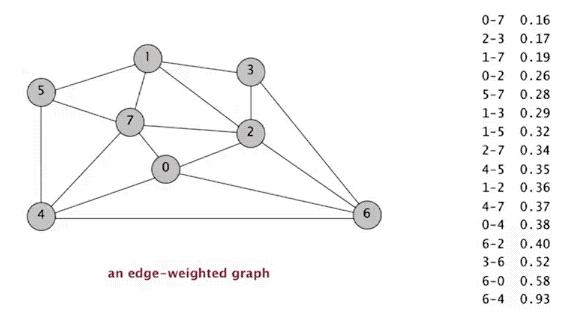

Pf. Prim's algorithm is a special case of the greedy MST algorithm.

The growing tree defines a cut with no black edges; the algorithm takes the crossing edge of minimal weight, so it is successively coloring edges black in accordance with the greedy algorithm.

<hh>Data structures</hh>

* Vertices on the tree : We use a vertex-indexed boolean array <C>marked[]</C>, where marked[$v$] is true if $v$ is on the tree.
* Edges on the tree : We use one of two data structures: a queue <C>mst</C> to collect MST edges or a vertex-indexed array <C>edgeTo[]</C> of <C>Edge </C>objects, where edgeTo[$v$] is the Edge that connects $v$ to the tree.
* Crossing edges : We use a <C>MinPQ<Edge></C> priority queue that compares edges by weight.

Challenge. Find the min weight edge with exactly one endpoint in $T$.

<hh>Lazy Implementation</hh>

Maintaining the set of crossing edges.

* Key = edge; priority = weight of edge.
* Delete-min to determine next edge $e = v-w$ to add to $T$.
* Disregard if both endpoints $v$ and $w$ are marked (both in $T$). 
* Otherwise, let $w$ be the unmarked vertex (not in $T$):
    * add to PQ any edge incident to $w$ (assuming other endpoint not in $T$)
    * add $e$ to $T$ and mark $w$


The lazy version of Prim’s algorithm uses space proportional to $E$ and time proportional to $E\log E$ (in the worst case) to compute the MST of a connected edge-weighted graph with $E$ edges and $V$ vertices.

```Java
public class LazyPrimMST {
    private double weight;                  // total weight of MST
    private Queue<Edge> mst;                // edges in the MST
    private boolean[] marked;               // marked[v] = true if v on tree
    private PriorityQueue<Edge> pq;         // edges with one endpoint in tree

    // Compute a minimum spanning tree (or forest) of an edge-weighted graph.
    public LazyPrimMST(EdgeWeightedGraph G) {
        mst = new LinkedList<>();
        pq = new PriorityQueue<>();
        marked = new boolean[G.V()];
        for (int v = 0; v < G.V(); v++)     // run Prim from all vertices to
            if (!marked[v]) prim(G, v);     // get a minimum spanning forest
    }

    // run Prim's algorithm
    private void prim(EdgeWeightedGraph G, int s) {
        scan(G, s);
        while (!pq.isEmpty()) {                     // better to stop when mst has V-1 edges
            Edge e = pq.poll();                     // smallest edge on pq
            int v = e.either(), w = e.other(v);     // two endpoints
            if (marked[v] && marked[w]) continue;   // lazy, both v and w already scanned
            mst.offer(e);                           // add e to MST
            weight += e.weight();
            if (!marked[v]) scan(G, v);             // v becomes part of tree
            if (!marked[w]) scan(G, w);             // w becomes part of tree
        }
    }

    // add all edges e incident to v onto pq if the other endpoint has not yet been scanned
    private void scan(EdgeWeightedGraph G, int v) {
        marked[v] = true;
        for (Edge e : G.adj(v))
            if (!marked[e.other(v)]) pq.offer(e);
    }
}
```

#### Questions

1. Do Prim’s and Kruskal’s algorithms work for directed graphs?
   
    A. No, not at all. That is a more difficult graph-processing problem known as the *minimum cost arborescence problem*.


2. **Bottleneck minimum spanning tree**. Given a connected edge-weighted graph, design an efficient algorithm to find a *minimum bottleneck spanning tree*(MBST). The bottleneck capacity of a spanning tree is the weights of its largest edge. A minimum bottleneck spanning tree is a spanning tree of minimum bottleneck capacity.
    
    A MST is necessarily a MBST, but a MBST is not necessarily a MST.

3. **Is an edge in a MST**. Given an edge-weighted graph $G$ and an edge $e$, design a linear-time algorithm to determine whether $e$ appears in some MST of $G$.
    
    For both endpoints of the edge, using cut theory.
    
    
4.  **Minimum-weight feedback edge set**. A feedback edge set of a graph is a subset of edges that contains at least one edge from every cycle in the graph. If the edges of a feedback edge set are removed, the resulting graph is acyclic. Given an edge-weighted graph, design an efficient algorithm to find a feedback edge set of minimum weight. Assume the edge weights are positive.
   
    Minimum-weight feedback edge sets of undirected graphs are complements of maximum-weight spanning forests.


### 2 Shortest Path

> A <font color='red'>shortest path</font> from vertex $s$ to vertex $t$ in an edge-weighted digraph is a directed path from $s$ to $t$ with the property that no other such path has a lower weight.

We focus on the single-source shortest-paths problem:

***Single-source shortest paths***. Given an edge-weighted digraph and a source vertex $s$, support queries of the form: Is there a directed path from $s$ to a given target vertex $t$? If so, find a shortest such path.

The result of the computation is a tree known as the *shortest-paths tree*(SPT), which gives a shortest path from $s$ to every vertex reachable from $s$.

> Given an edge-weighted digraph and a designated vertex $s$, a <font color='red'>shortest-paths tree</font> for a source $s$ is a subgraph containing $s$ and all the vertices reachable from $s$ that forms a directed tree rooted at $s$ such that every tree path is a shortest path in the digraph.

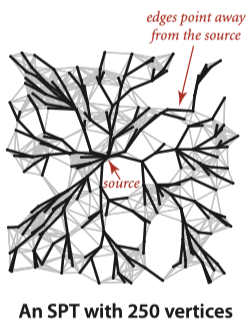

#### API

Instead of the <C>either()</C> and <C>other()</C> methods in Edge, we have <C>from()</C> and <C>to()</C> methods:


```Java
public class DirectedEdge { 
    private final int v, w;
    private final double weight;

    // Initializes a directed edge from vertex v to vertex w 
    // with the given weight
    public DirectedEdge(int v, int w, double weight) {
        this.v = v;
        this.w = w;
        this.weight = weight;
    }

    // Returns the tail vertex of the directed edge.
    public int from() {
        return v;
    }

    // Returns the head vertex of the directed edge.
    public int to() {
        return w;
    }

    // Returns the weight of the directed edge.
    public double weight() {
        return weight;
    }

    // Returns a string representation of the directed edge.
    public String toString() {
        return v + "->" + w + " " + String.format("%5.2f", weight);
    }
}
```


Instead of the adjacency lists of integers used in <C>Digraph</C>, we have adjacency lists of <C>DirectedEdge</C> objects in <C>EdgeWeightedDigraph</C>.


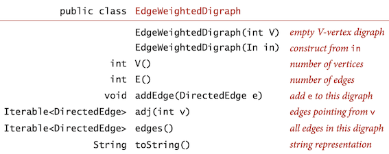

```Java
public class EdgeWeightedDigraph {
    private final int V;                // number of vertices in this digraph
    private int E;                      // number of edges in this digraph
    private Bag<DirectedEdge>[] adj;    // adj[v] = adjacency list for vertex v
    
    // Initializes an empty edge-weighted digraph with V vertices and 0 edges.
    public EdgeWeightedDigraph(int V) {
        this.V = V; this.E = 0;
        adj = (Bag<DirectedEdge>[]) new Bag[V];
        for (int v = 0; v < V; v++)
            adj[v] = new Bag<DirectedEdge>();
    }
    
    // Returns the number of vertices in this edge-weighted digraph.
    public int V() {
        return V;
    }

   // Returns the number of edges in this edge-weighted digraph.
    public int E() {
        return E;
    }

    // Adds the directed edge e to this edge-weighted digraph.
    public void addEdge(DirectedEdge e) {
        int v = e.from(), w = e.to();
        adj[v].add(e);
        E++;
    }

    // Returns the directed edges incident from vertex v.
    public Iterable<DirectedEdge> adj(int v) {
        return adj[v];
    }

    // Returns all directed edges in this edge-weighted digraph.
    public Iterable<DirectedEdge> edges() {
        Bag<DirectedEdge> list = new Bag<DirectedEdge>();
        for (int v = 0; v < V; v++)
            for (DirectedEdge e : adj(v))
                list.add(e);
        return list;
    } 
}
```

For shortest paths, <C>SP</C> builds the shortest-paths tree and computes shortest-paths distances; the client query methods use those data structures to provide distances and iterable paths to the client.


#### Shortest-Paths properties

Shortest-paths implementations are based on a simple operation known as *relaxation*.

<hh>Edge relaxation</hh>
To relax an edge $v\rightarrow w$ means to test whether the best known way from $s$ to $w$ is to go from $s$ to $v$, then take the edge from $v$ to $w$, and, if so, update our data structures to indicate that to be the case.

Relax edge $e = v\rightarrow w$.

* $\text{distTo}[v]$ is length of shortest known path from $s$ to $v$. 
* $\text{distTo}[w]$ is length of shortest known path from $s$ to $w$. 
* $\text{edgeTo}[w]$ is last edge on shortest known path from $s$ to $w$. 
* If $e = v\rightarrow w$ gives shorter path to $w$ through $v$, update both $\text{distTo}[w]$ and $\text{edgeTo}[w]$.

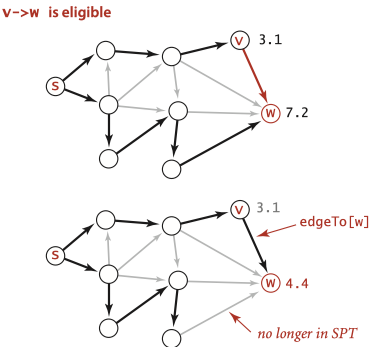


```Java
private void relax(DirectedEdge e) {
    int v = e.from(), w = e.to(); 
    if (distTo[w] > distTo[v] + e.weight()) {
        distTo[w] = distTo[v] + e.weight();
        edgeTo[w] = e; 
    }
}
```


The term *relaxation* follows from the idea of a rubber band stretched tight on a path connecting two vertices: relaxing an edge is akin to relaxing the tension on the rubber band along a shorter path, if possible.

<hh>Vertex relaxation</hh>
Each vertex relaxation finds a shorter path than the best known so far to some vertex, incrementally progressing toward the goal of finding shortest paths to every vertex.

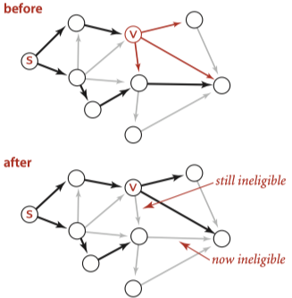

```Java
private void relax(EdgeWeightedDigraph G, int v) {
    for (DirectedEdge e : G.adj(v)) { 
        int w = e.to(); 
        if (distTo[w] > distTo[v] + e.weight()) { 
            distTo[w] = distTo[v] + e.weight(); 
            edgeTo[w] = e; 
        }
    }
}
```

<hh>Shortest-paths optimality conditions</hh> The following optimality conditions shows an equivalence between the *global* condition that the distances are shortest-paths distances, and the *local* condition that we test to relax an edge.

Let $G$ be an edge-weighted digraph. Then $\text{distTo}[]$ are the shortest path distances from $s$ iff:

* $\text{distTo}[s]$ = 0.
* For each vertex $v$, $\text{distTo}[v]$  is the length of some path from $s$ to $v$. 
* For each edge $e = v\rightarrow w$, $\text{distTo}[w] ≤ \text{distTo}[v] + e.\text{weight}()$.

<hh>Generic shortest-paths algorithm</hh> Initialize $\text{distTo}[s]$ to 0 and all other $\text{distTo}[]$ values to infinity, and proceed as follows: 

*Relax any edge in $G$, continuing until no edge is eligible.*

For all vertices $w$ reachable from $s$, the value of $\text{distTo}[w]$ after this computation is the length of a shortest path from $s$ to $w$.

The key reason for considering the *optimality conditions* and the *generic algorithm* is that the generic algorithm does *not specify in which order the edges are to be relaxed.* Thus, all that we need to do to prove that any algorithm computes shortest paths is to prove that it relaxes edges until no edge is eligible.

Efficient implementations. How to choose which edge to relax? 

* Ex 1. Dijkstra's algorithm (nonnegative weights).
* Ex 2. Topological sort algorithm (no directed cycles).
* Ex 3. Bellman-Ford algorithm (no negative cycles).

#### Dijkstra’s algorithm

* Consider vertices in increasing order of distance from $s$ (non-tree vertex with the lowest <C>distTo[]</C> value).
* Add vertex to tree and relax all edges pointing from that vertex.

Pf.

* Each edge $e = v\rightarrow w$ is relaxed exactly once (when $v$ is relaxed), leaving $\text{distTo}[w] ≤ \text{distTo}[v] + e.\text{weight}()$.
* Inequality holds until algorithm terminates because:
    * $\text{distTo}[w]$ cannot increase $\text{distTo[]}$ values are monotone decreasing
    * $\text{distTo}[v]$ will not change

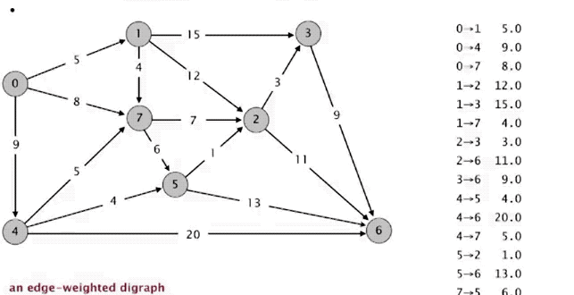

```Java
public class DijkstraSP {
    // distTo[v] = distance  of shortest s->v path
    private double[] distTo;   
    // edgeTo[v] = last edge on shortest s->v path       
    private DirectedEdge[] edgeTo;   
    // priority queue of vertices
    private PriorityQueue<double[]> pq;    

    // Computes a shortest-paths tree from the source vertex s 
    // to every other  vertex in the edge-weighted digraph G.
    public DijkstraSP(EdgeWeightedDigraph G, int s) {
        distTo = new double[G.V()];
        edgeTo = new DirectedEdge[G.V()];
        for (int v = 0; v < G.V(); v++)
            distTo[v] = Double.POSITIVE_INFINITY;
        distTo[s] = 0.0;

        // relax vertices in order of distance from s
        pq = new PriorityQueue<>(Comparator.comparing(o->o[1]));
        pq.offer(new double[]{s, distTo[s]});
        while (!pq.isEmpty()) {
            int v = (int) pq.poll()[0];
            for (DirectedEdge e : G.adj(v))
                relax(e);
        }
    }

    // relax edge e and update pq if changed
    private void relax(DirectedEdge e) {
        int v = e.from(), w = e.to();
        if (distTo[w] > distTo[v] + e.weight()) {
            distTo[w] = distTo[v] + e.weight();
            edgeTo[w] = e;
            pq.remove(new int[]{w, distTo[w]});
            pq.put(w, distTo[w]);
        }
    }

    // Returns the length of a shortest path from the source vertex s to v.
    public double distTo(int v) {
        return distTo[v];
    }

    // Returns true if there is a path from the source vertex s to v
    public boolean hasPathTo(int v) {
        return distTo[v] < Double.POSITIVE_INFINITY;
    }

    // Returns a shortest path from the source vertex s to v
    public Iterable<DirectedEdge> pathTo(int v) {
        if (!hasPathTo(v)) return null;
        Stack<DirectedEdge> path = new Stack<DirectedEdge>();
        for (DirectedEdge e = edgeTo[v]; e != null; e = edgeTo[e.from()])
            path.push(e);
        return path;
    }
}
```

***Single-source shortest paths in undirected graphs*** Given an edge-weighted undirected graph and a source vertex $s$, support queries of the form: Is there a path from $s$ to a given target vertex $v$? If so, find a shortest such path (one whose total weight is minimal).

The solution to this problem is immediate if we view the undirected graph as a digraph. That is, given an undirected graph, build an edge-weighted digraph with the same vertices and with two directed edges (one in each direction) corresponding to each edge in the graph.


#### Edge-weighted DAGs

Suppose that an edge-weighted digraph has no directed cycles. It is easier to find shortest paths than in a general digraph.

!!! Proposition
    
    By relaxing vertices in topological order, we can solve the single-source shortest-paths problem for edge-weighted DAGs in time proportional to $|E| + |V|$.
    
    Proof: Every edge $v->w$ is relaxed exactly once, when $v$ is relaxed, leaving $\text{distTo}[w] <= \text{distTo}[v] + e.\text{weight}()$. This inequality holds until the algorithm completes, since $\text{distTo}[v]$ never changes (because of the topological order, no edge pointing to $v$ will be processed after $v$ is relaxed) and $\text{distTo}[w]$ can only decrease (any relaxation can only decrease a \text{distTo}[] value). Thus, after all vertices reachable from $s$ have been added to the tree, the shortest-paths optimality conditions hold, and Proposition applies.

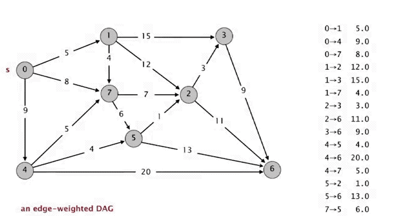


```Java
public class AcyclicSP {
    // distTo[v] = distance of shortest s->v path
    private double[] distTo;         
    // edgeTo[v] = last edge on shortest s->v path
    private DirectedEdge[] edgeTo;   

    // Computes a shortest paths tree from s to every other vertex in
    // the directed acyclic graph G.
    public AcyclicSP(EdgeWeightedDigraph G, int s) {
        distTo = new double[G.V()];
        edgeTo = new DirectedEdge[G.V()];
        for (int v = 0; v < G.V(); v++)
            distTo[v] = Double.POSITIVE_INFINITY;
        distTo[s] = 0.0;

        // visit vertices in topological order
        Topological topological = new Topological(G);
        for (int v : topological.order())
            for (DirectedEdge e : G.adj(v))
                relax(e);
    }
}
```

***Single-source longest paths in edge-weighted DAGs*** Given an edge-weighted DAG (with negative weights allowed) and a source vertex $s$, support queries of the form: Is there a directed path from $s$ to a given target vertex $v$? If so, find a longest such path (one whose total weight is maximal).

Given a longest-paths problem, create a copy of the given edge-weighted DAG that is identical to the original, except that all edge weights are negated. Then the shortest path in this copy is the longest path in the original.


#### General edge-weighted digraphs

> A *negative cycle* is a directed cycle whose sum of edge weights is negative.

There exists a shortest path from $s$ to $v$ in an edge-weighted digraph if and only if there exists at least one directed path from $s$ to $v$ and no vertex on any directed path from $s$ to $v$ is on a negative cycle.

**Bellman-Ford Algorithm**: Given source $s$ for any edge-weighted digraph with $V$ vertices and no negative cycles reachable from $s$: Initialize $\text{distTo}[s]$ to 0 and all other $\text{distTo}[]$ values to infinity. Then, considering the digraph’s edges in any order, relax all edges. Make $V$ such passes.

```Java
for (int i = 0; i < G.V(); i++)
    for (int v = 0; v < G.V(); v++) 
        for (DirectedEdge e : G.adj(v)) 
            relax(e);
```

#### Choice

The table below summarizes the important characteristics of the shortest-paths algorithms that we have considered in this section.

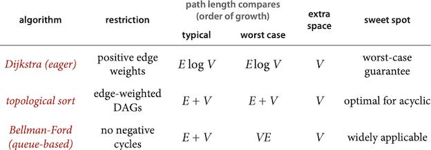

#### Application: Seam carving

> Seam carving: Resize an image without distortion for display on cell phones and web browsers. <small>[[Avidan and Shamir]</small>


A *vertical seam* in an image is a path of pixels connected from the top to the bottom with one pixel in each row. (A *horizontal seam* is a path of pixels connected from the left to the right with one pixel in each column.)

To find vertical seam:

* Grid DAG: vertex = pixel; edge = from pixel to 3 downward neighbors. Weight of pixel = energy function of 8 neighboring pixels.
* Seam = shortest path (sum of vertex weights) from top to bottom.

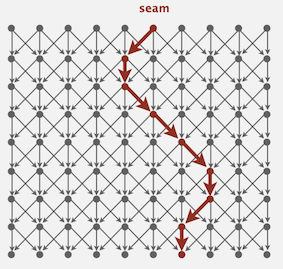

Finding and removing a seam involves three parts and a tiny bit of notation:

1. Energy calculation. Use the dual-gradient energy function. $\sqrt{\triangle_x^2(x,y) + \triangle_y^2(x,y)}$, , where the square of $x$-gradient is $\triangle_x^2(x,y) = R_x^2(x,y) + G_x^2(x,y) + B_x^2(x,y)$, where the central differences $R_x(x, y), G_x(x, y)$, and $B_x(x, y)$ are the differences in the red, green, and blue components between pixel $(x + 1, y)$ and pixel $(x − 1, y)$, respectively.
2. Seam identification. Compute shortest Path of the corresponding graph, since we already know the topological order(for vertical seams, it's top to bottom, and for horizontal seams, it's left to right), so just relaxing every vertex by correct order.
3. Seam removal. Remove vertexes.

The Java code below only contains operations involving vertical seams since functions for vertical and horizontal seams are similar, and some code using to check and verity is removed, to keep it concise.

```Java
public class SeamCarver {
    private int[][] colors;                 // color of the picture
    private double[][] energys;             // energy of the picture
    private int width, height;              // the width/height of the picture

    // Create a seam carver object based on the given picture.
    public SeamCarver(Picture picture) {
        this.width = picture.width();
        this.height = picture.height();
        setColor(picture);
        setEnergy();
    }

    // Set Color of the picture.
    private void setColor(Picture picture) {
        colors = new int[width][height];
        for (int col = 0; col < width; col++)
            for (int row = 0; row < height; row++)
                colors[col][row] = picture.getRGB(col, row);
    }


    // Calculate Energy of the picture.
    private void setEnergy() {
        energys = new double[width][height];
        for (int col = 0; col < width; col++)
            for (int row = 0; row < height; row++)
                if (row == 0 || row == height - 1 || col == 0 || col == width - 1)  
                    energys[col][row] = 1000;
                else energys[col][row] = energy(colors[col][row + 1], colors[col][row - 1],
                        colors[col - 1][row], colors[col + 1][row]);
    }

    // Calculate energy based on colors
    private double energy(int top, int bottom, int left, int right) {
        int redx    = ((right >> 16) & 0xFF) - ((left >> 16)   & 0xFF);
        int greenx  = ((right >> 8)  & 0xFF) - ((left >> 8)    & 0xFF);
        int bluex   = (right         & 0xFF) - (left           & 0xFF);
        int redy    = ((top >> 16)   & 0xFF) - ((bottom >> 16) & 0xFF);
        int greeny  = ((top >> 8)    & 0xFF) - ((bottom >> 8)  & 0xFF);
        int bluey   = (top           & 0xFF) -  (bottom        & 0xFF);
        return  Math.sqrt(redx * redx + greenx * greenx + bluex * bluex
                + redy * redy + greeny * greeny + bluey * bluey);
    }

    // Current picture
    public Picture picture() {
        // Construct a new picture and return it.
        Picture newPicture = new Picture(width, height);
        for (int col = 0; col < width; col++)
            for (int row = 0; row < height; row++)
                newPicture.setRGB(col, row, colors[col][row]);
        return newPicture;
    }

    // Energy of pixel at column x and row y
    public double energy(int col, int row) {
        return energys[col][row];
    }


    // Sequence of indices for vertical seam.
    public int[] findVerticalSeam() {
        int[][] edgesTo = new int[width][height];
        double[][] distTo = new double[width][height];

        // initialize and set when row = 0
        for (int col = 0; col < width; col++) {
            Arrays.fill(distTo[col], Double.POSITIVE_INFINITY);
            distTo[col][0] = 1000;
        }

        for (int row = 1; row < height; row++) {
            for (int col = 0; col < width; col++) {
                // relax edges
                if (distTo[col][row]    > distTo[col][row - 1] + energys[col][row]) {
                    distTo[col][row]    = distTo[col][row - 1] + energys[col][row];
                    edgesTo[col][row]   = col + (row - 1) * width;
                }
                if (col > 0 && distTo[col][row] 
                    > distTo[col - 1][row - 1] + energys[col][row]) {
                    distTo[col][row] = distTo[col - 1][row - 1] + energys[col][row];
                    edgesTo[col][row] =  col - 1 + (row - 1) * width;
                }
                if (col + 1 < width && distTo[col][row]
                     > distTo[col + 1][row - 1] + energys[col][row]) {
                    distTo[col][row] = distTo[col + 1][row - 1] + energys[col][row];
                    edgesTo[col][row] = col + 1 + (row - 1) * width;
                }
            }
        }

        // find shorest path
        double minDist = distTo[0][height - 1];
        int minPath = 0;
        for (int col = 1; col < width; col++)
            if (distTo[col][height - 1] < minDist) {
                minDist = distTo[col][height - 1];
                minPath = col;
            }
        int [] seams = new int[height];
        seams[height - 1] = minPath;
        for (int row = height - 2; row >= 0; row--)
            seams[row] = edgesTo[seams[row + 1]][row + 1] - row * width;

        return seams;
    }


    // Remove vertical seam from current picture.
    public void removeVerticalSeam(int[] seam) {
        int[][] newColors = new int[width - 1][height];
        double[][] newEnergys = new double[width - 1][height];
        for (int col = 0; col < width - 1; col++)
            for (int row = 0; row < height; row++)
                if (col < seam[row]) {
                    newColors[col][row] = colors[col][row];
                    newEnergys[col][row] = energys[col][row];
                }
                else {
                    newColors[col][row] = colors[col + 1][row];
                    newEnergys[col][row] = energys[col + 1][row];
                }
        colors = newColors;
        energys = newEnergys;
        width--;
    }
}
```