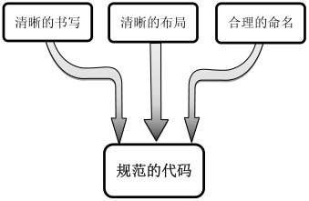
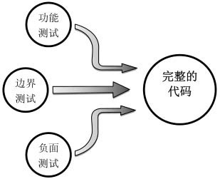
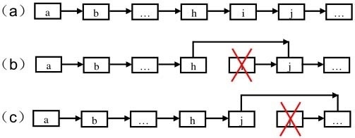

* 考查代码的容错处理能力
* 对输入参数的检查
* 考虑边界情况
* 处理错误和异常
* 变量、函数命名规则

### 高质量代码

#### 规范性

规范的代码书写清晰，布局清晰，命名合理。



#### 完整性

通常我们可以从功能测试、边界测试和负⾯测三⽅⾯设计测试⽤例，以确保代码的完整性。



#### 代码的鲁棒性

代码的鲁棒性(Robust)是指程序能够判断输入是否合乎规范要求，并对不合要求的输入予以合理的处理。

容错性是鲁棒性的⼀个重要体现。不鲁棒的软件在发⽣异常事件的时候，⽐如⽤户输⼊错误的⽤户名、试图打开的⽂件不存在或者⽹络不能连接，就会出现不可预见的诡异⾏为，或者⼲脆整个软件崩溃。这样的软件对于⽤户⽽⾔，不亚于⼀场灾难。

提⾼代码的鲁棒性的有效途径是进⾏防御性编程。防御性编程是⼀种编程习惯，是指预见在什么地⽅可能会出现问题，并为这些可能出现的问题制定处理⽅式。⽐如试图打开⽂件时发现⽂ 件不存在，我们可以提⽰⽤户检查⽂件名和路径；当服务器连接不上时， 我们可以试图连接备⽤服务器等。这样当异常情况发⽣时，软件的⾏为也 尽在我们的掌握之中，⽽不⾄于出现不可预见的事情。

在⾯试时，最简单也最实⽤的防御性编程就是在函数⼊口添加代码以验证⽤户输⼊是否符合要求。通常⾯试要求的是写⼀两个函数，我们需要格外关注这些函数的输⼊参数。如果输⼊的是⼀个指针，那指针是空指针怎么办？如果输⼊的是⼀个字符串，那么字符串的内容为空怎么办？如果能把这些问题都提前考虑到，并做相应的处理，那么⾯试官就会觉得我们有防御性编程的习惯，能够写出鲁棒的软件。


### 11. 数值的整数次方

[NowCoder](https://www.nowcoder.com/practice/1a834e5e3e1a4b7ba251417554e07c00?tpId=13&tqId=11165&tPage=1&rp=1&ru=/ta/coding-interviews&qru=/ta/coding-interviews/question-ranking)

<hh>题目描述</hh>


给定一个double类型的浮点数base和int类型的整数exponent，求base的 exponent次方。

<hh>解题思路</hh>

见[LeetCode 50 Pow(x,n)](https://techlarry.github.io/wiki/2017/10/30/Leetcode-50-Pow-x-n/)

### 12. 打印从1到最大的n位数

<hh>题目描述</hh>


输入数字$n$，按顺序打印出从1到最大的$n$位十进制数。比如输入3，则打印出 1、2、3 一直到最大的3位数即999。

<hh>解题思路</hh>

这个题目最容易想到的方法是先求出最大的$n$位数，然后从1开始逐个打印。但是，当输入的$n$很大的时候，求最大的$n$位数用int或者long会溢出。所以只能用字符串，或者字符数组表示。

使用搜索来打印所有的$n$位数，可以参考[Exhaustive Search and Backtracking](https://techlarry.github.io/wiki/2017/10/30/Algorithm-Backtracking/#Example-printAllBinary)，使用回溯法。


```java
public void printAllNumber(int n) {
    if (n <= 0) throw new IllegalArgumentException("The input number must larger than zero");
    printAllNumber(n, new StringBuilder());
}

private void printAllNumber(int n, StringBuilder str) {
    if (n == 0) {
        System.out.println(str);
        return;
    }
    // 当i = 0时，需要判断str是不是空
    // 即不能出现0001这样的情况，而应该是1
    if (str.length() == 0) printAllNumber(n - 1, str);
    for (int i = 1; i < 10; i++) {
        str.append(i);
        printAllNumber(n - 1, str);
        str.deleteCharAt(str.length() - 1);
    }
}
```


### 13 在O(1)时间内删除链表节点

给定单向链表的头指针和⼀个结点指针，定义⼀个函数在$O(1)$时间删除该结点。链表结点与函数的定义如下：

```Java
public class ListNode {
    int val;
    ListNode next;
}
public void deleteNode(ListNode head, ListNode toBeDeleted);
```


<hh>解题思路</hh>

在单向链表中删除一个节点，最常规的做法是从链表的头结点开始，顺序遍历查找要删除的节点，并在链表中删除该节点。例如下图(a)中删除节点$i$，找到$i$的前一个节点$h$，让$h$指向$j$。时间复杂度是$O(n)$.


之所以需要从头开始查找，是因为我们需要得到将被删除的结点的前⾯⼀个结点。但这是必须的吗？答案是否定的。如果把下一个节点的内容复制到需要删除的节点上，再删除下一个节点，其效果等于删除当前节点。例如下图(c)中，要删除结点$i$，先把$i$的下⼀个结点$j$的内容复制到$i$，然后把$i$的指针指向结点$j$的下⼀个结点。但是如果要删除的节点位于链表尾部，仍然要从头开始查找，然后删除该节点。该算法的平均时间复杂度为$O(1)$，最坏情况下的时间复杂度是$O(n)$。





```java
public ListNode deleteNode(ListNode head, ListNode node) {
    if (head == null || node == null) return null;
    if (node.next != null) {
        // 要删除的节点不是尾节点
        ListNode nextNode = node.next;
        node.val = nextNode.val;
        node.next = nextNode.next;
    } else {
        // 删除尾节点
        ListNode cur = head;
        while (cur.next != node)
            cur = cur.next;
        cur.next = null;
    }
    return head;
}
```

值得注意的是，上述代码不是完美的代码，因为它基于一个假设：要删除的节点的确在链表中。需要$O(n)$的时间才能判断链表中是否包含某一节点。受到$O(1)$的时间限制，不得不把确保点在链表中的责任推给了函数的调用者。


### 14. 调整数组顺序使奇数位于偶数前面

<hh>题目描述</hh>


输入一个整数数组，实现一个函数来调整该数组中数字的顺序，使得所有的奇数位于数组的前半部分，所有的偶数位于数组的后半部分。


<hh>解题思路</hh>

这个题⽬要求把奇数放在数组的前半部分，偶数放在数组的后半部 分，因此所有的奇数应该位于偶数的前⾯。这非常类似于快速排序的[`partition`方法](https://techlarry.github.io/note-os/algorithm/algorithmPrinceton/sort/#partitioning]。partition是把大于某个数的数排在小于某个数的后面。所以只要把判断条件改为是否是偶数即可：维护两个指针，第一个指针初始化时指向数组的第一个数字，它指向后移动；第⼆个指针初始化时指向数组的最后⼀个数字，它只向前移动。在两个指针相遇之前，第⼀个指针总是位于第⼆个指针的前⾯。如果第⼀个指针指向的数字是偶数，并且第⼆个指针指向的数字是奇数，我们就交换这两个数字。

```java
public void reOrderArray(int [] array) {
    if (array == null || array.length <= 1) return;
    int lo = 0, hi = array.length - 1;
    while (true) {
        while (lo < hi && array[lo] % 2 == 1) lo++;
        while (lo < hi && array[hi] % 2 == 0) hi--;
        if (lo >= hi) break;
        int tmp = array[lo];
        array[lo] = array[hi];
        array[hi] = tmp;
    }
}
```
### 15. 链表中倒数第 K 个结点

[NowCoder](https://www.nowcoder.com/practice/529d3ae5a407492994ad2a246518148a?tpId=13&tqId=11167&tPage=1&rp=1&ru=/ta/coding-interviews&qru=/ta/coding-interviews/question-ranking)

输⼊⼀个链表，输出该链表中倒数第$k$个结点。从1开始计数，即链表的尾结点是倒数第1个结点。例如⼀个链表有6个结点，从头结点开始它们的值依次是1、2、3、4、5、6。这个链表的倒数第3个结点是值为4的结点。


<hh>解题思路</hh>


为了实现只遍历链表⼀次就能找到倒数第$k$个结点，我们可以定义两个指针。第⼀个指针从链表的头指针开始遍历向前⾛$k－1$，第⼆个指针保持不动；从第$k$步开始，第⼆个指针也开始从链表的头指针开始遍历。由于两个指针的距离保持在$k－1$，当第⼀个（⾛在前⾯的）指针到达链表的尾结点时，第⼆个指针（⾛在后⾯的）指针正好是倒数第$k$个结点。

要注意代码的鲁棒性

* 输入的链表头部head为null
* 链表的节点个数小于$k$
* 输入的参数$k$为0


```java
public ListNode findKthToTail(ListNode head, int k) {
    if (head == null || k <= 0) return null;
    ListNode cur = head;
    for (int i = 0; i < k - 1; i++) {
        cur = cur.next;
        if (cur == null) return null;
    }
    ListNode kthNode = head;
    while (cur.next != null) {
        cur = cur.next;
        kthNode = kthNode.next;
    }
    return kthNode;
}
```

相关题目：

* 求链表的中间节点， [LeetCode 876](https://techlarry.github.io/wiki/2017/10/10/Leetcode-876-Middle-of-the-Linked-List/)
* 判断⼀个单向链表是否形成了环形结构, [LeetCode 141](https://techlarry.github.io/wiki/2017/10/30/Leetcode-141-Linked-List-Cycle/)


### 16. 反转链表

[NowCoder](https://www.nowcoder.com/practice/75e878df47f24fdc9dc3e400ec6058ca?tpId=13&tqId=11168&tPage=1&rp=1&ru=/ta/coding-interviews&qru=/ta/coding-interviews/question-ranking)

输⼊⼀个链表的头结点，反转该链表并输出反转后链表的头结点。

<hh>解题思路</hh>

见[LeetCode 206 Reverse Linked List](https://techlarry.github.io/wiki/2017/10/30/Leetcode-206-Reverse-Linked-List/)

### 17. 合并两个排序的链表

[NowCoder](https://www.nowcoder.com/practice/d8b6b4358f774294a89de2a6ac4d9337?tpId=13&tqId=11169&tPage=1&rp=1&ru=/ta/coding-interviews&qru=/ta/coding-interviews/question-ranking)

输⼊两个递增排序的链表，合并这两个链表并使新链 表中的结点仍然是按照递增排序的。

见[LeetCode 21 Merge two sorted arrays](http://larryim/wiki/2017/10/30/Leetcode-21-Merge-Two-Sorted-Lists/)

### 18. 树的子结构

[NowCoder](https://www.nowcoder.com/practice/6e196c44c7004d15b1610b9afca8bd88?tpId=13&tqId=11170&tPage=1&rp=1&ru=/ta/coding-interviews&qru=/ta/coding-interviews/question-ranking)

<hh>题目描述</hh>

输入两棵二叉树A，B，判断B是不是A的子结构。（ps：我们约定空树不是任意一个树的子结构）

<hh>解题思路</hh>

要查找树A中是否存在和树B结构⼀样的⼦树，我们可以分成两步：

* 在树A中找到和B的根结点的值⼀样的结点R
* 判断树A中以R为根结点的⼦树是不是包含和树B⼀样的结构。

```java
public static boolean HasSubtree(TreeNode root1, TreeNode root2) {
    boolean result = false;
    //当Tree1和Tree2都不为零的时候，才进行比较。否则直接返回false
    if (root2 != null && root1 != null) {
        //如果找到了对应Tree2的根节点的点
        if(root1.val == root2.val)
            //以这个根节点为为起点判断是否包含Tree2
            result = doesTree1HaveTree2(root1, root2);
        //如果找不到，那么就再去root的左子树当作起点，去判断时候包含Tree2
        if (!result) result = HasSubtree(root1.left, root2);
        //如果还找不到，那么就再去root的右子树当作起点，去判断时候包含Tree2
        if (!result) result = HasSubtree(root1.right, root2);
        //返回结果
    return result;
}
 
public static boolean isSubtree(TreeNode node1, TreeNode node2) {
    //如果Tree2已经遍历完了都能对应的上，返回true
    if (node2 == null) return true;
    //如果Tree2还没有遍历完，Tree1却遍历完了。返回false
    if (node1 == null) return false;
    //如果其中有一个点没有对应上，返回false
    if (node1.val != node2.val) return false;
    //如果根节点对应的上，那么就分别去子节点里面匹配
    return isSubtree(node1.left, node2.left) && isSubtree(node1.right, node2.right);
}
```


