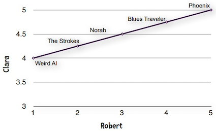

本章将介绍协同过滤，基本的距离算法，最后使用Python实现一个简单的推荐算法。

协同过滤，顾名思义，是利用他人的喜好来进行推荐，也就是说，是大家一起产生的推荐。它的工作原理是，在网站上查找一个和你类似的用户，然后将它喜欢的书籍推荐给你。

如何找到相似的用户？

### 曼哈顿距离

顾名思义，在曼哈顿街区要从一个十字路口开车到另一个十字路口，实际驾驶距离就是“曼哈顿距离”。


最简单的距离计算方式是曼哈顿距离。在二维模型中，每个人都可以用$(x, y)$的点来表示，这里用下标来表示不同的人，$(x_1, y_1)$表示艾米，$(x_2, y_2)$表示神秘的X先生，那么他们之间的曼哈顿距离就是：

$$|x_1-x_2|+|y_1-y_2|$$


曼哈顿距离的优点之一是计算速度快，对于Facebook这样需要计算百万用户之间的相似度时就非常有利。

```python
def manhattan(rating1, rating2):
    """Computes the Manhattan distance. Both rating1 and rating2 are dictionaries
       of the form {'The Strokes': 3.0, 'Slightly Stoopid': 2.5}"""
    distance = 0
    commonRatings = False 
    for key in rating1:
        if key in rating2:
            distance += abs(rating1[key] - rating2[key])
            commonRatings = True
    if commonRatings:
        return distance
    else:
        return -1 #Indicates no ratings in common
```

#### 欧几里得距离

欧几里得距离就是两点之间的直线距离。 下面的斜线就是欧几里得距离，公式是：

$$\sqrt{(x_1-x_2)^2+(y_1-y_2)^2}$$


曼哈顿距离和欧几里得距离在数据完整的情况下效果最好。


```python
def euclidean(rating1, rating2):
    """
    Computes the Euclidean Distance
    :param rating1: rating
    :param rating2: rating
    :return: distance if common ratings exists, or -1
    """
    distance = 0
    commonRatings = False
    for key in rating1:
        if key in rating2:
            distance += pow(rating1[key] - rating2[key], 2)
            commonRatings = True

    if commonRatings:
        return distance
    else:
        return -1  # Indicates no ratings in common
```


#### 闵可夫斯基距离

我们可以将曼哈顿距离和欧几里得距离归纳成一个公式，这个公式称为闵可夫斯基距离(Minkowski Distance)：

$$d(x,y) = (\sum_{k=1}^{n}|x_k-y_k|^r)^{\frac{1}{r}}$$

其中：

* $r = 1$, 该公式即曼哈顿距离
* $r = 2$, 该公式即欧几里得距离
* $r = \infty$, 切比雪夫距离

!!!note
    $r$值越大，单个维度的差值大小会对整体距离有更大的影响。

#### 切比雪夫距离

 切比雪夫距离(Chebyshev Distance)是定义为其各坐标数值差的最大值。
 
$$D_{\rm Chebyshev}(x,y) = \max_i(|x_i - y_i|)=\lim_{k \to \infty} \bigg( \sum_{i=1}^n \left| x_i - y_i \right|^k \bigg)^{1/k}$$


```Python
def chebyshev(rating1, rating2):
	"""
	Computes the Chebyshev Distance
	:param rating1: rating
	:param rating2: rating
	:return: distance if common ratings exists, or -1
	"""
	distance = 0
	commonRatings = False
	for key in rating1:
		if key in rating2:
			distance = max(distance, abs(rating1[key] - rating2[key]))
			commonRatings = True

	if commonRatings:
		return distance
	else:
		return -1  # Indicates no ratings in common
```


#### 皮尔逊相关系数

让我们仔细看看用户对乐队的评分，可以发现每个用户的打分标准非常不同：

* Bill没有打出极端的分数，都在2至4分之间； 
* Jordyn似乎喜欢所有的乐队，打分都在4至5之间； 
* Hailey是一个有趣的人，他的分数不是1就是4。

那么，如何比较这些用户呢？比如Hailey的4分相当于Jordan的4分还是5分呢？我觉得更接近5分。这样一来就会影响到推荐系统的准确性了。Clara最低给了4分——她所有的打分都在4至5分之间，这种现象在数据挖掘领域称为**分数膨胀**。




解决方法之一是使用皮尔逊相关系数, 用于度量两个变量X和Y之间的相关(线性相关)，其值介于-1与1之间, 1表示完全吻合，-1表示完全相悖。下面是常见的几组$(x, y)$点集的皮尔逊相关系数。


两个变量之间的皮尔逊相关系数定义为两个变量之间的协方差($\text{cov}(X,Y)$)和标准差($\sigma_X$)的商：

$$\rho_{X,Y}={\mathrm{cov}(X,Y) \over \sigma_X \sigma_Y} ={E[(X-\mu_X)(Y-\mu_Y)] \over \sigma_X\sigma_Y}$$


对于样本皮尔逊相关系数:

$$r_{xy}=\frac{\sum x_iy_i-n \bar{x} \bar{y}}{(n-1) s_x s_y}=\frac{n\sum x_iy_i-\sum x_i\sum y_i}{\sqrt{n\sum x_i^2-(\sum x_i)^2}~\sqrt{n\sum y_i^2-(\sum y_i)^2}}.$$

以上方程给出了计算样本皮尔逊相关系数简单的单流程算法，但是其依赖于涉及到的数据，有时它可能是数值不稳定的。但它最大的优点是，用代码实现的时候可以只遍历一次数据。

```python
	def pearson(rating1, rating2):
		"""
		Compute pearson coefficient
		:param rating1: a dictionary
		:param rating2: a dictionary
		:return: pearson coefficient
		"""
		sum_xy = 0
		sum_x = 0
		sum_y = 0
		sum_x2 = 0
		sum_y2 = 0
		n = 0
		commonRatings = False
		for key in rating1:
			if key in rating2:
				n += 1
				x = rating1[key]
				y = rating2[key]
				sum_xy += x * y
				sum_x += x
				sum_y += y
				sum_x2 += pow(x, 2)
				sum_y2 += pow(y, 2)
				commonRatings = True

		if not commonRatings:
			return -1
		# now compute denominator
		denominator = math.sqrt(sum_x2 - pow(sum_x, 2) / n) * math.sqrt(sum_y2 - pow(sum_y, 2) / n)
		if denominator == 0:
			return 0
		else:
			return (sum_xy - (sum_x * sum_y) / n) / denominator
```


#### 余弦相似度

当我们用1500万首歌曲来比较两个用户时，很有可能他们之间没有任何交集，这样一来就无从计算他们之间的距离了。类似的情况是在计算两篇文章的相似度时。余弦相似度的计算中会略过这些非零值。它的计算公式是：

$$\cos(x,y) = \frac{x\cdot y}{||x||\times||y||}$$

其中，$\cdot$ 号表示数量积。$||x||$表示向量$x$的模。


余弦相似度在文本挖掘中应用得较多，在协同过滤中也会使用到。


#### 应该使用哪种相似度？

* 如果数据存在“分数膨胀”问题，就使用皮尔逊相关系数。 
* 如果数据比较“密集”，变量之间基本都存在公有值，且这些距离数据是非常重要的，那就使用欧几里得或曼哈顿距离。
* 如果数据是稀疏的，则使用余弦相似度。


!!! note
    在数据标准化($\mu=0,\sigma=1$）后，Pearson相关性系数、余弦相似度、欧式距离的平方可认为是等价的[[1](https://www.zhihu.com/question/19734616)]。

### kNN

上面的做法中，我们只依靠最相似的一个用户来做推荐，如果这个用户有些特殊的偏好，就会直接反映在推荐内容里。解决方法之一是找寻多个相似的用户，这里就要用到K最邻近算法了。

在协同过滤中可以使用K最邻近算法来找出K个最相似的用户，以此作为推荐的基础。不同的 应用有不同的K值，需要做一些实验来得出。以下给到读者一个基本的思路。 假设我要为Ann做推荐，并令K=3。使用皮尔逊相关系数得到的结果是：

|  Person | Pearson |
| --- | --- |
| Sally | 0.8 |
| Eric | 0.7 |
| Amanda | 0.5 |

这三个人都会对推荐结果有所贡献，问题在于我们如何确定他们的比重呢？ 我们直接用相关系数的比重来描述，Sally的比重是0.8/2=40%，Eric是0.7/2=35%，Amanda 则是25%：

假设他们三人对Grey Wardens的评分以及加权后的结果如下：

| Person | Grey Wardens Rating | Influence |
| --- | --- | --- |
| Sally | 4.5 | 25% |
| Eric | 5 | 35% |
| Amanda | 3.5 | 40% |

最后计算得到的分数为为加权和 $4.5\times 25\% + 5\times 35\% + 3.5 \times 40\%$。


### Python推荐模块

Cai-Nicolas Zeigler从图书漂流站收集了超过100万条评价数据——278,858位用户为271,379本书打了分。数据可以从这个[地址](http://www2.informatik.uni-freiburg.de/~cziegler/BX/)获得。


CSV文件包含了三张表：

* 用户表，包括用户ID、位置、年龄等信息。其中用户的姓名已经隐去； 
* 书籍表，包括ISBN号、标题、作者、出版日期、出版社等；
* 评分表，包括用户ID、书籍ISBN号、以及评分（0-10分）。

```python tab="Recommender"
class Recommender:

	def __init__(self, books, users, user_ratings, book_ratings):
		"""
		initialize basic data
		:param books: a dictionary of books, whose key is book id
		:param users: a dictionary of users, whose key is user id
		:param book_ratings: a dictionary of book ratings, whose key is book id
		:param user_ratings: a dictionary of user ratings, whose key is user id
		"""
		self.books = books
		self.users = users
		self.book_ratings = book_ratings
		self.user_ratings = user_ratings

	def recommend(self, user_to_recommend_int, k=1):
		"""
		Recommend user books
		:param user_to_recommend_int: int, user id
		:param k : int, for nearest k neighbors
		:return: a list of books
		"""
		user_to_recommend = str(user_to_recommend_int)
		if user_to_recommend not in self.users:
			raise Exception("user does not exist!!")

		# find the user having min distances from user_to_recommend
		distances = []
		find_user = False
		for user in self.users:
			if user_to_recommend == user:
				continue
			# extract user ratings based on user ids, 
			# and compute the distance between them
			distance = Distance.pearson(self.user_ratings[user_to_recommend], 
			     self.user_ratings[user])
			if distance != -1:
				distances.append([user, distance])
				find_user = True

		if not find_user:
			return []

		# sort user based on their distances
		# pearson 系数越大，距离越近，所以用reverse
		distances.sort(key=lambda x: x[1], reverse=True)

		# compute weight based on distances
		distances = distances[0:k]
		sum_distance = sum([distance for user, distance in distances])
		for i in range(len(distances)):
			distances[i][1] /= sum_distance

		# recommend books
		books_to_recommend = {}
		for user_id, weight in distances:
			for book_id in self.user_ratings[user_id]:
					if book_id not in self.user_ratings[user_to_recommend]:  # the user haven't seen
						if book_id not in books_to_recommend:  # haven't recommend
							books_to_recommend[book_id] = 
							     self.user_ratings[user_id][book_id]*weight
						else:
							books_to_recommend[book_id] = books_to_recommend[book_id] \
								+ self.user_ratings[user_id][book_id]*weight

		# transform to a  list of tuple
		books_to_recommend = [(book_id, project_rating) 
		      for book_id, project_rating in books_to_recommend.items()]

		# sort based on project_rating
		books_to_recommend.sort(key=lambda x: x[1], reverse=True)

		# extract book title
		books_to_recommend = [self.books[book_id]["title"]
		       for book_id, project_rating in books_to_recommend]
		return books_to_recommend


if __name__ == "__main__":
	ratings = BooksImport()
	books, users, user_ratings, book_ratings = ratings.recommender_import()
	test = Recommender(books, users, user_ratings, book_ratings)
	print(test.recommend(171118))
```


```python tab="Distance"
import math


class Distance:
	"""
	Compute distance of two users, having different ratings.

	Both rating1 and rating2 are
	dictionaries of the form {'The Strokes': 3.0, 'Slightly Stoopid': 2.5}
	"""

	def __init__(self):
		pass

	@staticmethod
	def manhattan(rating1, rating2):
		"""
		Computes the Manhattan distance.
		"""
		distance = 0
		common_ratings = False
		for key in rating1:
			if key in rating2:
				distance += abs(rating1[key] - rating2[key])
				common_ratings = True
		if common_ratings:
			return distance
		else:
			return -1  # Indicates no ratings in common

	@staticmethod
	def euclidean(rating1, rating2):
		"""
		Computes the Euclidean Distance
		:param rating1: rating
		:param rating2: rating
		:return: distance if common ratings exists, or -1
		"""
		distance = 0
		commonRatings = False
		for key in rating1:
			if key in rating2:
				distance += pow(rating1[key] - rating2[key], 2)
				commonRatings = True

		if commonRatings:
			return distance
		else:
			return -1  # Indicates no ratings in common

	@staticmethod
	def chebyshev(rating1, rating2):
		"""
		Computes the Chebyshev Distance
		:param rating1: rating
		:param rating2: rating
		:return: distance if common ratings exists, or -1
		"""
		distance = 0
		commonRatings = False
		for key in rating1:
			if key in rating2:
				distance = max(distance, abs(rating1[key] - rating2[key]))
				commonRatings = True

		if commonRatings:
			return distance
		else:
			return -1  # Indicates no ratings in common

	@staticmethod
	def pearson(rating1, rating2):
		"""
		Compute pearson coefficient
		:param rating1: a dictionary
		:param rating2: a dictionary
		:return: pearson coefficient
		"""
		sum_xy = 0
		sum_x = 0
		sum_y = 0
		sum_x2 = 0
		sum_y2 = 0
		n = 0
		commonRatings = False
		for key in rating1:
			if key in rating2:
				n += 1
				x = rating1[key]
				y = rating2[key]
				sum_xy += x * y
				sum_x += x
				sum_y += y
				sum_x2 += pow(x, 2)
				sum_y2 += pow(y, 2)
				commonRatings = True

		if not commonRatings:
			return -1
		# now compute denominator
		denominator = math.sqrt(sum_x2 - pow(sum_x, 2) / n)\ 
    		* math.sqrt(sum_y2 - pow(sum_y, 2) / n)
		if denominator == 0:
			return 0
		else:
			return (sum_xy - (sum_x * sum_y) / n) / denominator
```
	
```python tab="books_import"
class BooksImport:

	def __init__(self):
		self.books = {}
		self.users = {}
		self.book_ratings = {}
		self.user_ratings = {}
		self.bx_books_import()
		self.bx_users_import()
		self.bx_ratings_import()
    
	def bx_books_import(self):
		"""
		import books meta information
		"""
    
		try:
			booksfile = codecs.open("BX-Dump/BX-Books.csv", "r", "utf-8")
    
			for line in booksfile:
				props = line.split(';')
				isbn = props[0].strip('"')
				title = props[1].strip('"')
				author = props[2].strip('"')
				year = props[3].strip('"')
				self.books[isbn] = {"title": title, "author": author, "year": year}
    
			booksfile.close()
    
		except IOError as e:
			error = "Failed to load: {0}".format(e)
			print(error)
    
	def bx_users_import(self):
		"""
		import user meta information
		user is a dictionary, whose key is user_id
		"""
		try:
			users_file = codecs.open("BX-Dump/BX-Users.csv", 'r', 'utf--8')
			for line in users_file:
				props = line.split(';')
				user_id = props[0].strip('"')
				location = props[1].strip('"')
				self.users[user_id] = location
				self.user_ratings[user_id] = {}
			users_file.close()
    
		except IOError as e:
			error = "Failed to load: {0}".format(e)
			print(error)
    
	def bx_ratings_import(self):
		try:
			ratings_file = codecs.open("BX-Dump/BX-Book-Ratings.csv", 'r', 'utf--8')
			for line in ratings_file:
				props = line.split(';')
				user_id = props[0].strip('"')
				book_id = props[1].strip('"')
				rating = int(props[2].strip().strip('"'))
    
				if book_id in self.book_ratings:
					self.book_ratings[book_id].append(rating)
				else:
					self.book_ratings[book_id] = [rating]
    
				self.user_ratings[user_id][book_id] = rating
    
			ratings_file.close()
    
		except IOError as e:
			error = "Failed to load: {0}".format(e)
			print(error)
    
	def get_books(self):
		return self.books
    
	def get_users(self):
		return self.users
    
	def get_user_ratings(self):
		return self.user_ratings
    
	def get_book_ratings(self):
		return self.book_ratings
    
	def recommender_import(self):
		return self.books, self.users, self.user_ratings, self.book_ratings
```

