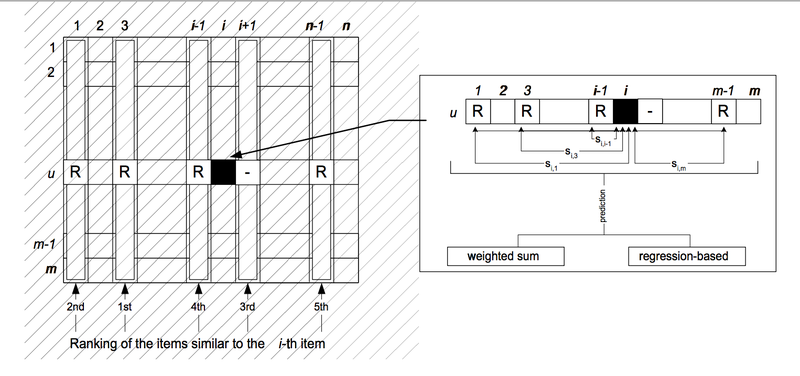

### 隐式评价

用户的评价类型可以分为显式评价和隐式评价。**显式评价**指的是用户明确地给出对物品的评价。最常见的例子是YouTube上的“喜欢”和“不喜欢”按钮，以及亚马逊的星级评价系统。

**隐式评价**，就是我们不让用户明确给出对物品的评价，而是通过观察他们的行为来获得偏好信息。示例之一是记录用户在纽约时报网上的点击记录，亚马逊上用户的实际购买记录。

我们可以收集到哪些隐式评价呢？ e.g. 网页方面：页面点击、停留时间、重复访问次数、引用率、Hulu上观看视频的次数；音乐播放器：播放的曲目、跳过的曲目、播放次数；


### 基于物品的过滤算法

目前为止我们描述的都是基于用户的协同过滤算法：将一个用户和其他*所有*用户进行对比，找到相似的人。这种算法有两个弊端：

1. **扩展性**：随着用户数量的增加，其计算量也会增加。这种算法在只有几千个用户的情况下能够工作得很好，但达到一百万个用户时就会出现瓶颈。
2. **稀疏性**：大多数推荐系统中，用户仅仅对一小部分物品进行了评价，这就造成了数据的稀疏性。比如亚马逊有上百万本书，但用户只评论了很少一部分，于是就很难找到两个相似的用户了。


#### 修正的余弦相似度

使用余弦相似度来计算两个物品的距离。由于“分数膨胀”现象，需要从用户的评价中减去他所有评价的均值，这就是修正的余弦相似度(Adjusted Cosine Similarity)。这个公式来自于一篇影响深远的论文《[基于物品的协同过滤算法](http://files.grouplens.org/papers/www10_sarwar.pdf)》。

$$s(i,j) =\frac{\sum_{u\in U}(R_{u,i}-\bar R_u)(R_{u,j}-\bar R_u)}{\sqrt{\sum_{u\in U}(R_{u,i}-\bar R_u)^2}\sqrt{\sum_{u\in U}(R_{u,j}-\bar R_u)^2}}$$

$U$表示同时评价过物品$i$和$j$的用户集合， $\bar R_u$表示用户$u$对所有物品的评价均值，$s(i,j)$表示物品$i$和$j$的相似度。


```python
def cosinesimilarity(item1, item2, userRatings):
    averages = {}
    for user, ratings in userRatings.items():
        averages[user] = (float(sum(ratings.values())) / len(ratings.values()))

    num = 0    # 分子
    dem1 = 0   # 分母的第一部分
    dem2 = 0
    for (user, ratings) in userRatings.items():
        if item1 in ratings and item2 in ratings:
            avg = averages[user]
            num += (ratings[item1] - avg) * (ratings[item2] - avg)
            dem1 += (ratings[item1] - avg) ** 2
            dem2 += (ratings[item1] - avg) ** 2
    return num / (math.sqrt(dem1) * math.sqrt(dem2))
```


#### 预测

那下面该如何使用它来做预测呢？比如我想知道David有多喜欢Kacey Musgraves？在計算完 similarity 之後，下一步驟就是要進行某個 item 的預測，這裡有兩種方法，分別是： weighted-sum 和 regression。


<hh>weighted-sum</hh>





$$p(u,i) = \frac{{\sum_{N\in \text{similarTo}(i)}(S_{i,N}\times R_{u,N})}}{\sum_{N\in \text{similarTo}(i)}|S_{i,N}|}$$

其中$p(u,i)$表示预测的用户$u$对物品$i$的评分，$S_{i,N}$表示物品$i$和$N$的相似度，$R_{u,N}$表示用户$u$对物品$N$的评分。$N$是一个物品的集合，有如下特性：用户$u$对集合中的物品打过分，物品$i$和集合中的物品有相似度数据。


#### 使用Python实现修正的余弦相似度算法

```python
class ItemBasedCF:
	"""
	使用修正的余弦相似度实现物品推荐
	"""
	def __init__(self, data):
		"""
		initialize data
		:param data: a dict of (user, ratings)
		For instance, users2 = {"Amy": {"Taylor Swift": 4, "PSY": 3, "Whitney Houston": 4},
			"Clara": {"PSY": 3.5, "Whitney Houston": 4},
			"Daisy": {"Taylor Swift": 5, "Whitney Houston": 3}}
		"""
		self.data = data
		self.items = set()   # a set of items

		# compute average user ratings of given data
		self.avg_user_rating = {}
		for user, ratings in data.items():
			self.avg_user_rating[user] = np.average(list(ratings.values()))
			for item in ratings.keys():
				self.items.add(item)

	def adjusted_cosine_similarity(self, item1, item2):
		"""
		Compute adjusted cosine similarity
		:param item1: an item
		:param item2: an item
		:return: similarity
		"""
		if (item1 not in self.items) or (item2 not in self.items):
			raise(Exception("Input Item NOT FOUND!"))


		num = 0  # numerator
		den1 = 0  # denominator1
		den2 = 0   # denominator2
		for user, ratings in self.data.items():
			if item1 in ratings and item2 in ratings:
				x = ratings[item1] - self.avg_user_rating[user]
				y = ratings[item2] - self.avg_user_rating[user]
				num += x*y
				den1 += x*x
				den2 += y*y

		den = np.sqrt(den1*den2)  # denominator
		if den == 0:
			return None

		return num/den

	def predict(self, user, item):
		"""
		predict rating of given user on given item
		:param user: an user
		:param item: an item
		:return: rating
		"""
		if user not in self.data:
			raise(Exception("Input User NOT FOUND!"))

		if item not in self.items:
			raise(Exception("Input Item NOT FOUND!"))

		num = 0  # numerator
		den = 0  # denominator
		for another_item, rating in self.data[user].items():
			if item != another_item:
				similarity = self.adjusted_cosine_similarity(item, another_item)
				if similarity is None:
					continue
				num += rating * similarity
				den += abs(similarity)

		if den == 0:
			return None

		return num/den

	def recommend(self, user):
		"""
		recommend items to the user
		:param user: an user
		:return: a list of items(up to 10)
		"""
		recommendations = []
		for item in self.items:
			if item not in self.data[user]:
				predict = self.predict(user, item)
				if predict is not None:
					recommendations.append((predict, item))

		recommendations.sort(reverse=True)
		return list(map(lambda x: x[1], recommendations))
```


### Slope One算法

Slope One是另一种比较流行的基于物品的协同过滤算法。它最大的优势是简单，易于实现。Slope One算法是在一篇名为《[Slope One Predictors for Online Rating-Based Collaborative Filtering](https://arxiv.org/abs/cs/0702144)》的论文中提出的，由Lemire和Machlachlan合著。这篇论文非常值得一读。


我们用一个简单的例子来了解这个算法。假设A给Item I打了1分，给Item J打了1.5分；B给Item I打了2分。我们可以用以下逻辑来预测B对Item J的评分：由于A给Item J打的分数要比Item I的高0.5分，所以我们预测B也会给高0.5分，即2.5分。


可以将Slope One分为两个步骤： 

* 计算出物品之间的两两差值(可以在夜间批量计算)
* 进行预测，可以使用加权的Slope One算法

#### 计算差值

物品$i$与物品$j$之间的平均差异为：

$$\text{dev}_{i,j}=\sum_{u\in S_{i,j}(X)}\frac{u_i-u_j}{\text{card}(S_{i,j}(X))}$$

其中$S_{i,j}(X)$表示同时评价过$i,j$的用户集合，$\text{card}(S)$表示$S$中有多少个元素，$X$表示所有评分值的集合，$\text{card}(S_{j,i}(X))$则表示同时评价过物品$i$和$j$的用户数，$u_i$表示用户$u$对物品$i$的评分。


!!! Question
    如果有一个新进的用户对10个歌手做了评价，我们是否需要重新计算20万×20万的差异数据，或是有其他更简单的方法？ 答案是你不需要计算整个数据集，这正是Slope One的美妙之处。对于两个物品，我们只需记录同时评价过这对物品的用户数就可以了。

#### 使用加权的Slope One算法进行预测

使用加权的Slope One算法(Weighted Slope One, WS1)来进行预测，用$P^{WS1}$来表示预测用户$u$对物品$j$的评分：

$$P^{WS1}(u)_j=\frac{\sum_{i\in S(u) - \{j\}}(\text{dev}_{i,j}+u_i)c_{j,i}}{\sum_{i\in S(u) - \{j\}} c_{j,i}}$$

其中：$c_{j,i}=\text{card}(S_{j,i}(\chi))$。式中$\sum_{i\in S(u) - \{j\}}$表示用户$u$评价的除$j$除外的物品，其他符号与上一节的含义相同。这个公式其实很好理解，$\text{dev}_{i,j}+u_i$表示根据物品$i$预测得到的用户$u$对物品$j$的评分，在此基础上进行了加权平均就得到$P^{WS1}$。


#### 使用Python实现Slope One算法

其实代码整体思路比较简单，把公式转化为代码就可以了，没有什么特殊的技巧。唯一需要注意的是尽可能的测试该程序，保证其正确性。由于网上有不少SlopeOne代码，我自己写完以后和他们的结果比对，发现完全一致。


```Python
class SlopeOne:

	def __init__(self, data):
		"""
		initialize
		:param data: a dictionary, whose key is an item, and value is  a rating.
		"""
		self.data = data
		# frequencies, a dictionary, whose key is an item,
		#   and value is a dictionary of (item, frequency)
		self.frequencies = {}
		# deviations, a dictionary, whose key is an item,
		#   and value is a dictionary of (item, deviation)
		self.deviations = {}

	def computeDeviations(self):
		"""
		compute deviations between items
		:return:
		"""
		# 获取每位用户的评分数据ratings
		for ratings in self.data.values():
			# 对于该用户的每个评分项(歌手、分数)
			for (item1, rating1) in ratings.items():
				self.frequencies.setdefault(item1, {})
				self.deviations.setdefault(item1, {})
				# 再次遍历该用户的每个评分项
				for (item2, rating2) in ratings.items():
					if item1 != item2:
						# 将评分的差异保存到变量中
						self.frequencies[item1].setdefault(item2, 0)
						self.deviations[item1].setdefault(item2, 0.0)
						self.frequencies[item1][item2] += 1
						self.deviations[item1][item2] += (rating1 - rating2)

		# 计算deviations
		for item1, deviations in self.deviations.items():
			for item2 in deviations:
				deviations[item2] /= self.frequencies[item1][item2]

	def predict(self, user, item):

		"""
		predict the ratings of the user regard to the item
		Using Weighted Slope One (WSO)
		:param user: an user
		:param item: an item
		:return: a prediction, double
		"""

		if user not in self.data:
			raise Exception

		# predictions
		predictions = 0
		frequency = 0

		# 用户user 评价的除 item 除外的物品
		for diff_item, ratings in self.data[user].items():
			if (item == diff_item) or (diff_item not in self.deviations[item]):
				continue
			predictions += (self.deviations[item][diff_item] + self.data[user][diff_item]) \
				* self.frequencies[item][diff_item]
			frequency += self.frequencies[item][diff_item]

		predictions /= frequency

		return predictions

	def recommendation(self, user):
		"""
		recommend items to user
		:param user: an user
		:return: a list of items recommended
		"""
		if user not in self.data:
			raise Exception

		if self.deviations == {}:
			self.computeDeviations()

		recommendations = []
		# 所有的item
		for item in self.deviations.keys():
			# 用户未评价过的item
			if item not in self.data[user]:
				recommendations.append((item, self.predict(user, item)))

		recommendations.sort(key=lambda x: x[1], reverse=True)
		return list(map(lambda x: x[0], recommendations))
```
	
### Example: MovieLens

MovieLens数据集是由明尼苏达州大学的GroupLens研究项目收集的，是用户对电影的评分。 这个数据集可以在[www.grouplens.org](www.grouplens.org)下载。其中100K数据集包含了943位用户对1682部电影的评价，约10万条记录。

使用MovieLens 100K数据集处理的过程如下：

* 根据README中描述的文件格式，将电影、用户、评分数据导入并转化为合适的数据格式
* 利用SlopeOne进行推荐
* 将推荐结果展示


代码整体非常简洁的，因为可以直接继承上面写的SlopeOne算法。

```python
class MovieRecommendation(SlopeOne):
	def __init__(self, data, movie):
		super(MovieRecommendation, self).__init__(data)
		self.movie = movie


	def recommend_movie(self, user):
		movies = self.recommendation(user)[:10]
		return list(map(lambda x: self.movie[x]["title"], movies))
```

### 进一步阅读

http://www.diva-portal.se/smash/get/diva2:811049/FULLTEXT01.pdf
https://dzone.com/articles/slope-one-recommender
https://www.slideshare.net/irecsys/slope-one-recommender-on-hadoop-15199798?from_action=save#