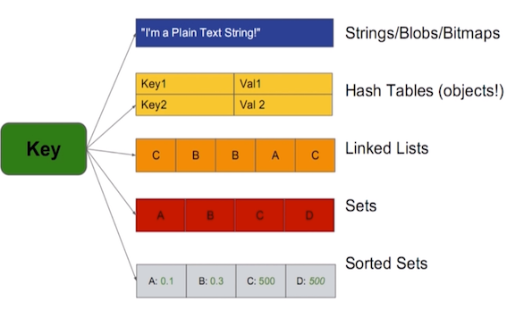
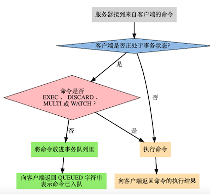
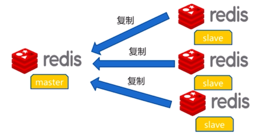
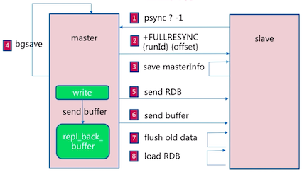
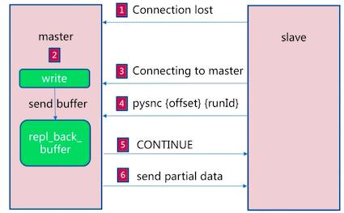
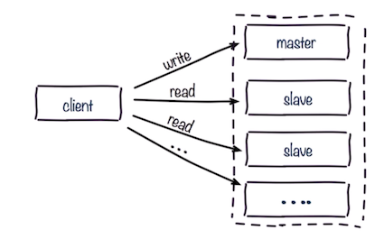
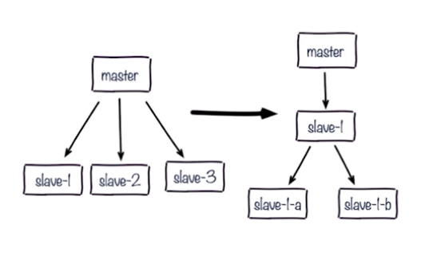
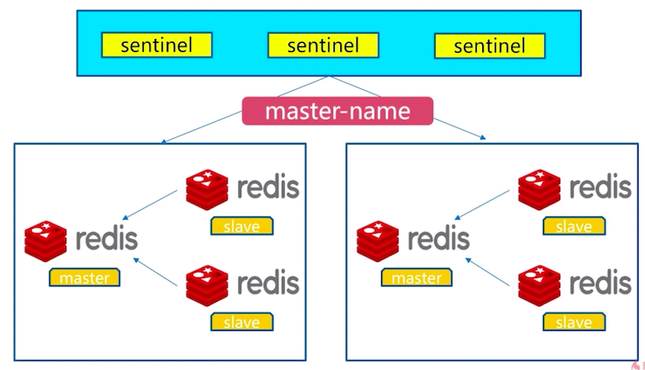

### 1 概述

#### NoSQL概述

NoSQL = Not Only SQL, 非关系型数据库

为什么需要NoSQL？

* High performance 高并发读写(动态页面频繁查询)
* Huge Storage 海量数据的高效率存储和访问
* High Scalability && High Availability 高可扩展性和高可用性

主流的NoSQL数据库： mongoDB, Redis

NoSQL数据库的分类：

* 键值存储：Redis 快速查询，但存储数据缺少结构快
* 列存储： Hbase，快速查询，扩展性强，但功能局限
* 文档数据库MongoDB: 数据格式不严格，但是查询效率不高
* 图形数据库：InfoGrid，

NoSQL的特点：

* 易扩展
* 灵活的数据类型
* 大数据量，高性能
* 高可用

#### Redis概述

> [Redis](https://redis.io) is an open source (BSD licensed), in-memory data structure store, used as a database, cache and message broker. It supports data structures such as strings, hashes, lists, sets, sorted sets with range queries, bitmaps, hyperloglogs, geospatial indexes with radius queries and streams.


Redis是**RE**mote **DI**ctionary **S**erver的缩写，以字典结构存储数据，字典中的键值可以有多种类型(字符串、哈希、列表、集合、有序集合)。Redis数据库中的所有数据都存储在内存中，所以性能比基于硬盘存储的数据库(例如MySQL, Oracle)有非常明显的优势。还提供了持久化支持，可以将内存中的数据写入到硬盘中。

Redis还可以用作缓存，可以为每个键设生存时间(到期自动删除)，还可以限定数据占用的最大内存空间(达到空间限制后自动删除不需要的键)

Redis还可以实现任务队列，用列表类型键实现队列，由于支持阻塞式读取，很容易实现一个高性能的优先级队列。

可以在官方网站文档中查询[所有的命令](https://redis.io/commands)。

#### 基本使用

**安装**

在Mac上直接使用redis安装。

```bash
brew install redis
```

**启动**

启动Redis有多种启动方式：

* 最简启动：`redis-server`，适用于开发环境，默认使用6379端口
* 动态参数启动：`redis-server --port 6379`，制定特定端口
* 配置文件启动：`redis-server configPath`，需要配置以后使用，适用于生产环境

作为守护进程的启动方式参见[Mac OS](../../Miscellaneous/awesome Install/Mac OS使用.md)。

向Redis发送SHUTDOWN命令(`redis-cli shutdown`)，会断开所有客户端连接，然后根据配置执行持久化，然后退出。

redis-cli是Redis自带的基于命令行的Redis客户端，可以直接通过`redis-cli`命令启动客户端。

**多数据库**

Redis中的每个字典都可以理解成一个独立的数据库。Redis默认支持16个数据库，数据库的名字由整数索引标识(从0开始的数字编号)，建立连接以后会自动选择0号数据库，可以通过`select database`切换数据库(例如`select 1`选择1号数据库)。它有以下特点：

* 不支持为每个数据库设置访问密码，所以一个客户端要么可以访问全部数据库，要么连一个数据库也不能访问
* 数据库之间并不完全隔离，例如`FLUSHALL`命令可以清空所有数据库中过的数据(FLUSHDB只清除当前数据库)

所以，Redis的多数据库更像是一种命名空间，不适宜存储不同应用程序的数据。可以将不同数据库使用不同生产环境、测试环境数据。

Redis的多数据库有点鸡肋，下面是[redis作者的观点](https://groups.google.com/forum/#!msg/redis-db/vS5wX8X4Cjg/8ounBXitG4sJ):

<div style="font-size: 10pt; font-style:italic;">
Understand how this can be useful, but unfortunately I consider Redis multiple database errors my worst decision in Redis design at all… without any kind of real gain, it makes the internals a lot more complex. The reality is that databases don't scale well for a number of reason, like active expire of keys and VM. If the DB selection can be performed with a string I can see this feature being used as a scalable O(1) dictionary layer, that instead it is not.<br/><br/>

With DB numbers, with a default of a few DBs, we are communication better what this feature is and how can be used I think. I hope that at some point we can drop the multiple DBs support at all, but I think it is probably too late as there is a number of people relying on this feature for their work.
</div>


#### 常见可执行文件

* `redis-server`: Redis服务器
* `redis-cli`: Redis客户端
* `redis-benchmark`: 性能基准测试
* `redis-check-aof`: AOF文件修复工具
* `redis-check-dump`: RDB文件检查工具
* `redis-sentinel`： Sentinel服务器


### 2 数据类型

多种数据结构：字符串String, 哈希Hash, 列表Lists，集合Sets，有序集合Sorted Sets.




Key定义的注意点：

* 不要过长：最好不要超过1024个字节
* 不要过短：太短不利于阅读，如a
* 统一的命令规范

#### 字符串

字符串String是Redis最为基础的数据类型，以二进制方式存储，存入和获取的数据相同，字符串类型键允许的最大容量是512M。

关于String常用命令：

* 赋值：`set key value`
* 多个赋值：`mset key value [key value...]`
* 取值：`get key`
* 多次取值：`get key [key...]`
* 获取key对应的值value并设置新值newValue：`getset key newValue`
* 删除key：`del key`
* 指定key的value递增/递减1：`incr key`,  `decr key`
* 指定key的value递增/递减：`incrby key increment`, `decrby key decrement`
* 拼接字符串：`append key value`

#### 哈希

哈希类型(hash)的键是一种字典结构，存储字段(field)和值(value)之间的映射，字段值只能是字符串。

关于hash的常用命令：

* 设置一个键值对: `hset key field value`
* 设置多个键值对：`hmset key field value [field value]`
* 取值: `hget key field`
* 取多个值: `hmget key field [field ...]`
* 删除: `hdel key field [field...]`
* 增加数字: `hincrby key field increment`
* field是否存在：`hexists key field`  
* 获取field数量： `hlen key` 
* 得到所有fields/values：`hkeys key`, `hvals key`

#### 列表

列表类型(list)可以存储一个有序的字符串列表，内部是使用双向列表实现的，所以获取靠近两端的元素速度比较快，但是通过索引访问元素比较慢。

关于list的常用命令


* 链表头部插入数据： `lpush key value1 value2 value3`
* 链表尾部插入数据: `rpush key value1 value2 value 3`


* 向列表左边插入数据：`lpush key value [value...]`
* 向列表右边插入数据：`rpush key value [value...]`
* 从列表左边弹出数据：`lpop key`
* 从列表右边弹出数据：`rpop key`
* 获取列表中元素的个数： `llen key`
* 获取列表片段: `lrange key start stop`
* 删除列表中前count个值为value的元素: `lrem key count value`
    * 当count大于0时，从列表<red>左边</red>开始删除前count个值为value的元素
    * 当count大于0时，从列表<red>右边</red>开始删除前count个值为value的元素
    * 当count等于0时，删除<red>所有</red>值为value的元素

!!! example
    ```
    127.0.0.1:6379> lpush list 1 2 3 4
    (integer) 5
    127.0.0.1:6379> lrange list 0 4
    1) "4"
    2) "3"
    3) "2"
    4) "1"
    127.0.0.1:6379> lrange list 0 -1 // 支持负数索引
    1) "4"
    2) "3"
    3) "2"
    4) "1"
    ```

#### 集合

集合类型(set)不允许重复成员，在Redis内部是使用值为空的散列表(hash)实现的，所以增删成员、判断某个成员是否存在等常见操作的时间复杂度都是$O(1)$。

* 增加成员: `sadd key member [member ...]`
* 删除成员: `srem key mumber [member ...]`
* 获取所有成员: `smembers key`
* 判断成员是否在集合中: `sismember key member`
* 获得集合中成员个数: `scard key`
* 差集运算：`sdiff key1 key2` (获取在key1中存在，在key2中不存在的成员）
* 交集运算: `sinter key1 key2` (获取在key1和key2中都存在的成员)
* 并集运算: `sunion key1 key2` (获取key1中和key2中的所有成员)
* 进行集合运算并将结果存储： `sdiffstore/sinterstore/sunionstore destination key [key...]`

!!! example 
    ```text tab="常见操作"
    127.0.0.1:6379> sadd set 5 5 5
    (integer) 1
    127.0.0.1:6379> smembers set
    1) "5"
    127.0.0.1:6379> sismember set 5
    (integer) 1
    127.0.0.1:6379> sadd set 3
    (integer) 1
    127.0.0.1:6379> scard set
    (integer) 2
    ```
    
    ```text tab="集合间运算"
    127.0.0.1:6379> sadd setA 1 2 3
    (integer) 3
    127.0.0.1:6379> sadd setB 2 3 4
    (integer) 3
    127.0.0.1:6379> sdiff setA setB
    1) "1"
    127.0.0.1:6379> sinter setA setB
    1) "2"
    2) "3"
    127.0.0.1:6379> sunion setA setB
    1) "1"
    2) "2"
    3) "3"
    4) "4"
    127.0.0.1:6379> sinterstore setC setA setB
    (integer) 2
    127.0.0.1:6379> smembers setC
    1) "2"
    2) "3"
    ```

#### 有序集合

有序集合sorted-set类型为集合中的每个元素都关联了一个分数，这使得不仅可以完成插入、删除和判断元素是否存在等集合类型支持的操作，还能够获得分数最高或最低的前N个元素、获得指定分数范围内的元素等与分数有关的操作。虽然集合中的元素都不同，但是它们的分数可以相同。

有序集合类型是通过三列表和跳跃表(skip list)实现的，时间复杂度是$O(log(N))$。


Sorted-Set常用命令：

* 增加元素： `zadd key score member [score member ...]`
* 获得元素分数: `zscore key member`
* 获得排名在某个范围的元素列表
    * `zrange key start top [WITHSCORES]`(按分数从小到大返回从start到stop排名之间的所有元素，withscore参数表示同时获得元素分数)
    * `zrevrange key start top [WITHSCORES]`(按分数从大到小返回)
* 获得指定分数范围的元素：`zrangebyscore key min max [WITHSCORES] [LiMIT offset count]`
    * 按照元素分数从小到大的顺序返回分数在min和max之间的分数(包含min和max)
    * [LiMIT offset count]表示在获得的元素列表的基础上向后偏移offset个元素，并且只获取前count个元素
    * 如果不包含端点值，可以在分数前加上"("符号
    * 可以使用"+inf"表示上限

!!! example "有序集合演示"

    ```text
    127.0.0.1:6379> zadd scoreboard 89 tom 67 jerry 75 peick //添加元素
    (integer) 3 // scoreboard中一共有三个元素
    127.0.0.1:6379> zscore scoreboard tom // 获取tom的分数
    "89"
    127.0.0.1:6379> zrange scoreboard  0 1 // 获取最低和次低的分数的人
    1) "jerry"
    2) "peick"
    127.0.0.1:6379> zrange scoreboard  0 1 withscores // 附带分数
    1) "jerry"
    2) "67"
    3) "peick"
    4) "75"
    127.0.0.1:6379> zrangebyscore scoreboard 80 90  // 获取80-90分之间的人
    1) "tom"
    // 获得分数⾼于70分的从第⼆个⼈开始的2个⼈
    127.0.0.1:6379> zrangebyscore scoreboard 60 +inf limit 1 2
    1) "peick"
    2) "tom"
    ```

### 3 高级功能

#### 事务

事务可以一次执行多个命令， 并且带有以下两个重要的保证：

* 事务是一个单独的隔离操作：事务中的所有命令都会序列化、按顺序地执行。事务在执行的过程中，不会被其他客户端发送来的命令请求所打断。
 



在Redis中，使用`multi`命令开启事务，客户端向服务器发送的命令被放入事务队列中，直到`exec`命令提交执行事务。期间可以通过调用`discard`命令晴空事务队列，并放弃执行事务。事务的返回值是事务中的命令的返回值组成的列表，返回值顺序和命令的顺序相同。

!!! example
    ```text
    127.0.0.1:6379> multi
    OK
    127.0.0.1:6379> sadd "user:1:following" 2
    QUEUED
    127.0.0.1:6379> sadd "user:2:followers" 1
    QUEUED
    127.0.0.1:6379> exec
    1) (integer) 1
    2) (integer) 1
    ```
    

值得注意的是，Redis的事务没有关系数据库提供的回滚功能。在使用事务时可能会遇上两种错误：

* 事务在执行`exec`之前，入队的命令可能会出错(例如语法错误，参数数量错误)
* 命令在`exec`调用之后失败(键类型错误)

对于发生在`exec`执行之前的错误，服务器会对命令入队失败的情况进行记录，并在客户端调用`exec`命令时，拒绝执行并自动放弃这个事务。对于在`exec`执行之后的错误，事务中的其他命令仍然会继续执行。

!!! example "事务发生错误"
    ```text
    127.0.0.1:6379> multi       // 开启事务
    OK
    127.0.0.1:6379> set key 1  // 设置键值对key = 1
    QUEUED
    127.0.0.1:6379> sadd key 2 // 错误，key的类型不是set
    QUEUED
    127.0.0.1:6379> set key 3  // 更新key对应的值为3
    QUEUED
    127.0.0.1:6379> exec      // 执行事务
    1) OK
    2) (error) WRONGTYPE Operation against a key holding the wrong kind of value
    3) OK
    127.0.0.1:6379> get key   // 错误后面的命令仍然被执行，key对应的值为3
    "3"
    ```


#### 慢查询

#### 

#### HyperLogLog

极小空间完成独立数量统计。


* pfadd key element [element...]: 向hyperloglog添加元素
* pfcount key [key..]: 计算hyperloglog的独立总数
* pfmerge destkey sourcekey [sourcekey...] 合并多个hyperloglog


### 4 持久化

[近一步阅读： Reids Persistence](https://redis.io/topics/persistence)

Redis**持久化**(persistence)是指Redis将数据从内存中以某种形式同步到硬盘中，使得重启后可以根据硬盘中的记录恢复数据。Redis支持**RDB**(Redis Database File)和**AOF**(Append Only File)两种持久化方式。

* RDB持久化：默认开启，在指定的时间间隔内，将内存快照写入到磁盘;
* AOF持久化：默认不开启，将执行过后的每一条写命令本身记录下来;

还可以

* 无持久化：通过配置来禁用redis服务器持久化的功能，这时候redis作为一个缓存服务
* 同时使用RDB和AOF：既保证了数据安全，又使得数据备份等操作十分容易。

#### RDB持久化

RDB方式的持久化是通过快照(snapshot)完成的，当符合一定条件时Redis会自动将内存中的所有数据生成一份副本并存储在硬盘上。Redis会在以下几种情况下对数据进行快照：

* 根据配置规则进行自动快照；
* 用户执行SAVE或BGSAVE命令；
* 执行FLUSHALL命令；
* 执行复制(replication）时。


**RDB方式持久化配置**

每当时间M内被更改的键Key的个数大于N时，即自动快照

```js
//file: redis.conf
save 900 1          //每900秒，至少有1个key发生变化，会持久化一次
save 300 10         //每300秒，至少有10个key发生变化，会持久化一次
save 60 10000       //每60秒，至少有10000个key发生变化，会持久化一次
dbfilename dump.rdb //持久化文件名称, 默认dump.rdb
dir: ./             // 持久化文件保存路径，默认./配置文件当前路径
```

**SAVE/BGSAVE命令**

执行SAVE命令时，Redis<red>同步</red>进行快照操作，在快照执行过程中会阻塞所有来自客户端的请求。可能会导致Redis长时间不响应，所以应该尽量避免在生产环境中使用。

BGSAVE命令可以在后台<red>异步</red>地进行快照操作，在快照执行过程中还可以继续响应来自客户端的请求。

**FLUSHALL命令**

执行FLUSHALL命令时，Redis会清除数据库中的所有数据。

**执行复制时**

当设置了主从模式时(见下文)，Redis会在复制初始化时进行自动快照。


**快照执行过程**：

1. Redis使用fork函数复制一份当前进程的副本；
2. 父进程继续接收并处理客户端发来的命令，而子进程开始将内存中的数据写入硬盘中的临时文件；
3. 当子进程写入完所有数据后会用该临时文件替换旧的RDB文件，至此一次快照操作完成。

RDB持久化优势：

* 只包含一个文件，方便文件备份。对于灾难恢复而言，RDB是一个非常不错的选择。
* RDB文件是经过压缩的二进制格式，所以占用的空间会小于内存中的数据大小，更利于数据传输。
* 性能最大化，由子进程完成持久化操作
* 相比AOF，大数据集启动效率更高

RDB持久化缺点：如果想保证数据的高可用性，即最大限度的避免数据的丢失，RDB将不是一个很好的选择。当系统在定时持久化之前出现宕机，还未来得及往硬盘写入数据，那数据就丢失了。如果数据相对重要，希望将损失降到最小，则可以使用AOF方式进行持久化。


#### AOF持久化

当使用Redis存储非临时数据时，一般需要打开AOF持久化来降低进程中导致的数据丢失。AOF将Redis执行的每一条写命令追加到硬盘文件中，这一过程显然会降低Redis性能，但是大部分情况下是可以接受的。

```js
// file: redis.conf
appendonly  yes                      //配置AOF持久化是否启用，默认no：不启用
appendfilename "appendonly.aof"     //配置AOC持久化文件名称
// 同步策略配置
appendfsync always      // 每次执行写入都会执行同步，最安全但是最慢
appendfsync everysec    // 每秒执行一次同步操作，兼顾性能和安全
appendfsync no          // 不主动进行同步操作，最快单最不安全
// 自动重写
// 当前AOF文件大小超过上一次重写时的文件大小的百分之多少时再次重写
auto-aof-rewrite-percentage 100
auto-aof-rewrite-min-size 64mb // 允许重写的最小AOF文件大小
```

**AOF实现过程**：

AOF文件的内容是Redis客户端向Redis发送的原始通信协议(见下文)的内容。由于执行的命令会有冗余(命令执行的结果被后面的命令执行覆盖)，Redis会自动优化AOF文件。


虽然每次执行更改数据库内容的操作时，AOF都会将命令记录在AOF文件中，但是事实上，由于操作系统的缓存机制，数据进入了系统的硬盘缓存。一般来讲启用AOF持久化的应用都无法容忍硬盘缓存中的数据丢失，所以需要主动要求将缓存内容同步到硬盘中(配置appendfsync参数)。


AOF方式持久化优势：

* 带来更高的数据安全性，修改策略可以为每秒同步或每修改同步或不同步
* 对于日志文件写入操作采用追加模式，当写入过程中出现宕机时，不会破坏已经存在的内容
* 如果日志过大，redis会自动启动重写机制
* AOF包含格式清晰、易于理解的日志文件记录所有的修改操作，通过该文件可完成数据重建

AOF方式持久化劣势：

* 对于相同数据集而言，AOF的文件要比RDB的文件大一些
* 根据同步策略的不同，运行效率要低于RDB


### 5 客户端
#### Jedis

[Jedis](https://github.com/xetorthio/jedis)是Redis官方首选的Java客户端开发包。其Maven依赖是

```xml
<dependency>
    <groupId>redis.clients</groupId>
    <artifactId>jedis</artifactId>
    <version>2.10.0</version>
    <type>jar</type>
    <scope>compile</scope>
</dependency>
```

Jedis的连接方式有两种，一种是单实例连接，一种是通过连接池连接

```Java tab="单实例"
/**
 * 单实例的测试
 */
@Test
public void demo1() {
    // 1. 设置IP地址和端口
    Jedis jedis = new Jedis("127.0.0.1", 6379);
    // 2. 保存数据
    jedis.set("name", "value");
    // 3. 获取数据
    String value = jedis.get("name");
    System.out.println(value);
    // 4. 释放资源
    jedis.close();
}
```

```Java tab="连接池"
/**
 * 连接池方式连接
 */
@Test
public void demo2() {
    // 获得连接池的配置对象
    JedisPoolConfig config = new JedisPoolConfig();
    // 设置最大连接数
    config.setMaxTotal(30);
    // 设置最大空闲连接数
    config.setMaxIdle(10);

    // 获得连接池
    JedisPool jedisPool = new JedisPool(config);

    // 获得核心对象
    Jedis jedis = null;
    try {
        // 通过连接池获得连接
        jedis = jedisPool.getResource();
        // 设置数据
        jedis.set("name", "ajx");
        // 获取数据
        String value = jedis.get("name");
        System.out.println(value);
    } catch (Exception e) {
        e.printStackTrace();
    } finally {
        // 释放资源
        jedis.close();
        // 释放连接池
        jedisPool.close();
    }
}
```

#### redis-py

[redis-py](https://github.com/andymccurdy/redis-py)是Redis官方推荐的Python模块

```python
import redis
# 创建连接
r = redis.StrictRedis(host='127.0.0.1', port=6379, db=0)
# 设置数据
r.set('usrname', 'redis')
r.get('usrname')
# HMSET支持将字典作为参数存储，同时HGETALL的返回值也是一个字典，搭配使用十分方便：
r.hmset('dict', {'name':'Bob'})
people = r.hgetall('dict')
# 事物和管道
pipe = r.pipeline()
pipe.set('foo', 'bar')
pipe.get('foo')
result = pipe.execute()
```

### 6 集群


#### 复制

为了避免单点故障，Redis提供了**复制**(Replication)功能，可以实现当一台数据库的数据更新后，自动将更新的数据同步到其他数据库上。

在复制的概念中，数据库分为两类，一类是主数据库(master)，另一类是从数据库(slave)。主数据库可以进行读写操作，当写操作导致数据变化时会自动将数据同步给从数据库。从数据库一般是只读的，并接受主数据库同步过来的数据。


一个主数据可以拥有多个从数据库，而一个从数据库只能拥有一个主数据库。



在Redis中使⽤复制功能⾮常容易，只需要在*从数据库*的配置⽂件中加⼊”slaveof 主数据库地址 主数据库端口“即可，主数据库⽆需进⾏任何配置。


!!! example 

    命令方式
    ```
    redis-6380 > slaveof 127.0.0.1 6379  // 成为127.0.0.1: 6379的从节点，并清除所有数据
    OK
    redis-6380 > slavef no one   // 不当从节点，取消复制
    OK
    ```
    
    修改配置方式
    
    ```
    slaveof ip port // 成为ip:port的从节点
    slave-read-only yes // 从节点只做读的操作
    ```

    | 方式 | 优点 | 缺点 |
    | --- | --- | --- |
    | 命令 | 无需重启 | 不便于管理 |
    | 配置 | 统一配置 | 需要重启 |


复制原理：


当⼀个从数据库启动后，会向主数据库发送SYNC命令。同时主数据库接收到SYNC命令后会开始在后台保存快照（即RDB持久化的过程)，并将保存快照期间接收到的命令缓存起来。当快照完成后，Redis会将快照⽂件和所有缓存的命令发送给从数据库。从数据库收到后，会载⼊快照⽂件并执⾏收到的缓存的命令。以上过程称为**复制初始化**。复制初始化结束后，主数据库每当收到写命令时就会将命令同步给从数据库，从⽽保证主从数据库数据⼀致。





Redis2.8版实现了主从断线重连的情况下的增量复制。




<!--
#### 故障处理

故障转移

一个slave宕机：将客户端请求发到其他slave上
master宕机： 选择一个slave变成master，其他slave变成新的master的slave


#### 开发与运维中的问题

读写分离：读流量分摊到从节点, 可能遇到的问题：

* 复制数据延迟，读写不一致
* 读到过期数据：master没有及时删除过期数据，slave没有权利删除，但是3.2版本已经解决




* 主从配置不一致
    * maxmemory不一致：可能丢失数据
    * 数据结构优化参数(hash-max-ziplist-entries): 内存不一致
* 规避全量复制
    * 第一次不可避免 
    * 节点run_id不匹配: 主节点重启(run_id变化)
    * 故障转移，例如哨兵或集群
    * 复制缓冲区不足：网络中断，部分复制无法满足，解决方法是增大复制缓冲区配置rel_backlog_size
* 规避复制风暴
    * 主节点重启，所有从节点都要复制，解决方法是更换复制拓扑
    * 多个主节点放在一个机器上，及其宕机，大量全量复制，解决方法是将主节点分散多机器

    

!-->

#### 哨兵 

遇到的问题：当主数据库遇到异常中断服务后，开发者只能通过⼿动的⽅式选择⼀个从数据库来升格为主数据库，以使得系统能够继续提供服务。


哨兵的作⽤就是监控Redis系统的运⾏状况。它的功能包括：

* 监控主数据库和从数据库是否正常运⾏；
* 主数据库出现故障时⾃动将从数据库转换为主数据库。

可以使用多个哨兵进行监控任务以保证系统足够稳健。此时不仅哨兵会同时监控主从数据库，哨兵之间也会相互监视。




多个sentinel发现并确认master有问题，选举出一个sentinel作为领导，选出一个slave作为master。通知其余slave成为新的master的slave，通知客户端主从变化，等待老的master复活成为新master的slave。


#### 集群

遇到的问题：

* 高并发量：超过单机并发量
* 数据量：超过单机内存容量

Redis集群是Redis提供的分布式数据库⽅案，集群通过分⽚（sharding）来进⾏数据共享，并提供复制和故障转移功能。


### 参考资料

* 慕课网, [Redis入门](https://www.imooc.com/learn/839)
* 慕课网, [从入门到高可用分布式实践](https://coding.imooc.com/class/151.html)
* Redis入门指南(第二版)，李子骅
* Redis设计与实现(第二版)，黄健宏
* [Redis命令参考](http://redisdoc.com/index.html)