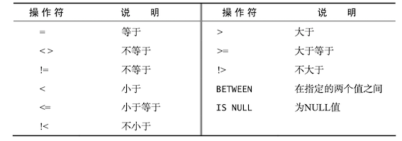
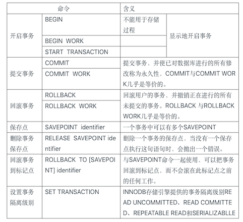

### 1 了解SQL

#### 数据库基础

**数据库**(database)是保存有组织的数据的容器(通常是一个文件或一组文件)。数据库软件，确切的说是数据库管理系统(DBMS)。数据库是通过DBMS创建和操纵的容器。

**表**(table)是某种特定类型数据的结构化清单。数据库中的每个表都有一个唯一一个名字来标识，称为表名。

**模式**(schema)是指关于数据库和表的布局及特性的信息，可以用来描述数据库中的特定的表，也可以用来描述整个数据库(和其中表的关系)。

表由**列**(column)组成，列存储表中某部分的信息。每个表列都有相应的数据类型，它限制(或允许)该列中存储的数据。

**行**(row)是表中的一个记录(record)。行和记录多半是可以交替使用的，但从技术上说，行才是正确的术语。

**主键**(primary key)是一列或一组列，其值能够唯一标识表中每一行。虽然并不总是需要主键，但多数数据库设计者都会保证他们创建的每个表具有一个主键，以便于以后的数据操作和管理。

表中的任何列都可以作为主键，只要它满足一下条件：

* 任意两行都不具有相同的主键值
* 每一行都必须具有一个主键值(主键列不允许NULL值)
* 主键列中的值不允许修改或更新
* 主键值不能重用(如果某行从表中删除，它的主键不能付给以后的新行)

#### 什么是SQL

**SQL**(发音为S-Q-L或sequel)是Structured Query Language(结构化查询语言)的缩写。SQL是一种专门用来与数据库沟通的语言。

标准SQL由ANSI标准委员会管理，称为ANSI SQL。DBMS一般通过增加语句或指令，对SQL进行了扩展。

### 2 检索数据

#### SELECT语句

```sql
SELECT prod_name FROM Products;
```

上述语句利用SELECT语句从Products表中检索一个名为prod_name的列。所需的列名写在SELECT关键字之后，FROM关键字指出从哪个表中检索数据。

要想从一个表中检索多个列，仍然使用相同的SELECT语句。唯一的不同是必须在SELECT关键字后给出多个列名，列名之间必须以逗号分隔。

```sql
SELECT prod_id, prod_name, prod_price FROM Products;
```

使用星号(*)通配符检索所有的列

```sql
SELECT * FROM Products;
```

使用DISTINCT关键字，指示数据库值返回不同的值

```sql
SELECT DISTINCT vend_id FROM Products;
```

如果只想返回第一行或者一定数量的行，使用LIMIT字句

```sql
SELECT prod_name FROM Products LIMIT 5;
```

LIMIT 5指示MySQL返回不超过5行的数据。

如果需要指定从哪儿开始以及检索的行数，可以使用OFFSET和LIMIT关键字， LIMIT指定返回的行数，OFFSET指定从哪儿开始。

```sql
SELECT prod_name FROM Products LIMIT 5 OFFSET 4;
```

LIMIT 5 OFFSET 5指示MySQL返回从第4行起的5行数据。

MySQL和MariaDB支持简化版的LIMIT 4 OFFSET 3语句，即LIMIT 3,4。使用这个语法，逗号之前的值对应OFFSET，逗号之后的值对应LIMIT。

很多DMBMS都支持各种形式的注释语法。使用两个连字符(--)作为行内注释

```sql
SELECT prod_name FROM Products; -- 这是一条行内注释
```

也可以在一行的开始处使用#，这一整行都将作为注释

```sql
# 这是一行注释
SELECT prod_name FROM Products;
```

可以使用`/* */`进行多行注释，注释可以在脚本的任何位置停止和开始

```sql
/* SELECT prod_name, 
vend_id FROM Products; */ 
SELECT prod_name FROM Products;
```

### 3 排序检索数据

检索出的数据如果不排序，一般将以它在底层表中出现的顺序显示。

!!! note "子句"

    SQL语句由子句构成，有些子句是必须的，有些则是可选的。一个子句通常由一个关键字加上所提供的数据组成。例如SELECT语句的FROM子句。

为了明确地排序用SELECT语句检索出的数据，可使用ORDER BY子句。ORDER BY子句取一个或多个列的名字，据此对输出进行排序。

```sql
SELECT prod_name FROM Products ORDER BY prod_name;
```

!!! warning "ORDER BY子句的位置"

    在指定一条ORDER BY子句时，应该保证它时SELECT语句中最后一条子句。如果它不是最后的子句，将会出现错误消息。


要按多个列排序，简单指定列名，列名之间用逗号分开即可。

```sql
SELECT prod_id, prod_price, prod_name FROM Products
ORDER BY prod_price, prod_name;
```

除了能用列名指出排序顺序外，ORDER BY还支持按相对列位置进行排序。

```sql
SELECT prod_id, prod_price, prod_name FROM Products
ORDER BY 2, 3;
```

这条SQL语句的与上一条等价，唯一区别是选择列的相对位置而不是列名。

升序排列排序(从A到Z)是默认的排序顺序。为了进行降序排序，必须制定DESC关键字。

下面的例子以价格降序来排序产品（最贵的排在最前面）：

```sql
SELECT prod_id, prod_price, prod_name FROM Products ORDER BY prod_price DESC, prod_name;
```

!!! warning "在多个列上降序排序"
    
    如果想在多个列上进行降序排序，必须对每一列指定DESC关键字。

!!! tip "区分大小写和排序顺序"
    
    对文本数据进行排序时， A与a相同吗？a位于B之间，还是位于Z之后？这些问题取决于数据库的设置方式。
    
### 4 过滤数据

数据库表一般包含大量的数据，很少需要检索表中的所有行。通常值会根据特定操作或报告的需要提取表数据的子集。只检索所需数据需要指定**搜索条件**(search criteria)，也称为**过滤条件**(filter condition)。

在SELECT语句中，数据根据WHERE子句中指定的搜索条件进行过滤，WHERE子句在FROM子句后给出。

```sql
SELECT prod_name, prod_price FROM Products WHERE prod_price = 3.49;
```

WHERE子句支持多种操作符



例如列出所有不是供应商DLL01制造的产品

```sql
SELECT vend_id, prod_name FROM Products WHERE vend_id != 'DLL01';
```

要检查某个范围的值，可以使用BETWEEN操作符，指定范围的开始值和结束值，用AND关键字分隔。BETWEEN匹配范围中所有的值，包括指定的开始值和结束值。

例如检索价格在5美元和10美元之间的所有产品：

```sql
SELECT prod_name, prod_price FROM Products WHERE prod_price BETWEEN 5 AND 10;
```

!!! note "NULL值"
    
    在一个列不包含值时，称其包含控制NULL。NULL是无值(no value)，它与字段包含0、空字符串或仅仅包含空格不同。

确定值是否为NULL，不能简单地检查是否`= NULL`。需要使用IS NULL子句。

```sql
SELECT prod_name FROM Products where prod_price IS NULL;
```


### 5 高级数据过滤

要通过不止一个列进行过滤，可以使用AND操作符给WHERE子句附加条件。

例如检索由供应商DLL01制造且价格小于等于4美元的所有产品的名称和价格：

```sql
SELECT prod_id, prod_price, prod_name FROM Products
WHERE vend_id = 'DLL01' AND prod_price <= 4;
```

OR操作符指示检索匹配任一条件的行。


```sql
SELECT prod_id, prod_price, prod_name FROM Products
WHERE vend_id = 'DLL01' OR prod_price <= 4;
```

SQL在处理WHERE子句时，优先处理AND子句，其次是OR子句。所以当需要列出价格10美元及以上，且由DLL01或BRS01制造的所有产品时，需要使用圆括号`()`对操作符进行明确分组。

```sql
SELECT prod_name, prod_price FROM Products
WHERE (vend_id = 'DLL01' OR vend_id = 'BRS01') AND prod_price >= 10;
```

!!! tip "在WHERE子句中使用圆括号"

    任何时候使用具有AND和OR操作符的WHERE子句，都应该使用圆括号明确地分组操作符。使用圆括号没有什么坏处，它能消除歧义。
    
IN操作符用来指定条件范围，范围中的每个条件都可以进行匹配。IN取一组由逗号分隔、括在圆括号中的合法值。

例如可以将上述SQL语句转化为

```sql
SELECT prod_name, prod_price FROM Products
WHERE vend_id IN ('DLL01', 'BRS01')
ORDER BY prod_name;
```

为什么使用IN操作符？其优点如下：

* 在由很多合法选项时，IN操作符的语法更清楚，更直观。
* 在与其他AND和OR操作符组合使用IN时，求值顺序更容易管理。
* IN操作符一般比一组OR操作符执行得更快。
* IN的最大优点是可以包含其他SELECT语句，能够更动态地建立WHERE子句。


NOT关键字用在WHERE子句中用来否定其后条件的关键字。

```sql
SELECT prod_name FROM Products WHERE NOT vend_id = 'DLL01'
ORDER BY prod_name;
```

### 6 用通配符进行过滤

### 15 插入数据

INSERT用来将行插入或添加到数据库表。插入有几种方式：插入完整的行，插入行的一部分，插入某些查询的结果。

把数据插入表中最简单方法是使用基本的INSERT语法，它要求指定表名和插入到新行中的值。例如

```sql
INSERT INTO Customers VALUES('1000006', 'Toy Land', 
        '124 ANy Street', 'New York', 'NY', '11111', 
        'USA', NULL, NULL);
```

虽然这种语法很简单，但并不安全，应该尽量避免使用，更安全的方法如下

```sql
INSERT INTO Customers（cust_id, cust_name, cust_address,
    cust_city, cust_state, cust_zip, cust_country, cust_contant, cust_mail)
     VALUES('1000006', 'Toy Land', '124 ANy Street', 'New York', 'NY', 
     '11111', 'USA', NULL, NULL);
```

!!! tip "总是使用列的列表"
    不要使用没有明确给出列的INSERT语句。给出列能使SQL代码继续发挥作用，即使表结构发生了变化。

### 16 更新和删除数据
### 17 创建和操纵表

利用CREATE TABLE创建表，必须给出下列信息：

* 新表的名字，在关键字CREATE TABLE之后给出
* 表列的名字和定义，用逗号分隔；
* 有的DBMS还要求指定表的位置；

表名紧跟CREATE TABLE关键字。实际的表定义(所有列)括在圆括号之中，各列之间用逗号分隔。

例如创建Products表:

```sql
CREATE TABLE Products 
（
    prod_id int primary key auto_increment NOT NULL,
    vend_id CHAR(10) NOT NULL,
    prod_name CHAR(254) NOT NULL,
    prod_price DECIMAL(8,2) NOT NULL,
    prod_desc VARCHAR(1000) NULL
);
```

SQL允许指定默认值，在插入行时如果不给出值，DBMS将自动采用默认值。默认值在CREATE TABLE语句的列定义中用关键字DEFAULT指定。

```mysql
CREATE TABLE OrderItems
(
    order_num   INTEGER     NOT NULL,
    order_item  INTEGER     NOT NULL,
    quantity    INTEGER     NOT NULL DEFAULT 1,
    item_price  DECIMAL(8,2)   NOT NULL
);
```

默认值经常用于日期或时间戳列，例如DEFAULT CURRENT_DATE()将系统日期作为默认日期。
    
对已有表进行增加列，例如

```sql
ALTER TABLE Vendors ADD vend_phone CHAR(20);
```

可以使用describe table查看表的结构和信息。


使用DROP TABLE语句删除表：

```sql
DROP TABLE Cust;
```

### 18 使用视图

视图是虚拟的表。与包含数据的表不一样，视图只包含使用时动态检索数据的查询。视图常用于：

* 重用SQL语句；
* 简化复杂的SQL操作；
* 使用表的一部分而不是整个表；
* 保护数据：可以授予用户访问表的特定部分的权限，而不是整个表的访问权限；
* 更改数据格式和表示；

!!! warning "性能问题"
    
    因为视图不包含数据，所以每次使用视图时，都必须处理查询执行时需要的所有检索。如果你用多个联结和过滤创建了复杂的视图或者嵌套了视图，性能可能会下降得很厉害。因此，在部署使用了大量视图的应用前，应该进行测试。
    

视图用CREATE VIEW语句来创建。

利用视图可以简化复杂的联结。例如创建一个名为ProductCustomers的视图，它联结三个表，返回已订购了任意产品的所有顾客的列表。

```sql
CREATE VIEW ProductCustomers AS
SELECT cust_name, cust_contant, prod_id FROM Customers, Orders, OrderItems
WHERE Customers.cust_id = Orders.cust_id AND OrderItems.order_num = Orders.order_num;
```
检索订购了产品RGAN01的顾客，可如下进行

```sql
SELECT cust_name, cust_contact FROM ProductCustomers WHERE prod_id = 'RGAN01';
```

视图的另一常见用途时重新格式化检索出的数据。例如：

```sql
CREATE VIEW VendorLocations AS 
    SELECT RTRIM(vend_name) || ' (' || RTRIM(vend_country) || ')' 
    AS vend_title FROM Vendors;
```


### 19 使用存储过程

存储过程就是为以后使用而保存的一条或多条SQL语句。可将其视为批文件，虽然它们的作用不仅限于批处理。执行存储过程的 SQL语句很简单，即EXECUTE。EXECUTE接受存储过程名和需要传递给它的任何参数。

### 20 管理事务处理

使用事务处理(transaction processing)，通过确保成批的SQL操作要么完全执行，要么完全不执行，来维护数据库的完整性。详见[事务](事务.md)。

下面是关于事务处理，需要知道的几个术语：

* 事务(transaction)指一组SQL语句； 
* 回退(rollback)指撤销指定SQL语句的过程； 
* 提交(commit)指将未存储的SQL语句结果写入数据库表； 
* 保留点(savepoint)指事务处理中设置的临时占位符(placeholder)，可以对它发布回退(与回退整个事务处理不同)。


!!! tip "可以回退哪些语句"
    事务处理用来管理INSERT、UPDATE和DELETE语句。不能回退SELECT语句、CREATE或DROP操作。
    

在MySQL中，使用BEGIN或者START TRANSACTION开启一个事务，使用`COMMIT`提交事务，使用`ROLLBACK`回退事务，并撤销正在进行的所有未提交的修改。

!!! example 
    ```sql
    mysql> use RUNOOB;
    Database changed
    mysql> CREATE TABLE runoob_transaction_test( id int(5)) engine=innodb;  # 创建数据表
    Query OK, 0 rows affected (0.04 sec)
     
    mysql> select * from runoob_transaction_test;
    Empty set (0.01 sec)
     
    mysql> begin;  # 开始事务
    Query OK, 0 rows affected (0.00 sec)
     
    mysql> insert into runoob_transaction_test value(5);
    Query OK, 1 rows affected (0.01 sec)
     
    mysql> insert into runoob_transaction_test value(6);
    Query OK, 1 rows affected (0.00 sec)
     
    mysql> commit; # 提交事务
    Query OK, 0 rows affected (0.01 sec)
     
    mysql>  select * from runoob_transaction_test;
    +------+
    | id   |
    +------+
    | 5    |
    | 6    |
    +------+
    2 rows in set (0.01 sec)
     
    mysql> begin;    # 开始事务
    Query OK, 0 rows affected (0.00 sec)
     
    mysql>  insert into runoob_transaction_test values(7);
    Query OK, 1 rows affected (0.00 sec)
     
    mysql> rollback;   # 回滚
    Query OK, 0 rows affected (0.00 sec)
    
    # 因为回滚所以数据没有插入
    mysql>   select * from runoob_transaction_test;   
    +------+
    | id   |
    +------+
    | 5    |
    | 6    |
    +------+
    2 rows in set (0.01 sec)
    ```

要支持回退部分事务，必须在事务处理块中的合适位置放置占位符。这样，如果需要回退，可以回退到某个占位符。在SQL中，这些占位符称为**保留点**。可以使用SAVEPOINT语句设置保留点。使用ROLLBACK TO语句回退。

```sql
SAVEPOINT delete1;
ROLLBACK TO delete1;
```



### 22 高级SQL特性
#### 约束

顾客信息存储在Customers表中。Orders表中的订单通过顾客ID与Customers表中的特定行相关联。

```sql
CREATE TABLE Orders
(
    order_num INTEGER NOT NULL PRIMARY KEY,
    order_date DATETIME NOT NULL,
    cust_id CHAR(10) NOT NULL REFERENCES Customers(cust_id)
);
```

其中的表定义使用了REFERENCE关键字，它表示cust_id中的任何值都必须是Customers表中的cust_id中的值。

也可以使用CONSTRIANT语法来完成

```sql
ALTER TABLE Orders
ADD CONSTRAINT
FOREIGN KEY (cust_id) REFERENCES Customers(cust_id);
```


#### 索引
#### 触发器


### 附录

#### SQL数据类型


日期

| 数据类型 | 说明 |
| --- | --- |
| DATE | 日期值 |
| DATETIME | 日期时间值 |
| SMALLDATETIME | 日期时间值，精确到分 |
| TIME | 时间值 |