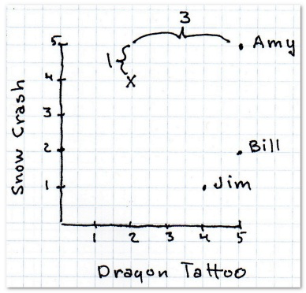
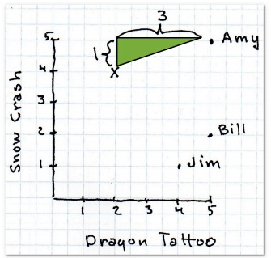
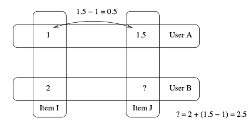
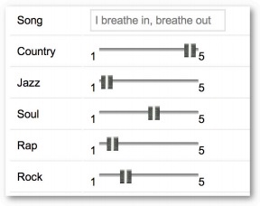
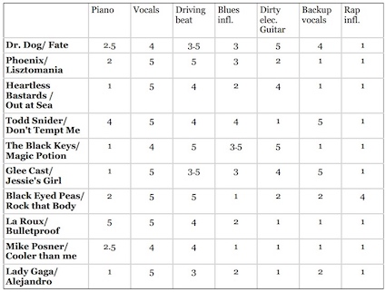
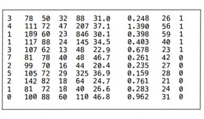
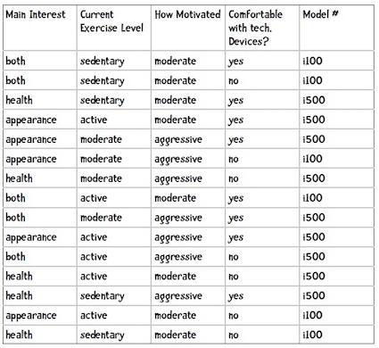
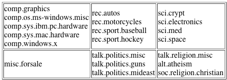

###  1 推荐系统入门


本章将介绍协同过滤，基本的距离算法，最后使用Python实现一个简单的推荐算法。

协同过滤，顾名思义，是利用他人的喜好来进行推荐，也就是说，是大家一起产生的推荐。它的工作原理是，在网站上查找一个和你类似的用户，然后将它喜欢的书籍推荐给你。

如何找到相似的用户？

#### 曼哈顿距离

顾名思义，在曼哈顿街区要从一个十字路口开车到另一个十字路口，实际驾驶距离就是“曼哈顿距离”。


最简单的距离计算方式是曼哈顿距离。在二维模型中，每个人都可以用$(x, y)$的点来表示，这里用下标来表示不同的人，$(x_1, y_1)$表示艾米，$(x_2, y_2)$表示神秘的X先生，那么他们之间的曼哈顿距离就是：

$$|x_1-x_2|+|y_1-y_2|$$



曼哈顿距离的优点之一是计算速度快，对于Facebook这样需要计算百万用户之间的相似度时就非常有利。

```python
def manhattan(rating1, rating2):
    """Computes the Manhattan distance. Both rating1 and rating2 are dictionaries
       of the form {'The Strokes': 3.0, 'Slightly Stoopid': 2.5}"""
    distance = 0
    commonRatings = False 
    for key in rating1:
        if key in rating2:
            distance += abs(rating1[key] - rating2[key])
            commonRatings = True
    if commonRatings:
        return distance
    else:
        return -1 #Indicates no ratings in common
```

##### 欧几里得距离

欧几里得距离就是两点之间的直线距离。 下面的斜线就是欧几里得距离，公式是：

$$\sqrt{(x_1-x_2)^2+(y_1-y_2)^2}$$



曼哈顿距离和欧几里得距离在数据完整的情况下效果最好。


```python
def euclidean(rating1, rating2):
    """
    Computes the Euclidean Distance
    :param rating1: rating
    :param rating2: rating
    :return: distance if common ratings exists, or -1
    """
    distance = 0
    commonRatings = False
    for key in rating1:
        if key in rating2:
            distance += pow(rating1[key] - rating2[key], 2)
            commonRatings = True

    if commonRatings:
        return distance
    else:
        return -1  # Indicates no ratings in common
```


##### 闵可夫斯基距离

我们可以将曼哈顿距离和欧几里得距离归纳成一个公式，这个公式称为闵可夫斯基距离(Minkowski Distance)：

$$d(x,y) = (\sum_{k=1}^{n}|x_k-y_k|^r)^{\frac{1}{r}}$$

其中：

* $r = 1$, 该公式即曼哈顿距离
* $r = 2$, 该公式即欧几里得距离
* $r = \infty$, 切比雪夫距离

!!!note
    $r$值越大，单个维度的差值大小会对整体距离有更大的影响。

##### 切比雪夫距离

 切比雪夫距离(Chebyshev Distance)是定义为其各坐标数值差的最大值。
 
$$D_{\rm Chebyshev}(x,y) = \max_i(|x_i - y_i|)=\lim_{k \to \infty} \bigg( \sum_{i=1}^n \left| x_i - y_i \right|^k \bigg)^{1/k}$$


```Python
def chebyshev(rating1, rating2):
	"""
	Computes the Chebyshev Distance
	:param rating1: rating
	:param rating2: rating
	:return: distance if common ratings exists, or -1
	"""
	distance = 0
	commonRatings = False
	for key in rating1:
		if key in rating2:
			distance = max(distance, abs(rating1[key] - rating2[key]))
			commonRatings = True

	if commonRatings:
		return distance
	else:
		return -1  # Indicates no ratings in common
```


##### 皮尔逊相关系数

让我们仔细看看用户对乐队的评分，可以发现每个用户的打分标准非常不同：

* Bill没有打出极端的分数，都在2至4分之间； 
* Jordyn似乎喜欢所有的乐队，打分都在4至5之间； 
* Hailey是一个有趣的人，他的分数不是1就是4。

那么，如何比较这些用户呢？比如Hailey的4分相当于Jordan的4分还是5分呢？我觉得更接近5分。这样一来就会影响到推荐系统的准确性了。Clara最低给了4分——她所有的打分都在4至5分之间，这种现象在数据挖掘领域称为**分数膨胀**。


解决方法之一是使用皮尔逊相关系数, 用于度量两个变量X和Y之间的相关(线性相关)，其值介于-1与1之间, 1表示完全吻合，-1表示完全相悖。下面是常见的几组$(x, y)$点集的皮尔逊相关系数。


两个变量之间的皮尔逊相关系数定义为两个变量之间的协方差($\text{cov}(X,Y)$)和标准差($\sigma_X$)的商：

$$\rho_{X,Y}={\mathrm{cov}(X,Y) \over \sigma_X \sigma_Y} ={E[(X-\mu_X)(Y-\mu_Y)] \over \sigma_X\sigma_Y}$$


对于样本皮尔逊相关系数:

$$r_{xy}=\frac{\sum x_iy_i-n \bar{x} \bar{y}}{(n-1) s_x s_y}=\frac{n\sum x_iy_i-\sum x_i\sum y_i}{\sqrt{n\sum x_i^2-(\sum x_i)^2}~\sqrt{n\sum y_i^2-(\sum y_i)^2}}.$$

以上方程给出了计算样本皮尔逊相关系数简单的单流程算法，但是其依赖于涉及到的数据，有时它可能是数值不稳定的。但它最大的优点是，用代码实现的时候可以只遍历一次数据。

```python
	def pearson(rating1, rating2):
		"""
		Compute pearson coefficient
		:param rating1: a dictionary
		:param rating2: a dictionary
		:return: pearson coefficient
		"""
		sum_xy = 0
		sum_x = 0
		sum_y = 0
		sum_x2 = 0
		sum_y2 = 0
		n = 0
		commonRatings = False
		for key in rating1:
			if key in rating2:
				n += 1
				x = rating1[key]
				y = rating2[key]
				sum_xy += x * y
				sum_x += x
				sum_y += y
				sum_x2 += pow(x, 2)
				sum_y2 += pow(y, 2)
				commonRatings = True

		if not commonRatings:
			return -1
		# now compute denominator
		denominator = math.sqrt(sum_x2 - pow(sum_x, 2) / n) * math.sqrt(sum_y2 - pow(sum_y, 2) / n)
		if denominator == 0:
			return 0
		else:
			return (sum_xy - (sum_x * sum_y) / n) / denominator
```


##### 余弦相似度

当我们用1500万首歌曲来比较两个用户时，很有可能他们之间没有任何交集，这样一来就无从计算他们之间的距离了。类似的情况是在计算两篇文章的相似度时。余弦相似度的计算中会略过这些非零值。它的计算公式是：

$$\cos(x,y) = \frac{x\cdot y}{||x||\times||y||}$$

其中，$\cdot$ 号表示数量积。$||x||$表示向量$x$的模。


余弦相似度在文本挖掘中应用得较多，在协同过滤中也会使用到。


##### 应该使用哪种相似度？

* 如果数据存在“分数膨胀”问题，就使用皮尔逊相关系数。 
* 如果数据比较“密集”，变量之间基本都存在公有值，且这些距离数据是非常重要的，那就使用欧几里得或曼哈顿距离。
* 如果数据是稀疏的，则使用余弦相似度。


!!! note
    在数据标准化($\mu=0,\sigma=1$）后，Pearson相关性系数、余弦相似度、欧式距离的平方可认为是等价的[[1](https://www.zhihu.com/question/19734616)]。

#### kNN

上面的做法中，我们只依靠最相似的一个用户来做推荐，如果这个用户有些特殊的偏好，就会直接反映在推荐内容里。解决方法之一是找寻多个相似的用户，这里就要用到K最邻近算法了。

在协同过滤中可以使用K最邻近算法来找出K个最相似的用户，以此作为推荐的基础。不同的 应用有不同的K值，需要做一些实验来得出。以下给到读者一个基本的思路。 假设我要为Ann做推荐，并令K=3。使用皮尔逊相关系数得到的结果是：

|  Person | Pearson |
| --- | --- |
| Sally | 0.8 |
| Eric | 0.7 |
| Amanda | 0.5 |

这三个人都会对推荐结果有所贡献，问题在于我们如何确定他们的比重呢？ 我们直接用相关系数的比重来描述，Sally的比重是0.8/2=40%，Eric是0.7/2=35%，Amanda 则是25%：

假设他们三人对Grey Wardens的评分以及加权后的结果如下：

| Person | Grey Wardens Rating | Influence |
| --- | --- | --- |
| Sally | 4.5 | 25% |
| Eric | 5 | 35% |
| Amanda | 3.5 | 40% |

最后计算得到的分数为为加权和 $4.5\times 25\% + 5\times 35\% + 3.5 \times 40\%$。


#### Python推荐模块

Cai-Nicolas Zeigler从图书漂流站收集了超过100万条评价数据——278,858位用户为271,379本书打了分。数据可以从这个[地址](http://www2.informatik.uni-freiburg.de/~cziegler/BX/)获得。


CSV文件包含了三张表：

* 用户表，包括用户ID、位置、年龄等信息。其中用户的姓名已经隐去； 
* 书籍表，包括ISBN号、标题、作者、出版日期、出版社等；
* 评分表，包括用户ID、书籍ISBN号、以及评分（0-10分）。

```python tab="Recommender"
class Recommender:

	def __init__(self, books, users, user_ratings, book_ratings):
		"""
		initialize basic data
		:param books: a dictionary of books, whose key is book id
		:param users: a dictionary of users, whose key is user id
		:param book_ratings: a dictionary of book ratings, whose key is book id
		:param user_ratings: a dictionary of user ratings, whose key is user id
		"""
		self.books = books
		self.users = users
		self.book_ratings = book_ratings
		self.user_ratings = user_ratings

	def recommend(self, user_to_recommend_int, k=1):
		"""
		Recommend user books
		:param user_to_recommend_int: int, user id
		:param k : int, for nearest k neighbors
		:return: a list of books
		"""
		user_to_recommend = str(user_to_recommend_int)
		if user_to_recommend not in self.users:
			raise Exception("user does not exist!!")

		# find the user having min distances from user_to_recommend
		distances = []
		find_user = False
		for user in self.users:
			if user_to_recommend == user:
				continue
			# extract user ratings based on user ids, 
			# and compute the distance between them
			distance = Distance.pearson(self.user_ratings[user_to_recommend], 
			     self.user_ratings[user])
			if distance != -1:
				distances.append([user, distance])
				find_user = True

		if not find_user:
			return []

		# sort user based on their distances
		# pearson 系数越大，距离越近，所以用reverse
		distances.sort(key=lambda x: x[1], reverse=True)

		# compute weight based on distances
		distances = distances[0:k]
		sum_distance = sum([distance for user, distance in distances])
		for i in range(len(distances)):
			distances[i][1] /= sum_distance

		# recommend books
		books_to_recommend = {}
		for user_id, weight in distances:
			for book_id in self.user_ratings[user_id]:
					if book_id not in self.user_ratings[user_to_recommend]:  # the user haven't seen
						if book_id not in books_to_recommend:  # haven't recommend
							books_to_recommend[book_id] = 
							     self.user_ratings[user_id][book_id]*weight
						else:
							books_to_recommend[book_id] = books_to_recommend[book_id] \
								+ self.user_ratings[user_id][book_id]*weight

		# transform to a  list of tuple
		books_to_recommend = [(book_id, project_rating) 
		      for book_id, project_rating in books_to_recommend.items()]

		# sort based on project_rating
		books_to_recommend.sort(key=lambda x: x[1], reverse=True)

		# extract book title
		books_to_recommend = [self.books[book_id]["title"]
		       for book_id, project_rating in books_to_recommend]
		return books_to_recommend


if __name__ == "__main__":
	ratings = BooksImport()
	books, users, user_ratings, book_ratings = ratings.recommender_import()
	test = Recommender(books, users, user_ratings, book_ratings)
	print(test.recommend(171118))
```


```python tab="Distance"
import math


class Distance:
	"""
	Compute distance of two users, having different ratings.

	Both rating1 and rating2 are
	dictionaries of the form {'The Strokes': 3.0, 'Slightly Stoopid': 2.5}
	"""

	def __init__(self):
		pass

	@staticmethod
	def manhattan(rating1, rating2):
		"""
		Computes the Manhattan distance.
		"""
		distance = 0
		common_ratings = False
		for key in rating1:
			if key in rating2:
				distance += abs(rating1[key] - rating2[key])
				common_ratings = True
		if common_ratings:
			return distance
		else:
			return -1  # Indicates no ratings in common

	@staticmethod
	def euclidean(rating1, rating2):
		"""
		Computes the Euclidean Distance
		:param rating1: rating
		:param rating2: rating
		:return: distance if common ratings exists, or -1
		"""
		distance = 0
		commonRatings = False
		for key in rating1:
			if key in rating2:
				distance += pow(rating1[key] - rating2[key], 2)
				commonRatings = True

		if commonRatings:
			return distance
		else:
			return -1  # Indicates no ratings in common

	@staticmethod
	def chebyshev(rating1, rating2):
		"""
		Computes the Chebyshev Distance
		:param rating1: rating
		:param rating2: rating
		:return: distance if common ratings exists, or -1
		"""
		distance = 0
		commonRatings = False
		for key in rating1:
			if key in rating2:
				distance = max(distance, abs(rating1[key] - rating2[key]))
				commonRatings = True

		if commonRatings:
			return distance
		else:
			return -1  # Indicates no ratings in common

	@staticmethod
	def pearson(rating1, rating2):
		"""
		Compute pearson coefficient
		:param rating1: a dictionary
		:param rating2: a dictionary
		:return: pearson coefficient
		"""
		sum_xy = 0
		sum_x = 0
		sum_y = 0
		sum_x2 = 0
		sum_y2 = 0
		n = 0
		commonRatings = False
		for key in rating1:
			if key in rating2:
				n += 1
				x = rating1[key]
				y = rating2[key]
				sum_xy += x * y
				sum_x += x
				sum_y += y
				sum_x2 += pow(x, 2)
				sum_y2 += pow(y, 2)
				commonRatings = True

		if not commonRatings:
			return -1
		# now compute denominator
		denominator = math.sqrt(sum_x2 - pow(sum_x, 2) / n)\ 
    		* math.sqrt(sum_y2 - pow(sum_y, 2) / n)
		if denominator == 0:
			return 0
		else:
			return (sum_xy - (sum_x * sum_y) / n) / denominator
```
	
```python tab="books_import"
class BooksImport:

	def __init__(self):
		self.books = {}
		self.users = {}
		self.book_ratings = {}
		self.user_ratings = {}
		self.bx_books_import()
		self.bx_users_import()
		self.bx_ratings_import()
    
	def bx_books_import(self):
		"""
		import books meta information
		"""
    
		try:
			booksfile = codecs.open("BX-Dump/BX-Books.csv", "r", "utf-8")
    
			for line in booksfile:
				props = line.split(';')
				isbn = props[0].strip('"')
				title = props[1].strip('"')
				author = props[2].strip('"')
				year = props[3].strip('"')
				self.books[isbn] = {"title": title, "author": author, "year": year}
    
			booksfile.close()
    
		except IOError as e:
			error = "Failed to load: {0}".format(e)
			print(error)
    
	def bx_users_import(self):
		"""
		import user meta information
		user is a dictionary, whose key is user_id
		"""
		try:
			users_file = codecs.open("BX-Dump/BX-Users.csv", 'r', 'utf--8')
			for line in users_file:
				props = line.split(';')
				user_id = props[0].strip('"')
				location = props[1].strip('"')
				self.users[user_id] = location
				self.user_ratings[user_id] = {}
			users_file.close()
    
		except IOError as e:
			error = "Failed to load: {0}".format(e)
			print(error)
    
	def bx_ratings_import(self):
		try:
			ratings_file = codecs.open("BX-Dump/BX-Book-Ratings.csv", 'r', 'utf--8')
			for line in ratings_file:
				props = line.split(';')
				user_id = props[0].strip('"')
				book_id = props[1].strip('"')
				rating = int(props[2].strip().strip('"'))
    
				if book_id in self.book_ratings:
					self.book_ratings[book_id].append(rating)
				else:
					self.book_ratings[book_id] = [rating]
    
				self.user_ratings[user_id][book_id] = rating
    
			ratings_file.close()
    
		except IOError as e:
			error = "Failed to load: {0}".format(e)
			print(error)
    
	def get_books(self):
		return self.books
    
	def get_users(self):
		return self.users
    
	def get_user_ratings(self):
		return self.user_ratings
    
	def get_book_ratings(self):
		return self.book_ratings
    
	def recommender_import(self):
		return self.books, self.users, self.user_ratings, self.book_ratings
```


###  2 隐式评价和基于物品的过滤算法


#### 隐式评价

用户的评价类型可以分为显式评价和隐式评价。**显式评价**指的是用户明确地给出对物品的评价。最常见的例子是YouTube上的“喜欢”和“不喜欢”按钮，以及亚马逊的星级评价系统。

**隐式评价**，就是我们不让用户明确给出对物品的评价，而是通过观察他们的行为来获得偏好信息。示例之一是记录用户在纽约时报网上的点击记录，亚马逊上用户的实际购买记录。

我们可以收集到哪些隐式评价呢？ e.g. 网页方面：页面点击、停留时间、重复访问次数、引用率、Hulu上观看视频的次数；音乐播放器：播放的曲目、跳过的曲目、播放次数；


#### 基于物品的过滤算法

目前为止我们描述的都是基于用户的协同过滤算法：将一个用户和其他*所有*用户进行对比，找到相似的人。这种算法有两个弊端：

1. **扩展性**：随着用户数量的增加，其计算量也会增加。这种算法在只有几千个用户的情况下能够工作得很好，但达到一百万个用户时就会出现瓶颈。
2. **稀疏性**：大多数推荐系统中，用户仅仅对一小部分物品进行了评价，这就造成了数据的稀疏性。比如亚马逊有上百万本书，但用户只评论了很少一部分，于是就很难找到两个相似的用户了。


##### 修正的余弦相似度

使用余弦相似度来计算两个物品的距离。由于“分数膨胀”现象，需要从用户的评价中减去他所有评价的均值，这就是修正的余弦相似度(Adjusted Cosine Similarity)。这个公式来自于一篇影响深远的论文《[基于物品的协同过滤算法](http://files.grouplens.org/papers/www10_sarwar.pdf)》。

$$s(i,j) =\frac{\sum_{u\in U}(R_{u,i}-\bar R_u)(R_{u,j}-\bar R_u)}{\sqrt{\sum_{u\in U}(R_{u,i}-\bar R_u)^2}\sqrt{\sum_{u\in U}(R_{u,j}-\bar R_u)^2}}$$

$U$表示同时评价过物品$i$和$j$的用户集合， $\bar R_u$表示用户$u$对所有物品的评价均值，$s(i,j)$表示物品$i$和$j$的相似度。


```python
def cosinesimilarity(item1, item2, userRatings):
    averages = {}
    for user, ratings in userRatings.items():
        averages[user] = (float(sum(ratings.values())) / len(ratings.values()))

    num = 0    # 分子
    dem1 = 0   # 分母的第一部分
    dem2 = 0
    for (user, ratings) in userRatings.items():
        if item1 in ratings and item2 in ratings:
            avg = averages[user]
            num += (ratings[item1] - avg) * (ratings[item2] - avg)
            dem1 += (ratings[item1] - avg) ** 2
            dem2 += (ratings[item1] - avg) ** 2
    return num / (math.sqrt(dem1) * math.sqrt(dem2))
```


##### 预测

那下面该如何使用它来做预测呢？比如我想知道David有多喜欢Kacey Musgraves？在計算完 similarity 之後，下一步驟就是要進行某個 item 的預測，這裡有兩種方法，分別是： weighted-sum 和 regression。


<hh>weighted-sum</hh>


$$p(u,i) = \frac{{\sum_{N\in \text{similarTo}(i)}(S_{i,N}\times R_{u,N})}}{\sum_{N\in \text{similarTo}(i)}|S_{i,N}|}$$

其中$p(u,i)$表示预测的用户$u$对物品$i$的评分，$S_{i,N}$表示物品$i$和$N$的相似度，$R_{u,N}$表示用户$u$对物品$N$的评分。$N$是一个物品的集合，有如下特性：用户$u$对集合中的物品打过分，物品$i$和集合中的物品有相似度数据。


##### 使用Python实现修正的余弦相似度算法

```python
class ItemBasedCF:
	"""
	使用修正的余弦相似度实现物品推荐
	"""
	def __init__(self, data):
		"""
		initialize data
		:param data: a dict of (user, ratings)
		For instance, users2 = {"Amy": {"Taylor Swift": 4, "PSY": 3, "Whitney Houston": 4},
			"Clara": {"PSY": 3.5, "Whitney Houston": 4},
			"Daisy": {"Taylor Swift": 5, "Whitney Houston": 3}}
		"""
		self.data = data
		self.items = set()   # a set of items

		# compute average user ratings of given data
		self.avg_user_rating = {}
		for user, ratings in data.items():
			self.avg_user_rating[user] = np.average(list(ratings.values()))
			for item in ratings.keys():
				self.items.add(item)

	def adjusted_cosine_similarity(self, item1, item2):
		"""
		Compute adjusted cosine similarity
		:param item1: an item
		:param item2: an item
		:return: similarity
		"""
		if (item1 not in self.items) or (item2 not in self.items):
			raise(Exception("Input Item NOT FOUND!"))


		num = 0  # numerator
		den1 = 0  # denominator1
		den2 = 0   # denominator2
		for user, ratings in self.data.items():
			if item1 in ratings and item2 in ratings:
				x = ratings[item1] - self.avg_user_rating[user]
				y = ratings[item2] - self.avg_user_rating[user]
				num += x*y
				den1 += x*x
				den2 += y*y

		den = np.sqrt(den1*den2)  # denominator
		if den == 0:
			return None

		return num/den

	def predict(self, user, item):
		"""
		predict rating of given user on given item
		:param user: an user
		:param item: an item
		:return: rating
		"""
		if user not in self.data:
			raise(Exception("Input User NOT FOUND!"))

		if item not in self.items:
			raise(Exception("Input Item NOT FOUND!"))

		num = 0  # numerator
		den = 0  # denominator
		for another_item, rating in self.data[user].items():
			if item != another_item:
				similarity = self.adjusted_cosine_similarity(item, another_item)
				if similarity is None:
					continue
				num += rating * similarity
				den += abs(similarity)

		if den == 0:
			return None

		return num/den

	def recommend(self, user):
		"""
		recommend items to the user
		:param user: an user
		:return: a list of items(up to 10)
		"""
		recommendations = []
		for item in self.items:
			if item not in self.data[user]:
				predict = self.predict(user, item)
				if predict is not None:
					recommendations.append((predict, item))

		recommendations.sort(reverse=True)
		return list(map(lambda x: x[1], recommendations))
```


#### Slope One算法

Slope One是另一种比较流行的基于物品的协同过滤算法。它最大的优势是简单，易于实现。Slope One算法是在一篇名为《[Slope One Predictors for Online Rating-Based Collaborative Filtering](https://arxiv.org/abs/cs/0702144)》的论文中提出的，由Lemire和Machlachlan合著。这篇论文非常值得一读。


我们用一个简单的例子来了解这个算法。假设A给Item I打了1分，给Item J打了1.5分；B给Item I打了2分。我们可以用以下逻辑来预测B对Item J的评分：由于A给Item J打的分数要比Item I的高0.5分，所以我们预测B也会给高0.5分，即2.5分。




可以将Slope One分为两个步骤： 

* 计算出物品之间的两两差值(可以在夜间批量计算)
* 进行预测，可以使用加权的Slope One算法

##### 计算差值

物品$i$与物品$j$之间的平均差异为：

$$\text{dev}_{i,j}=\sum_{u\in S_{i,j}(X)}\frac{u_i-u_j}{\text{card}(S_{i,j}(X))}$$

其中$S_{i,j}(X)$表示同时评价过$i,j$的用户集合，$\text{card}(S)$表示$S$中有多少个元素，$X$表示所有评分值的集合，$\text{card}(S_{j,i}(X))$则表示同时评价过物品$i$和$j$的用户数，$u_i$表示用户$u$对物品$i$的评分。


!!! Question
    如果有一个新进的用户对10个歌手做了评价，我们是否需要重新计算20万×20万的差异数据，或是有其他更简单的方法？ 答案是你不需要计算整个数据集，这正是Slope One的美妙之处。对于两个物品，我们只需记录同时评价过这对物品的用户数就可以了。

##### 使用加权的Slope One算法进行预测

使用加权的Slope One算法(Weighted Slope One, WS1)来进行预测，用$P^{WS1}$来表示预测用户$u$对物品$j$的评分：

$$P^{WS1}(u)_j=\frac{\sum_{i\in S(u) - \{j\}}(\text{dev}_{i,j}+u_i)c_{j,i}}{\sum_{i\in S(u) - \{j\}} c_{j,i}}$$

其中：$c_{j,i}=\text{card}(S_{j,i}(\chi))$。式中$\sum_{i\in S(u) - \{j\}}$表示用户$u$评价的除$j$除外的物品，其他符号与上一节的含义相同。这个公式其实很好理解，$\text{dev}_{i,j}+u_i$表示根据物品$i$预测得到的用户$u$对物品$j$的评分，在此基础上进行了加权平均就得到$P^{WS1}$。


##### 使用Python实现Slope One算法

其实代码整体思路比较简单，把公式转化为代码就可以了，没有什么特殊的技巧。唯一需要注意的是尽可能的测试该程序，保证其正确性。由于网上有不少SlopeOne代码，我自己写完以后和他们的结果比对，发现完全一致。


```Python
class SlopeOne:

	def __init__(self, data):
		"""
		initialize
		:param data: a dictionary, whose key is an item, and value is  a rating.
		"""
		self.data = data
		# frequencies, a dictionary, whose key is an item,
		#   and value is a dictionary of (item, frequency)
		self.frequencies = {}
		# deviations, a dictionary, whose key is an item,
		#   and value is a dictionary of (item, deviation)
		self.deviations = {}

	def computeDeviations(self):
		"""
		compute deviations between items
		:return:
		"""
		# 获取每位用户的评分数据ratings
		for ratings in self.data.values():
			# 对于该用户的每个评分项(歌手、分数)
			for (item1, rating1) in ratings.items():
				self.frequencies.setdefault(item1, {})
				self.deviations.setdefault(item1, {})
				# 再次遍历该用户的每个评分项
				for (item2, rating2) in ratings.items():
					if item1 != item2:
						# 将评分的差异保存到变量中
						self.frequencies[item1].setdefault(item2, 0)
						self.deviations[item1].setdefault(item2, 0.0)
						self.frequencies[item1][item2] += 1
						self.deviations[item1][item2] += (rating1 - rating2)

		# 计算deviations
		for item1, deviations in self.deviations.items():
			for item2 in deviations:
				deviations[item2] /= self.frequencies[item1][item2]

	def predict(self, user, item):

		"""
		predict the ratings of the user regard to the item
		Using Weighted Slope One (WSO)
		:param user: an user
		:param item: an item
		:return: a prediction, double
		"""

		if user not in self.data:
			raise Exception

		# predictions
		predictions = 0
		frequency = 0

		# 用户user 评价的除 item 除外的物品
		for diff_item, ratings in self.data[user].items():
			if (item == diff_item) or (diff_item not in self.deviations[item]):
				continue
			predictions += (self.deviations[item][diff_item] + self.data[user][diff_item]) \
				* self.frequencies[item][diff_item]
			frequency += self.frequencies[item][diff_item]

		predictions /= frequency

		return predictions

	def recommendation(self, user):
		"""
		recommend items to user
		:param user: an user
		:return: a list of items recommended
		"""
		if user not in self.data:
			raise Exception

		if self.deviations == {}:
			self.computeDeviations()

		recommendations = []
		# 所有的item
		for item in self.deviations.keys():
			# 用户未评价过的item
			if item not in self.data[user]:
				recommendations.append((item, self.predict(user, item)))

		recommendations.sort(key=lambda x: x[1], reverse=True)
		return list(map(lambda x: x[0], recommendations))
```
	
#### Example: MovieLens

MovieLens数据集是由明尼苏达州大学的GroupLens研究项目收集的，是用户对电影的评分。 这个数据集可以在[www.grouplens.org](www.grouplens.org)下载。其中100K数据集包含了943位用户对1682部电影的评价，约10万条记录。

使用MovieLens 100K数据集处理的过程如下：

* 根据README中描述的文件格式，将电影、用户、评分数据导入并转化为合适的数据格式
* 利用SlopeOne进行推荐
* 将推荐结果展示


代码整体非常简洁的，因为可以直接继承上面写的SlopeOne算法。

```python
class MovieRecommendation(SlopeOne):
	def __init__(self, data, movie):
		super(MovieRecommendation, self).__init__(data)
		self.movie = movie


	def recommend_movie(self, user):
		movies = self.recommendation(user)[:10]
		return list(map(lambda x: self.movie[x]["title"], movies))
```

#### 进一步阅读

http://www.diva-portal.se/smash/get/diva2:811049/FULLTEXT01.pdf
https://dzone.com/articles/slope-one-recommender
https://www.slideshare.net/irecsys/slope-one-recommender-on-hadoop-15199798?from_action=save#
###  3 分类


试想一个极端的例子：一个新乐队发布了专辑，这张专辑还没有被任何用户评价或购买过，如果是用协同过滤的话，那它将永远不会出现在推荐列表中。

这时我们可以**根据物品特征进行分类**。

来看一下[潘多拉音乐盒](http://www.pandora.com/newpandora)的例子。在这个站点上你可以设立各种音乐频道，只需为这个频道添加一个歌手，潘多拉就会播放和这个歌手风格相类似的歌曲。原因在于潘多拉网站的推荐系统是基于一个名为音乐基因的项目。 他们雇佣了专业的音乐家对歌曲进行分类（提取它们的“基因”）；这些专家要甄别400多种音乐特征。

具体方法是将每种歌曲类型拆分成单独的特征，并对此进行打分。每个特征都是1到5分的尺度，0.5分为一档。1分表示完全不符合，5分则表示很相符。



下表使用一些音乐特征(使用钢琴的程度、使用美声的程度、节奏等)对歌曲进行评分：



可以将上表存成二维HashTable的形式，可以直接利用第一章中的各种距离计算公式计算歌曲之间的距离来进行推荐。按我的理解，可以这么看待问题，或许更加容易理解：把这些特征(piano, vocals, driving beat)看成是用户，各个特征上的评分可以看成是用户评分，把基于用户的协同过滤看成是基于特征的协同过滤。


#### 评分标准

假如我想增加一种音乐特征——每分钟的鼓点数（bpm），用来判断这是一首快歌还是慢歌。由于bpm取值范围(100~200左右)与前面(1~5)的不一致，导致bpm基本决定了两首歌的距离。

评分标准不一是所有推荐系统的大敌！让数据变得可用我们可以对其进行**标准化**(normalization)。 

##### Rescaling/Min-max normalization

最常用的方法是将所有数据都转化为0到1之间的值： 将每个值减去最小值，并除以范围：

$$\frac{x_i-\min}{\max-\min}$$

##### z-score normalization/Standardization


还可以使用**标准分**(z-score or standard score)：分值偏离均值的程度，

$$\text{standard score} = \frac{x_i-\bar x}{\sigma}$$

##### Modified Z-Score

标准分的问题在于它会受异常值的影响。 比如说一家公司有100名员工，普通员工每小时赚10美元，而CEO一年能赚600万，那全公司的平均时薪为38美元。在修正的标准分(Modified Z-Score)中，将标准分公式中的均值改为中位数(median)，将标准差改为**平均绝对偏差**(MAD, Mean Absolute Deviation[[wiki](https://en.wikipedia.org/wiki/Average_absolute_deviation)])。

$$\text{modified z-score}= \frac{x_i-\text{median}}{\text{MAD}}$$

$$\text{mean absolute deviation(MAD)} = \frac{\sum_i |x_i-\text{median}|}{\text{card}(x)}$$

##### 是否需要标准化？

需要进行标准化的情形：

* 我们需要通过物品特性来计算距离；
* 不同特性之间的尺度相差很大。

#### Python数据格式

上面我们用二维HashTable的形式来存储歌曲的特征数据，这样做虽然可行，但却比较繁琐，piano、vocals这样的键名需要重复很多次。我们可以将其简化为向量，即Python中的数组类型：

```Python
# 物品向量中的特征依次为：piano, vocals, beat, blues, guitar, backup vocals, rap
items = {"Dr Dog/Fate": [2.5, 4, 3.5, 3, 5, 4, 1],
"Phoenix/Lisztomania": [2, 5, 5, 3, 2, 1, 1],
"Heartless Bastards/Out": [1, 5, 4, 2, 4, 1, 1],
"Black Eyed Peas/Rock That Body": [2, 5, 5, 1, 2, 2, 4],
"Lady Gaga/Alejandro": [1, 5, 3, 2, 1, 2, 1]
}
```

那么用户“赞”和“踩”的数据用什么表示呢？由于用户并不会对所有的歌曲都做这些操作，所以用嵌套的字典来表示比较方便：

```python
users = {"Angelica": {"Dr Dog/Fate": "L",
    "Phoenix/Lisztomania": "L",
    "Mike Posner": "D",
    "Black Eyed Peas/Rock That Body": "D",
    "Lady Gaga/Alejandro": "L"},
"Bill": {"Dr Dog/Fate": "L",
    "Phoenix/Lisztomania": "L",
    "Heartless Bastards/Out at Sea": "L",
    "Black Eyed Peas/Rock That Body": "D",
    "Lady Gaga/Alejandro": "D"}}
```

这里使用L和D两个字母来表示喜欢和不喜欢。


#### 分类器

分类器是指通过物品特征来判断它应该属于哪个组或类别的程序。分类器程序会基于一组已经做过分类的物品进行学习，从而判断新物品的所属类别。


建立一个分类函数，用来预测用户对一个新物品的喜好;这个函数会先计算出与这个物品距离最近的物品，然后找到用户对这个最近物品的评价，以此作为新物品的预测值。

```Python
class simple_classifier:
	def __init__(self, users, items):
		self.users = users
		self.items = items


	def computeNearestNeighbor(self, itemName, itemVector, items):
		"""
		按照距离排序，返回邻近物品列表
		:param itemName
		:param itemVector
		:param items
		"""
		distances = []
		for otherItem in items:
			if otherItem != itemName:
				distance = DistanceVector.manhattan(itemVector, items[otherItem])
				distances.append((distance, otherItem))
		# 最近的排在前面
		distances.sort()
		return distances

	def classify(self, user, itemName, itemVector):
		nearest = self.computeNearestNeighbor(itemName, itemVector, self.items)[0][1]
		rating = self.users[user][nearest]
		return rating
```

让我们试用一下：

```python
>>> classify('Angelica', 'Chris Cagle/I Breathe In. I Breathe Out', [1, 5, 2.5, 1, 1, 5
, 1])
'L'
```

其实我们做的是一个分类器，将歌曲分为了用户喜欢和不喜欢两个类别。


#### Example:运动项目

先看一个较为简单的例子——根据女运动员的身高和体重来判断她们是从事什么运动项目的。训练数据和测试数据分别来自athletesTrainingSet.txt和athletesTestSet.txt。文件格式如下：

```
comment	class	num	num
Asuka Teramoto	Gymnastics	54	66
Brittainey Raven	Basketball	72 162
```


##### 数据格式

在Python中应该如何合适的表示这些数据呢？由于分类器程序根本不会使用到姓名，所以用姓名作为键值的字典是不合适的。由于我们需要遍历文件的数据，所以使用list类型是合理的。如下是最合理的：

```python
[('Gymnastics', [54, 66], ['Asuka Termoto']),
    ('Basketball', [72, 162], ['Brittainey Raven']), ...]
```

它将不同类型的数据区别开来了，依次是分类、特征、备注。

##### Python代码

```python
class AthleteClassifier:
	def __init__(self, filename=None, format=None, header=True):
		"""
		initialize
		:param format: num, comment, class
		:param filename: filename for training data
		:param header: whether header line exist
		"""
		# format
		self.format = format
		# self.data format: class, fields, comments
		self.data = None
		# a list of median
		self.medians = []
		# mean absolute deviation
		self.mad = []
		# test result
		self.test_result = None
		# classes
		self.classes = set()

		# training data if a file is provided
		if filename and format:
			# data
			self.data = self.pre_processing(filename, header)
			# mad
			self.mean_absolute_deviation()
			# normalize
			self.normalizeColumn()


	def pre_processing(self, filename, header=True):
		"""
		read file and transform to data format
		:param filename: filename for training data
		:param header: whether header line exist
		"""

		file = codecs.open(filename, mode='r', encoding='utf-8')
		# skip header
		if header:
			file.readline()

		data = []
		n = len(self.format)
		for line in file.readlines():
			fields = line.strip("\n").split('\t')
			if len(fields) != n:
				raise(Exception("Input File Format Error"))
			vector, comment, classification = ([], "", None)
			for i in range(n):
				field, field_format = fields[i], self.format[i]
				if field_format == "num":
					vector.append(float(field))
				elif field_format == "class":
					classification = field
					self.classes.add(field)
				elif field_format == "comment":
					comment += (field + " ")
			data.append([classification, vector, comment.strip()])
		return data

	def mean_absolute_deviation(self):
		"""
		calculate mean absolute deviation of each fields for data
		"""
		for i in range(len(self.data[0][1])):
			# calculate median
			field = list(map(lambda x: x[1][i], self.data))
			self.medians.append(np.median(field))
			self.mad.append(sum(abs(np.array(field)
			                        - self.medians[i]))/len(field))

	def normalizeColumn(self):
		"""
		given a column number, normalize that column in self.data
		using the Modified Standard Score
		Modified Standard Score = score - median /(maxScore - minScore)
		"""
		for item in self.data:
			for j in range(len(item[1])):
				item[1][j] = (item[1][j] - self.medians[j])/self.mad[j]

	def normalizeVector(self, itemVector):
		"""
		given a vector, having the same format as the vector in the self.data[0][1],
		normalize it using a modified z-score
		:param itemVector: a vector, size of fields in self.data
		:return: a vector normazalied
		"""
		return [(itemVector[j] - self.medians[j]) / self.mad[j]
		        for j in range(len(itemVector))]

	def nearest_neighbor(self, itemVector):
		"""
		find nearest neighbor
		:param itemVector: a vector
		:return: nearest neighbor and the distance between them
		"""
		distance = [(DistanceVector.manhattan(np.array(itemVector), np.array(item[1])),
		             item) for item in self.data]
		return min(distance)

	def classify(self, itemVector):
		"""
		预测itemVector的分类
		:return: the result of the classification
		"""
		return self.nearest_neighbor(self.normalizeVector(itemVector))[1][0]

	def initialize_test_result(self):
		"""
		initialize test result
		"""
		self.test_result = {}
		classes = list(self.classes)
		classes.sort()
		for class_name in classes:
			self.test_result.setdefault(class_name, {})
			for another_class_name in classes:
				self.test_result[class_name][another_class_name] = 0

	def test(self, testfile, header=True):
		"""
		test file, return accuracy
		:param testfile: a file
		:param header: whether header line exist
		:return: double, accuracy
		"""
		accurate = 0

		# check if test result is initialized
		if not self.test_result:
			self.initialize_test_result()

		test_data = self.pre_processing(testfile, header)
		for item in test_data:
			classify_result = self.classify(item[1])
			self.test_result[item[0]][classify_result] += 1
			if classify_result == item[0]:
				accurate += 1
			#else:
				#print(item, "not equals", classify_result)
		return round(accurate/float(len(test_data))*100, 1)
```

结果测试准确率为84%。

```python
classifier = AthleteClassifier(training_file, ["comment", "class", "num", "num"], header=True)
print(classifier.test(test_file, header=True)) #84.2
```


#### Example: 鸢尾花

鸢尾花数据集在数据挖掘领域是比较有名的。 它是20世纪30年代Ronald Fisher对三种鸢尾花的50个样本做的测量数据(萼片和花瓣)。训练集中有120条数据，测试集中有30条，两者没有交集。

测试结果表明使用同样的分类器有93.1的正确率。如果计算距离时，使用欧式距离，分类器有96.6%的正确率。

```Python
classifier = AthleteClassifier(training_file, ["num", "num", "num", "num", "class"], header=True)
classifier.test(test_file, header=False) # 93.1% correct
```

#### Example: 每加仑燃油公里数

卡内基梅隆大学统计的汽车燃油消耗和公里数数据也是一个广泛使用的数据集。大致格式如下：


根据汽缸数、排气量、马力、重量、 加速度等数据预测每加仑燃油公里数(mpg)。如果不进行标准化，准确率将只有32%。标准化之后有55%准确率。

###  4 进一步探索分类


#### 效果评估算法和kNN

当我们构建完一个分类器后，应该问以下问题：分类器的准确度如何？ 结果理想吗？ 如何与其它分类器做比较？


##### 训练集和测试集

数据集可以分为两个部分，第一部分用来构造分类器，称为**训练集**；另一部分用来评估分类器的结果，称为**测试集**。

##### k折交叉验证

不过，这种上面这种简单、直接的做法似乎有问题：如果分割的时候不凑巧，就会引发异常。比如，若测试集中的篮球运动员恰巧都很矮，她们就会被归为马拉松运动员。解决方法之一是将数据集按不同的方式拆分，测试多次，取结果的平均值。

如果将数据集分成$k$份，用$k-1$份来做训练集，另一份来做测试集，并迭代$k$次，叫做$k$**折交叉验证**($k$-fold cross validation)。在数据挖掘中，通常的做法是将数据集拆分成十份，称为**十折交叉验证**。

我们来看一个示例：假设有一个分类器能判断某个人是否是篮球运动员，数据集包含500个运动员和500个普通人。

* 第一步：将数据分成10份，每份包含50个篮球运动员，50个普通人
* 第二步：重复以下步骤10次
    * 每次迭代我们保留一份，比如第一次迭代保留第1份，第二次保留第2份。
    * 我们使用剩余的9份来训练分类器，比如第一次迭代使用第2至10份来训练。
    * 我们用刚才保留的一份来进行测试，并记录结果，比如：35个篮球运动员分类正确， 29个普通人分类正确。
* 第三步：合并结果

我们可以用一张表格来展示结果(就是马上要提到的混淆矩阵)：


通过十折交叉验证得到的评价结果肯定会比二折或者三折来得准确，因为使用了更多的训练数据。

##### 留一法

既然十折交叉验证效果那么好，我们为何不做一个$N$折交叉验证？$N$即数据集中的数据量。在数据挖掘领域，$N$折交叉验证又称为**留一法**。

* 优点：
    * 几乎所有的数据进行训练，然后用一个数据进行测试。
    * 确定性。
* 缺点：
    * 最大的缺点是计算时间很长。
    * 分层问题

在留一法中，所有的测试集都只包含一个数据(分层问题)。所以说，留一法对小数据集是合适的，但大多数情况下我们会选择十折交叉验证。

#### 混淆矩阵

混淆矩阵(confusion matrix)可以展现更为详细的评价结果。混淆矩阵可以帮助我们快速识别出分类器到底在哪些类别上发生了混淆，因此得名。表格的行表示测试用例实际所属的类别，列则表示分类器的判断结果。


在这个示例中，我们的分类器可以很好地区分体操运动员和篮球运动员，而马拉松运动员则比较容易和其他两个类别发生混淆。


#### Application: 每加仑燃油公里数

卡内基梅隆大学统计的汽车燃油消耗和公里数数据也是一个广泛使用的数据集。在[前面一章](../ch3/#example_2)中已经介绍过。

根据汽缸数、排气量、马力、重量、 加速度等数据预测每加仑燃油公里数(mpg)。392条数据都存放在mpgData.txt文件中，并用下面这段Python代码将这些数据按层次等分成十份：

```python
# divide data into 10 buckets
import random

def buckets(filename, bucket_name, separator, class_column):
	"""
	@param filename: file name of the original data.
	@param bucket_name: the prefix for all the bucket names.
	@param separator: the character that divides the columns.
	@param class_column: column that indicates the class, start from 0
	"""
	# put the data in 10 buckets


	number_of_buckets = 10
	data = {}
	# first read in the data and divide by category
	with open(filename) as f:
		lines = f.readlines()
	for line in lines:
		if separator != '\t':
			line = line.replace(separator, '\t')
		# first get the category
		category = line.split()[class_column]
		data.setdefault(category, [])
		data[category].append(line)
	# initialize the buckets
	buckets = []
	for i in range(number_of_buckets):
		buckets.append([])
	# now for each category put the data into the buckets
	for k in data.keys():
		# randomize order of instances for each class
		random.shuffle(data[k])
		bNum = 0
		# divide into buckets
		for item in data[k]:
			buckets[bNum].append(item)
			bNum = (bNum + 1) % number_of_buckets

	# write to file
	for bNum in range(number_of_buckets):
		f = open("%s-%02i" % (bucket_name, bNum + 1), 'w')
		for item in buckets[bNum]:
			f.write(item)
		f.close()

# example of how to use this code          
buckets("mpgTrainingSet", 'mpgData', '\t', 1)
```

执行这个程序后会生成10个文件：mpgData01、mpgData02等。然后需要修改上一章的近邻算法程序，让AthleteClassifier.test()函数能够执行十折交叉验证。


```Python
def ten_fold_cross_validation(self, bucket_name, separator, format, header=True):
	"""
	10-fold cross validation
	:param bucket_name: the prefix for all the bucket names.
	:param separator: the character that divides the columns.
	:param format: num, comment, class
	:param header: whether header line exist
	:return: accuracy
	"""
	self.format = format
	self.test_result = {}
	accuracy = []

	# repeat 10 times, select test bucket for test
	for test_bucket_number in range(10):
		# select remaining 9 bucket for training
		training_data = []
		for bucket_number in range(10):
			if test_bucket_number != bucket_number:
				training_filename = "%s%s%02i" % (bucket_name, separator, bucket_number + 1)
				training_data.extend(self.pre_processing(training_filename, header))
		self.data = training_data

		# normalize
		self.mean_absolute_deviation()
		self.normalizeColumn()

		# test
		test_filename = "%s%s%02i" % (bucket_name, separator, test_bucket_number + 1)
		accuracy.append(self.test(test_filename, header))

	# print output
	print("    ", end='')
	for actual in self.test_result.keys():
		print("%5s" % actual, end='')
	print("\n    ", "+----"*len(self.classes), "+")
	for actual, test_results in self.test_result.items():
		print("%3s" % actual, end='  |')
		for accuracy_count in test_results.values():
			print("%3s" % accuracy_count, end=' |')
		print('\n')
	print("    ", "+----"*len(self.classes), "+")

	avg_accuracy = np.average(accuracy)
	print("accuray is",  avg_accuracy)
	return avg_accuracy
```


#### Kappa指标

Kappa指标可以用来评价分类器的效果比随机分类要好多少，公式为

$$\kappa = \frac{P(c)-P(r)}{1-P(r)}$$

$P(c)$表示分类器的准确率，$P(r)$表示随机分类器的准确率。可以参考下列经验结果：


#### kNN算法

其实kNN算法已经在[第一章](../ch1#knn)里叙述并使用了。当时计算距离时，使用的是皮尔森相关系数。那么，如果是曼哈顿距离呢？首先，将距离取倒数，然后把所有的距离倒数除以距离倒数的和，从而得到评分的权重，最后加权平均得到评分。

其实把距离的倒数看成是相似度，就非常容易理解了。

#### Example: 比马印第安人糖尿病

这一节分析由美国国家糖尿病、消化和肾脏疾病研究所提供的比马印第安人糖尿病数据集([下载](https://gist.githubusercontent.com/ktisha/c21e73a1bd1700294ef790c56c8aec1f/raw/819b69b5736821ccee93d05b51de0510bea00294/pima-indians-diabetes.csv))。数据集中的一条记录代表一名21岁以上的比马女性，她们分类两类：五年内查出患有糖尿病，以及没有得病。数据集中包含了8个特征，如怀孕次数，舒张压等。


 数据集前八列是特征，最后一列是分类（1-患病，0-健康）。




结果如下：


###  5 朴素贝叶斯


#### 1 朴素贝叶斯

使用近邻算法时，我们很难对分类结果的置信度进行量化。但如果使用的是基于概率的分类算法——贝叶斯算法——那就可以给出分类结果的可能性了：这名运动员有80%的几率是篮球运动员。

近邻算法又称为**被动学习算法**。这种算法只是将训练集的数据保存起来，在收到测试数据时才会进行计算。如果我们有10万首音乐，那每进行一次分类，都需要遍历这10万条记录才行。

贝叶斯算法则是一种**主动学习算法**。它会根据训练集构建起一个模型，并用这个模型来对新的记录进行分类，因此速度会快很多。

贝叶斯算法的两个优点即：

* 能够给出分类结果的置信度；
* 它是一种主动学习算法。

##### 后验概率

我们用$P(h|D)$来表示$D$条件下事件$h$发生的概率。$P(h)$表示事件$h$发生的概率，称为h的先验概率。$P(h|d)$称为后验概率，表示在观察了数据集$d$之后，$h$事件发生的概率是多少。后验概率又称为条件概率。

##### 贝叶斯法则

贝叶斯法则描述了$P(h)$、$P(h|D)$、$P(D)$、以及$P(D|h)$这四个概率之间的关系：

$$P(h|D) = \frac{P(D|h)P(h)}{P(D)}$$


如果我们有$h_1, h_2,...h_n$等事件。计算不同事件发生的概率，

$$P(h_i|D) = \frac{P(D|h_i)P(h_i)}{P(D)}$$

选取最大的概率，就能用作分类了。这种方法叫**最大后验估计**(Maximum A Posteriori, MAP)，记为$h_{MAP}$：

$$h_{MAP} = \arg \max_{h\in H} P(h|D) =  \arg \max_{h\in H} \frac{P(D|h)P(h)}{P(D)}$$

$H$表示所有的事件，所以$h\in H$表示“对于集合中的每一个事件”。整个公式的含义就是：对于集合中的每一个事件，计算出$P(h|D)$的值，并取最大的结果。

可以发现对于所有的事件，公式中的分母都是$P(D)$，因此即便只计算$P(D|h)P(h)$，也可以判断出最大的结果。那么这个公式就可以简化为：

$$h_{MAP} = \arg \max_{h\in H} P(D|h)P(h)$$

##### Example: 手环推荐

现在我们要为iHealth公司发一套推荐系统。iHealth新出产了两件商品：i100和i500。为了收集数据，让购买的用户填写调查问卷，每个问题都对应一个特征：



也就是说已知一位客户的运动目的、当前运动水平、对健身的热情、是否适应高科技产品，下面用朴素贝叶斯来推荐手环型号。


简单分析一下，这里的假设空间$H$是表格第5列：推荐的手环型号，包括i500和i100; $D$是表格前4列的值。

朴素贝叶斯分类器包含两个部分：训练和分类。

<hh>训练</hh>

训练的输出结果应该是：

* 先验概率，如$P(i100) = 0.4$
* 条件概率，如$P(健康|i100) = 0.167$

我们使用如下代码表示先验概率：

```python
self.prior = {'i500': 0.6, 'i100': 0.4}
```

条件概率的表示有些复杂，用嵌套的字典来实现：

```python
{'i500': {1: {'appearance': 0.3333333333333333, 'health': 0.4444444444444444,
                'both': 0.2222222222222222},
        2: {'active': 0.4444444444444444, 'sedentary': 0.2222222222222222,
                'moderate': 0.3333333333333333},
        3: {'aggressive': 0.6666666666666666, 'moderate': 0.3333333333333333},
        4: {'yes': 0.6666666666666666, 'no': 0.3333333333333333}},
'i100': {1: {'both': 0.5, 'health': 0.16666666666666666,
                'appearance': 0.3333333333333333},
        2: {'active': 0.3333333333333333, 'sedentary': 0.5,
                'moderate': 0.16666666666666666},
        3: {'aggressive': 0.16666666666666666, 'moderate': 0.8333333333333334},
        4: {'yes': 0.3333333333333333, 'no': 0.6666666666666666}}}
```

1、2、3、4表示第几列，所以第一行可以解释为购买i500的顾客中运动目的是外表的概率是0.333。

为了计算概率，要进行计数，可以用字典来统计每个型号的次数。

以下是训练用的Python代码：

```python
class NavieBayes:
	"""
	Classification Using naive bayes
	"""

	def __init__(self, bucketPrefix, testBucketNumber, 
	                       dataFormat, separator='\t'):
		"""
		initialize data
		:param bucketPrefix: 分桶数据集文件前缀
		:param testBucketNumber: 测试桶的编号
		:param dataFormat: 数据格式e.g. attr attr attr attr class
		:param separator: 文件分隔符
		"""
		# 总条数
		total = 0
		# 先验概率计数
		classes = {}
		# 后验概率计数
		counts = {}

		# 从文件中读取数据
		self.format = dataFormat.strip().split(separator)
		# 先验概率
		self.prior = {}
		# 条件概率
		self.conditional = {}

		# 遍历十个桶， 十折交叉验证
		for i in range(1, 11):
			# 跳过测试桶
			if i != testBucketNumber:
				filename = "%s-%02i" % (bucketPrefix, i)
				f = open(filename)
				lines = f.readlines()
				f.close()
				for line in lines:
					fields = line.strip().split('\t')
					ignore = []
					vector = []
					for i in range(len(fields)):
						if self.format[i] == 'num':
							vector.append(float(fields[i]))
						elif self.format[i] == 'attr':
							vector.append(fields[i])
						elif self.format[i] == 'comment':
							ignore.append(fields[i])
						elif self.format[i] == 'class':
							category = fields[i]
					# 处理该条记录
					total += 1
					classes.setdefault(category, 0)
					counts.setdefault(category, {})
					classes[category] += 1
					# 处理各个属性
					col = 0
					for columnValue in vector:
						col += 1
						counts[category].setdefault(col, {})
						counts[category][col].setdefault(columnValue, 0)
						counts[category][col][columnValue] += 1

		# 计数结束，开始计算概率

		# 计算先验概率P(h)
		for (category, count) in classes.items():
			self.prior[category] = count / total

		# 计算条件概率P(h|D)
		for (category, columns) in counts.items():
			self.conditional.setdefault(category, {})
			for (col_id, valueCounts) in columns.items():
				self.conditional[category].setdefault(col_id, {})
				for (attrValue, count) in valueCounts.items():
					self.conditional[category][col_id][attrValue] = 
					           count / classes[category]
		self.tmp = counts

	def classify(self, itemVector):
		"""
		返回itemVector所属类别
		"""
		results = []

		for (category, prior) in self.prior.items():
			prob = prior
			col = 1
			for attrValue in itemVector:
				if attrValue not in conditional[category][col]:
					# 属性不存在，返回0概率
					prob = 0
				else:
					prob *= conditional[category][col][attrValue]
				col += 1
			results.append((prob, category))
		# 返回概率最高的结果
		return max(results)[1]

if __name__ == "__main__":
	c = NavieBayes('iHealth/i', 10, 'attr\tattr\tattr\tattr\tclass')
	print(c.classify(['health' 'moderate', 'moderate', 'yes']))
```


##### Example: 美国国会投票数据

[美国国会投票数据](https://archive.ics.uci.edu/ml/datasets/congressional+voting+records)，其中每条记录代表一个选民，第一列是分类名称（democrat, republican），之后是16条法案，用y和n表示该人是否支持。

文件格式如下：

```
democrat
y n y n n y y y y y n n y n n y
democrat
y y y n n y y y y n n n n n y y
republican
y y n y y y n n n y n y y y n n
```

在调用上一节编写的朴素贝叶斯分类器时使用以下dataFormat参数就可以了：

```
"class\tattr\tattr\tattr\tattr\tattr\tattr\tattr\
tattr\tattr\tattr\tattr\tattr\tattr\tattr\tattr\tattr"
```

<hh>概率值为0</hh>

但是，上面的代码在一些特殊情况下会有一些问题。

使用朴素贝叶斯计算得到的概率其实是真实概率的一种估计，而真实概率是对全量数据做统计得到的。比如说，我们需要对所有人都做血液测试，才能得到健康人返回阴性结果的真实概率。显然，对全量数据做统计是不现实的，所以我们会选取一个样本，如1000人，对他们进行测试并计算概率。大部分情况下，这种估计都是接近于真实概率的。但当真实概率非常小时，这种抽样统计的做法就会有问题了。比如说，民主党对网络非法传播法案的否决率是0.03，即$P(S=no|民主党) = 0.03$。如果我们 分别选取十个民主党和共和党人，看他们对该法案的投票情况，你觉得得到的概率会是什么？答案很可能是0。

在朴素贝叶斯中，概率为0的影响是很大的。如果其中⼀个概率值为0，那么最后的乘积也为0。

为了表示方便，我们采用以下公式：

$$P(x|y)=\frac{n_c}{n}$$

其中,$n$表示训练集中y类别的记录数；$n_c$表示$y$类别中值为$x$的记录数。我们的问题是$n_c$可能为0。解决方法是将公示变为以下形式：

$$P(x|y)=\frac{n_c+mp}{n+m}$$

$m$是一个常数，表示等效样本大小。决定常数$m$的方法有很多，我们这里使用值的类别数目来作为$m$，比如投票有赞成和否决两种类别，所以$m$就为2。$p$则是相应的先验概率，比如说赞成和否决的概率分别是0.5，那$p$就是0.5。


#### 2 数值型数据

在贝叶斯方法中，之前我们对事物进行了计数，这种计数则是可以度量的。对于数值型的数据要如何计数呢？通常有两种做法：区分类别和高斯分布。

##### 区分类别

我们可以划定几个范围作为分类，如：

* 年龄
    * < 18 
    * 18 - 22 
    * 23 - 30 
    * 31 - 40 
    * 40
* 年薪
    * $200,000
    * 150,000 - 200,000 
    * 100,000 - 150,000 
    * 60,000 - 100,000 
    * 40,000 - 60,000

划分类别后，就可以应用朴素贝叶斯方法了。

##### 高斯分布

属于类别$y_i$的特征$x_i$的概率为


$$P(x_i|y_i) = \frac{1}{\sqrt{2\pi}\sigma_{ij}} e^{\LARGE -\frac{(x_i-u_{ij})^2}{2\sigma^2_{ij}}}$$

为了举例，我们为上面讲述的手环的例子增加一列收入属性。假设我们要计算$P(100k|i500)$的概率，即购买i500的用户中收入是100,000美元的概率。那么这里$u_{ij}, \sigma_{ij}$分别对应的是购买i500的用户的平均收入和收入的标准差。

样本标准差的计算公式是：

$$\sigma = \sqrt{\frac{\sum_i(x_i-\bar x)^2}{\text{card}(x)-1}}$$

注意分母中的是$\text{card}(x)-1$不是$\text{card}(x)$。

在训练朴素贝叶斯分类器时，可以将所有属性的平均值和样本标准差计算出来，而分类阶段使用平均值和样本标准差计算概率密度分布：

```python
def pdf(mean, ssd, x):
    """概率密度函数，计算P(x|y)"""
    ePart = math.pow(math.e, -(x - mean) ** 2 / (2 * ssd ** 2))
    return (1.0 / (math.sqrt(2 * math.pi) * ssd)) * ePart
```

##### Example: 比马印第安人糖尿病

比马印第安人糖尿病数据集在[前一章](../ch4)已经进行了详细描述。该数据集包含了数值型特征，不能直接用上一节代码。也就是说不能直接用计数的方法来计算某个具体特征的值出现的概率，而是要用高斯分布的概率密度函数计算。

```python
import math
import numpy as np


class NaiveBayes:
	"""
	Classification Using naive bayes
	"""

	def __init__(self, bucketPrefix, testBucketNumber, dataFormat, separator='\t'):
		"""
		initialize data
		:param bucketPrefix: 分桶数据集文件前缀
		:param testBucketNumber: 测试桶的编号
		:param dataFormat: 数据格式，形如attr attr attr attr class
		:param separator: 文件分隔符
		"""
		# 对数值型数据进行求和
		totals = {}
		numericValues = {}

		# 对分类型数据进行计数
		total = 0
		# 先验概率计数
		classes = {}
		# 后验概率计数
		counts = {}

		# 从文件中读取数据
		self.format = dataFormat.strip().split(separator)
		# 先验概率
		self.prior = {}
		# 条件概率
		self.conditional = {}

		# 遍历十个桶， 十折交叉验证
		for i in range(1, 11):
			# 跳过测试桶
			if i != testBucketNumber:
				filename = "%s-%02i" % (bucketPrefix, i)
				f = open(filename)
				lines = f.readlines()
				f.close()
				for line in lines:
					fields = line.strip().split('\t')
					ignore = []
					vector = []
					nums = []
					if len(fields) > len(self.format):
						print(fields, filename, line)
						raise Exception("INPUT ERROR")
					for i in range(len(fields)):
						if self.format[i] == 'num':
							nums.append(float(fields[i]))
						elif self.format[i] == 'attr':
							vector.append(fields[i])
						elif self.format[i] == 'comment':
							ignore.append(fields[i])
						elif self.format[i] == 'class':
							category = fields[i]

					# 处理分类型数据
					# 处理该条记录
					total += 1
					classes.setdefault(category, 0)
					counts.setdefault(category, {})
					classes[category] += 1
					# 处理各个属性
					col = 0
					for columnValue in vector:
						col += 1
						counts[category].setdefault(col, {})
						counts[category][col].setdefault(columnValue, 0)
						counts[category][col][columnValue] += 1

					# 处理数值型数据
					col = 0  # column number
					totals.setdefault(category, {})
					numericValues.setdefault(category, {})
					for columnValue in nums:
						col += 1
						totals[category].setdefault(col, 0)
						totals[category][col] += columnValue
						numericValues[category].setdefault(col, [])
						numericValues[category][col].append(columnValue)

		# 计数结束，开始计算概率

		# 计算先验概率P(h)
		for (category, count) in classes.items():
			self.prior[category] = count / total

		# 计算条件概率P(h|D)
		for (category, columns) in counts.items():
			self.conditional.setdefault(category, {})
			for (col_id, valueCounts) in columns.items():
				self.conditional[category].setdefault(col_id, {})
				for (attrValue, count) in valueCounts.items():
					self.conditional[category][col_id][attrValue] = (
							count / classes[category])

		# 计算平均数和样本标准差
		self.means = {}
		self.standard_deviation = {}
		for category, columns in totals.items():
			self.means.setdefault(category, {})
			self.standard_deviation.setdefault(category, {})
			for col, sums in columns.items():
				self.means[category][col] = 
				    sums/len(numericValues[category][col])
				self.standard_deviation[category][col] = 
				    np.sqrt(np.sum(np.power(
				    (np.array(numericValues[category][col]) -
				    self.means[category][col]), 2))/
				    (len(numericValues[category][col]) - 1.0))

	def pdf(self, mean, ssd, x):
		"""概率密度函数，计算P(x|y)"""
		ePart = math.pow(math.e, -(x - mean) ** 2 / (2 * ssd ** 2))
		return (1.0 / (math.sqrt(2 * math.pi) * ssd)) * ePart

	def classify(self, itemVector, numVector):
		"""
		根据itemVector和numVector进行分类
		"""
		results = []

		for (category, prior) in self.prior.items():
			prob = prior
			col = 1
			for attrValue in itemVector:
				if attrValue not in self.conditional[category][col]:
					# 属性不存在，返回0概率
					prob = 0
				else:
					prob *= self.conditional[category][col][attrValue]
				col += 1
			col = 1
			for numValue in numVector:
				#高斯概率密度分布
				prob *= self.pdf(self.means[category][col], 
				        self.standard_deviation[category][col], numValue)
				col += 1
			results.append((prob, category))
		# 返回概率最高的结果
		return max(results)[1]

	def testBucket(self, bucketPrefix, i):
		"""
		测试
		:param bucketPrefix: 分桶数据集文件前缀
		:param i: 编号
		:return: 测试结果
		"""
		filename = "%s-%02i" % (bucketPrefix, i)
		f = open(filename)
		lines = f.readlines()
		f.close()
		results = {}
		for line in lines:
			fields = line.strip().split('\t')
			ignore = []
			vector = []
			nums = []
			if len(fields) > len(self.format):
				print(fields, filename, line)
				raise Exception("INPUT ERROR")
			for i in range(len(fields)):
				if self.format[i] == 'num':
					nums.append(float(fields[i]))
				elif self.format[i] == 'attr':
					vector.append(fields[i])
				elif self.format[i] == 'comment':
					ignore.append(fields[i])
				elif self.format[i] == 'class':
					category = fields[i]
			test_result = self.classify(vector, nums)
			results.setdefault(category, {})
			results[category].setdefault(test_result, 0)
			results[category][test_result] += 1
		return results


def tenfold(bucketPrefix, dataFormat):
	results = {}
	for i in range(1, 11):
		c = NaiveBayes(bucketPrefix, i, dataFormat)
		t = c.testBucket(bucketPrefix, i)
		for (key, value) in t.items():
			results.setdefault(key, {})
			for (ckey, cvalue) in value.items():
				results[key].setdefault(ckey, 0)
				results[key][ckey] += cvalue

	# now print results
	categories = list(results.keys())
	categories.sort()
	print("\n       Classified as: ")
	header = "        "
	subheader = "      +"
	for category in categories:
		header += "% 2s   " % category
		subheader += "-----+"
	print(header)
	print(subheader)
	total = 0.0
	correct = 0.0
	for category in categories:
		row = " %s    |" % category
		for c2 in categories:
			if c2 in results[category]:
				count = results[category][c2]
			else:
				count = 0
			row += " %3i |" % count
			total += count
			if c2 == category:
				correct += count
		print(row)
	print(subheader)
	print("\n%5.3f percent correct" % ((correct * 100) / total))
	print("total of %i instances" % total)


if __name__ == "__main__":
	tenfold("pimaSmall/pimaSmall",
	        "num\tnum\tnum\tnum\tnum\tnum\tnum\tnum\tclass")
```

输出结果如下：

```
       Classified as: 
         0    1   
      +-----+-----+
 0    |  46 |  13 |
 1    |  15 |  26 |
      +-----+-----+

72.000 percent correct
total of 100 instances
```

与kNN相比，朴素贝叶斯准确率更好，而且计算更快。


##### 为什么要叫“朴素贝叶斯”呢？

我们之所以能将多个概率进行相乘是因为这些概率都是具有独立性的。关于贝叶斯准则，可以参见[概率导论](https://techlarry.github.io/note-big-data/prob/ch1/)。


> In simple terms, a naive Bayes classifier assumes that the presence (or absence) of a particular feature of a class is unrelated to the presence (or absence) of any other feature, given the class variable. For example, a fruit may be considered to be an apple if it is red, round, and about 4" in diameter. Even if these features depend on each other or upon the existence of the other features, a naive Bayes classifier considers all of these properties to independently contribute to the probability that this fruit is an apple. [[ref](https://stackoverflow.com/questions/10614754/what-is-naive-in-a-naive-bayes-classifier)]


但是在现实数据挖掘场景中，这种特征变量之间往往不相互独立。

* 运动员例子中，身高和体重不是互相独立的，因为高的人体重也会较高。 
* 地区邮编、收入、年龄，这些特征也不完全独立，一些地区的房屋都很昂贵，一些地区则只有房车：加州帕罗奥图大多是20岁的年轻人，而亚利桑那州则多是退休人员。
*  在音乐基因工程中，很多特征也是不独立的，如果音乐中有很多变音吉他，那小提琴的 概率就降低了。 血液检验的结果中，T4和TSH这两个指标通常是呈反比的。

所以，在使用贝叶斯方法时，我们需要互相独立的特征，但现实生活中很难找到这样的应用，因此我们只能假设他们是独立的了！我们完全忽略了这个问题，因此才称为“朴素的”（天真的）贝叶斯方法。不过事实证明朴素贝叶斯的效果还是很不错的。
###  6 朴素贝叶斯算法和非结构化文本


**结构化数据**是指数据集中的每条数据由多个特征进行描述。例如前面章节涉及的比马印第安人糖尿病数据集。

**非结构化数据**指的是诸如电子邮件文本、推特信息、博客、新闻等。这些数据至少第一眼看起来是无法用一张表格来展现的，它们无法用多个特征进行描述。

#### 自动判别文本中的感情色彩

自动判别文本感情色彩的系统的用处：

* 售卖健康检测设备：人们对这款产品的反响如何。
* 投放广告：顾客是喜欢(我好想买一台)还是讨厌(看起来很糟糕)呢？

假设我要从文本中区分顾客对某些食品的喜好，可能就会列出一些表达喜欢的词语，以及表达厌恶的词：

* 表达喜欢的词：美味、好吃、不错、喜欢、可口 
* 表达厌恶的词：糟糕、难吃、不好、讨厌、恶心

我们的训练集是一组文本，又称为**语料库**。每个文本(即每条记录)是一条推文，并被标记为喜欢和讨厌两类。

##### 训练阶段

首先，我们统计所有文本中一共出现了多少个不同的单词，记作“|Vocabulary|”（总词汇表）。

对于每个单词$w_k$ ，我们将计算$P(w_k|h_i)$，每个$h_i$(喜欢和讨厌两种)的计算步骤如下：

1. 将该分类下的所有文章合并到一起；
2. 统计每个分类中单词数量，记为$n_i$；
3. 对于总词汇表中的单词$w_k$，统计他们在本类文章中出现的次数$n_k$
4. 最后计算概率：$P(w_k|h_i)=\large \frac{n_k+1}{n_i+|\text{Vocabulary}|}$


##### 分类阶段

分类阶段比较简单，直接应用贝叶斯公式就可以了。

比如下面这句话，要如何判断它是正面还是负面的呢？“I am stunned by the hype over gravity.” 我们需要计算的是下面两个概率，并选取较高的结果：

```
P(like)×P(I|like)×P(am|like)×P(stunned|like)×...
P(dislike)×P(I|dislike)×P(am|dislike)×P(stunned|dislike)×...
```


#### Application: 20 Newsgroups

20newsgroups数据集是用于文本分类、文本挖据和信息检索研究的国际标准数据集之一。数据集收集了大约20,000左右的新闻组文档，分为20个不同主题的新闻组集合。



下载下来后，文档格式如下：


##### 停用词

**停用词**指的是那些没有意义的、组成语法结构的单词，它们产生会很多噪音。这些单词一般并不会对分类结果产生大的影响。有专门的停用词表可供使用。

去除停用词的好处：

1. 能够减少需要处理的数据量；
2. 这些词的存在会对分类效果产生负面影响。

中文的常用停用词表可以在[这里](https://github.com/goto456/stopwords)找到。
[英文的停用词表](http://www.ranks.nl/stopwords)

##### 常用词和停词

虽然像the、a这种单词的确没有意义，但有些**常用词**如work、write、school等在某些场合下还是有作用的，如果将他们也列进停词表里可能会有问题。

##### Python代码

分类器的初始化代码要完成以下工作：

1. 读取停词列表；
2. 获取训练集中各目录（分类）的名称；
3. 对于各个分类，调用train方法，统计单词出现的次数；
4. 计算各个单词出现的概率

```python
class BayesText:

	def __init__(self, trainingdir, stopwordlist):
		"""
		:params trainingdir 训练集目录，子目录是分类，子目录中包含若干文本
		:params stopwordlist 停词列表（一行一个）
		"""
		self.vocabulary = {}
		self.prob = {}
		self.totals = {}
		self.stopwords = {}
		with codecs.open(stopwordlist, mode='r', encoding="utf-8") as f:
    		for line in f:
    			self.stopwords[line.strip()] = 1
		categories = os.listdir(trainingdir)
		# filter out files that are not directories
		self.categories = [filename for filename in categories
		                   if os.path.isdir(trainingdir + filename)]
		print("Counting ...")
		for category in self.categories:
			print('    ' + category)
			(self.prob[category],
			 self.totals[category]) = self.train(trainingdir, category)

		# eliminate any word in the vocabulary
		# that occur less than 3 times
		toDelete = []
		for word in self.vocabulary:
			if self.vocabulary[word] < 3:
				# mark word for deletion
				# can't delete now because you can't delete
				# from a list you are currently iterating over
				toDelete.append(word)
		# now delete these words
		for word in toDelete:
			del self.vocabulary[word]

		# now compute probabilities
		vocabLength = len(self.vocabulary)
		print("Computing probabilities:")
		for category in self.categories:
			print('    ' + category)
			denominator = self.totals[category] + vocabLength
			for word in self.vocabulary:
				if word in self.prob[category]:
					count = self.prob[category][word]
				else:
					count = 1
				self.prob[category][word] = (float(count + 1)
				                             / denominator)
		print("DONE TRAINING\n\n")

	def train(self, trainingdir, category):
		"""
		counts word occurrences for a particular category
		"""
		currentdir = trainingdir + category
		files = os.listdir(currentdir)
		counts = {}
		total = 0
		for file in files:
			f = codecs.open(currentdir + '/' + file, 'r', 'iso8859-1')
			for line in f:
				tokens = line.split()
				for token in tokens:
					# get rid of punctuation and lowercase token
					token = token.strip('\'".,?:-')
					token = token.lower()
					if token != '' and not token in self.stopwords:
						self.vocabulary.setdefault(token, 0)
						self.vocabulary[token] += 1
						counts.setdefault(token, 0)
						counts[token] += 1
						total += 1
			f.close()
		return (counts, total)
```

下面分类器`classify`方法能够根据给定的新闻(以文件形式)，给出正确的分类。`test`方法会对测试集中的所有文档进行分类，并计算准确率。

```Python
def classify(self, filename):
	"""
	classify files
	:param filename: a file
	:return: classification result
	"""
	results = {}
	for category in self.categories:
		results[category] = 0
	f = codecs.open(filename, 'r', 'iso8859-1')
	for line in f:
		tokens = line.split()
		for token in tokens:
			# print(token)
			token = token.strip('\'".,?:-').lower()
			if token in self.vocabulary:
				for category in self.categories:
					if self.prob[category][token] == 0:
						print("%s %s" % (category, token))
					results[category] += math.log(
						self.prob[category][token])
	f.close()
	results = list(results.items())
	results.sort(key=lambda tuple: tuple[1], reverse=True)
	# for debugging I can change this to give me the entire list
	return results[0][0]

def testCategory(self, directory, category):
	"""
	test all files for the category in this directory
	:param directory: a directory containing category
	:param category: a categeory folder contains files 
	"""
	files = os.listdir(directory)
	total = 0
	correct = 0
	for file in files:
		total += 1
		result = self.classify(directory + file)
		if result == category:
			correct += 1
	return (correct, total)

def test(self, testdir):
	"""
	Test all files in the test directory--that directory is
	organized into subdirectories--each subdir is a classification
	category
	:param testdir: test directory
	"""
	categories = os.listdir(testdir)
	# filter out files that are not directories
	categories = [filename for filename in categories if
	              os.path.isdir(testdir + filename)]
	correct = 0
	total = 0
	for category in categories:
		print(".", end="")
		(catCorrect, catTotal) = self.testCategory(
			testdir + category + '/', category)
		correct += catCorrect
		total += catTotal
	print("\n\nAccuracy is  %f%%  (%i test instances)" %
	      ((float(correct) / total) * 100, total))
```
	
#### 朴素贝叶斯与情感分析
	
情感分析的目的是判断作者的态度或意见。情感分析的例子之一是判断一篇评论是正面的还是反面的，我们可以用朴素贝叶斯算法来实现。

##### Application电影评价

Pang&Lee 2004的[电影评价数据](http://www.cs.cornell.edu/people/pabo/movie-review-data/)集包含1000个正面和1000个负面的评价。

与20 Newsgroups类似，可以把电影评价看成是新闻分类，也就是把求电影正负评价看成是新闻某一分类的概率。所以代码是完全相同的。


###  7 聚类


...to be continued