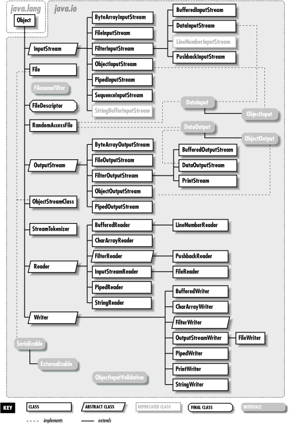
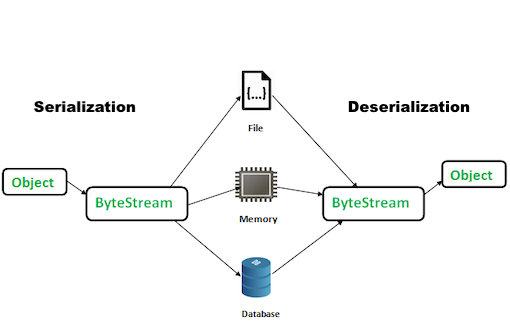
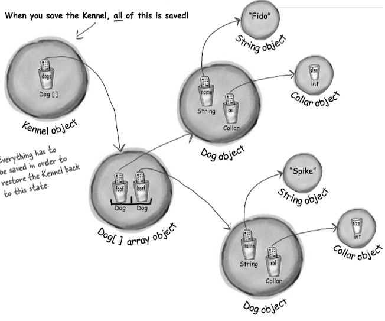
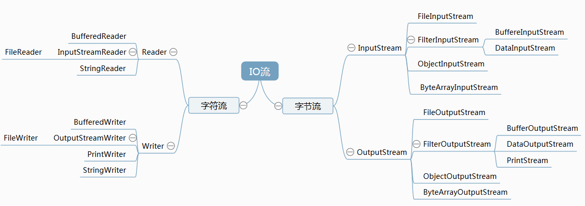
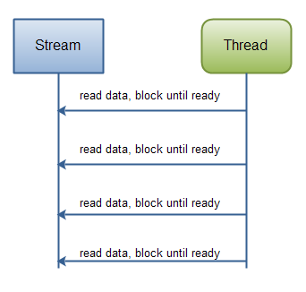
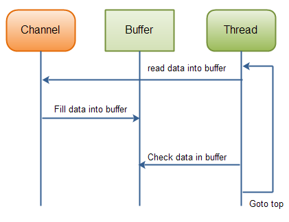
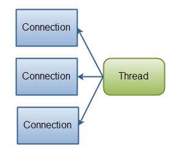
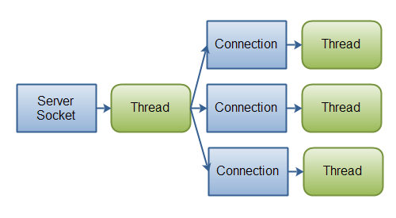

### Saving Objects

If your data will be used by only the Java program that generated it:

* Using **serialization**(序列化): Serialization is an (automatic) way to save and load the state of an object from a stream. The serialized object could then be stored in a file, database or sent over the network.
* The serialized file is much *harder for humans to read*, but it's *much easier (and safer)* to restore  objects from serialization.




If your data will be used by *other* programs:

* Write a **plain text file**(纯文本文件): Write a file, with delimiters that other programs can parse.

#### Writing a serialized object to a file

* Make a <C>FileOutputStream</C>
    * `:::Java FileOutputStream fileStream = new FileOutputStream("MyGame.ser");` 
* Make an <C>ObjectOutputStream</C>
    * `:::Java ObjectOutputStream os = new ObjectOutputStream(fileStream);`
* Write the object
    * `:::Java os.writeObject(characterOne);` 
    * Serializes the object referenced by character-One, and writes them to the file "myGame.ser".
* Close the <C>ObjectOutputStream</C>
    * `:::Java os.close();`
    * Closing the stream at the top closes the ones underneath, so the <C>FileOutputStream</C> (and the file) will close automatically.   


#### Streams

The Java I/O API has **connection streams**, that represent connections to destinations and sources such as files or network sockets, and **chain streams** that work only if chained to other streams.

* connection streams represent the connection (<C>FileOutputStream</C>)
* chain streams call methods on connection. (<C>ObjectOutputStream</C>)


* <C>FileOutputStream</C> writes bytes to a file.
* <C>ObjectOutputStream</C> turns objects into data that can be written to a stream.

> A <C>FileOutputStream</C> is an output stream for writing data to a File or to a <C>FileDescriptor</C>. 

!!! Note
    <C>FileOutputStream</C> is meant for writing streams of raw bytes. For writing streams of characters, consider using <C>FileWriter</C>.


#### Saving Serialized Objects

Serialization saves the entire **object graph**.

* When an object is serialized, all the objects it refers to from instance variables are *also* serialized.  



#### Implement Serializable

<b>If you want your class to be serializable, implement <i>{==Serializable==}</i>.</b>

* The <C>Serializable</C> interface is known as a *marker* or *tag* interface(标记接口), because the interface doesn't have any methods to implement.
* Its sole purpose is to announce that the class implementing it, is *serializable*.
* If any superclass of a class is serializable, the subclass is automatically serializable even if the subclass doesn't explicitly declare <C>implements Serializable</C>.

> A **marker interface** is an interface that contains NO method declarations, but merely designates (or "marks") a class that implements the interface as having some property. <small>[Effective Java, 2nd]</small>


The source file of `Serializable.java`:

```Java
public interface Serializable {
}
```

**Serialization is all or nothing**: Either the entire object graph is serialized correctly  or serialization fails.


```Java
import java.io.*;

public class Box implements Serializable {
    // No methods to implement, but when you say "implements Serializable",
    // it says to the JVM, "it's OK to serialize objects of this type."
    private int width;
    private int hight;

    public void setWidth(int w) {
        width = w;
    }

    public void setHight(int h) {
        hight = h;
    }

    public static void main(String[] args) {
        Box box = new Box();
        box.setHight(5);
        box.setWidth(6);
        try {
            FileOutputStream outputStream = new FileOutputStream("foo.ser");
            ObjectOutputStream os = new ObjectOutputStream(outputStream);
            os.writeObject(box);
            os.close();
        } catch (IOException ex) {
            ex.printStackTrace();
        }
    }// end main
}// end class Box
```


#### transient

<C>transient</C> is a variables modifier used in serialization:

<b>Mark an instance variable as <i>{==transient==}</i> if it can't (or shouldn't) be saved.</b>

```Java
import java.net.*;
class Chat implements Serializable {
    // transient says, 
    // "don't save this variable during serialization, just skip it".
    transient String currentID;
    
    String userName;
    //more code
}
```

> Variables may be marked **transient** to indicate that they are not part of the persistent state of an object. <small>[Java Language Specification, Java SE 7 Edition, Section 8.3.1.3. transient Fields]</small>

!!! Note
    If you serialize an object, a transient reference instance variable will be brought back as *null*, regardless of the value it had at the time it was saved.
    
!!! Question
    What happens if two objects in the object graph are the same object?
        
    In that case, *only one* of the objects is saved, and during deserialization, any references to that single object are restored.
    
#### Deserialization

**Deserialization**(反序列化) is a lot like **serialization**(序列化) in reverse.


* Make a <C>FileInputStream</C>
    * `:::Java FileInputStream fileStream = new FileInputStream("MyGame.ser");`
* Make an <C>ObjectInputStream</C>
    * `:::Java ObjectInputStream os = new ObjectInputStream(fileStream);`
* Read the object
    * `:::Java Object one = os.readObject();`
    * Each time you say <C>readObject()</C>, you get the next object in the stream. So you'll read them back in the same order in which they were written.
* Cast the objects
    * `:::Java GameCharacter elf = (GameCharacter) one;`
    * The return value of <C>readObject()</C> is type <C>Object</C>, so you have to *cast* it back to the type you know it really is.
* Close the <C>ObjectInputStream</C>
    * `:::Java os.close();` 
    * Closing the stream at the top closes the ones underneath, so the <C>FileInputStream</C> and the file will close automatically.


What happens during deserialization?

* The object is **read** from the stream.
* The JVM determines (through info stored with the serialized object) the object’s **class type**.
* The JVM attempts to **find** and **load** the object’s class. If the JVM can’t find and/or load the class, the JVM throws an exception and the deserialization fails.
* A new object is given space on the heap, but **the serialized object’s constructor does NOT run**! Obviously, if the constructor ran, it would restore the state of the object back to its original 'new' state, and that’s not what we want. We want the object to be restored to the state it had when it was serialized, not when it was **first** created.
* If the object has a non-serializable class somewhere up its inheritance tree, the constructor for that non-serializable class will run along with any constructors above that (even if they’re serializable). Once the constructor chaining begins, you can’t stop it, which means all superclasses, beginning with the first non-serializable one, will reinitialize their state.
* The object’s instance variables are given the values from the serialized state. Transient variables are given a value of null for object references and defaults (0, false, etc.) for primitives.

!!! note
    Static variables are **NOT** serialized. Static means "one per class" not "one per object". When an object is deserialized, static variables will have whatever static variable its class *currently* has.


#### serialVersionUID

**Question**: What might happen if you **change the class** and want to deserialize the object?

**Result**: It may throw an <C>InvalidClassException</C>.

Changes to a class that can hurt deserialization:

* Deleting an instance variable
* Change the declared type of an instance variable
* Changing a non-transient instance variable to transient
* Moving a class up or down the inheritance hierarchy
* Changing a class from Serializable to not Serializable.
* Changing an instance variable to static.

Each time an object is serialized, the object (including every object in its graph) is 'stamped' with a version ID number for the object's class. The ID is called **serialVersionUID**.

> The serialization runtime associates with each serializable class a version number, called a <C>serialVersionUID</C>, which is used during deserialization to verify that the sender and receiver of a serialized object have loaded classes for that object that are *compatible* with respect to serialization. If the receiver has loaded a class for the object that has a different <C>serialVersionUID</C> than that of the corresponding sender's class, then deserialization will result in an `InvalidClassException`. <small>[Java Docs]</small>

**SOLUTION TO THE QUESTION**: ***If you think there is ANY possibility that your class might evolve, put a serialVersionUID in your class.***

* As the class evolves, the <C>serialVersionUID</C> will remain the same and the JVM thinks the class is compatible with this serialized object.

> If a serializable class does *not* explicitly declare a <C>serialVersionUID</C>, then the serialization runtime will *calculate a default <C>serialVersionUID</C> value* for that class based on various aspects of the class. However, it is **strongly recommended that all serializable classes explicitly declare** <C>serialVersionUID</C> **values**, since the default <C>serialVersionUID</C> computation is highly sensitive to class details that may vary depending on compiler implementations, and can thus result in unexpected <C>InvalidClassExceptions</C> during deserialization. <small>[Java Docs]</small>


**HOW**?

A serializable class can declare its own <C>serialVersionUID</C> explicitly by declaring a field named "serialVersionUID" that must be **static**, **final**, and of type **long**:

```Java
ANY-ACCESS-MODIFIER static final long serialVersionUID = 42L;
```

### Writing Files

#### File Class

The <C>java.io.File</C> class *represents* a file on disk, but doesn't actually represent the *contents* of the file.

* Think of a File object as something more like a *pathname* of a file (or even a *directory*) rather than the Actual File Itself.

> <i><b>File</b></i> is an abstract representation of file and directory pathnames. <small>[Java docs]</small>


Some things you can do with a <C>File</C> object:

* Make a file Object representing an existing file
    * `:::Java File f = new File("Mycode.txt");`// not actually create a file
* Create a new, empty file
    * `:::Java File.createNewFile​("MyFile.txt")` 
* Make a new directory
    * `:::Java File dir = new File("Chapter7"); dir.mkdir();`
* List the contents of a directory

    ```Java
    if (dir.isDirectory()) {
        String[] dirContents = dir.list();
        for (int i=0; i < dirContents.length; i++) {
            System.out.println(dirContents[i]);
        }
    }
    ```
        
* Get the absolute path of a file or directory 
    * `:::Java System.out.println(dir.getAbsolutePath());`
* Delete a file or directory (returns true if successful)
    * `:::Java boolean isDeleted = f.delete();` 

#### Writing to a plain text file

To write a string: `:::Java FileWriter.write("My first String to save")`

```Java
import java.io.*; 

class WriteAFile {

    public static void main (String[] args) { 
        try { 
            // If the file "foo.txt" does not exist, FileWriter will create it.
            FileWriter writer = new FileWriter(“Foo.txt”);
            // The write() method takes a String  
            writer.write(“hello foo!”); 
            // Close it when you're done!
            writer.close(); 
        } catch(IOException ex) { 
            ex.printStackTrace(); 
        }
    }
}
```


#### Buffer

Buffers are *much* more efficient than working without them.

```Java
BufferedWriter writer = new BufferedWriter(new FileWriter(aFile));
```


* <C>FileWriter</C> writes each and every thing you pass to the file each and every time.
* <C>BufferedWriter</C> will hold all the stuff you write to it until it's full. **Only then the buffer is full will the FileWriter actually be told to write to the file on disk**.
    * If you do want to send data *before* the buffer is full, **Just Flush It**(`writer.flush()`).


### Reading Files

* Usually, we use a <C>File</C> Object to represent a file, a <C>FileReader</C> to do the actual reading, and a <C>BufferedReader</C> to make the reading more efficient.

```Java
import java.io.BufferedReader;
import java.io.File;
import java.io.FileReader;

public class ReadAFile {
    public static void main (String[] args){
        try{
            File myFile = new File("Foo.text");
            // A FileReader is a connection stream for characters, that connects to a text file.
            FileReader fileReader = new FileReader(myFile);
            //Chain the FileReader to a BufferedReader for more efficient reading.
            BufferedReader reader = new BufferedReader(fileReader);

            // Make a String variable to hold each line as the line is read.
            String line = null;

            while ((line = reader.readLine())!=null) {
                System.out.println(line);
            }
            reader.close();
        } catch (Exception ex) {
            ex.printStackTrace();
        }
    }
}
```

### 字节流/字符流

在java.io包中流的操作主要有**字节流**(byte streams)、**字符流**(character streams)两大类，并且两个都具备输入输出的操作。InputStream和OutputStream属于字节流，Reader和Writer属于字符流。

[对比](https://stackoverflow.com/questions/3013996/byte-stream-and-character-stream)：字节流一个字节一个字节访问文件。字节流适合于任何文件，除了文本文件。例如，当文件的字符使用两个字节的unicode编码时，字节流会分开对待每个字符，需要手动转换。而字符流一个字符一个字符访问文件。字符流需要指定文件编码才能正确访问。



### Java NIO

When studying both the Java NIO and IO API's, a question quickly pops into mind:

When should I use IO and when should I use NIO?

| IO | NIO |
| --- | --- |
| Stream oriented | Buffer oriented |
| Blocking IO | Non blocking IO |
| | Selectors |

#### Main Differences of NIO and IO

[[Java NIO vs. IO](https://dzone.com/articles/java-nio-vs-io)，[翻译](http://ifeve.com/java-nio-vs-io/)]

**Stream Oriented vs. Buffer Oriented**

The first big difference between Java NIO and IO is that IO is stream oriented(面向流), where NIO is buffer oriented(面向缓冲). 

Java IO being stream oriented means that you read one or more bytes at a time, from a stream. What you do with the read bytes is up to you. They are not cached anywhere. Furthermore, you cannot move forth and back in the data in a stream. If you need to move back and forth in the data read from a stream, you will need to cache it in a buffer first.

Java NIO's buffer oriented approach is slightly different. Data is read into a buffer from which it is later processed. You can move forth and back in the buffer as you need to. This gives you a bit more flexibility during processing. However, you also need to check if the buffer contains all the data you need in order to fully process it. And, you need to make sure that when reading more data into the buffer, you do not overwrite data in the buffer you have not yet processed.


**Blocking vs. Non-blocking IO**

Java IO's various streams are blocking. That means, that when a thread invokes a read() or write(), that thread is blocked until there is some data to read, or the data is fully written. The thread can do nothing else in the meantime.

Java IO: Reading data from a blocking stream.




Java NIO's non-blocking mode enables a thread to request reading data from a channel, and only get what is currently available, or nothing at all, if no data is currently available. Rather than remain blocked until data becomes available for reading, the thread can go on with something else.

The same is true for non-blocking writing. A thread can request that some data be written to a channel, but not wait for it to be fully written. The thread can then go on and do something else in the mean time.

What threads spend their idle time on when not blocked in IO calls, is usually performing IO on other channels in the meantime. That is, a single thread can now manage multiple channels of input and output.



If you need to manage thousands of open connections simultaneously, which each only send a little data, for instance a chat server, implementing the server in NIO is probably an advantage. Similarly, if you need to keep a lot of open connections to other computers, e.g. in a P2P network, using a single thread to manage all of your outbound connections might be an advantage. This one thread, multiple connections design is illustrated in this diagram:



If you have fewer connections with very high bandwidth, sending a lot of data at a time, perhaps a classic IO server implementation might be the best fit. This diagram illustrates a classic IO server design:




**Selectors**

Java NIO's selectors(选择器) allow a single thread to monitor multiple channels of input. You can register multiple channels with a selector, then use a single thread to "select" the channels that have input available for processing, or select the channels that are ready for writing. This selector mechanism makes it easy for a single thread to manage multiple channels.

#### NIO Channel

Java NIO Channels are similar to streams with a few differences:

* You can both read and write to a Channels. Streams are typically one-way (read or write).
* Channels can be read and written asynchronously.
* Channels always read from, or write to, a Buffer.


Here are the most important Channel implementations in Java NIO:

* <C>FileChannel</C> reads data from and write to files.
* <C>DatagramChannel</C> can read and write data over the network via UDP.
* <C>SocketChannel</C> can read and write data over the network via TCP.
* <C>ServerSocketChannel</C> allows you to listen for incoming TCP connections, like a web server does. For each incoming connection a <C>SocketChannel</C> is created.

```Java
RandomAccessFile aFile = new RandomAccessFile("data/nio-data.txt", "rw");
FileChannel inChannel = aFile.getChannel();

ByteBuffer buf = ByteBuffer.allocate(48);

int bytesRead = inChannel.read(buf);
while (bytesRead != -1) {

      System.out.println("Read " + bytesRead);
      buf.flip();

      while(buf.hasRemaining()){
          System.out.print((char) buf.get());
      }

      buf.clear();
      bytesRead = inChannel.read(buf);
}
aFile.close();
```
