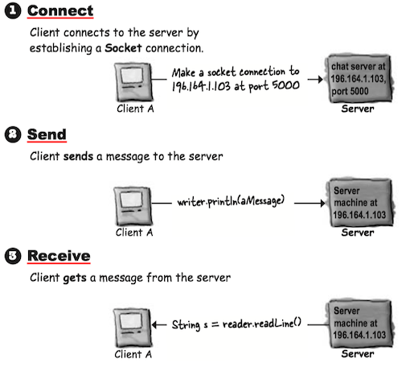
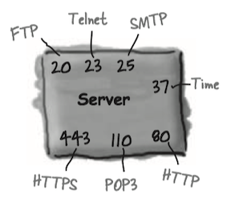
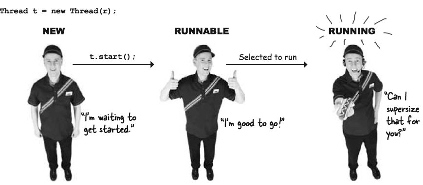
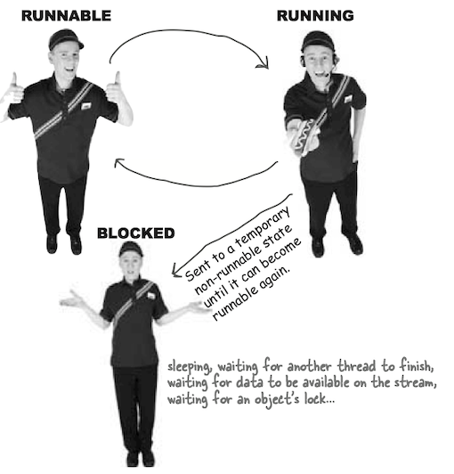
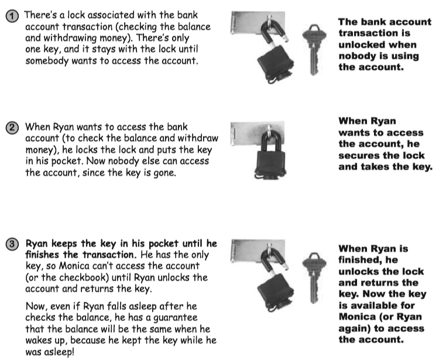

All the low-level networking details are taken care of by classes in the <C>java.net</C> library. One of Java's big benefits is that sending and receiving data over a network is just I/O with a slightly different connection stream at the end of the chain.


### 1 Socket Connections




#### Make a Network Socket Connection

To connect to another machine, We need a <C>Socket</C> connection. A <C>Socket</C> (<C>java.net.Socket</C>) is an object that represents a network connection between two machines. A connection is a *relationship* between two machines, where two pieces of software know about each other.

To make a Socket connection, you need to know two things about the server: who it is, and which port it’s running on. In other words, **IP address** and **TCP port number**.

```Java
// 196.164.1.103 is the IP address for the sever
// 5000 is TCP port number
Socket chatSocket = new Socket("196.164.1.103", 3000);
```

**A TCP port is just a 16-bit number that identifies a specific program on the server**.

The TCP port numbers from 0 to 1023 are reserved for well-known services. Don’t use them for your own server programs!

Well-known TCP port numbers for common server applications:



#### Reading/Writing From/To a Socket

**To read data from a <C>Socket</C>, use a <C>BufferedReader</C>**.

To communicate over a <C>Socket</C> connection, you use regular I/O streams. One of the coolest features in Java is that the most of you I/O work won't care what you high-level chain stream is actually connected to.


* Make a <C>Socket</C> connection to the server
    * `:::Java Socket chatSocket = new Socket("127.0.0.1", 3000);`
* Make an <C>InputStreamReader</C> chained to the <C>Socket</C>’s low-level (connection) input stream
    * `:::Java InputStreamReader stream = new InputStreamReader(chatSocket.getInputStream());`
* Make a <C>BufferedReader</C> and read!
    * `:::Java BufferedReader reader = new BufferedReader(stream);` 
    * `:::Java String message = reader.readLine();` 


**To write data to a Socket, use a <C>PrintWriter</C>**

* Make a <C>Socket</C> connection to the server
    * `:::Java Socket chatSocket = new Socket("127.0.0.1", 5000);`
* Make an <C>PrintWriter</C> chained to the <C>Socket</C>’s low-level (connection) input stream
    * `:::Java PrintWriter writer = new PrintWriter(chatSocket.getOutputStream());`
* Write (print) Something!
    * `:::Java writer.println("message to send);` 
    * `:::Java writer.print("another message");` 


#### Writing a client

* Client connects to the server and gets an input stream from it
    * `:::Java Socket socket = new Socket("127.0.0.1", 3000)`
    * `:::Java InputStreamReader streamReader = new InputStreamReader(socket.getInputStream());`
    * `:::Java BufferedReader reader = new BufferedReader(streamReader)`
* Client reads a message from the server
    * `:::Java message = reader.readLine();` 
  
  A simple demo program, which reads `index.html` from my personal blog "larryim.cc", is illustrated below. The format of HTTP Request is discussed in [CSAPP](../csapp/ch11.md/#5-web).

```Java
import java.io.BufferedReader;
import java.io.InputStreamReader;
import java.io.PrintWriter;
import java.net.Socket;

public class MyBlog {
    public void http_request(){
        try{
            Socket s = new Socket("192.30.252.153", 80);
            InputStreamReader streamReader = 
                new InputStreamReader(s.getInputStream());
            BufferedReader br = new BufferedReader(streamReader);

            //注意换行符是\r\n
            writer.println("GET /index.html HTTP/1.0 \r\n" 
                    + "Host: larryim.cc  \r\n   \r\n ");

            String line = null;
            while ((line= br.readLine())!= null)
                System.out.println(line);
            br.close();
        } catch (Exception ex){
            ex.printStackTrace();
        }
    }

    public static void main(String[] args){
        MyBlog client = new MyBlog();
        client.http_request();
    }
}
```
   
#### Writing a Simple Server

* Server application makes a ServerSocket, on a specific port
    * `:::Java ServerSocket serverSock = new ServerSocket(4242);`
* Client makes a Socket connection to the server application
    * `:::Java Socket sock = new Socket("190.165.1.103", 4242);`
* Server makes a new Socket to communicate with this client
    * `:::Java Socket sock = serverSock.accept();`
    
### 2 Threads

To make a thread, make a <C>Thread</C>. A <C>Thread</C> is a java class that represents a thread. You'll create an instance of class <C>Thread</C> each time you want to start up a new *thread* of execution.

A thread is a separate thread of execution. That means a separate stack. Remember, Java is just a process running on your underlying OS. **The JVM switches between the new thread (user thread) and the original main thread, until both threads complete**.

#### Launching a thread

* Make a <C>Runnable</C> object (the thread’s job)
    * `:::Java Runnable threadJob = new MyRunnable();`
    * <C>Runnable</C> is an interface you’ll learn about on the next page. You’ll write a class that implements the <C>Runnable</C> interface, and that class is where you’ll define the work that a thread will perform. In other words, the method that will be run from the thread’s new call stack.
* Make a <C>Thread object</C>(the worker) and give it a <C>Runnable</C>(the job)
    * `:::Java Thread myThread = new Thread(threadJob);`
    * Pass the new <C>Runnable</C> object to the <C>Thread</C> constructor. This tells the new <C>Thread</C> object which method to put on the bottom of the new stack—the <C>Runnable</C>’s <C>run()</C> method.
* Start the Thread
    * `:::Java myThread.start();`
    * Nothing happens until you call the <C>Thread</C>’s <C>start()</C> method. That’s when you go from having just a <C>Thread</C> instance to having a new thread of execution. When the new thread starts up, it takes the <C>Runnable</C> object’s <C>run()</C> method and puts it on the bottom of the new thread’s stack.

**<C>Runnable</C> is to a <C>Thread</C> what a job is to a worker**. A <C>Runnable</C> is the job a thread is supposed to run.
   
#### Runnable interface

To make a job for your thread, implement the <C>Runnable</C> interface.


```Java
// Runnable is in the java.lang package, so you don't need to import it.
public class RunThreads implements Runnable {

    @Override
    // Runnable has only one method to implement: public void run() (with no arguments)
    // This is where you put the JOB the thread is suposed to run.
    // This is the method that goes at the bottom of the new stack()
    public void run() {
        for (int i=0; i<20; i++){
            String threadName = Thread.currentThread().getName();
            System.out.println(threadName + " is running.");
        }
    }

    public static void main(String[] args){
        RunThreads jobs = new RunThreads();
        // Pass the new Runnable instance into the new Thread constructor.
        // This tells the thread what method to put on the bottom of the new stack.
        // In other words, the first method that the new thread will run.
        Thread threadA = new Thread(jobs);
        Thread threadB = new Thread(jobs);

        threadA.setName("Thread A");
        threadB.setName("Thread B");

        // You won't get a new thread of execution until you call start() on the Thread instance.
        threadA.start();
        threadB.start();

    }
}
```

**The three states of a new thread**:



Once the thread becomes runnable, it can move back and forth between runnable, running, and an additional state: temporarily not runnable (also known as 'blocked').

Typically, a thread moves back and forth between runnable and running, as the JVM thread scheduler selects a thread to run and then kicks it back out so another thread gets a chance.



A thread scheduler can move a running thread into a blocked state, for a variety of reasons. See [Understanding JVM](../ujvm/ch12.md/#_8).

#### Thread Scheduler

The thread scheduler makes all the decisions about who runs and who doesn’t.

Most importantly, there are no guarantees about scheduling! So DO NOT base your program's correctness on the scheduler working in a particular way! You multi-threaded program must work no matter *how* the thread scheduler behaves.

The thread's <C>sleep()</C> method does come with *one* guarantee: a sleeping thread will *not* become the currently-running thread before the length of its sleep time has expired.

!!! Note
    Another way of making a thread is to, make a subclass of <C>Thread</C> and override the <C>Thread</C>'s <C>run()</C> method, instead of <C>Runnable</C>  implementation. However, it's rarely a good idea - not a good OO design.

#### Lock

The lock works like this:




Use the <C>synchronized</C> keyword to modify a method so that only one thread at a time can access it. The <C>synchronized</C> keyword means that a thread needs a key in order to access the synchronized code.


Every Java object has a lock. A lock has only one key. Most of the time, the lock is unlocked and nobody cares. But if an object has <C>synchronized</C> methods, a thread can enter one of the synchronized methods ONLY if the key for the object’s lock is available. In other words, only if another thread hasn’t already grabbed the one key.

### 3 Example: A Simple ChatApp

```Java tab="Client"
public class ChatClient {
    JFrame frame;
    String out_message;     // message sent to a server
    ScrollPane scroll;
    JTextArea inMessage;      // incoming message from a server
    JTextField outTextField;
    JButton button;         // a button to send message
    PrintWriter writer;
    BufferedReader reader;
    Thread backgroundJob = new Thread(new ReceiveMessage());

    private void establishConnection() {
        try {
            Socket socket = new Socket("127.0.0.1", 3000);
            writer = new PrintWriter(socket.getOutputStream());
            InputStreamReader streamReader = 
                    new InputStreamReader(socket.getInputStream());
            reader = new BufferedReader(streamReader);
        } catch (IOException ex) {
            ex.printStackTrace();
        }
    }

    private void gui() {
        frame = new JFrame("Ludirously Simple Chat Client");

        inMessage = new JTextArea(7, 14);
        outTextField = new JTextField(18);
        button = new JButton("Send");
        button.setSize(300, 40);
        scroll = new ScrollPane();
        scroll.add(inMessage);
        inMessage.setLineWrap(true);
        frame.setDefaultCloseOperation(JFrame.EXIT_ON_CLOSE);

        frame.getContentPane().add(BorderLayout.NORTH, scroll);
        frame.getContentPane().add(BorderLayout.WEST, outTextField);
        frame.getContentPane().add(BorderLayout.EAST, button);
        button.addActionListener(new ButtonListener());
        frame.setSize(300, 200);
        frame.setVisible(true);
    }


    class ButtonListener implements ActionListener {

        @Override
        public void actionPerformed(ActionEvent e) {
            out_message = outTextField.getText();
            outTextField.setText("");
            outTextField.requestFocus();
            writer.println(out_message);
            writer.flush();
        }
    }


    class ReceiveMessage implements Runnable {

        @Override
        public void run() {
            while (true) {
                String line = null;
                try {
                    while ((line = reader.readLine())!= null) {
                        inMessage.append(line);
                    }
                } catch (IOException ex) {
                    ex.printStackTrace();
                }
            }// end while
        } // end run
    } // end class

    public void start() {
        gui();
        establishConnection();
        backgroundJob.start();


    }

    public static void main(String[] args){
        ChatClient client = new ChatClient();
        client.start();
    }


}
```

```Java tab="Server"
public class ChatServer{
    ArrayList clientOutputStreams;
    
    public class ClientHandler implements Runnable {
        BufferedReader reader;
        Socket sock;
        
        public ClientHandler(Socket clientSocket) {
            try {
                sock = clientSocket;
                InputStreamReader isReader = 
                    new InputStreamReader(sock.getInputStream());
                reader = new BufferedReader(isReader);
                
            } catch (Exception ex) { ex.printStackTrace(); }
        }
        
        public void run() {
            String message;
            try {
                while ((message = reader.readLine()) != null) {
                    System.out.println("read " + message);
                    tellEveryone(message);
                }
            } catch (Exception ex) { ex.printStackTrace(); }
        }
    }
    
    public static void main(String[] args) {
        new ChatServer().go();
    }
    
    public void go() {
        clientOutputStreams = new ArrayList();
        try {
            ServerSocket serverSock = new ServerSocket(3000);
            while(true) {
                Socket clientSocket = serverSock.accept();
                PrintWriter writer = 
                    new PrintWriter(clientSocket.getOutputStream());
                clientOutputStreams.add(writer);
                
                Thread t = new Thread(new ClientHandler(clientSocket));
                t.start();
                System.out.println("got a connection");
            }
        } catch (Exception ex) { ex.printStackTrace(); }
    }
    
    public void tellEveryone(String message) {
        Iterator it = clientOutputStreams.iterator();
        while (it.hasNext()) {
            try {
                PrintWriter writer = (PrintWriter) it.next();
                writer.println(message);
                writer.flush();
            } catch (Exception ex) { ex.printStackTrace(); }
        }
    }
}
```