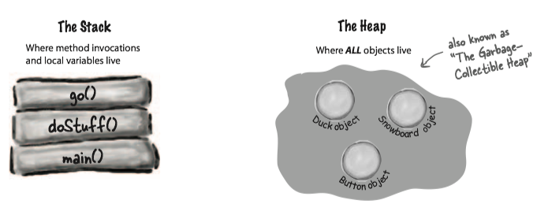
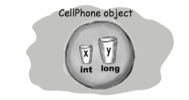
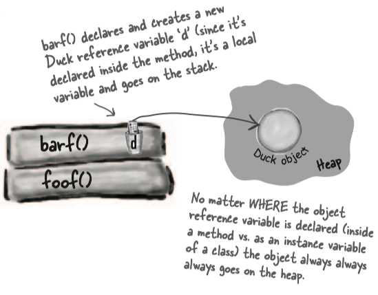
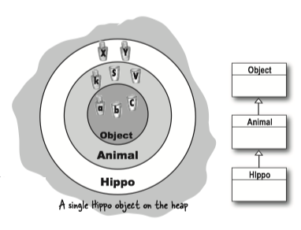
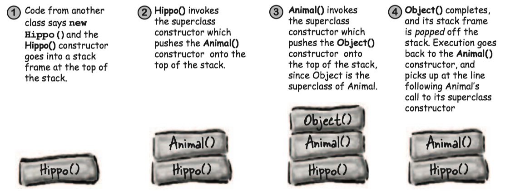

### 1 Stack and Heap

In Java, programmers care about two areas of memory

* heap: where objects live
* stack: where method invocations and local variables live




**Instance variables**(实例变量) are declared inside a *class* but not inside a method. Instance variables live inside the object they belong to. So instance variable live on the Heap, inside the object.



**Local variables**(局部变量) are declared inside a *method*, including method parameters. They're temporary, and live only as long as the method is on the stack.

What about local variables that are objects?

***If the local variable is a reference to an object, only the variable (the reference/remote control) goes on the stack.***

```Java
public class StackRef {
    public void foof() {
     barf();
    }
    
    public void barf() {
        Duck d = new Duck(24);
    }
}
```



### 2 Constructor

**Constructor**(构造函数) is _*the code that runs when you instantiate an object*_ . They only way to invoke a constructor is with the keyword **`new`** followed by the class name.

You can write a constructor for your class, but if you don't the ***compiler writes one for you*** !

Here is what the compiler default constructor looks like:

```Java
public Duck(){

}
```

A constructor does look and feel a lot like a method, but it's *not* a method. How is it different from a method?

* A constructor's name is the same as the class name. That's mandatory.
* Constructors have no return type, while a method need a return type.

!!! note
    * Java lets you declare a method with the same name as your class. The thing that separates a method from a constructor is **the return type**.
    * Constructors are **not inherited**.

The key feature of a constructor is that it runs ***before*** the object can be assigned to a reference.

#### Initializing the state of an object

Most people use constructors to initialize the state of an object. In other words, to make and assign values to the object's instance variables. 

And all you need to do is make a constructor with arguments:

```Java
public class Duck {
    int size;
    // Add an int parameter to the Duck constructor
    public Duck(int duckSize) {
        System.out.println("Quack");
        // use the argument value to set the size instance variable.
        size = duckSize;
        System.out.println("size is " + size);
    }
    
    public Duck() {
        //supply default size
        size = 27;
    }
}

public class UseADuck {
    public static void main(String[] args) {
        // Pass a value to the constructor
        Duck d = new Duck(42);
    }
}
```

If you have more than one constructor in a class, it means you have ***overloaded*** constructors. **The constructors MUST have different arguments lists**. Different arguments lists means different variable *type*(int, Dog, etc.) and *order*.

If you write a constructor that takes arguments, and you still want a no-arg constructor, you'll have to build the no-arg constructor yourself! Because the compiler won't make a default constructor if you have any constructors.

#### constructor chaining

When an object is created, the object gets space for *all* instance variables, from all the way up the inheritance tree.

***All the constructors in an object's inheritance tree must run when you make a new object.*** When a constructor runs, it immediately calls its superclass constructor, all the way up the chain until you get to the class `Object` constructor (called **constructor chaining**(构造函数链)).


eg. A new Hippo object also IS-A Animal and IS-A Object. If you want to make a Hippo, you must also make the Animal and Object parts of the Hippo.



```Java
public class Animal { 
    public Animal() { 
        System.out.println(“Making an Animal”); 
    } 
}

public class Hippo extends Animal { 
    public Hippo() { 
        System.out.println(“Making a Hippo”); 
    }
}

public class TestHippo {
    public static void main (String[] args { 
        System.out.println(“Starting...”); 
        Hippo h = new Hippo(); 
        }
}
```



#### invoke a superclass constructor

The only way to call a superclass constructor is by calling `**super()`**.

```Java
public class Duck extends Animal {
    int size;
    
    public Duck(int newSize) {
        super();
    }
}
```

A call to `super()` in your constructor puts the superclass constructor on the top of the Stack. And that superclass constructor calls its superclass constructor. And so it goes until the Object constructor is on the top of the Stack. Once `Object()` finishes, it's popped off the Stack and goes until the original constructor is on the top of the Stack.

!!! note
    The compiler will put a call to `super()` in **each** of your overloaded constructors, if you do *not* have calls to `super()`.

***The superclass parts of an object have to be fully-formed (completely built) before the subclass parts can be constructed.*** So the call to `Super()` must be  the *first* statement in each constructor!

#### `this`

`this` is a **reference** to *the current object*.  

* `this()` calls the real constructor and let the real constructor finish the job of construction.
* The call to `this()` can be used only in a constructor, and must be the ***first*** statement in a constructor.
* A constructor can have a call to `super()` or `this()`, but never both!


```Java
class Mini extends Car {
    Color color;
    public Mini() { 
        // The no-arg constructor supplies a default Color
        // and calls the overloaded Real Constructor 
        // (the one that calls super())
        this(Color.Red);
    }

    public Mini(Color c) { 
        // The is the Real Constructor that does the real work 
        // of initializing the object
        super(“Mini”);   
        color = c; 
        // more initialization 
    }

    public Mini(int size) { 
        // Won't work!! 
        // Can't have super() and this() in the same constructor
        // because they each must be the first statement!
        this(Color.Red); 
        super(size);
    }
}
```

### 3 Object lifespan

An Object's life depends entirely on the life of references referring to it.

* If the reference is considered "alive", the object is still alive on the Heap.
* If the reference dies, the object will die.

So if an object's life depends on the reference variable's life, how long does a variable live?

* A _local_ variable lives only within the method that declared the variable.
* An _instance_ variable lives as long as the object does. If the object is still alive, so are its instance variables.


The difference between **life** and **scope** for local variables:

* **Life**: a local variable is alive as long as its Stack frame is  on the Stack.
* **Scope**: a local variable is in *scope* only within the method in which the variable was declared. You can use a variable only when it is in scope.

#### Object lifecycle

An object's life has no value, no meaning, no point, unless somebody has a reference to it. Because if you can't get to it, you can't ask it to do anything and it's just a big fat waste of bits.

An object becomes eligible for Garbage Collector(垃圾收集器) when its last live reference disappear.

Object-killer

* Reference goes out of scope, permanently.
* Assign the reference to another object.
* Explicitly set the reference to null.