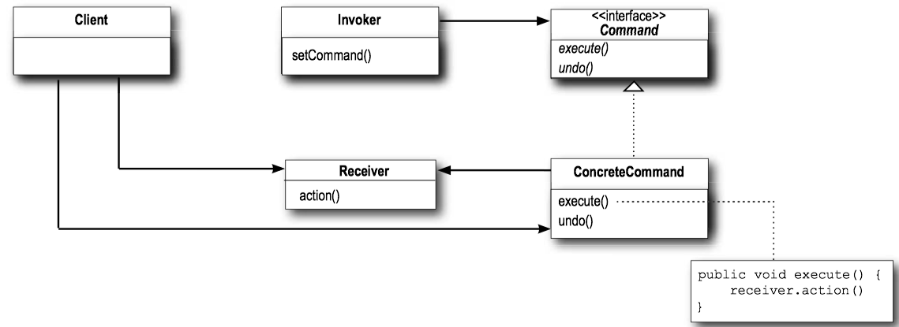
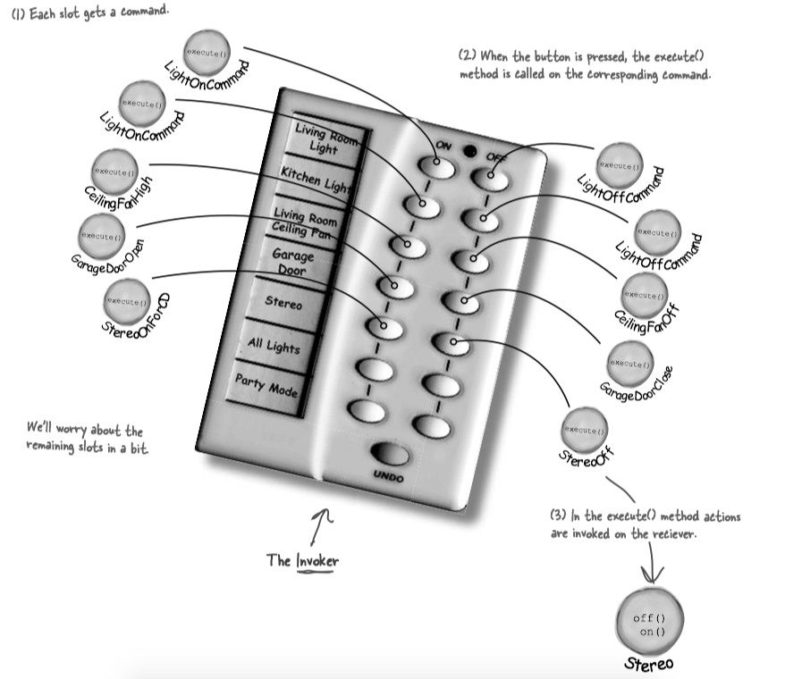
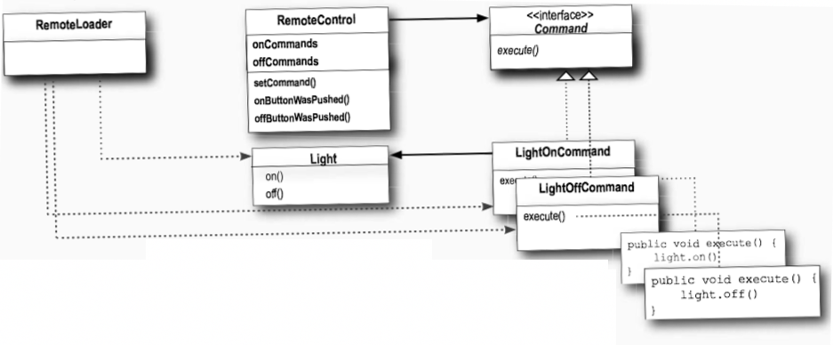

#### Definition

> The Command Pattern(命令模式) encapsulates a request as an object, thereby letting you parameterize other objects with different requests, queue or log requests, and support undoable operations.


#### Class Diagram

The class diagram:



* The <C>Client</C> is responsible for creating a <C>ConcreateCommand</C> and setting its <C>Receiver</C>.
* The <C>Receiver</C> knows how to perform the work needed to carry out the request. Any class can act as a <C>Receiver</C>.
* <C>Command</C> declares an interface for all commands. A command is invoked through its <C>execute()</C> method, which asks a receiver to perform an action.
* The <C>Invoker</C> holds a command and at some point asks the command to carry out a request by calling its <C>execute</C> method.


#### Example - Remote control

The remote control is our <C>Invoker</C>. When a button is pressed, the <C>execute()</C> method is going to be called on the corresponding command, which results in actions being invoked on the receiver (like lights, celling fans).







* The <C>RemoteLoader</C> creates a number of <C>Command</C> Objects that are loaded into the slots of the Remote Control. Each command object encapsulates a request of a home automation device.
* The <C>RemoteControl</C> manages a set of <C>Command</C> objects, one per button. When a button is pressed, the corresponding <C>ButtonWasPushed</C> method on the command. 
* All <C>RemoteControl</C> commands implement the <C>Command</C> interface, which consists of one method: <C>execute</C>. <C>Commands</C> encapsulates a set of actions on a specific vendor class. The remote invokes these actions by calling the <C>execute()</C> method.

```Java tab="Command"
public interface Command {
    public void execute();
    public void undo();
}

public class LightOffCommand implements Command{
    private Light light;
    public LightOffCommand (Light light) {
        this.light = light;
    }
    public void execute () {
        light.off();
    }
    public void undo() {light.on();}

}

public class LightOnCommand implements Command {
    private Light light;
    public LightOnCommand (Light light) {
        this.light = light;
    }
    public void execute () {
        light.on();
    }
    public void undo() {light.off();}
}

public class NoCommand implements Command {
    public NoCommand() { }

    @Override
    public void execute() { }

    @Override
    public void undo() { }
}

```

```Java tab="RemoteControl"
public class RemoteControl {
    private final int NUMSLOT = 7;
    private Command[] onCommands;
    private Command[] offCommands;
    private Command undoCommand;

    public RemoteControl() {
        onCommands = new Command[NUMSLOT];
        offCommands = new Command[NUMSLOT];

        for (int i=0; i< NUMSLOT; i++) {
            onCommands[i] = new NoCommand();
            offCommands[i] = new NoCommand();
        }
        undoCommand = new NoCommand();
    }

    public void setCommand (int slot, 
        Command onCommand, Command offCommand) {
        onCommands[slot] = onCommand;
        offCommands[slot] = offCommand;
    }

    public void onButtonWasPushed(int slot) {
        onCommands[slot].execute();
        undoCommand = onCommands[slot];
    }

    public void offButtonWasPushed(int slot) {
        offCommands[slot].execute();
        undoCommand = offCommands[slot];
    }

    public void undoButtonWasPushed() {
        undoCommand.undo();
    }

    public String toString() {
        StringBuilder descritption = new StringBuilder();
        descritption.append("\n------ Remote Control -------\n");
        for (int i = 0; i < NUMSLOT; i++) {
            descritption.append("[slot " + i + "] " + onCommands[i].getClass().getSimpleName()
         + " " + offCommands[i].getClass().getSimpleName() + "\n");
        }
        return descritption.toString();

    }
}
```

```Java tab="RemoteLoader"
public class RemoteLoader {
    public static void main(String[] args) {
        Light light = new Light();
        Stereo stereo = new Stereo();
        RemoteControl remoteControl = new RemoteControl();

        remoteControl.setCommand(0, 
                new LightOnCommand(light), new LightOffCommand(light));
        remoteControl.setCommand(1, new StereoOnWithCDCommand(stereo), 
                new StereoOffWithCDCommand(stereo));

        System.out.println(remoteControl);
        remoteControl.onButtonWasPushed(0);
        remoteControl.offButtonWasPushed(0);
        remoteControl.undoButtonWasPushed();
    }
}
```


#### Example - Runnable

Runnable interface uses command pattern. It allows the thread pool to execute the command even though the thread pool class itself was written without any knowledge of the specific tasks for which it would be used.

```Java tab="Runnable"

public interface Runnable {
    public abstract void run();
}

public interface Executor {
    void execute(Runnable command);
}

class SerialExecutor implements Executor {
    private final Queue<Runnable> tasks = new ArrayDeque<>();
    private final Executor executor;
    private Runnable active;
 
    SerialExecutor(Executor executor) {
      this.executor = executor;
    }

    public synchronized void execute(Runnable r) {
      tasks.add(() -> {
        try {
          r.run();
        } finally {
          scheduleNext();
        }
      });
      if (active == null) {
        scheduleNext();
      }
    }
 
    protected synchronized void scheduleNext() {
      if ((active = tasks.poll()) != null) {
        executor.execute(active);
      }
    }
}

```