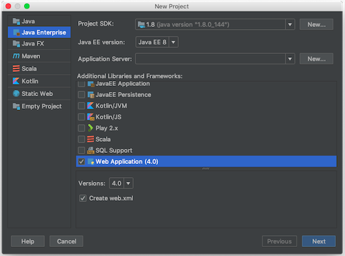
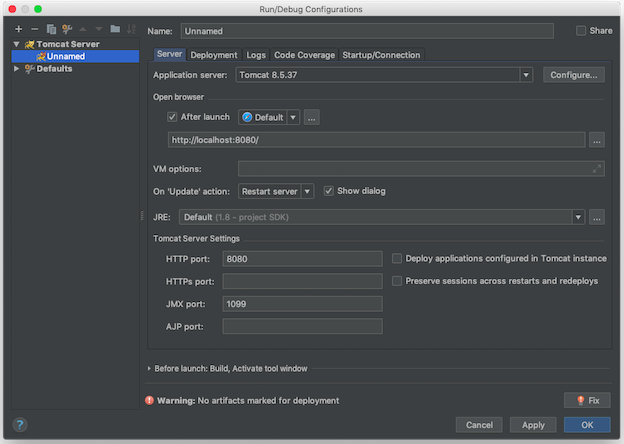

https://www.cnblogs.com/doit8791/p/4211936.html

1、原始的web页面是HTML，原始的JAVA是用作嵌入式开发的。

2、由于静态页面不会动态的更新信息，需要动态显示。java产生的servlet规范，可以动态的生成页面。

3、由于servlet生成页面需要手工写很多不友好且重复的输出语句，发展了JSP规范来辅助servlet支持生成页面。

4、由于jsp结合servlet开发的系统后期非常不便于维护、并且不能对很多重复代码公用，产生了MVC架构，对系统进行划分层次化。

5、基于对MVC的支持产生了Struts框架,Struts框架使控制层和展示层能够更加简便的通信交互。

6、Spring通过IOC容器，使系统模块间、类之间的调用实现了解耦，同时支持的AOP切面编程可以把一个层次的共性代码形成切面，通过配置方式切入到业务层。

#### Java Web


Java Web是用Java技术来解决相关web互联网领域的技术总称。

* 需要在特定的web服务器上运行，分为web服务器和web客户端两部分。
* 跨平台，能够在多个不同平台下布署与运行。 

需要会哪些技术 需要会哪些技术？

* 基于页面的前端技术，如HTML, CSS, JavaScript, JQuery等。
* 动态语言技术，如Java, JSP等。
* 数据库的技术，如Oracle, MySQL, SqlServer等。
* 其他工具与组件，如服务器，SSM，SSH框架等。 

Java Web应用场景：淘宝，12306

1：高并发
2：数据量大
3：软件与硬件成本高 


#### JSP简介

JSP全名为Java Server Pages，中文名叫Java服务器页面，其根本是一个简化的Servlet设计。

JSP是在传统的网页HTML文件中插入Java程序段(Scriptlet)和JSP标记(tag)，从而形成JSP文件，后缀名为(*.jsp)。

用JSP开发的Web应用是跨平台的，既能在Linux下运行，也能在其他操作系统上运行。 

#### JSP与Servlet的不同

JSP在本质上就是SERVLET, 但JSP是Servlet的一种简化，JSP由HTML代码和JSP标签构成，可以方便地编写动态网页。

Servlet完全是由JAVA程序代码构成流程控制和事务处理。

Servlet的应用逻辑是在Java文件中，并且完全从表示层中的HTML里分离开来。JSP侧重于视图，Servlet主要用于控制逻辑。 

#### 开发环境准备

* IntelliJ IDEA
* JDK 1.8
* Apache-tomcat-8.0.35

下面简单描述下安装apache tomcat的过程：

* 官网下载地址：http://tomcat.apache.org/download-80.cgi
* 环境变量：设置`CATALINA_HOME`环境变量为Tomcat包的根目录。
* 启动tomcat: `./startup.sh`

登入首页：输入http://localhost:8080/即可！


选择IntelliJ IDEA的Preference | Application Servers, 选择右侧➕，添加tomcat根目录


#### 创建Web应用

在配置完IDEA以后，就可以开始创建Web应用了。 可以参考[IntelliJ IDEA官方文档](http://www.jetbrains.com/help/idea/enabling-web-application-support.html)


当创建项目时，选择Java Enterprise, 然后在Additional Libraries and Frameworks下勾选Web Application。


另外，在File | Project Structure | Modules右侧dependencies选项卡中添加Tomcat依赖。

选择Run | Edit Configures, 在左侧点击加号➕，添加Tomcat Server配置，选择Local，


在右侧Deployment选项卡中，点击加号➕，添加部署。


接下来就可以运行了，选择Run | index.jsp，完成以后，浏览器会自动打开。


#### 完整的JSP程序


1. 客户端发出请求(request)，请求访问JSP网页
2. 服务器读取请求
3. JSP Container将jsp转化为Servlet源代码(`.java`)
4. web容器将转化为servlet代码编译(`.class`)
5. web容器加载编译后的代码并执行
6. 将执行结果响应给客户端


### JSP基本语法

任何语言都有自己的语法，JAVA中有，JSP虽然是在JAVA上的一种应用，但是依然有其自己扩充的语法，而且在JSP中，所有的JAVA语句都可以使用。

参考资料：[JSP 语法](http://www.runoob.com/jsp/jsp-syntax.html)

JSP脚本、声明、表达式、注释的使用方法如下，需要注意是否使用分号。

```JSP
<%            代码片段;                 %>
<%!     JSP声明，用来声明变量、方法;       %>
<%=               表达式                %>
<%--             JSP注释              --%>
```

控制流语句

```JSP
<h3>IF...ELSE 实例</h3>
<% if (day == 1 | day == 7) { %>
      <p>今天是周末</p>
<% } else { %>
      <p>今天不是周末</p>
<% } %>
```

### JSP隐式对象

请求与响应模式


在JSP中如何获取请求和响应对象？请求与响应对象是通过内置对象存在的。

JSP隐式对象(共9个):不需要预先声明就可以在脚本代码和表达式中使用。

为什么要使用内置对象：提高开发效率

参考资料: [JSP隐式对象](http://www.runoob.com/jsp/jsp-implicit-objects.html)

| 隐式对象 | 描述 |
| --- | --- |
| request |	HttpServletRequest 接口的实例 |
| response |	HttpServletResponse 接口的实例 |
| out |	JspWriter类的实例，用于把结果输出至网页上 |
| session |	HttpSession类的实例 |
| application |	ServletContext类的实例，与应用上下文有关 |
| config |	ServletConfig类的实例 |
| pageContext |	PageContext类的实例，提供对JSP页面所有对象以及命名空间的访问 |
| page |	类似于Java类中的this关键字 |
| Exception |	Exception类的对象，代表发生错误的JSP页面中对应的异常对象 |