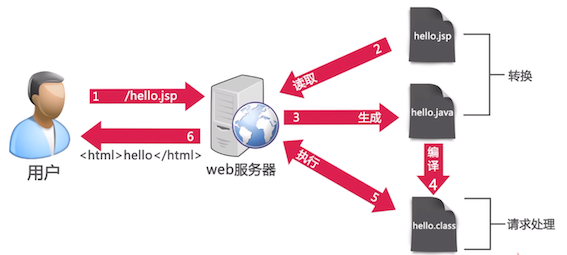
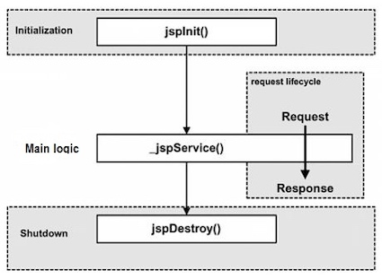

### 1 JSP简介

JSP全名为Java Server Pages，中文名叫**Java服务器页面**，其根本是一个简化的Servlet设计。JSP通过在传统的网页HTML文件中插入Java程序片段(Scriptlet)和JSP标记(tag)，从而形成JSP文件，后缀名为`.jsp`。用JSP开发的Web应用是跨平台的，既能在Linux下运行，也能在其他操作系统上运行。 


!!! note "JSP和Servlet"
    JSP不是Servlet。JSP是动态生成的网页，而servlet是运行在服务器上的Java类。但是JSP引擎会将JSP转化成Java源代码，再编译成一个完成的Java Servlet类(转化具体过程可见[Translation into Servlets](http://cs.au.dk/~amoeller/WWW/jsp/translation.html)）。

#### JSP程序的执行过程




1. 客户端发出请求(request)，请求访问JSP网页
2. Web容器(Tomcat)把访问请求交给JSP引擎处理
3. 每个JSP页面在第一次被访问时，JSP引擎先将JSP页面转化为Servlet源代码(`.java`)，接着再编译为class类文件(`.class`)，然后再由Web容器像调用普通Servlet程序一样的方式来装载和解释执行。
4. 将执行结果响应给客户端

#### JSP程序的生命周期

既然JSP最终会变成一个Servlet，那么它的生命周期就和一般的Servlet类似：



* 查看指令，得到转换时可能需要的信息
* 创建一个`HttpJspBase`子类
* 如果一个page指令有import属性，它会在类文件的最上面写import语句
* 如果有声明，将声明写到类文件中，通常放在类声明下面，并在服务方法前面。
* 建立服务方法`_jspService()`, 由servlet超类被覆盖的`service()`方法调用，并初始化所有隐式对象。
* 将普通的HTML、scriptlet和表达式放到服务方法中，完成格式化，并写至PrintWriter输出。


`jspInit()`方法由Servlet的init方法调用，`jspDestroy()`由destroy方法调用，`_jspService()`由service方法调用。

!!! example "_jspService"
    下面是一个显示登陆成功的JSP页面转化成的Java代码中的`_jspService`函数：
    ```java tab="_jspService()"
     public void _jspService(final javax.servlet.http.HttpServletRequest request, 
                final javax.servlet.http.HttpServletResponse response)
          throws java.io.IOException, javax.servlet.ServletException {
    
        final java.lang.String _jspx_method = request.getMethod();
        if (!"GET".equals(_jspx_method) && !"POST".equals(_jspx_method) 
                    && !"HEAD".equals(_jspx_method) && !
                    javax.servlet.DispatcherType.ERROR.equals(request.getDispatcherType())) {
          response.sendError(HttpServletResponse.SC_METHOD_NOT_ALLOWED, 
                    "JSPs only permit GET POST or HEAD");
          return;
        }
        // 容器声明了一大堆的局部变量，包括表示”隐式对象“的变量
        final javax.servlet.jsp.PageContext pageContext;
        javax.servlet.http.HttpSession session = null;
        final javax.servlet.ServletContext application;
        final javax.servlet.ServletConfig config;
        javax.servlet.jsp.JspWriter out = null;
        final java.lang.Object page = this;
        javax.servlet.jsp.JspWriter _jspx_out = null;
        javax.servlet.jsp.PageContext _jspx_page_context = null;
    
    
        try {
          response.setContentType("text/html; charset=UTF-8");
          pageContext = _jspxFactory.getPageContext(this, request, response,
          			null, true, 8192, true);
          _jspx_page_context = pageContext;
          // 初始化隐式对象
          application = pageContext.getServletContext();
          config = pageContext.getServletConfig();
          session = pageContext.getSession();
          out = pageContext.getOut();
          _jspx_out = out;
    
          out.write('\r');
          out.write('\n');
    
    String path = request.getContextPath();
    String basePath = request.getScheme()+"://"
    +request.getServerName()+":"+request.getServerPort()+path+"/";
        // 运行和输出JSP中的HTML, scriptlet和表达式代码
          out.write("\r\n");
          out.write("<!DOCTYPE html>\r\n");
          out.write("<html>\r\n");
          out.write("<head>\r\n");
          out.write("<base href=\"");
          out.print(basePath);
          out.write("\">\r\n");
          out.write("<meta http-equiv=\"Content-Type\" content=\"text/html; charset=UTF-8\">\r\n");
          out.write("<title>登录成功</title>\r\n");
          out.write("</head>\r\n");
          out.write("<body>\r\n");
          out.write("\t<h1 style=\"color:red\">恭喜您，登录成功</h1>\r\n");
          out.write("</body>\r\n");
          out.write("</html>");
        } catch (java.lang.Throwable t) {
          if (!(t instanceof javax.servlet.jsp.SkipPageException)){
            out = _jspx_out;
            if (out != null && out.getBufferSize() != 0)
              try {
                if (response.isCommitted()) {
                  out.flush();
                } else {
                  out.clearBuffer();
                }
              } catch (java.io.IOException e) {}
            if (_jspx_page_context != null) _jspx_page_context.handlePageException(t);
            else throw new ServletException(t);
          }
        } finally {
          _jspxFactory.releasePageContext(_jspx_page_context);
        }
      }
    }
    ```


### 2 JSP基本语法

JSP有其自己扩充的语法，而且在JSP中所有的JAVA语句都可以使用。

参考资料：[JSP 语法](http://www.runoob.com/jsp/jsp-syntax.html)

JSP脚本、声明、表达式、注释的使用方法如下，需要注意是否使用分号。

**导入包**

 使用page指令(`<%@`开始的JSP代码为指令)导入包
 
 ```jsp
 <%@page import="foo.*" %> 
 ```

**scriptlet**

可以使用scriptlet放入常规的Java代码。需要注意的是在scriptlet中声明的变量是局部变量。

```jsp
<%            代码片段;                 %>
```


**表达式**

表达式元素会自动打印放在标记之间的内容`<%= expression %>`相当于`out.print(expression)`，所以在表达式末尾不要加分号。不能把返回类型为void的方法用做表达式。

```
<%=               表达式                %>
```

**声明**

```JSP
<%!     JSP声明，用来声明变量、方法;       %>
```

**注释**

在JSP中，可以放两种不同类型的注释。与HTML注释不同，JSP注释不会出现在最终的HTML代码中。

```
<%--             JSP注释              --%>
<!--            HTML注释              --%>
```

!!! example
    ```java tab="JSP声明和脚本"
    <%!
        String str = "hello world";
        String getStr() {
            return "hello world2";
        }
    %>
    <%
        int i = 10;
        if (i > 10)  out.println("i > 10");
        else out.println("i <= 10");
    %>
    ```

    ```java tab="控制流语句"
    <h3>IF...ELSE 实例</h3>
    <% if (day == 1 | day == 7) { %>
          <p>今天是周末</p>
    <% } else { %>
          <p>今天不是周末</p>
    <% } %>
    ```


### 3 JSP隐式对象

JSP**隐式对象**(又叫内置对象)是不需要预先声明就可以在脚本代码和表达式中随意使用的对象。所有隐式对象都会映射到Servlet API中的实例：


| 隐式对象 | 描述 |
| --- | --- |
| request |	 HttpServletRequest接口的实例 |
| response |	HttpServletResponse接口的实例 |
| out |	JspWriter类的实例，用于把结果输出至网页上 |
| session |	 HttpSession类的实例 |
| application |	ServletContext类的实例，与应用上下文有关 |
| config |	ServletConfig类的实例 |
| pageContext |	PageContext类的实例，提供对JSP页面所有对象以及命名空间的访问 |
| page |	 类似于Java类中的this关键字 |
| Exception |	Exception类的对象，代表发生错误的JSP页面中对应的异常对象 |

### 4 JSTL

[JSP标准标签库(JSTL)](http://www.runoob.com/jsp/jsp-jstl.html)

JSP标准标签库(JSTL)是一个JSP标签集合，它封装了JSP应用的通用核心功能。JSTL支持通用的、结构化的任务，比如迭代，条件判断，XML文档操作。 

核心标签是最常用的JSTL标签。引用核心标签库的语法如下：

```
<%@ taglib prefix="c" uri="http://java.sun.com/jsp/jstl/core" %>
```

|  JSTL | 描述 |
| --- | --- |
| `<c:out>` |  用于在JSP中显示数据，就像`<%= ... >` |
| `<c:set>` | 用于保存数据 |
| `<c:remove>` | 用于删除数据 |
| `<c:catch>` | 用来处理产生错误的异常状况，并且将错误信息储存起来 |
| `<c:if>` | 与我们在一般程序中用的if一样 |
| `<c:choose>` | 本身只当做<`c:when>`和<`c:otherwise>`的父标签 |
| `<c:when>` | <c:choose>的子标签，用来判断条件是否成立 |
| `<c:otherwise>` | `<c:choose>`的子标签，接在`<c:when>`标签后，当<`c:when>`标签判断为false时被执行 |
| `<c:import>` | 检索一个绝对或相对 URL，然后将其内容暴露给页面 |
| `<c:forEach>` | 基础迭代标签，接受多种集合类型 |
| `<c:forTokens>` | 根据指定的分隔符来分隔内容并迭代输出 |
| `<c:param>` | 用来给包含或重定向的页面传递参数 |
| `<c:redirect>` | 重定向至一个新的URL. |
| `<c:url>`| 使用可选的查询参数来创造一个URL |

### 5 EL表达式

EL是指Expression Language(表达式语言), 其目的是替代JSP页面中的复杂代码。

EL表达式语言的语法为`${expr}`。 这里`expr`指定表达式本身，EL中最常见的操作符是`.`和`[]`，可以用来访问对象的各种属性。

#### 获取数据

使用EL表达式获取数据语法："${表达式}"。当EL表达式中只有属性名时，会依次去四个作用域page, request, session和application中进行查找。每个作用域都对应一个EL中的名称，如下表所示：

| 作用域 | EL中的表示 |
| --- | --- |
| page | pageScope | 
| request | requestScope | 
| session  | sessionScope | 
| application  | applicationScope | 

#### 执行运算

语法： ${运算表达式}，EL表达式支持如下运算符


| 编号 | 运算符 | 描述 | 
| --- | --- | --- |
| 1 | `.` | 访问一个bean属性或Map的项 | 
| 2 | `[]` | 访问数组或List元素 | 
| 3 | `()` | 组合子表达式以更改评估顺序 | 
| 4 | `+` | 相加 | 
| 5 | `-` | 减去或取反一个值 | 
| 6 | `*` | 乘法 | 
| 7 | `/` 或 `div` | 除法 | 
| 8 | `%` 或 `mod` | 求模 | 
| 9 | `==` 或 `eq` | 测试等于 | 
| 10 | `!=` 或 `ne` | 测试不等于 | 
| 11 | `<` 或 `lt` | 测试小于 | 
| 12 | `>` 或 `gt` | 测试大于 | 
| 13 | `<=` 或 `le` | 测试小于或等于 | 
| 14 | `>=` 或 `ge` | 测试大于或等于 | 
| 15 | `&&` 或 `and` | 测试逻辑与 | 
| 16 | `or` | 测试逻辑或 | 
| 17 | ! 或 not | 一元布尔互补 | 
| 18 | empty | 测试空变量值 | 

!!! example 
    ```html
    <jsp:setProperty name = "box" property = "perimeter" 
       value = "${2*box.width+2*box.height}"/>
    ```
#### 隐式对象

JSP表达式语言支持以下隐式对象

| 编号 | 隐式对象 | 描述 | 
| --- | --- | --- |
| 1 | pageScope | 来自页面范围的范围变量 | 
| 2 | requestScope | 来自请求范围的范围变量 | 
| 3 | sessionScope | 会话范围的范围变量 | 
| 4 | applicationScope | 应用范围的范围变量 | 
| 5 | param | 请求参数作为字符串 | 
| 6 | paramValues | 请求参数作为字符串集合 | 
| 7 | header | HTTP请求标头作为字符串 | 
| 8 | headerValues | HTTP请求标头作为字符串集合 | 
| 9 | initParam | 上下文初始化参数 | 
| 10 | cookie | Cookie值 | 
| 11 | pageContext | 当前页面的JSP PageContext对象 | 


