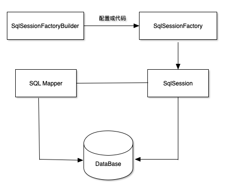
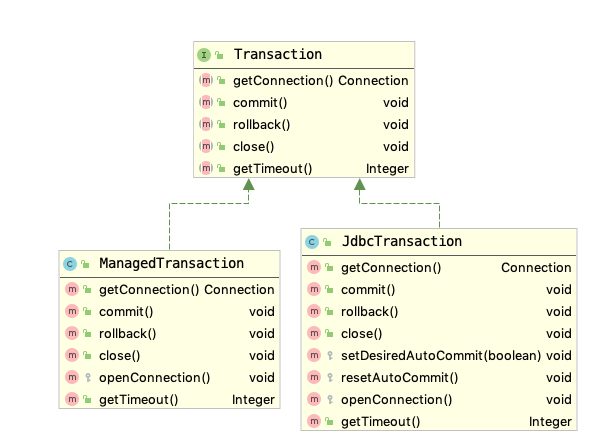

### 概述

> [MyBatis](http://www.mybatis.org/mybatis-3/zh/index.html)是一款优秀的持久层框架，它支持定制化SQL、存储过程以及高级映射。MyBatis避免了几乎所有的JDBC代码和手动设置参数以及获取结果集。MyBatis可以使用简单的XML或注解来配置和映射原生信息，将接口和Java的POJOs映射成数据库中的记录。

ORM: 对象关系映射(Object Relation Mapping)

* object: java中的实体内对象
* mapping：object和relation之间的映射
* relation: 数据库中的表


ORM模型可以用传统JDBC实现，但是传统JDBC程序的设计缺陷

* 大量配置信息硬编码：将数据库位置、密码等保存在代码中，违反软件开发的[OCP原则](../Head First设计模式/3 Decorator Pattern.md#2-the-open-closed-principle)
* 大量的无关业务处理的编码：数据库连接的打开和关闭，sql语句的建立和发送
* 扩展优化极为不便：数据库连接池

适合于：

* 更加关注SQL优化的项目
* 需求频繁更新改动的项目


### 核心组件

MyBatis的核心组件分为四部分：

* SqlSessionFactoryBuilder: 生成SqlSessionFactory,采用Builder模式
* SqlSessionFactory(工厂接口): 生成SqlSession,采用工厂模式
* SqlSession(会话):是一个既可以发送SQL执行返回结果，也可以获取Mapper的接口。一般会让其在业务逻辑代码中消失，而是用的是Mybatis提供的SQL Mapper接口编程技术
* SQL Mapper(映射器):负责发送SQL去执行，并返回结果





#### SqlSessionFactoryBuilder


```java
SqlSessionFactory SqlSessionFactory = null;


```
#### 映射器

映射器由一个接口和对应的XML文件组成，可以配置以下内容：

* 描述映射规则
* 提供SQL语句，并可以配置SQL参数类型、返回类型、缓存刷新等信息
* 配置缓存
* 提供动态SQL

### MyBatis配置


MyBatis配置文件并不复杂，它所有的元素如下：


```xml
<configuration> <!--配置-->
    <properties/> <!--属性-->
    <settings/>  <!--设置-->
    <typeAliases/> <!--类型命名-->
    <typeHandlers/> <!--类型处理器-->
    <objectFactory/> <!--对象工厂-->
    <plugins/> <!--插件-->
    <environments> <!--配置环境 -->
        <environment> <!--环境变量-->
            <transactionManager/> <!--事务管理器-->
            <dataSource/> <!--数据源-->
        </environment>
    </environments>
</configuration>
```

#### properties属性

properties属性可以给系统配置一些运行参数，可以放在XML文件或者properties文件中，而不是放在Java编码中，可以方便参数修改，而不会引起代码的重新编译。可以使用propery子元素或者properties文件的形式使用properties。

!!! example "properties子元素"

    ```xml tab="mybatis-config.xml"
    <properties>
        <property name="database.driver" value="com.mysql.jdbc.Driver"/>
        <property name="database.url" value="jdbc:mysql://localhost:3306/ssm/>"
    </properties>
    ```

使用properties文件是比较普遍的方法，其文件就是多个键值对。在MyBatis配置文件中通过<properties>的属性resource来引入properties文件。

!!! example "properties文件"

    ```text tab="jdbc.properties"
    database.driver=com.mysql.jdbc.Driver
    database.url=jdbc:mysql://localhost:3306/ssm
    ```
    
    ```xml tab="mybatis-config.xml"
    <properties resource="jdbc.properties"/>
    ```


#### typeAliases别名

由于类的全限定名称很长，需要大量使用的时候，总写那么长的名称不方便。在MyBatis中允许定义一个简写来代表这个类，这就是别名，别名分为系统定义别名和自定义别名。注意，在MyBatis中别名不区分大小写。

系统定义别名

| 别名 | Java类型 |
| --- | --- |
| _long | long |
| _int | int |
| _double | double |
| string | String |
| long | Long |
| date | Date |

使用配置文件可以自定义别名。扫描别名时，MyBatis将扫描这个包里面的类，将其第一个字母变为小谢作为其别名。

!!! example "自定义别名"

    ```xml tab="直接定义"
    <typeAliases>
        <typeAliase alias="role" type="com.exercise.ssm.Role"/>
    </typeAliases>
    ```
    
    ```xml tab="扫描别名"    
    <typeAliases>
        <typeAliase alias="role" type="com.exercise.ssm"/>
    </typeAliases>
    ```
#### typeHandler类型转换器

typeHandler的作用就是承担jdbcType和javaType之间的相互转换，其中jdbcTpe用于定义数据库类型，javaType用户定义Java类型。在很多情况下我们并不需要去配置typeHandler、jdbcType、javaType，因为MyBatis会探测应该使用什么类型的typeHandler进行处理。


#### environments

在MyBatis中，运行环境主要的作用就是配置数据库信息。分为两个可配置的元素：事务管理器(transactionManager)、数据源(dataSource)。

MyBatis为`Transaction`提供了两个实现类：`JdbcTransaction`和`ManagedTransaction`。它们都实现了`Transaction`接口，主要工作就是提交、回滚、关闭数据库。

```xml
<transactionManager type="JDBC">
<transactionManger type="Managed">
```





environment的主要作用是配置数据库，在Mybatis中数据库通过`PooledDataSourceFactory`， `UnpooledDataSourceFactory`和`JndiDataSourceFactory`三个工厂类来提供。分别配置如下

``` xml
<dataSource type="UNPOOLEd">
<dataSource type="POOLED">
<dataSource type="JNDI">
```


* UNPOOLED:非数据库池的管理方式，每次请求都会打开一个新的数据库连接，创建会比较慢
* POOLED: 数据库池的管理方式，请求时无需再建立和验证，省去了创建新的连接实例时所必需的初始化和认证时间；并且控制最大连接数，避免过多的连接导致系统瓶颈。
* JNDI：略


#### 引入映射器的方法

引入映射器的方法很多：

```xml tab="从文件路径引入"
<mappers>
    <mapper resource="com/exercise/mybatis/RoleMapper.xml">
</mappers>
```

```xml tab="从包名引入"
<mappers>
    <package name="com.exercise.mybatis">
</mappers>
```

```xml tab="从类注册引入"
<mappers>
    <mapper class="com.exercise.mybatis.RoleMapper"/>
    <mapper class="com.exercise.mybatis.UserMapper"/>
</mappers>
```
    
#### 案例

下面的一个简单的案例演示了MyBatis的基本操作。

```java tab="main"
public class Main {
    
    @Test
    public void testMyBatis() throws Exception {
        SqlSessionFactory sqlSessionFactory = null;
        InputStream inputStream;
    
        inputStream = Resources.getResourceAsStream("mybatis.xml");
        sqlSessionFactory = new SqlSessionFactoryBuilder().build(inputStream);
        SqlSession sqlSession = sqlSessionFactory.openSession();
        RoleMapper roleMapper = sqlSession.getMapper(RoleMapper.class);
        Role role = roleMapper.getRole(1L);
        System.out.println(role.getId()); //1
        roleMapper.deleteRole(1L);
    
        Role newRole = new Role("baby", "Q");
        roleMapper.insertRole(newRole);
        Long id = newRole.getId();
    
        System.out.println(id); //1
        System.out.println(roleMapper.getRole(id));
        roleMapper.updateRoleInfo(id, "zhenhua", "lala");
        System.out.println(roleMapper.getRole(id));
    }
}
```
    
```java tab="Role"    
public class Role {
    private Long id;
    private String roleName;
    private String note;
    
    public Role(String roleName, String note) {
        this.roleName = roleName;
        this.note = note;
    }
    
    public Long getId() {
        return id;
    }
    
    public void setId(Long id) {
        this.id = id;
    }
    
    public String getRoleName() {
        return roleName;
    }
    
    public void setRoleName(String roleName) {
        this.roleName = roleName;
    }
    
    public String getNote() {
        return note;
    }
    
    public void setNote(String note) {
        this.note = note;
    }
    
    
    @Override
    public String toString() {
        return roleName + "  id: " + id + "  note: " + note;
    }
}
```
    
```java tab="RoleMapper"    
//映射器接口
public interface RoleMapper {
    public Role getRole(Long id);
    public void deleteRole(Long id);
    public int getRoleNumber();
    public void updateRole(Role role);
    public void insertRole(Role role);
}
```
    
    
```xml tab="mybatis.xml"
<?xml version="1.0" encoding="UTF-8" ?>
<!DOCTYPE configuration
  PUBLIC "-//mybatis.org//DTD Config 3.0//EN"
  "http://mybatis.org/dtd/mybatis-3-config.dtd">
    
<configuration>
    <typeAliases>
        <typeAlias alias="role" type="com.exercise.mybatis.example.Role"/>
    </typeAliases>
    <environments default="development">
        <environment id="development">
            <transactionManager type="JDBC"></transactionManager>
            <dataSource type="POOLED">
                <property name="driver" value="com.mysql.jdbc.Driver"/>
                <property name="url" value="jdbc:mysql://localhost:3306/chapter3"/>
                <property name="username" value="root"/>
                <property name="password" value="imLarry!"/>
            </dataSource>
    
        </environment>
    </environments>
    <mappers>
        <mapper resource="com/exercise/mybatis/example/RoleMapper.xml"/>
    </mappers>
</configuration>
```
    
```xml tab="RoleMapper.xml"
<?xml version="1.0" encoding="UTF-8" ?>
<!DOCTYPE mapper PUBLIC "-//mybatis.org//DTD Mapper 3.0//EN"
        "http://mybatis.org/dtd/mybatis-3-mapper.dtd">
<mapper namespace="com.exercise.mybatis.example.RoleMapper">
    <select id="getRole" parameterType="long" resultType="role">
        select id, role_name as roleName, note
        from t_role
        where id = #{id}
    </select>
    <select id="deleteRole" parameterType="long">
        delete from t_role where id = #{id};
    </select>
    
    <select id="getRoleNumber" resultType="int">
        select count(*) from t_role;
    </select>
    
    <update id="updateRole" parameterType="role">
        update t_role set role_name=#{roleName} where id=#{id};
    </update>
    
    <insert id="insertRole" parameterType="role" useGeneratedKeys="true" keyProperty="id">
        insert into t_role (role_name, note) values(#{roleName}, #{note});
    </insert>
    
    <update id="updateRoleInfo">
        update t_role set role_name=#{roleName}, note=#{note} where id=#{id};
    </update>
</mapper>
```
    
### 映射器

映射器是MyBatis最复杂且最重要的组件。它由一个接口加上XML文件(或者注解)组成。在映射器中可以配置参数、SQL语句、存储过程、缓存、级联等复杂的内容，并且通过简易的映射规则映射到指定的POJO或者其他对象上，映射器能够有效消除JDBC底层的代码。

映射器的配置元素

| 元素名称 | 描述 | 备注 |
| --- | --- | --- |
| select | 查询语句，最常用、最复杂的元素之一 | 可以自定义参数，返回结果集等 |
| insert | 插入语句 | 执行后返回一个整数，代表插入的条数 |
| update | 更新语句 | 执行后返回一个整数，代表更新的条数 |
| delete | 删除语句 | 执行后返回一个整数，代表删除的条数 |
| resultMap | 用来描述从数据库结果集中加载对象 | 它将提供映射规则 |
| cache | 给定命名空间的缓存配置 | - | 
| cache-ref |  其他命名空间缓存配置的引用。| - |  

#### 传递多个参数


现实的需求中，可能会有多个参数，比如订单可以根据订单名称、日期或者价格进行查询。为此, MyBatis为开发者提供了一个注解@Param(`org.apache.ibatis.annotations.Param`)。可以通过它去定义映射器的参数名称，使用它可以得到更好的可读性。

!!! example "传递多个参数"

    在`RoleMapper`中，使用传递id，roleName来更新Role。注意此时并不需要parameterType参数，MyBatis会自动探索。
    
    ```java tab="RoleMapper"
    public void updateRoleInfo(@Param("id") Long id, @Param("roleName")     
            String roleName, @Param("note") String note);
    ```
    
    ```xml tab="mybatis-config.xml"
    <update id="updateRoleInfo">
        update t_role set role_name=#{roleName}, note=#{note} 
        where id=#{id};
    </update>
    ```
   
#### 主键回填

如果MySQL中的表格采用了自增主键(primary key auto_increment)，MYSQL数据库会为该记录生成对应的主键。MyBatis提供了这样的支持。在insert语句中有一个开关属性`useGeneratedKeys`用来控制是否获取数据库生成的主键。当打开了这个开关，还要配置其属性`keyProperty`，告诉系统把生成的主键放在哪个属性中。

!!! example "主键回填"
    
    ```java
     <insert id="insertRole" parameterType="role" useGeneratedKeys="true" keyProperty="id">
        insert into t_role (role_name, note) values(#{roleName}, #{note});
    </insert>
    ```
    
#### 自动映射和驼峰映射

MyBatis提供了自动映射功能，默认是开启的。如果编写的SQL列名和属性名保持一致，就会形成自动映射。

!!! example "自动映射"
    
    例如通过角色编号(id)获取角色的信息：
    
    ```xml
    <select id="getRole" parameterType="long" resultType="role">
        select id, role_name as roleName, note from t_role where id = #{id}
    </select>
    ```
    
    原来的列名`role_name`被别名`roleName`代替了，这样就和POJO上的属性名称保持一致了。此时MyBatis就会将这个结果集映射到POJO的属性`roleName`上，自动完成映射，而无需再进行任何配置。

MyBatis会严格按照驼峰命名的方式做自动映射。如果需要更为强大的映射规则，则需要考虑使用resultMap。    

#### resultMap元素

为了支持复杂的映射，MyBatis提供了resultMap属性。

!!! example "使用resultMap"

    下面这个例子不使用自动映射，而是使用了resultMap作为resultType。
    
    ```xml
    <resultMap id="roleMap" type="role">
        <id property="id" column="id"/>
        <result property="roleName" column="role_name"/>
        <result property="note" column="note"/>
    </result>
    <select id="getRole" parameterType="long" resultType="roleMap">
        select id, role_name, note from t_role where id = #{id}
    </select>
    ```
    
    
#### 分页

MyBatis中可以使用`RowBounds`进行分页。

```java tab= "Mapper接口"
public List<Role> findByRowBounds(@Param("roleName") String roleName, @Param("note") String note, RowBounds rowBounds);
```

```xml tab="mapper配置"
<select id="findRowBounds" resultType="role">
    select id, role_name as roleName, note from t_role
    where role_name like
    concat('%', #{roleName}, '%')
    and note like concat('%', #{note}, '%')
</select>
```

    
    
#### 级联

#### 缓存

#### 存储过程


<!--
####  案例：蛋糕网站


[项目地址](https://github.com/techlarry/Cake)

蛋糕网站使用MySQL数据库，首先建立名为cake的数据库以及名为cake的表。

```sql
mysql> create database cake default character set utf8;
Query OK, 1 row affected, 1 warning (0.17 sec)

mysql> use cake;
Database changed
mysql> create table cake
    -> (
    -> id bigint(20) not null auto_increment,
    -> category_id bigint(20) not null,
    -> name varchar(45) not null,
    -> level int(2) default null,
    -> price int(9) default null,
    -> small_img mediumblob,
    -> create_time datetime not null,
    -> update_time datetime not null,
    -> primary key (id)
    -> )
    -> engine=innodb auto_increment=1 default charset=utf8;
Query OK, 0 rows affected, 1 warning (0.21 sec)
mysql> create table category
    -> (
    -> id bigint(20) not null auto_increment,
    -> name varchar(45) not null,
    -> create_time datetime not null,
    -> update_time datetime not null,
    -> primary key (id)
    -> )
    -> engine=innodb auto_increment=1 default charset=utf8;
Query OK, 0 rows affected, 1 warning (0.11 sec)
```

类似于JDBCUtils，创建一个MyBatisUtils类

```java
public class MyBatisUtils {
    private static SqlSessionFactory sqlSessionFactory;
    private static Reader reader;
    static {
        try {
            String resource = "config.xml";
            reader = Resources.getResourceAsReader(resource);
            sqlSessionFactory = new SqlSessionFactoryBuilder().build(reader);
        } catch (IOException e) {
            e.printStackTrace();
        }
    }
    public static SqlSession openSession() {
        return sqlSessionFactory.openSession();
    }
}
```

创建Cake类，有Id, categoryId, name, price等属性。这里的重点是创建一个CakeMapper:


```java
public interface CakeMapper {

    /**
     * 分页查询蛋糕
     * @param skip  跳过的记录数，也就是从哪条开始查询
     * @param size  要查询的记录数
     * @return  蛋糕集合
     */
    @Select("select * from cake order by create_time desc limit #{skip}, #{size}")
    @Results({
                @Result(id = true, column = "id", property = "id"),
                @Result(column = "category_id", property = "categoryId"),
                @Result(column = "name", property = "name"),
                @Result(column = "level", property = "level"),
                @Result(column = "price", property = "price"),
                @Result(column = "create_time", property = "createTime"),
                @Result(column = "update_time", property = "updateTime")
            })
    List<Cake> getCakes(@Param("skip") Integer skip, @Param("size") Integer size);

    /**
     * 根据分类分页查询蛋糕
     * @param categoryId    蛋糕分类ID
     * @param skip  跳过的记录数，也就是从哪条开始查询
     * @param size  要查询的记录数
     * @return  蛋糕集合
     */
    @Select("select id, category_id categoryId, name, level, price, create_time createTime, update_time updateTime " +
            "from cake where category_id = #{categoryId} order by create_time desc limit #{skip}, #{size}")
    List<Cake> getCakesByCategoryId(@Param("categoryId")Long categoryId, @Param("skip") Integer skip,  @Param("size") Integer size);

    /**
     * 根据分类ID进行蛋糕数量的统计
     * @param categoryId    分类ID
     * @return  分类下蛋糕数量
     */
    @Select("select count(*) from cake where category_id = #{categoryId}")
    int countCakesByCategoryId(@Param("categoryId")Long categoryId);

    /**
     * 保存蛋糕信息
     * @param cake  蛋糕信息
     */
    @Insert("insert into cake(category_id, name, level, price, small_img, create_time, update_time) " +
            "value (#{cake.categoryId}, #{cake.name}, #{cake.level}, #{cake.price}, #{cake.smallImg}, " +
            "#{cake.createTime}, #{cake.updateTime})")
    void addCake(@Param("cake") Cake cake);

    /**
     * 查询蛋糕图片信息
     * @param id    蛋糕ID
     * @return  只包含图片的蛋糕实体
     */
    @Select("select small_img smallImg from cake where id = #{id} for update")
    Cake getImg(@Param("id")Long id);

}
```


#### XML映射文件

MyBatis的强大之处在于它的映射语句。SQL映射文件只有很少的几个顶级元素：

* `insert` – 映射插入语句
* `delete` – 映射删除语句
* `update` – 映射更新语句
* `select` – 映射查询语句
* `resultMap` – 是最复杂也是最强大的元素，用来描述如何从数据库结果集中来加载对象。
* `cache` – 对给定命名空间的缓存配置。
* `cache-ref` – 对其他命名空间缓存配置的引用。
* `sql` – 可被其他语句引用的可重用语句块。

[[详细用法](http://www.mybatis.org/mybatis-3/zh/sqlmap-xml.html)]

-->
