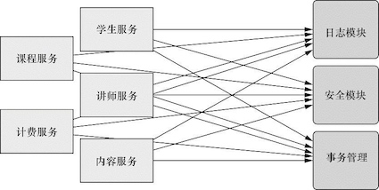
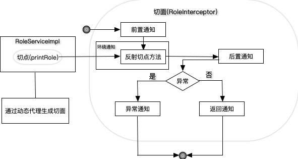
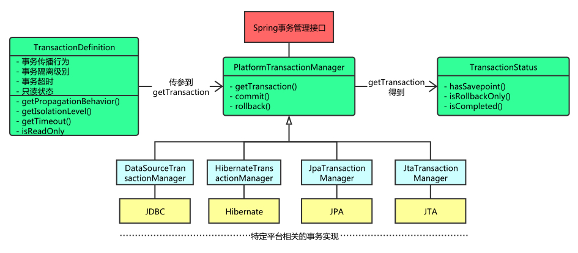
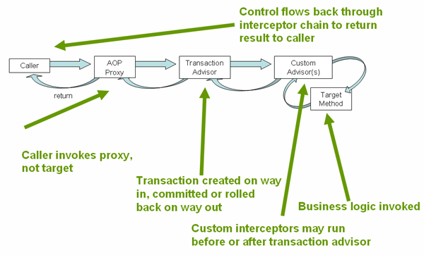
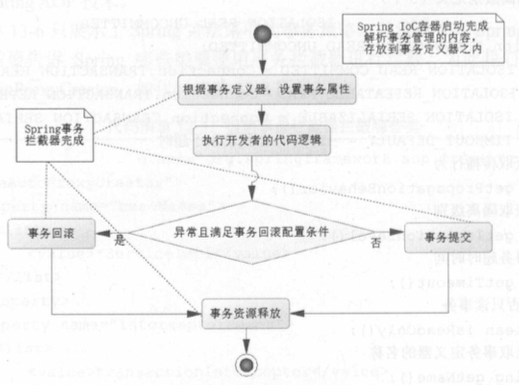
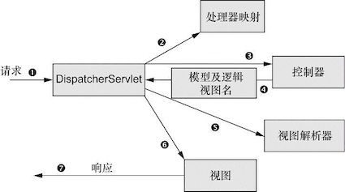
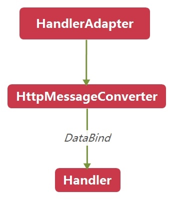
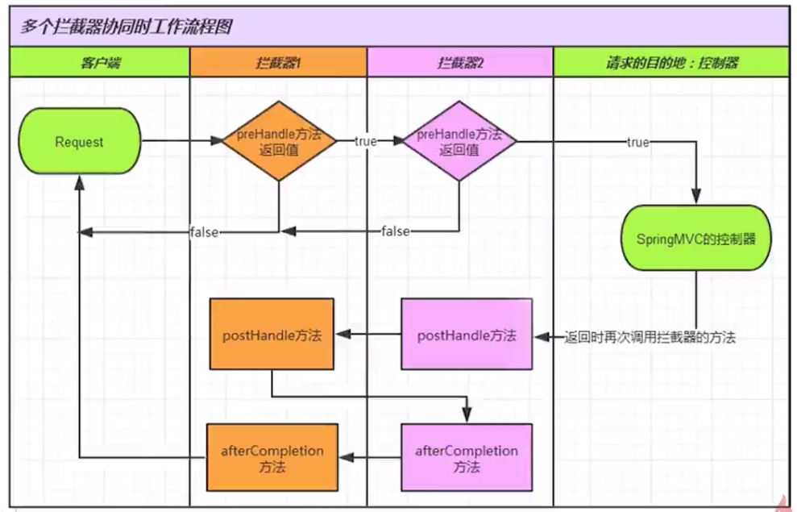
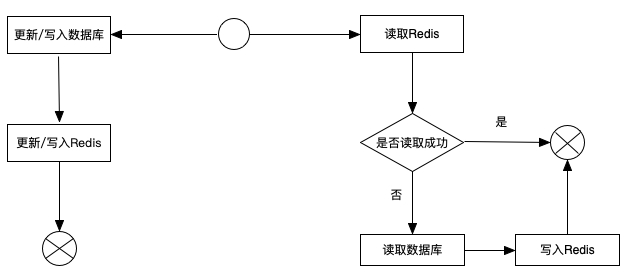
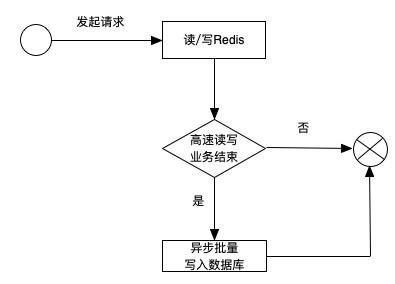

### 1 简介

[Spring](http://spring.io)是一个开源框架，为简化企业级应用开发而生，使用Spring可以让简单的JavaBean实现以前只有EJB才能实现的功能。

* 方便解耦，简化开发：可以将所有对象创建和依赖关系维护，交给Spring管理;
* AOP编程的支持：可以方便地实现对程序进行权限拦截，运行监控等功能;
* 声明式事务的支持：只需要通过配置就可以完成对事务的管理，而无需手动编程;
* 方便程序的测试：支持Junit，也可以通过注解测试;
* 方便继承各种优秀框架：提供了对各种优秀框架(structs, hibernate, mybatis)的直接支持;
* 降低Java EE API的使用难度：对一些非常难用的API(JDBC, JavaMail, 远程调用等)，都提供了封装，使这些API应用难度大大降低.

#### Spring模块


<!--

Spring核心容器：Spring 框架最核心的部分，它管理者Spring应用中bean的创建、配置和管理。


底层实现原理

通过配置文件+反射实现松耦合-->

#### 控制反转

**控制反转**(Inversion of Control, IOC)，是指将原本在程序中手动创建对象的控制权，交给Spring。

传统方式中，每个对象负责管理与自己相护协作的对象的引用，将会导致*高度耦合且难以测试*的代码。例如在`HelloTest`类中使用`UserService`类对象：

* 传统方式： `:::Java UserService userService = new Uservicmpl()`

* 使用控制反转的代码：

```java
public void demoIOC() {
    // 使用Spring工厂
    ApplicationContext applicationContext = new 
        ClassPathXmlApplicationContext("applicationContext.xml");
    // 通过工厂获得类
    UserService userService = 
        (UserService) applicationContext.getBean("userService");
    // 执行
    userService.sayHello();
}
```

#### 依赖注入

按照传统的做法，每个对象负责管理与⾃⼰相互协作的对象(即它所依赖的对象)的引⽤，这将会导致⾼度耦合和难以测试的代码。通过依赖注入，对象的依赖关系将由系统中负责协调各对象的第三⽅组件在创建对象的时候进⾏设定。

> **依赖注入**(Dependency Injection, DI)：在Spring创建对象的过程中，将这个对象所依赖的属性注入进去。


对于类成员变量，注入方式有三种

* 构造器注入(constructor injection)：保证Bean实例在实例化后就可以使用，注入在`<constructor-arg>`元素里声明的属性
* setter方法注入: 在`<property>`元素设置注入的属性，Spring中最主流注入方式
* 接口注入


<!--
p-命名空间属性是如何组成的。⾸先，属性的名字使⽤了“p: ”前缀，表明我们所设置的是⼀个属性。接下来就是要注⼊的属性名。最后，属性的名称以“-ref”结尾，这会提⽰Spring要进⾏装配的是引⽤，⽽不是字⾯量。


-->


```xml
<!--Bean的构造器注入=============================-->
<bean id="user" class="com.spring.ioc.User">
    <constructor-arg name="name" value="张三" />
    <constructor-arg name="age" value="23"/>
</bean>

<!--Bean的set方法的属性注入==============================-->
<bean id="person2" class="com.spring.ioc.Person">
    <property name="name" value="小王"/>
    <property name="age" value="38"/>
    <property name="cat" ref="cat2"/>
</bean>

<bean id="cat2" class="com.spring.ioc.Cat">
    <property name="name" value="ketty"/>
</bean>

<!--Bean的p名称空间的属性注入==============================-->
<bean id="person3" class="com.spring.ioc.Person" 
    p:name="大黄" p:age="34" p:cat-ref="cat2"/>
```


复杂类型的注入

```xml tab="数组类型"
<property name="arrs">
    <list>
        <value>aaa</value>
        <value>bbb</value>
        <value>ccc</value>
    </list>
</property>
```

```xml tab="List集合的属性注入"
<property name="list">
    <list>
        <value>111</value>
        <value>222</value>
        <value>333</value>
    </list>
</property>
```

```xml tab="Set集合的属性注入"
<!--Set集合的属性注入-->
<property name="set">
    <set>
        <value>ddd</value>
        <value>eee</value>
        <value>fff</value>
    </set>
</property>
```

```xml tab="Map集合的属性注入"
<!--Map集合的属性注入-->
<property name="map">
    <map>
        <entry key="aaa" value="111"/>
        <entry key="bbb" value="222"/>
        <entry key="ccc" value="333"/>
    </map>
</property>
```

```xml tab="Properties集合的属性注入"
<!--Properties的属性注入-->
<property name="properties">
    <props>
        <prop key="username">root</prop>
        <prop key="password">1234</prop>
    </props>
</property>
```

Spring支持前两种


依赖注入会将所依赖的关系自动交给目标对象，而不是让对象自己去获取依赖。

创建应用组件之间的协作的行为通常称为**装配**(wiring)。Spring有多种装配bean的方式，采用XML是很常见的一种装配方式。

Spring通过**应用上下文**(Application Context)装载bean的定义并把它们组装起来。Spring应用上下文全权负责对象的创建和组装。


#### 面向切面编程

**面向切面编程**(aspect-oriented programming, AOP)允许你把遍布应用各处的功能分离出来形成可重用的组件。

系统由许多不同的组件组成，每一个组件各负责一块特定功能，除此之外还经常承担着额外的职责。诸如日志、事务管理、安全这样的系统服务(通常被称为*横切关注点*)经常会跨越多个组件。如果将这些关注点分散到多个组件中去，实现系统关注点功能的代码将会重复出现在多个组件中，还会因为那些与自身核心业务无关的代码而变得混乱。

例如下图左边的业务对象与系统级服务结合得过于紧密。每个对象不但要知道它需要记⽇志、进⾏安全控制和参与事务，还要亲⾃执⾏这些服务。



AOP能够使横切关注点模块化，并以声明的方式将它们应用到它们需要影响的组件中去。


#### 样板式代码

样板式代码(boilerplate code)指重复编写的代码。Spring旨在通过模板封装来消除样板式代码。Spring的`JdbcTemplate`使得执⾏数据库操作时，避免传统的JDBC样板代码成为了可能。


#### Spring容器

Spring的应用对象生存于Spring容器(Container)中，由Spring容器负责创建、装配、配置和管理对象的整个生命周期。Spring自带多个容器：

* bean工厂(`BeanFactory`)是最简单的容器，提供基本的DI支持;
* 应用上下文(`ApplicationContext`)基于`BeanFactory`构建，并提供应用框架级别的服务。

Spring自带了多种类型的应用上下文，最常用的有

* `AnnotationConfigApplicationContext`: 从一个或多个基于Java的配置类中加载Spring应用上下文
* `AnnotationConfigWebApplicationContext`: 从一个或多个基于Java的配置类中加载Spring Web应用上下文
* `ClassPathXmlApplicationContext:` 从类路径下的一个或多个XML配置文件中加载上下文定义，把应用上下文的定义文件作为类资源
* `FileSystemXmlApplicationContext`: 从文件系统下的一个或多个XML配置文件中加载上下文定义
* `XmlWebApplicationContext:` 从Web应用下的一个或多个XML配置文件中加载上下文定义。


`BeanFactory`是Spring IoC容器所定义的最底层接口，而`ApplicationContext`是其高级接口之一，并且对`BeanFactory`功能做了许多有用的扩展，所以在大部分的工作场景下，都会使用`ApplicationContext`作为Spring IoC容器。


下图展示了bean装载到Spring应用上下文中的一个典型的生命周期过程：


1. Spring对bean进⾏实例化；
2. Spring将值和bean的引⽤注⼊到bean对应的属性中； 
3. 如果bean实现了`BeanNameAware`接口，Spring将bean的ID传递给`setBeanName()`⽅法； 
4. 如果bean实现了`BeanFactoryAware`接口，Spring将调⽤`setBeanFactory`⽅法，将`BeanFactory`容器实例传⼊；
5. 如果bean实现了`ApplicationContextAware`接口，Spring将调⽤`setApplicationContext()`⽅法，将bean所在的应⽤上下⽂的引⽤传⼊进来；
6. 如果bean实现了`BeanPostProcessor`接口，Spring将调⽤它们的`postProcesssBeforeInitialization()`⽅法。
7. 如果bean实现了`InitializingBean`接口，Spring将调⽤它们的`afterPropertiesSet()`⽅法;类似地，如果bean使⽤init-method声明了初始化⽅法，该⽅法也会被调⽤；
8. 如果bean实现了`BeanPostProcessor`接口，Spring将调⽤它们的`postProcessAfterInitalization()`⽅法；
9. 此时，bean已经准备就绪，可以被应⽤程序使⽤了，它们将⼀直驻留在应⽤上下⽂中，直到该应⽤上下⽂被销毁；
10. 如果bean实现了`DisposableBean`接口，Spring将调⽤它的`destroy()`接口⽅法。同样，如果bean使⽤destroy-method声明了销毁⽅法，该⽅法也会被调⽤。

```java
public class Man implements BeanNameAware, ApplicationContextAware,
                InitializingBean, DisposableBean {
    private String name;
    public void setName(String name) {
        System.out.println("第二步：设置属性");
        this.name = name;
    }
    
    public Man(){
        System.out.println("第一步：初始化...");
    }
    public void setup(){
        System.out.println("第七步：MAN被初始化了...");
    }

    public void teardown(){
        System.out.println("第十一步：MAN被销毁了...");
    }

    @Override
    public void setBeanName(String name) {
        System.out.println("第三步：设置Bean的名称"+name);
    }

    @Override
    public void setApplicationContext(ApplicationContext 
        applicationContext) throws BeansException {
        System.out.println("第四步：了解工厂信息");
    }

    @Override
    public void afterPropertiesSet() throws Exception {
        System.out.println("第六步：属性设置后");
    }

    public void run(){
        System.out.println("第九步：执行业务方法");
    }

    @Override
    public void destroy() throws Exception {
        System.out.println("第十步：执行Spring的销毁方法");
    }
}
```


### 2 装配Bean

在Spring中，对象无需自己查找或创建与其所关联的其他对象，容器负责把需要相护协作的对象引用赋予各个对象，_创建应用对象之间的协作关系的行为_ 通常被称为**装配**(wiring)。

Spring提供了三种主要的装配机制：

* 在XML中进行显式配置
* 在Java中进行显式配置
* 隐式的bean发现机制和自动装配


三种可选配置方案功能有一些重叠，建议尽可能地使用自动配置的机制，其次推荐使用JavaConfig，最后推荐使用XML。

#### 自动化装配bean

Spring从两个角度来实现自动化装配：

* **组件扫描**(component scanning): Spring会自动发现应用上下文中所创建的bean；
* **自动装配**(Autowiring): Spring自动满足bean之间的依赖；

`@Component`注解表明该类会作为组件类，并告知Spring要为这个类创建bean。不过，组件扫描默认是不启用的。所以要加入`@ComponentScan`注解启动组件扫描，寻找带有`@Component`注解的类。也通过XML来启动组件扫描，使用SpringContext命名空间的`<context:component-scan>`元素。

!!! example "组件扫描"
    
    ```java tab="@Component"
    @Component # 表明SgtPeppers作为组件类
    public class SgtPeppers implements CompactDisc {
        private String title = "Sgt. Pepper's Lonely Hearts Club Band";
        private String artist = "The Beatles";
        public void play() {
            System.out.println("Playing " + title + " by " + artist);
        }
    }
    ```
    
    ```java tab="@ComponentScan"
    @Configuration
    @ComponentScan  # 启用组件扫描
    public class CDPlayerConfig {
    }
    ```
    
    ```java tab="spring-config.xml"
    <beans xmlns="http://www.springframework.org/schema/beans"
      xmlns:xsi="http://www.w3.org/2001/XMLSchema-instance"
      xmlns:context="http://www.springframework.org/schema/context"
      xmlns:c="http://www.springframework.org/schema/c"
      xmlns:p="http://www.springframework.org/schema/p"
      xsi:schemaLocation="http://www.springframework.org/schema/beans http://www.springframework.org/schema/beans/spring-beans.xsd
    		http://www.springframework.org/schema/context http://www.springframework.org/schema/context/spring-context.xsd">
    
      <context:component-scan base-package="soundsystem" />
    
    </beans>
    ```
    
    
其他几个注意点：
    
* 通过将ID作为值传递给`@Component`注解，可以为这个bean设置ID，例如`@Component("lonelyHeartsClub)`为`SgtPeppers`设置了ID名`lonelyHeartsClub`
* 默认情况下，`@ComponentScan`会扫描对应类所在的基础包下的组件。可以通过value属性明确指定包的名称。例如指定在soundsystem下扫描组件: `@ComponentScan(basepackages="soundsystem")`，指定多个包下扫描组件: `@ComponentScan(basepackages={"soundsystem", "video"})`


<!--


除了@Component外，Spring提供了3个功能基本和@Component等效的注解

* @Repository用于对DAO实现类进行标注
* @Service用于对Service实现类进行标注
* @Controller用于对Controller实现类进行标注
-->


自动装配会在Spring应用上下文中寻找匹配的某个bean需求的其他bean。Spring的`@Autowired`注解，可以用在构造器上进行实例化，也可以用在属性的Setter方法上。@Autowired注解表示在Spring IoC定位所有的Bean之后，这个字段需要按类型注入，这样IoC容器就会寻找资源，然后将其注入。

!!! example "自动装配"
    
    在`CDPlayer`的构造器上添加了`@AutoWired`注解。当Spring创建`CDPlayer` bean时，会通过这个构造器来进行实例化，并且由于`@AutoWired`注解用在`setCompactDisc`上，会传入`SgtPeppers`。

    ```java tab="自动装配"
    @Component 
    public class CDPlayer implements MediaPlayer {
        private CompactDisc cd;
        
        @Autowired
        public CDPlayer(CompactDisc cd) {
            this.cd = cd;
        }
        
        public void play() {
            cd.play();
        }
        
        @Autowired
        public void setCompactDisc(CompactDisc cd) {
            this.cd = cd;
        }
    }
    ```
    
    ```java tab="验证自动装配"
    @RunWith(SpringJUnit4ClassRunner.class)
    @ContextConfiguration(classes = CDPlayerConfig.class)
    public class CDPlayerTest {
    
        @Rule
        public final StandardOutputStreamLog log =
             new StandardOutputStreamLog(); //得到标准输出：SgtPeppers
    
        @Autowired
        private MediaPlayer player;
    
        @Autowired
        private CompactDisc cd;
    
        @Test
        public void play() {
            player.play();
            assertEquals("Playing Sgt. Pepper's Lonely Hearts 
                Club Band by The Beatles\n",log.getLog());
        } // 验证输出的内容
    
    }
    ```
    
几个注意点：

* 如果Spring执行自动装配，但是没有匹配到bean，bean处于未装配状态，其属性为null
* 如果匹配到多个bean，那么将会抛出异常。

并在ApplicationContext.xml文件中配置开启注解扫描

```xml
<!--开启注解扫描=======================-->
<context:component-scan base-package="..."/>
```

Spring初始化bean或销毁bean时，有时需要作一些处理工作，因此Spring可以在创建和拆卸bean的时候调用bean的两个生命周期方法。可以使用@PostConstruct做一些初始化，使用@PreDestory做一些销毁前的工作。

```java
@Component("bean1")
public class Bean1 {
    @PostConstruct
    public void init(){
        System.out.println("initBean...");
    }
    public void say(){
        System.out.println("say...");
    }
    @PreDestroy
    public void destroy(){
        System.out.println("destroyBean...");
    }
}
```


#### Java装配bean

某些情况下不能使用自动化装配，例如将第三方库中的组件装配到应用中。这时，必须要采用显示配置的方式。由于其强大、类型安全并且对重构友好，JavaConfig是显示配置中较好的方案。


`@Bean`注解会告诉Spring这个方法将会返回一个对象，该对象要注册为Spring应用上下文中的bean。

```java
@Bean(name="lonelyHeartsClubBand")
public CompactDisc sgtPeppers() {
    return new SgtPeppers();
}
```

和其他Bean一样，它也可以通过`@Autowired`等注解注入别的Bean中


#### XML装备bean


```java tab="bean"
public class Bean1 {
    public Bean1(){
        System.out.println("Bean1被实例化了...");
    }
}

public class Bean2 {

}

public class Bean2Factory {
    public static Bean2 createBean2(){
        System.out.println("Bean2Factory的方法已经执行了...");
        return new Bean2();
    }
}

public class Bean3 {

}

public class Bean3Factory {
    public Bean3 createBean3(){
        System.out.println("Bean3Factory执行了...");
        return new Bean3();
    }
}

```

```java tab="demo"
public class SpringDemo2 {
    @Test
    public void demo1(){
        // 创建工厂
        ApplicationContext applicationContext = new 
            ClassPathXmlApplicationContext("applicationContext.xml");
        // 通过工厂获得类的实例:
        Bean1 bean1 = (Bean1)applicationContext.getBean("bean1");
    }

    @Test
    public void demo2(){
        // 创建工厂
        ApplicationContext applicationContext = new 
            ClassPathXmlApplicationContext("applicationContext.xml");
        // 通过工厂获得类的实例:
        Bean2 bean2 = (Bean2)applicationContext.getBean("bean2");
    }

    @Test
    public void demo3(){
        // 创建工厂
        ApplicationContext applicationContext = new 
            ClassPathXmlApplicationContext("applicationContext.xml");
        // 通过工厂获得类的实例:
        Bean3 bean3 = (Bean3)applicationContext.getBean("bean3");
    }
}
```

```xml tab="配置"
<!--第一种：无参构造器的方式-->
<bean id="bean1" class="com.spring.ioc.xmlbean.Bean1"/>
<!--第二种：静态工厂的方式-->
<bean id="bean2" class="com.spring.ioc.xmlbean.Bean2Factory" 
        factory-method="createBean2"/>
<!--第三种：实例工厂的方式-->
<bean id="bean3Factory" class="com.spring.ioc.xmlbean.Bean3Factory"/>
<bean id="bean3" factory-bean="bean3Factory" factory-method="createBean3"/>
```


bean的配置：

id和name

* 一般情况下，装配一个Bean时，通过指定一个id属性作为Bean的名称
* id属性在IOC容器中必须时唯一的
* 如果Bean的名称中含有特殊字符，就需要使用name属性，例如"/bean1"

class用于设置一个类的完全路径名称，主要作用是IOC容器生成类的实例


#### 使用Profile

使用@Profile注解可以在不同的环境中进行切换。例如切换不同的数据库分别让开发人员和测试人员来进行不同的测试。也可以通过XML的方式配置。

```java tab="注解"
@Bean(name="devDataSource")
@Profile("dev")
public DataSource getDevDataSource() throws Exception {
    Properties props = new Properties();
    props.getProperty("driver", "com.mysql.jdbc.Driver");
    props.setProperty("url", "jdbc:mysql://localhost:3306/sm");
    return BasicDataSourceFactory.createDataSource(props);
}

@Bean(name="testDataSource")
@Profile("test")
public DataSource getDevDataSource() throws Exception {
    Properties props = new Properties();
    props.getProperty("driver", "com.mysql.jdbc.Driver");
    props.setProperty("url", "jdbc:mysql://localhost:3306/sm2");
    return BasicDataSourceFactory.createDataSource(props);
}
```

```xml tab="xml"
<beans profile="dev">
    <bean id="devDataSource" class="org.apache.commons.dbcp.BasicDataSource">
        <property name="driverClassName" value="com.mysql.jdbc.Driver>
        <property name="url" value="jdbc:mysql://localhost:3306/sm">
        ...
    </bean>
</beans>

<beans profile="test">
    <bean id="devDataSource" class="org.apache.commons.dbcp.BasicDataSource">
        <property name="driverClassName" value="com.mysql.jdbc.Driver>
        <property name="url" value="jdbc:mysql://localhost:3306/sm2">
        ...
    </bean>
</beans>
```


#### 加载属性文件

属性文件(.properties)文件，也可以通过注解(@PropertySource)和XML方式加载。


```java tab="注解"
// 引入数据库配置文件
@Configuration
@PropertySource(value={"classpath:database-config.properties"},
    ignoreResourceNotFound=true)
public class ApplicationConfig {
}


// 使用引入属性文件的配置
@Componenent
public class DataSourceBean {
    @Value("${jdbc.database.driver}")
    private String driver = null;
    
    @Value("${jdbc.database.url}"
    private String url = null;
    ...
}
```

```xml tab="xml"
<context:property-placeholder ignore-resource-not-found="true"
    location="classpath:database-config.properties"/>
```


#### Bean的作用域

在默认的情况下，Spring IoC容器只会为一个Bean创建一个实例，这是由Spring的作用域所决定的。Spring提供了4种作用域，它会根据情况来决定是否生成新的对象：

| 类别 | 说明 |
| --- | --- |
| 单例singleton  | 默认的作用域，在整个应用中，只创建bean的一个实例 |
| 原型prototype | 每次注入或者通过Spring应用上下文获取的时候，都会创建一个新的bean实例 |
| 请求request  | 在Web应用中，为每个请求创建一个bean实例 |
| 会话session | 在Web应用中，为每个会话创建一个bean实例 |

Bean的作用域可以在XML文件中配置。例如

```xml
<bean id="userInfo" class="com.zhenhua.bean.UserInfo" scope="singleton"/>
```

#### 使用Spring表达式语言进行装配

Spring 3引⼊了Spring表达式语⾔（Spring Expression Language，SpEL）， 它能够以⼀种强⼤和简洁的⽅式将值装配到bean属性和构造器参数中，在 这个过程中所使⽤的表达式会在运⾏时计算得到值。


```xml
<!--Bean的SpEL的属性注入==============================-->
<bean id="category" class="com.spring.ioc.Category">
    <property name="name" value="#{'服装'}"/>
</bean>

<bean id="productInfo" class="com.spring.ioc.ProductInfo"/>

<bean id="product" class="com.spring.ioc.Product">
    <property name="name" value="#{'男装'}"/>
    <property name="price" value="#{productInfo.calculatePrice()}"/>
    <property name="category" value="#{category}"/>
</bean>
```

#### Spring2.5
在Spring2.5版本中，引入了更多的Spring类注解： `@Component`， `@Service`， `@Controller`。`@Component`是一个通用的Spring容器管理的单例bean组件。而`@Repository`，`@Service`，`@Controller`就是针对不同的使用场景所采用的特定功能化的注解组件。


| 注解 | 含义 | 备注 |
| --- | --- | --- | 
| `@Component` |	 最普通的组件，可以被注入到spring容器进行管理 | |
| `@Repository`	 | 作用于持久层 | 常用于DAO |
| `@Service`	 | 作用于业务逻辑层 | |
| `@Controller`	 | 作用于表现层（spring-mvc的注解） | |

### 3 面向切面编程

面向切面编程(AOP)是Spring的一项重要功能。

```java tab="Main"
public class Main {

    @Test
    public void test() {
        RoleService roleService = new RoleServiceImpl();
        Interceptor interceptor = new RoleInterceptor();
        RoleService proxy = ProxyBeanFactory.getBean(roleService, interceptor);
        Role role = new Role(1L, "zhenhua", "lala");
        System.out.println("测试afterthrowing方法");
        role = null;
        proxy.printRole(role);

    }
}
```


```java tab="Interceptor"
public interface Interceptor {
    public void before(Object obj);
    public void after(Object obj);
    public void afterReturning(Object obj);
    public void afterThrowing(Object obj);
}

public class RoleInterceptor implements Interceptor {
    public void before(Object obj) {
        System.out.println("准备打印角色信息");
    }

    public void after(Object obj) {
        System.out.println("已经完成角色信息的打印处理");

    }

    public void afterReturning(Object obj) {
        System.out.println("刚刚完成打印功能，一切正常");
    }

    public void afterThrowing(Object obj) {
        System.out.println("打印功能异常，查看一下角色对象为空了吗？");

    }
}
```

```java tab="RoleService"
public interface RoleService {
    public void printRole(Role role);
}

public class RoleServiceImpl implements RoleService {
    public void printRole(Role role) {
        System.out.println(role);
    }
}
```

```java tab="ProxyBeanFactory"
public class ProxyBeanFactory {

    public static <T> T getBean(T obj, Interceptor interceptor) {
        return (T) ProxyBeanUtil.getBean(obj, interceptor);
    }
}
```

```java tab="ProxyBeanUtil"
public class ProxyBeanUtil implements InvocationHandler {
    // 被代理的对象
    private Object obj;

    //拦截器
    private Interceptor interceptor = null;


    public static Object getBean(Object obj, Interceptor interceptor) {
        ProxyBeanUtil _this = new ProxyBeanUtil();
        _this.obj = obj;
        _this.interceptor = interceptor;
        return Proxy.newProxyInstance(obj.getClass().getClassLoader(),
                     obj.getClass().getInterfaces(), _this);
    }

    public Object invoke(Object proxy, Method method, Object[] args) 
                        throws Throwable {
        Object retObj = null;
        boolean exceptionFlag = false;
        interceptor.before(obj);
        try {
            retObj = method.invoke(obj, args);
        } catch (Exception e) {
            exceptionFlag = true;
        } finally {
            interceptor.after(obj);
        }

        if (exceptionFlag) {
            interceptor.afterThrowing(obj);
        } else {
            interceptor.afterReturning(obj);
        }

        return retObj;
    }
}
```





面向切面编程的常用术语有切面(aspect)、通知(advice)、切点(cut point)、连接点(join point)和织入(weaving)：

* **切面**：贯穿多个对象的关注模块。例如事务管理，通常有@Aspect注解
* **通知**：切面在特殊连接点采取的行为。Spring切面可以应用5种类型的通知：

    - 前置通知(Before): 在目标方法被调用之前调用通知功能
    - 后置通知(After): 在目标方法完成之后调用通知，此时不会关心方法的输出是什么
    - 返回通知(After-returning): 在目标方法成功之后调用通知；
    - 异常通知(After-throwing): 在目标方法抛出异常后调用通知；
    - 环绕通知: 通知包裹了被通知的方法，在被通知的方法调用之前和调用之后执行自定义的行为；

* **切点**：被切面拦截的方法。
* **连接点**：是在应用执行过程中能够插入切面的一个点。这个点可以是调用方法时、抛出异常时、甚至修改一个字段时。切面代码可以利用这些点插入到应用的正常流程之中，并添加新的行为。
* **织⼊**：把切⾯应⽤到⽬标对象并创建新的代理对象的过程。 切⾯在指定的连接点被织⼊到⽬标对象中。 在目标对象的生命周期里有多个点可以进行织入：

    - 编译期：切面在目标类编译时被织入。这种方式需要特殊的编译器。AspectJ的织入编译器就是以这种方式织入切面的。
    - 类加载期：切面在目标类加载到JVM时被织入。这种方式需要特殊的类加载器，它可以在目标类被引入应用之前增强该目标类的字节码。AspectJ 5的加载时织入(load-time)就支持以这种方式织入切面。
    - 运行期：切面在应用运行的某个时刻被织入。一般情况下，在织入切面时，AOP容器会为目标对象动态地创建一个代理对象。Spring AOP就是以这种方式织入切面的。


!!! example "Spring切面"

    下面是一个一般切面案例：它使用了前置通知，使用了ProxyFactoryBean(配置target和proxyInterfaces)。它对目标类的所有方法进行拦截。
    
    ```java tab="aop_demo"
    @RunWith(SpringJUnit4ClassRunner.class)
    @ContextConfiguration("classpath:applicationContext.xml")
    public class aop_demo {
        @Resource(name="studentDaoProxy")
        private StudentDao studentDao;
    
        @Test
        public void demo1() {
            studentDao.find();
            studentDao.save();
            studentDao.update();
            studentDao.delete();
        }
    }
    ```
    
    ```xml tab="applicationContext.xml"
    <bean id="studentDao" class="com.imooc.aop.demo3.StudentDaoImpl"/>
    <bean id="mybeforeadvice" class="com.imooc.aop.demo3.MyBeforeAdvice"/>
    <bean id="studentDaoProxy" 
          			class="org.springframework.aop.framework.ProxyFactoryBean">
        <property name="target" ref="studentDao"/>
        <property name="proxyInterfaces" value="com.imooc.aop.demo3.StudentDao"/>
        <property name="interceptorNames" value="mybeforeadvice"/>
        <!--使用CGLIB代理-->
        <property name="optimize" value="true"/>
    </bean>
    ```
    
    ```java tab="MyBeforeAdvice"
    public class MyBeforeAdvice implements MethodBeforeAdvice {
        public void before(Method method, Object[] objects, Object o) 
            								throws Throwable {
            System.out.println("before advice");
        }
    }
    ```
    
    ```java tab="StudentDaoImpl"
    public class StudentDaoImpl implements StudentDao {
        public void save() {
            System.out.println("save");
        }
    
        public void update() {
            System.out.println("update");
        }
    
        public void delete() {
            System.out.println("delete");
        }
    
        public void find() {
            System.out.println("find");
        }
    }
    ```

<!--
对目标类的所有方法进行拦截，不够灵活，在实际开发中长采用带有切点的切面。

常用的实现类有

* DefaultPointcutAdvisor: 最常用的切面类型，它可以通过任意Pointcut和Advice组合定义切面
* Jdkegexpethodointcut：构造正则表达式切点


下面这个例子使用了环绕通知，使用正则表达式切点，切点位置是save方法

```java tab="环绕通知"
public class MyAroundAdvice implements MethodInterceptor {
    public Object invoke(MethodInvocation methodInvocation) throws Throwable {
        System.out.println("环绕前增强===================");
        Object obj = methodInvocation.proceed();
        System.out.println("环绕后增强===================");
        return obj;
    }
}
```

```java tab="SpringDemo4"
@RunWith(SpringJUnit4ClassRunner.class)
@ContextConfiguration("classpath:applicationContext.xml")
public class SpringDemo4 {
    @Resource(name="customDaoProxy")
    private CustomDao customDao;

    @Test
    public void demo1() {
        customDao.delete();
        customDao.find();
        customDao.save();
        customDao.update();
    }
}
```

```java tab="applicationContext.xml"
<bean id="customDao" class="com.imooc.aop.demo4.CustomDao"/>
<bean id="myAroundAdvice" class="com.imooc.aop.demo4.MyAroundAdvice"/>
<bean id="myAdvisor" 
		class="org.springframework.aop.support.RegexpMethodPointcutAdvisor">
    <property name="pattern" value=".*save.*"/>
    <property name="advice" ref="myAroundAdvice"/>
</bean>
<bean id="customDaoProxy" class="org.springframework.aop.framework.ProxyFactoryBean">
    <property name="target" ref="customDao"/>
    <property name="proxyTargetClass" value="true"/>
    <property name="interceptorNames" value="myAdvisor"/>
</bean>
```

基于bean名称的自动代理，在配置中使用BeanNameAutoProxyCreator

```java tab="demo"
@RunWith(SpringJUnit4ClassRunner.class)
@ContextConfiguration("classpath:applicationContext3.xml")
public class SpringDemo5 {
    @Resource(name="studentDao")
    private StudentDao studentDao;
    @Resource(name="customDao")
    private CustomDao customDao;

    @Test
    public void demo1() {
        studentDao.update();

        customDao.update();
    }
}
```

```xml  tab="applicationContext.xml"
<bean id="studentDao" class="com.imooc.aop.demo3.StudentDaoImpl"/>
<bean id="customDao" class="com.imooc.aop.demo4.CustomDao"/>

<bean id="myBeforeAdvice" class="com.imooc.aop.demo3.MyBeforeAdvice"/>
<bean id="myAroundAdvice" class="com.imooc.aop.demo4.MyAroundAdvice"/>

<bean class="org.springframework.aop.framework.autoproxy.BeanNameAutoProxyCreator">
	<property name="beanNames" value="*Dao"/>
	<property name="interceptorNames" value="myAroundAdvice"/>
</bean>
```
-->


在Spring中有4种方式去实现AOP的拦截功能：

* 使用`ProxyFactoryBean`和对应的接口实现AOP
* 使用XML配置AOP
* 使用`@AspectJ`注解驱动切面：主流方式
* 使用AspectJ注入切面

#### AspectJ

AspectJ是一个基于Java语言的AOP框架，Spring 2.0以后新增了对AspectJ切点表达式支持。@AspectJ通过注解，允许直接在Bean类中定义切面。


@AspectJ注解:

| 注解 | 通知 |
| --- | --- |
| `@After` | 在目标方法返回或抛出异常后调用 |
| `@AfterReturning` | 在目标方法返回后调用 |
| `@AfterThrowing` | 在目标方法抛出异常后调用 |
| `@Around` | 将目标方法封装起来 |
| `@Before` | 在目标方法调用之前执行 |

通过execution函数，可以定义切点表达式的方法切入：

```
execution(<访问修饰符>?<返回类型><方法名>(<参数>)<异常>)
```

如果要在XML来装配bean的话，那么需要Spring aop的命名空间中的`<aop: aspectj-autoproxy>`元素。


!!! example ""
    
    ```java tab="main"
    public class Main {
    
        @Test
        public void test() {
            ApplicationContext context = new 
                AnnotationConfigApplicationContext(AopConfig.class);
            RoleService roleService = 
                context.getBean(RoleService.class);
            roleService.printRole(new Role(1L, "zhenhua", "lala"));
            roleService.printRole(new Role(1L, "zhenhua", "lala"), 5);
        }
    }
    ```
    
    ```java tab="AopConfig"
    @Configuration
    @ComponentScan(basePackages = {"com.exercise.spring.aop_aspectJ"})
    @EnableAspectJAutoProxy
    public class AopConfig {
        @Bean
        public RoleAspect getRoleAspect() {
            return new RoleAspect();
        }
    }
    ```
    
    ```java tab="RoleAspect"
    @Aspect
    public class RoleAspect {
           @Before("execution(* com.exercise.spring.aop_aspectJ
                .RoleServiceImpl.printRole(..))")
        public void before() {
            System.out.println("准备打印角色信息");
        }
    
        @After("execution(* com.exercise.spring.aop_aspectJ
            .RoleServiceImpl.printRole(..))")
        public void after() {
            System.out.println("已经完成角色信息的打印处理");
        }
    
        @AfterReturning("execution(* com.exercise.spring.aop_aspectJ
            .RoleServiceImpl.printRole(..))")
        public void afterReturning() {
            System.out.println("刚刚完成打印功能，一切正常");
        }
    
        @AfterThrowing("execution(* com.exercise.spring.aop_aspectJ
            .RoleServiceImpl.printRole(..))")
        public void afterThrowing() {
            System.out.println("打印功能异常，查看一下角色对象为空了吗？");
        }
    
        @Before("execution(* com.exercise.spring.aop_aspectJ
            .RoleServiceImpl.printRole(..))" + "&&args(role, sort)")
        public void before(Role role, int sort) {
            System.out.println("准备打印角色信息");
        }
    }
    ```
    
    ```java tab="RoleService"
    public interface RoleService {
        public void printRole(Role role);
        public void printRole(Role role, int sort);
    }
    @Component
    public class RoleServiceImpl implements RoleService {
        public void printRole(Role role) {
            System.out.println(role);
        }
    
        public void printRole(Role role, int sort) {
            System.out.println(role.toString() + "sort: " + sort);
        }
    }
    ```


#### 在XML中声明切面

在Spring的aop命名空间中，提供了多个元素用来在XML中声明切面。

| AOP配置元素 | 用途 | 备注 |
| --- | --- | --- | 
| `<aop: config>` |  顶层的AOP配置元素 |  |
| `<aop: advisor>` |  定义AOP通知器 | 不常使用 |
| `<aop: after/after-returning/after-throwing>` |  定义AOP后置/返回/异常通知   |   |
| `<aop: around/before>` | 定义AOP环绕/前置通知 |  |
| `<aop: aspect>` | 定义一个切面 |  |
| `<aop: pointcut>` | 定义一个切点 |  |

!!! example

    ```java tab="java"
    ApplicationContext context = new 
            ClassPathXmlApplicationContext("ApplicationContext_Spring_aop_aspectJ.xml");
    RoleService roleService = context.getBean(RoleService.class);
    roleService.printRole(new Role(1L, "zhenhua", "lala"));
    ```

    ```xml tab="XML"
    <bean id="roleAspect" class="com.exercise.spring.aop_aspectJ.RoleAspect"/>
    <bean id="roleServiceImpl" class="com.exercise.spring.aop_aspectJ.RoleServiceImpl"/>

    <aop:config>
        <aop:aspect ref="roleAspect">
            <aop:before pointcut="execution(* com.exercise.spring.aop_aspectJ
                    .RoleServiceImpl.printRole(..))" method="before"/>
            <aop:after pointcut="execution(* com.exercise.spring.aop_aspectJ
                    .RoleServiceImpl.printRole(..))" method="after"/>
            <aop:after-returning pointcut="execution(* com.exercise.spring.aop_aspectJ
                    .RoleServiceImpl.printRole(..))" method="afterReturning"/>
            <aop:after-throwing pointcut="execution(* com.exercise.spring.aop_aspectJ
                    .RoleServiceImpl.printRole(..))" method="afterThrowing"/>
        </aop:aspect>
    </aop:config>
    ```
    


### 4 数据库编程   

<!--为了避免持久化的逻辑分散到应用的各个组件中，最好将数据访问的功能放到一个或多个专注于此项任务的组件中。这样的组件通常称为**数据访问对象**(data access object, DAO)或Repository。-->


#### Spring-MyBatis
目前大部分的Java互联网项目，都是用Spring MVC+ Spring + MyBatis搭建平台的。使用Spring IoC可以有效管理各类Java资源，达到热插拔的功能；通过AOP框架，数据库事务可以委托给Spring处理，消除很大一部分的事务代码，配合MyBatis的高灵活、可配置、可优化SQL等特性，完全可以构建高性能的大型网站。

MyBatis社区开发了MyBatis-Spring项目([Maven主页](https://mvnrepository.com/artifact/org.mybatis/mybatis-spring)).

`SqlSessionFactory`是产生`SqlSession`的基础，在MyBatis-Spring项目中提供了`SqlSessionFactoryBean`去支持`SqlSessionFactory`的配置。

```xml
<bean id="SqlSessionFactory" class="org.mybatis.spring.SqlSessionFactoryBean">
    <property name="dataSource" ref="dataSource"/>
    <property name="configLocation" value="classpath:mybatis-spring.xml"/>
</bean>
```

MyBatis的运行之需要提供Mapper的接口，其实现是由MyBatis的动态代理实现的，所以Spring也没有办法为其实现Mapper类并注册。通过扫描的方式去配置Mapper类是最简单的方式。

```xml
<bean class="org.mybatis.spring.mapper.MapperScannerConfigurer">
    <property name="basePackage" value="com.exercise.spring.mybatis_spring" />
    <property name="sqlSessionFactoryBeanName" value="sqlSessionFactory" />
    <!-- 指定标注才扫描成为Mapper -->
    <property name="annotationClass" value="org.springframework
                        .stereotype.Repository" />
</bean>
```

!!! example "Spring-MyBatis"
      
    [完整代码-Private](https://github.com/techlarry/java-web-Exercise/tree/master/src/com/exercise/spring/mybatis_spring)
    
    将[MyBatis的例子](MyBatis.md)改成Spring-MyBatis项目。其他代码基本相同。主要区别有：
    
    * 在RoleMapper类上标注@Respository
    * 将数据库的配置从mybatis-config.xml转移到spring-config.xml中
    * 在spring-config.xml中配置了SqlSessionFactory和MapperScannerConfigurer

    ```java tab="RoleMapper"
    @Repository
    public interface RoleMapper {
        public Role getRole(Long id);
        public void deleteRole(Long id);
        public int getRoleNumber();
        public void updateRole(Role role);
        public void insertRole(Role role);
        public void updateRoleInfo(@Param("id") Long id, @Param("roleName") 
            String roleName, @Param("note") String note);
    }
    ```
    
    ```java tab="Main"
    public class Main {
    
        @Test
        public void testSpringMybatis() {
            ApplicationContext context = new ClassPathXmlApplicationContext("ApplicationContext_Spring_mybatis_spring.xml");
            RoleMapper mapper = context.getBean(RoleMapper.class);
            Role role = mapper.getRole(4L);
            System.out.println(role);
        }
    }
    ```
    
    ```xml tab="mybatis-spring.xml"
    <?xml version="1.0" encoding="UTF-8" ?>
    <!DOCTYPE configuration
      PUBLIC "-//mybatis.org//DTD Config 3.0//EN"
      "http://mybatis.org/dtd/mybatis-3-config.dtd">
    
    <configuration>
        <typeAliases>
            <typeAlias alias="role" type="com.exercise.spring.mybatis_spring.Role"/>
        </typeAliases>
    
        <mappers>
            <mapper resource="com/exercise/spring/mybatis_spring/RoleMapper.xml"/>
        </mappers>
    </configuration>
    ```
    
    ```xml tab="ApplicationContext_Spring_mybatis_spring.xml"
    <?xml version="1.0" encoding="UTF-8"?>
    <beans xmlns="http://www.springframework.org/schema/beans"
           xmlns:xsi="http://www.w3.org/2001/XMLSchema-instance"
           xmlns:context="http://www.springframework.org/schema/context"
           xmlns:aop="http://www.springframework.org/schema/aop"
           xsi:schemaLocation="http://www.springframework.org/schema/beans http://www.springframework.org/schema/beans/spring-beans.xsd http://www.springframework.org/schema/context http://www.springframework.org/schema/context/spring-context.xsd http://www.springframework.org/schema/aop http://www.springframework.org/schema/aop/spring-aop.xsd">
    
        <bean id="dataSource" class="org.springframework.jdbc.datasource.DriverManagerDataSource">
            <property name="driverClassName" value="com.mysql.jdbc.Driver"/>
            <property name="url" value="jdbc:mysql://localhost:3306/chapter12?useUnicode=true&amp;characterEncoding=utf-8"/>
            <property name="username" value="root"/>
            <property name="password" value="imLarry!"/>
        </bean>
    
        <bean id="sqlSessionFactory" class="org.mybatis.spring.SqlSessionFactoryBean">
            <property name="dataSource" ref="dataSource"/>
            <property name="configLocation" value="classpath:mybatis-spring.xml"/>
        </bean>
    
        <bean class="org.mybatis.spring.mapper.MapperScannerConfigurer">
            <property name="basePackage" value="com.exercise.spring.mybatis_spring" />
            <property name="sqlSessionFactoryBeanName" value="sqlSessionFactory" />
            <!-- 指定标注才扫描成为Mapper -->
            <property name="annotationClass" value="org.springframework.stereotype.Repository" />
        </bean>
    </beans>
    ```

### 5 事务

#### 事务管理器

在Spring中事务是通过事务管理器接口`PlatformTransactionManager`进行管理的。

```java
public interface PlatformTransactionManager {
    // 根据指定的传播行为，返回当前活动的事务或创建一个新事务。
    TransactionStatus getTransaction(TransactionDefinition definition);
    // 使用事务目前的状态提交事务
    void commit(TransactionStatus status);
    // 回滚事务
    void rollback(TransactionStatus status);
```

在Spring中，有多种事务管理器的实现，常用的是`DataSourceTransactionManager`。




事务定义器`TransactionDefinition`用于获取事务的属性：传播行为，隔离级别，超时时间和是否只读。

```java
public interface TransactionDefinition {
    // 返回事务的传播行为
    int getPropagationBehavior(); 
    // 返回事务的隔离级别，事务管理器根据它来控制另外一个事务可以看到本事务内的哪些数据
    int getIsolationLevel(); 
    //返回事务的名字
    String getName()；
    // 返回事务的超时时间
    int getTimeout();  
    // 返回是否为只读事务。
    boolean isReadOnly();
} 
```


`TransactionStatus`接口用于设置和查询事务的状态：新事务、只回滚、完成。

```java
public interface TransactionStatus{
    boolean isNewTransaction(); // 是否是新的事务
    boolean hasSavepoint(); // 是否有恢复点
    void setRollbackOnly();  // 设置为只回滚
    boolean isRollbackOnly(); // 是否为只回滚
    boolean isCompleted; // 是否已完成
} 
```

一般用XML的方式配置事务管理器。

```xml
<!--配置数据源事务管理器 -->
<bean id="dataSource" class="org.apache.commons.dbcp.BasicDataSource">
.... 
</bean>
<bean id="transactionManager" class="org.springframework.jdbc
                .datasource.DataSourceTransactionManager">
    <property name="dataSource" ref="dataSource"/>
</bean>
```
    
#### 声明式事务

[[详见Spring官方文档](https://docs.spring.io/spring/docs/current/spring-framework-reference/data-access.html#spring-data-tier)]

使用声明式事务非常简单，之需要在类和方法上加上@`@Transactional`注解，并在配置上类加上`@EnableTransactionManagement`即可。其中`@Transactional`注解的可配置项如下：


| 配置项 | 含义 |  备注 |
| --- | --- | --- |
| transactionManager | 定义事务管理器 |   |
| isolation | 隔离级别 |    |
| propagation | 传播行为   |   |
| timeout | 超时时间 | 单位为秒，当超时时，会引发异常，默认会导致事务回滚 |
| readOnly | 是否开启只读事务 | 默认为false |

Spring的声明式事务是通过AOP代理实现的，其事务通知(transactional advice)是由XML或者注解提供的。




在Spring IoC容器初始化时，Spring会读入注解或者XML配置的事务信息，并且保存到一个事务定义类里面(`TransactionDefinition`接口的子类)，以备将来使用。当运行时会让Spring拦截注解标注的某一个方法或者类的所有方法。




要使用`@Transactional`注解，需要配置注解驱动

```xml
<tx:annotation-driven transaction-manager="transactionManager"/>
```

也可以使用XML方式，使用`<tx:advice/>`配置事务设置：和`@Transactional`注解类似，配置传播行为、隔离级别、事务是否可读、事务超时时间等。

!!! example "事务的XML配置"

    [代码](https://github.com/techlarry/java-web-Exercise/tree/master/src/com/exercise/spring/transaction)

    `<tx:advice/>`配置了所有以`get`开始的方法都在只读事务的环境中执行，所以其他方法都以默认的事务环境中执行。
    
    ```xml tab="xml"
    <!-- this is the service object that we want to make transactional -->
    <bean id="fooService" class="com.exercise.spring
        .transaction.FooServiceImpl"/>
    <!-- the transactional advice (what 'happens'; see the <aop:advisor/> bean below) -->
    <tx:advice id="txAdvice" transaction-manager="txManager">
        <!-- the transactional semantics... -->
        <tx:attributes>
            <!-- all methods starting with 'get' are read-only -->
            <tx:method name="get*" read-only="true"/>
            <!-- other methods use the default transaction settings (see below) -->
            <tx:method name="*"/>
        </tx:attributes>
    </tx:advice>
    
    <!-- ensure that the above transactional advice runs for any execution\
        of an operation defined by the FooService interface -->
    <aop:config>
        <aop:pointcut id="fooServiceOperation" 
            expression="execution(* com.exercise.spring.transaction.FooService.*(..))"/>
        <aop:advisor advice-ref="txAdvice" pointcut-ref="fooServiceOperation"/>
    </aop:config>
    
    <!-- don't forget the DataSource -->
    <bean id="dataSource" class="org.springframework.jdbc
                .datasource.DriverManagerDataSource">
        <property name="driverClassName" value="com.mysql.jdbc.Driver"/>
        <property name="url" value="jdbc:mysql://localhost:3306/
                chapter12?useUnicode=true&amp;characterEncoding=utf-8"/>
        <property name="username" value="root"/>
        <property name="password" value="imLarry!"/>
    </bean>

    <!-- similarly, don't forget the PlatformTransactionManager -->
    <bean id="txManager" class="org.springframework.jdbc
                .datasource.DataSourceTransactionManager">
        <property name="dataSource" ref="dataSource"/>
    </bean>
    ```
    
    ```java tab="FooService"
    public interface FooService {
    
        Foo getFoo(String fooName);
    
        Foo getFoo(String fooName, String barName);
    
        void insertFoo(Foo foo);
    
        void updateFoo(Foo foo);
    }
    ```


注解`@Transactional`隔离级别的默认值是`Isolation.DEFAULT`，其含义是默认的，随数据库默认值的变化而变化。MySQL默认的隔离别别是可重复读。

| 隔离级别 | 含义 |
| --- | --- |
| ISOLATION\_DEFAULT | 使用后端数据库默认的隔离级别。 |
| ISOLATION\_READ\_UNCOMMITTED | 最低的隔离级别，允许读取尚未提交的数据变更，可能会导致脏读、幻读或不可重复读。 |
| ISOLATION\_READ\_COMMITTED | 允许读取并发事务已经提交的数据，可以阻止脏读，但是幻读或不可重复读仍有可能发生。 |
| ISOLATION\_REPEATABLE\_READ | 对同一字段的多次读取结果都是一致的，除非数据是被本身事务自己所修改，可以阻止脏读和不可重复读，但幻读仍有可能发生。 |
| ISOLATION\_SERIALIZABLE | 最高的隔离级别，完全服从ACID的隔离级别，确保阻止脏读、不可重复读以及幻读，也是最慢的事务隔离级别，因为它通常是通过完全锁定事务相关的数据库表来实现的。 |


事务的传播行为是指方法之间的调用事务策略的问题。

| 传播行为 | 含义 |
| --- | --- |
| PROPAGATION_REQUIRED | 表示当前方法必须运行在事务中。如果当前事务存在，方法将会在该事务中运行。否则，会启动一个新的事务 |
| PROPAGATION_SUPPORTS | 表示当前方法不需要事务上下文，但是如果存在当前事务的话，那么该方法会在这个事务中运行 |
| PROPAGATION_MANDATORY | 表示该方法必须在事务中运行，如果当前事务不存在，则会抛出一个异常 |
| PROPAGATION_REQUIRED_NEW | 表示当前方法必须运行在它自己的事务中。一个新的事务将被启动。如果存在当前事务，在该方法执行期间，当前事务会被挂起。如果使用JTATransactionManager的话，则需要访问TransactionManager |
| PROPAGATION_NOT_SUPPORTED | 表示该方法不应该运行在事务中。如果存在当前事务，在该方法运行期间，当前事务将被挂起。如果使用JTATransactionManager的话，则需要访问TransactionManager |
| PROPAGATION_NEVER | 表示当前方法不应该运行在事务上下文中。如果当前正有一个事务在运行，则会抛出异常 |
| PROPAGATION_NESTED | 表示如果当前已经存在一个事务，那么该方法将会在嵌套事务中运行。嵌套的事务可以独立于当前事务进行单独地提交或回滚。如果当前事务不存在，那么其行为与PR OPAGATION\_REQUIRED一样。注意各厂商对这种传播行为的支持是有所差异的。可以参考资源管理器的文档来确认它们是否支持嵌套事务 |
    
    

!!! example "在Spring+MyBatis组合中使用事务"

    ```xml tab="xml"
    	<!--启用扫描机制，并指定扫描对应的包-->
    	<context:annotation-config />
    	<context:component-scan base-package="com.exercise.spring.mybatis_spring_transaction" />
    
    	<!-- 数据库连接池 -->
    	<bean id="dataSource" class="org.springframework.jdbc.datasource.DriverManagerDataSource">
    		<property name="driverClassName" value="com.mysql.jdbc.Driver" />
    		<property name="url" value="jdbc:mysql://localhost:3306/chapter13"/>
    		<property name="username" value="root" />
    		<property name="password" value="imLarry!" />
    	</bean>
    
    	<!-- 集成MyBatis -->
    	<bean id="SqlSessionFactory" class="org.mybatis.spring.SqlSessionFactoryBean">
    		<property name="dataSource" ref="dataSource" />
             <!--指定MyBatis配置文件-->
    		<property name="configLocation" value="classpath:/com/exercise/spring/mybatis_spring_transaction/mybatis-config.xml" />
    	</bean>
    
    	<!-- 事务管理器配置数据源事务 -->
    	<bean id="transactionManager"
    		class="org.springframework.jdbc.datasource.DataSourceTransactionManager">
    		<property name="dataSource" ref="dataSource" />
    	</bean>
    
    	<!-- 使用注解定义事务 -->
    	<tx:annotation-driven transaction-manager="transactionManager" />
    
    	<!-- 采用自动扫描方式创建mapper bean -->
    	<bean class="org.mybatis.spring.mapper.MapperScannerConfigurer">
    	   <property name="basePackage" value="com.exercise.spring.mybatis_spring_transaction" />
    	   <property name="sqlSessionFactoryBeanName" value="SqlSessionFactory" />
    	   <property name="annotationClass" value="org.springframework.stereotype.Repository" />
    	</bean>
    	
    </beans>
    ```
    
    ```java tab="RoleMapper"
    @Repository
    public interface RoleMapper {
    	public int insertRole(Role role);
    }
    ```
    
    ```java tab="RoleListServiceImpl"
    @Service
    public class RoleListServiceImpl implements RoleListService {
    	@Autowired
    	private RoleService roleService = null;
    	Logger log = Logger.getLogger(RoleListServiceImpl.class);
    	@Override
    	@Transactional(propagation = Propagation.REQUIRED, isolation = Isolation.READ_COMMITTED)
    	public int insertRoleList(List<Role> roleList) {
    		int count = 0;
    		for (Role role : roleList) {
    			try {
    				count += roleService.insertRole(role);
    			} catch (Exception ex) {
    				log.info(ex);
    			}
    		}
    		return count;
    	}
    }
    ```
    
    
### 7 Spring MVC

Spring MVC基于模型-视图-控制器(MVC)模式实现，是Spring提供给Web应用的框架设计。Spring MVC是一种基于Servlet的技术，它提供了核心控制器DispatcherServlet和相关的组件，并制定了松散的结构，以适合各种灵活的需要。
    
核心组件 

| 核心组件 | 名称 |
| --- | --- | 
|  DispatcherServlet | 前端控制器，查询处理器映射，确定请求的处理顺序 |
|  Handler | 处理器，完成具体业务 |
|  HandlerMapping | 处理器映射，将请求映射到handler |
|  HandlerInterceptor | 处理器拦截器 |
|  HandlerExecutionChain | 处理器执行链 |
|  HandlerAdapter |  处理器适配器 |
|  Controller | 控制器，处理用户请求 |
|  ModelAndView | 模型和视图 | 
|  ViewResolver | 视图解析器 | 



1. 客户端发送请求，带有用户所请求内容的信息。Spring MVC所有的请求都会通过前端控制器(DispatcherServlet)；
2. 前端控制器查询一个或多个处理器映射(HanderMapping)来确定请求处理顺序。处理器映射会根据请求所携带的URI信息来进行决策；
3. 一旦选择了合适的控制器，DispatcherServlet会将请求发送给选中的控制器(Controller)；
4. 控制器在完成处理后，返回模型和视图(ModelAndView)；
5. DispatcherServlet将会使用视图解析器(ViewResolver)来将逻辑视图名匹配为一个特定的视图实现(例如JSP)；
6. 视图将使用模型数据渲染输出；
7. 输出通过相应对象传递给客户端。


#### 控制器

注解@Controller可以将类标注为控制器。@RequestMapping可以配置在类或者方法之上，指定URI。当Spring MVC启动的时候，首先回去解析@Controller中的@RequestMapping配置，再结合配置的拦截器，就会组成多个拦截器和一个控制器的形式，存放到一个HandlerMapping中去。

```java 
public @interface RequestMapping {
    String name() default ""; //请求路径
    
    @AliasFor("path")
    String[] value() default {}; //请求路径，可以是数组
    
    @AliasFor("value")
    String[] path() default {}; //请求路径，数组
    
    RequestMethod[] method() default {}; // 请求类型：post/get
    
    String[] params() default {}; // 请求参数
    ...
}
```


控制器开发是Spring MVC的核心内容，其步骤一般会分为3步：获取请求参数，处理业务逻辑，绑定模型和视图。

#### 接收请求参数

<hh>@RequestParam</hh>

控制器接收请求参数的方法有很多，但是不建议使用Servlet容器提供的API，因为这样控制器会依赖于Servlet容器，不利于扩展和测试。实际上Spring MVC会自动解析session和request，使用注解`@RequestParam`获取HTTP请求参数更加好。

!!! example "获取请求参数"
    
    ```java tab="使用Servlet API"
    @RequestMapping(value="/index2", method=RequestMethod.GET)
    public ModelAndView index2(HttpSession session, HttpServletRequest request) {
        ModelAndView mv = new ModelAndView();
        mv.setViewName("index");
        return mv;
    }
    ```
    
    ```java tab="使用@RequestParam"
    @RequestMapping(value="/index2", method=RequestMethod.GET)
    public ModelAndView index2(@RequestParam("id") Long id) {
        System.out.println("params[id] = " + id);
        ModelAndView mv = new ModelAndView();
        mv.setViewName("index");
        return mv;
    }
    ```

<hh>使用URL传递参数</hh>

一些网站使用URL的形式传递参数，这符合[RESTFul](RESTful.md)的风格。这时可以使用注解`@PathVariable`从URL的请求地址中获取参数。


```java
// {id} 代表接收一个参数
@RequestMapping("/getRole/{id}")
public ModelAndView pathVariable(@PathVariable("id") Long id) {
    Role role = roleService.getRole(id);
    ModelAndView mv = new ModelAndView();
    //绑定数据模型
    mv.addObject(role);
    //设置为JSON视图
    mv.setView(new MappingJackson2JsonView());
    return mv;
}
```


##### Spring表单

有时候JSP文件的表单极其复杂，那么接收参数就变得不那么容易了，特别是select这样的form元素。幸好，Spring MVC封装了一系列表单标签，开箱即用。使用之前，类似于JSTL，需要在JSP文件的顶部加入指令：

```jsp
<%@taglib uri="http://www.springframework.org/tags/form" prefix="form" %>
```

[[官方文档](https://docs.spring.io/spring/docs/current/spring-framework-reference/web.html#mvc-view-jsp)]

使用bean来接收form表单提交的参数时，pojo中必须含有默认的（即空的）构造函数，同时，需要设置到bean中的变量必须有setter方法。


    
#### 视图渲染

一般而言，Spring MVC会默认使用JstlView进行渲染，也就是将查询出来的模型绑定到JSTL(JSP标准标签库)中，这样通过JSTL就可以把数据模型在JSP中读出展示数据了。

```java
@RequestMaping(value="/getRole", method=RequestMethod.GET)
public ModelAndView getRole(@RequestParam("id") Long id) {
    Role role = roleService.getRole(id);
    ModelAndView mv = new ModelAndView();
    mv.addObject("role", role);
    mv.setView(new MappingJackson2JsonView());
    return mv;
}
```

注意，由于MappingJackson2JsonView是一个非逻辑视图，因此对于它而言并不需要视图解析器进行解析，它会直接把模型和视图中的数据模型直接通过JSON视图转换出来。


#### 结合Ajax

`@ResponseBody`注解常用在处理Ajax的方法上，`@ResponseBody`表示该方法的返回结果直接写入HTTP response body中。控制器返回JSON数据让JavaScript处理。


```javascript tab="JS"
//post传参，方式一
$("#btn").click(function(){
    var data = {"user_id":"111","user_name":"abc","user_email":"aaa@sina.com"};
    $.ajax({
        url:'<%=request.getContextPath()%>/User/loadData',
        type:'POST',
        //data也可设置成"user_id=111&user_name=abc&user_email=aaa@sina.com"这种方式
        data:data,
        //contentType : 'application/json',
        //返回List或Map，dataType要设置为“json”. 
        dataType:'json',
        success:function(data){
            $(data).each(function (i, value) {  
                    alert(value);
            });  
        },
        error : function() {  
            alert("error")  
        }   
    })
})
```

```java tab="java"
/**
 * ajax post方式传参,通过@RequestParam接收
 * @param user_id
 * @param user_name
 * @param user_email
 * @return
 */
@RequestMapping(value="/loadData")
@ResponseBody
public List loadData(@RequestParam(value="user_id") int user_id,
        @RequestParam(value="user_name") String user_name,
        @RequestParam(value="user_email") String user_email){
    System.out.println(user_id);
    System.out.println(user_name);
    System.out.println(user_email);
    
    List<String> list=new ArrayList<String>();
    list.add("电视");
    list.add("空调");
    list.add("电冰箱");
    return list;
}
```


    
#### 重定向

Spring MVC有一个约定，当返回的字符串带有redirect的时候，它就会认为需要的是一个重定向。视图解析器ViewResolver会自动识别。 不仅可以通过返回字符串来实现重定向，也可以通过返回视图来实现重定向。当然也可以使用[servlet](Head First Servlets and JSP.md)中使用过的`response.sendRedirect()`方法。

```java tab="返回ModelAndView实现重定向"
@RequestMapping("/addRole")
public String addRole(ModelAndView mv, String roleName, String note) {
    Role role = new Role();
    role.setRoleName(roleName);
    role.setNote(note);
    roleService.insertRole(role);
    // 绑定重定向数据模型
    mv.addObject("roleName", roleName);
    mv.addObject("note", note);
    mv.addObject("id", role.getId());
    mv.setViewName("redirect:./showRoleJsonInfo.do"); // 设置重定向URL
    return mv;
}
```

```java tab="返回字符串实现重定向"
@RequestMapping("/addRole")
// model为重定向数据模型，Spring MVC会自动初始化它
public String addRole(Model model, String roleName, String note) {
    Role role = new Role();
    role.setRoleName(roleName);
    role.setNote(note);
    roleService.insertRole(role);
    // 绑定重定向数据模型
    model.addAttribute("roleName", roleName);
    model.addAttribute("note", note);
    model.addAttribute("id", role.getId());
    return "redirect:./showRoleJsonInfo.do";
}
```

```java tab="response.sendRedirect重定向"
@RequestMapping("/addRole")
// model为重定向数据模型，Spring MVC会自动初始化它
public void addRole(HttpServletRequest request, HttpServletResponse response, 
                    String roleName, String note) {
    Role role = new Role();
    role.setRoleName(roleName);
    role.setNote(note);
    roleService.insertRole(role);
    // 绑定重定向数据模型
    request.setAttribute("role", role);
    response.sendRedirect("./showRoleJsonInfo.do");
}
```

!!! note "@ResponsBody/redirect"
    
       在Spring中，当添加@ResponseBody注解返回JSON类型的数据时，不能同时使用重定向功能。正确的做法是返回JSON数据，然后通过JavaScript的Ajax功能中的Success函数实现网页跳转。(参见 [ref](https://stackoverflow.com/questions/36840104/spring-mvc-redirect-in-responsebody))


    


#### 数据绑定

将HTTP请求中的参数绑定到Handler业务方法的形参




#### 拦截器


拦截器是指通过统一拦截从浏览器发往服务器的请求来完成功能的增强。它可以解决一些请求的共性问题，如乱码、权限验证。

!!! note "拦截器和过滤器"
    
    

    过滤器详见[过滤器](Head First Servlets and JSP.md#8)
    
    过滤器是Servlet中的规范，是由Servlet容器Servlet容器过滤每个请求和响应。拦截器位于Spring容器中，由Spring控制。
    
    > As a basic guideline, fine-grained handler-related preprocessing tasks are candidates for HandlerInterceptor implementations, especially factored-out common handler code and authorization checks. On the other hand, a Filter is well-suited for request content and view content handling, like multipart forms and GZIP compression. This typically shows when one needs to map the filter to certain content types (e.g. images), or to all requests. [[ref](https://docs.spring.io/autorepo/docs/spring/current/javadoc-api/org/springframework/web/servlet/HandlerInterceptor.html)]


用户可以自定义拦截器来实现特定的功能，自定义的拦截器必须实现`HandlerInterceptor`接口，接口的方法如下：


* `preHandle()`: 这个方法在业务处理器处理请求之前被调用，在该方法中对用户请求request进行处理
    * 如果程序员决定该拦截器对请求进行拦截处理后还要调用其他的拦截器，或者是业务处理器去进行处理，则返回true；如果程序员决定不需要再调用其他组件去处理请求，则返回false；
*  `postHandle()`:这个方法在业务处理器处理完请求后，在DispatcherServlet向客户端返回响应前被调用，在该方法中对用户请求request进行处理
* `afterCompletion()`:在DispatcherServlet完全处理完请求后被调用，可以在该方法中进行一些资源清理的操作

也可以继承HandlerInterceptorAdapter，当只想实现3个拦截器方法中的1到2个时，那么只要继承它，根据需要覆盖掉原有的方法就可以了。




一般使用XML的方式配置拦截器

```xml
<!-- 拦截器的注册 -->
<mvc:interceptors>
    <mvc:interceptor>
        <!-- 拦截器的拦截的URL -->
        <mvc:mapping path="/user/**"/>
        <!--exclude-mapping在所有拦截中进行排除，一般在通配符会有意义。-->
        <mvc:exclude-mapping path="/user/updatebackground/*"/>
        <!-- 指定拦截器类 -->
        <bean class="com.zhenhua.LoginInterceptor"/>
    </mvc:interceptor>
</mvc:interceptors>
```


### 8 Redis
 
 关于Redis的具体操作详见[Redis](../../Data Science/Database/Redis.md)。
 
#### 在Java Web中的应用
 
 
一般而言Redis在Java Web应用中存在两个主要的场景。一个是缓存常用的数据，另一个是在需要高速读/写的场合使用它快速读/写。
 
<hh>缓存</hh>
 
在对数据库的读/写操作中，现实的情况是读操作的次数远超过写操作。当使用例如MySQL的数据库进行读取时，它的硬盘索引是一个相对缓慢的过程。如果把数据直接放在运行在内存中的Redis服务器上，通过直接读取内存中的数据，显然速度会快很多。但是内存的容量往往远小于磁盘，所以并不是想存什么就存什么。只能存储一些常用的数据，例如存储一些高命中率、读操作多、业务数据小的数据。




使用Redis作为缓存时，第一次读取数据时，由于读取失败，随后去读取硬盘上的数据库，最后再写入Redis。如果要更新/写入数据，那么首先去数据库更新/写入，随后再到Redis中更新/写入。

<hh>高速读写场合</hh>

在一些高速读写场合，比如商品的秒杀，抢红包，春运抢票等，如果使用的是MySQL等数据库，很容易造成数据库的瓶颈，严重的会导致数据库的瘫痪。在这种高速读写场合，往往把这些数据都缓存到Redis中，而在一定情况下(例如商品个数为0，抢红包金额为0)，再把Redis中的数据写入MySQL等数据库中。




#### 在Spring中使用Redis

在Spring中使用Redis，除了需要Jedis之外，还需要Spring Data Redis([Maven页面](https://mvnrepository.com/artifact/org.springframework.data/spring-data-redis), [项目主页](https://spring.io/projects/spring-data-redis) )。Spring Data Redis是Spring Data家族的一员。

Java对象保存在Redis中有以下几种方案：

* Spring模版提供了RedisSerializer接口和一些实现类
* Spring Data Redis中实现RedisSerializer接口的类
    * GenericJackson2JsonRedisSerializer
    * StringRedisSerializer 使用字符串进行序列化
    * KeySerializer 键序列器
    * valueSerializer 值序列器

 


```xml
<bean id="poolConfig" class="redis.clients.jedis.JedisPoolConfig">
    <!--最大空闲数 -->
    <property name="maxIdle" value="50"/>
    <!--最大连接数 -->
    <property name="maxTotal" value="100"/>
    <!--最大等待时间 -->
    <property name="maxWaitMillis" value="20000"/>
</bean>
<bean id="connectionFactory"
      class="org.springframework.data.redis.connection.jedis.JedisConnectionFactory" p:poolConfig-ref="poolConfig"/>
<bean id="jdkSerializationRedisSerializer"
>       class="org.springframework.data.redis.serializer.JdkSerializationRedisSerializer"/>
<bean id="stringRedisSerializer"
      class="org.springframework.data.redis.serializer.StringRedisSerializer"/>
<bean id="redisTemplate" class="org.springframework.data.redis.core.RedisTemplate">
    <property name="connectionFactory" ref="connectionFactory"/>
    <property name="keySerializer" ref="stringRedisSerializer"/>
    <property name="valueSerializer" ref="jdkSerializationRedisSerializer"/>
</bean>
```


### 常见问题

#### NoSuchBeanDefinitionException

查看类有没有被扫描到。需要注意的是`<context:component-scan base-package>`中通配符`**`可以匹配任意class文件和包，而通配符`*`只能匹配，直接不用通配符匹配路径下任意文件和包。

查看事务设置 `<tx:annotation-driven/>`，设置proxy-target-class=true使用CGLIB代理。[[stackoverflow](https://stackoverflow.com/questions/28917845/spring-autowired-bean-not-found-no-qualifying-bean-of-type-found)]

#### ibatis.binding.BindingException

查看一下`<mapper namespace=>`设置


#### HTML form表单中action的正确写法
　　我的Java Web Application的context是myweb，即http://localhost:8080/myweb/index.jsp是欢迎页。

　　现在我的一个Controller的映射为@RequestMapping("/fileUp")。

　　如果页面的form中的action=“/fileUp”，转向的URL为http://localhost:8080/fileUp，是无效的。

　　以下是有效的写法，会转向“http://localhost:8080/myweb/fileUp”：

action="/myweb/fileUp"
action="./fileUp"
action="fileUp"
