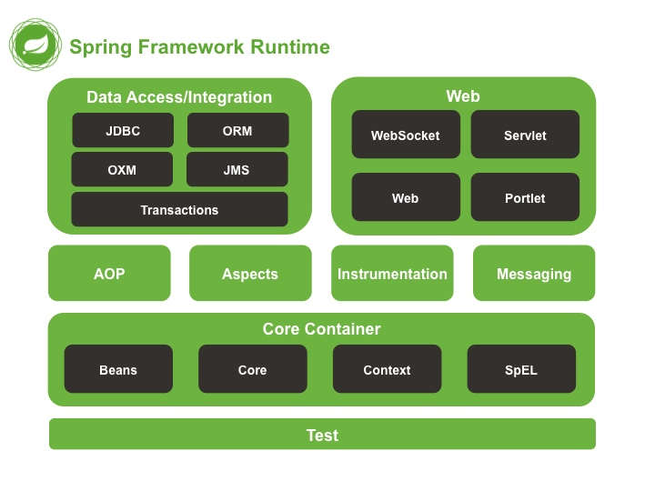
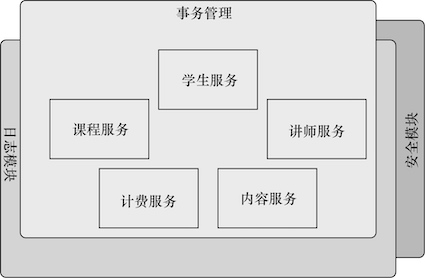
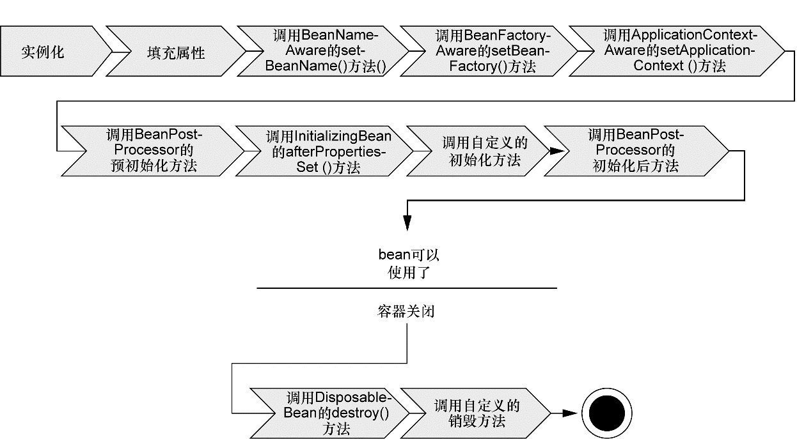

### 1 简介

[Spring](http://spring.io)是一个开源框架，为简化企业级应用开发而生，使用Spring可以让简单的JavaBean实现以前只有EJB才能实现的功能。

* 方便解耦，简化开发：可以将所有对象创建和依赖关系维护，交给Spring管理
* AOP编程的支持：可以方便地额实现对程序进行权限拦截，运行监控等功能
* 声明式事务的支持：只需要通过配置就可以完成对事务的管理，而无需手动编程

* 方便程序的测试：支持Junit，也可以通过注解测试
* 方便继承各种优秀框架：提供了对各种优秀框架(structs, hibernate, mybatis)的直接支持
* 降低Java EE API的使用难度：对一些非常难用的API(JDBC, JavaMail, 远程调用等)，都提供了封装，使这些API应用难度大大降低

#### Spring模块




Spring核心容器：Spring 框架最核心的部分，它管理者Spring应用中bean的创建、配置和管理。


底层实现原理

通过配置文件+反射实现松耦合

#### 控制反转

控制反转(Inversion of Control, IOC)，将原本在程序中手动创建对象的控制权，交给Spring

传统方式中，每个对象负责管理与自己相护协作的对象的引用，将会导致高度耦合且难以测试的代码。

HelloTest类中使用UserService类对象

传统方式： `:::Java UserService userService = new Uservicmpl()`

使用控制反转：

```java
public void demoIOC() {
    // 使用Spring工厂
    ApplicationContext applicationContext = new 
        ClassPathXmlApplicationContext("applicationContext.xml");
    // 通过工厂获得类
    UserService userService = (UserService) applicationContext.getBean("userService");
    // 执行
    userService.sayHello();
}
```
    
    

依赖注入(Dependency Injection, DI)：在Spring创建对象的过程中，将这个对象所依赖的属性注入进去。

依赖注入会将所依赖的关系自动交给目标对象，而不是让对象自己去获取依赖。

创建应用组件之间的协作的行为通常称为装配(wiring)。Spring有多种装配bean的方式，采用XML是很常见的一种装配方式。

Spring通过应用上下文(Application Context)装载bean的定义并把它们组装起来。Spring应用上下文全权负责对象的创建和组装。

#### 面向切面编程

面向切面编程(aspect-oriented programming, AOP)允许你把遍布应用各处的功能分离出来形成可重用的组件。

系统由许多不同的组件组成，每一个组件各负责一块特定功能，除此之外还经常承担着额外的职责。诸如日志、事务管理、安全这样的系统服务(通常被称为*横切关注点*)经常会跨越多个组件。如果将这些关注点分散到多个组件中去，实现系统关注点功能的代码将会重复出现在多个组件中，还会因为那些与自身核心业务无关的代码而变得混乱。

例如下图左边的业务对象与系统级服务结合得过于紧密。每个对象不但要知道它需要记⽇志、进⾏安全控制和参与事务，还要亲⾃执⾏这些服务。


AOP能够使横切关注点模块化，并以声明的方式将它们应用到它们需要影响的组件中去。



#### 样板代码

样本代码(boilerplate code)指重复编写的代码。Spring旨在通过模板封装来消除样板式代码。Spring的JdbcTemplate使得执⾏数据库操作时，避免传统的JDBC样板代码成为了可能。


#### Spring容器

Spring的应用对象生存于Spring容器(Container)中，由Spring容器负责创建、装配、配置和管理对象的整个生命周期。Spring自带多个容器：

* bean工厂(BeanFactory)是最简单的容器，提供基本的DI支持;
* 应用上下文(ApplicationContext)基于BeanFactory构建，并提供应用框架级别的服务。

Spring自带了多种类型的应用上下文，最常用的有

* AnnotationConfigApplicationContext: 从一个或多个基于Java的配置类中加载Spring应用上下文
* AnnotationConfigWebApplicationContext: 从一个或多个基于Java的配置类中加载Spring Web应用上下文
* ClassPathXmlApplicationContext: 从类路径下的一个或多个XML配置文件中加载上下文定义，把应用上下文的定义文件作为类资源
* FileSystemXmlApplicationContext: 从文件系统下的一个或多个XML配置文件中加载上下文定义
* XmlWebApplicationContext: 从Web应用下的一个或多个XML配置文件中加载上下文定义。

下图展示了bean装载到Spring应用上下文中的一个典型的生命周期过程：



1. Spring对bean进⾏实例化；
2. Spring将值和bean的引⽤注⼊到bean对应的属性中； 
3. 如果bean实现了BeanNameAware接口，Spring将bean的ID传递给setBeanName()⽅法； 
4. 如果bean实现了BeanFactoryAware接口，Spring将调⽤setBeanFactory⽅法，将BeanFactory容器实例传⼊；
5. 如果bean实现了ApplicationContextAware接口，Spring将调⽤setApplicationContext()⽅法，将bean所在的应⽤上下⽂的引⽤传⼊进来；
6. 如果bean实现了BeanPostProcessor接口，Spring将调⽤它们的post-ProcesssBeforeInitialization()⽅法。
7. 如果bean实现了InitializaingBean接口，Spring将调⽤它们的after-PropertiesSet()⽅法;类似地，如果bean使⽤init-method声明了初始化⽅法，该⽅法也会被调⽤；
8. 如果bean实现了BeanPostProcessor接口，Spring将调⽤它们的post-ProcessAfterInitalization()⽅法；
9. 此时，bean已经准备就绪，可以被应⽤程序使⽤了，它们将⼀直驻留在应⽤上下⽂中，直到该应⽤上下⽂被销毁；
10. 如果bean实现了DisposableBean接口，Spring将调⽤它的destroy()接口⽅法。同样，如果bean使⽤destroy-method声明了销毁⽅法，该⽅法也会被调⽤。


### 2 装配Bean

在Spring中个，对象无需自己查找或创建与其所关联的其他对象，容器负责把需要相护协作的对象引用赋予各个对象，创建应用对象之间的协作关系的行为通常被称为**装配**(wiring)。

Spring从两个角度来实现自动化装配：

* 组件扫描(component scanning): Spring会自动发现应用上下文中所创建的bean
* 自动装配(autowiring): Spring自动满足bean之间的依赖

@Component注解表明该类会作为组件类，并告知Spring要为这个类创建bean。@ComponentScan注解会启动组件扫描。也通过XML来启动组件扫描，使用SpringContext命名空间的`<context:component-scan>`元素。