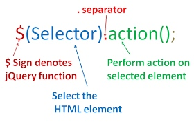
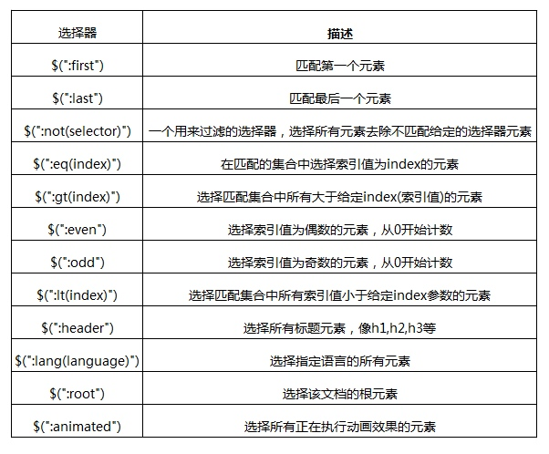
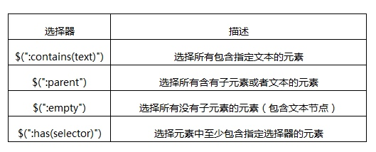
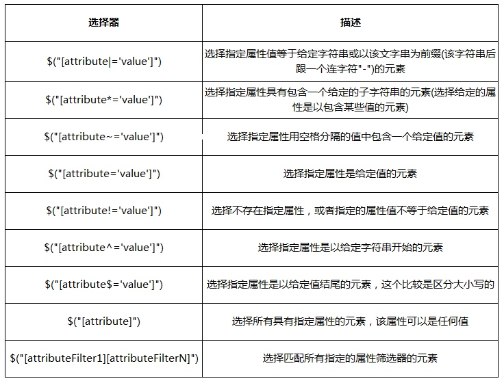
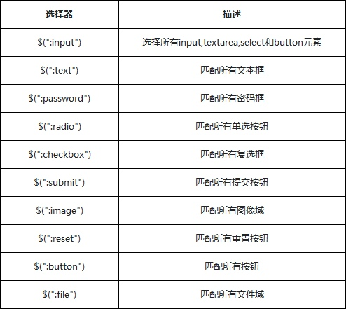
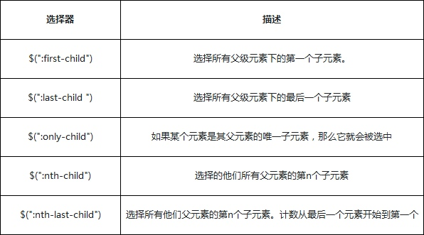

### 1 简介

[jQuery](http://jquery.com)是一个JavaScript库, 极大地简化了JavaScript编程，可以方便地处理HTML、事件、动画等，可以兼容多浏览器(开发者不用再关注兼容性)。

> jQuery is a fast, small, and feature-rich JavaScript library. It makes things like HTML document traversal and manipulation, event handling, animation, and Ajax much simpler with an easy-to-use API that works across a multitude of browsers. [[Ref](http://jquery.com)]


jQuery有多个版本：

* 压缩版本，用于上线; 非压缩版本，用于开发
* V1.x兼容性强；V2.x：不兼容IE6-8；V3.x：更精简，性能优化

如何使用？

* 关联本地jQuery：`:::html <script src="jquery-3.1.0.js"></script>`
* 从CDN载入jQuery


#### 基本语法 




* 美元符号`$`定义jQuery
* 选择器(selector)"查询"和"查找" HTML 元素
* jQuery的action()执行对元素的操作


```js
$(this).hide() - 隐藏当前元素
$("p").hide() - 隐藏所有段落
```

#### jQuery对象

`$(selector)`返回一个jQuery对象

什么是jQuery对象？

1. 是原生DOM对象的封装
2. jQuery对象和原生DOM对象不同
3. jQuery对象包含了很多方法，方便的操作DOM元素

jQuery对象是一个类数组对象，而DOM对象就是一个单独的DOM元素。可以通过数组下标和`get()`方法从jQuery对象中得到DOM对象。

```js
var $div = $('div') // jQuery对象
var div = $div[0] //转化为DOM对象
var div2 = $div.get(0) // 通过get方法，转化成DOM对象
```

也可以把DOM对象转化为jQuery对象。如果`$(DOM)`函数的参数是一个DOM对象，jQuery方法会把这个DOM对象包装成一个新的jQuery对象。

```js
var div = document.getElementByTagName("div"); //DOM对象
var $div = $(div); //jQuery对象
```


#### 链式语法

利用链式语法写起来简单，而且由于只需要查询一次，提高了性能。

```js
$('#divTest').text('Hello, world!') 
    .removeClass('blue') 
    .addClass('bold') 
    .css('color', 'red')
```

#### ready

一般要等整个HTML DOM加载以后，jQuery才能执行操作：不然有的元素还未存在，会执行错误。判断页面是否加载完毕的方法有以下两种，推荐使用第二种：

* `window.onload` 必须等待DOM和所有元素加载完成，例如图片、第三方网站加载。
* `$(document).ready()` DOM加载完成, 不用等待图片加载完成。

```js
window.onload = function () {
    console.log('onload');
}
$(document).ready(function() {
    console.log('ready');
});
```

### 2 jQuery选择器

jQuery选择器支持所有的[CSS选择器](CSS.md)。除此之外，它还有一些自定义的选择器。下面重点介绍筛选选择器。

**筛选选择器**的用法与CSS中的伪元素相似，选择器用冒号`:`开头。

#### 基本筛选选择器



!!! Example
    ```js
    $(".div:first").css("color", "#CD00CD"); //找到第一个div
    $(".div:last").css("color", "#CD00CD");  //找到最后一个div
    //:gt 选择匹配集合中所有索引值大于给定index参数的元素
    $('.aaron:gt(3)').css("border", "3px groove blue");
    //:eq 在匹配的集合中选择索引值为index的元素
    $('a:eq(2)') # 第2个a标签
    ```

#### 内容筛选选择器

通过内容筛选




#### 可见性筛选选择器


#### 属性筛选选择器



* [att=val]、[att]、[att|=val]、[att~=val]  属于CSS 2.1规范
* [ns|attr]、[att^=val]、[att*=val]、[att$=val] 属于CSS3规范
* [name!="value"]  属于jQuery 扩展的选择器


#### 表单元素选择器



!!! example
    ```js
    //匹配所有input元素中类型为text的input元素
    $("input:text").css("background", "#A2CD5A");
    ```

#### 子元素筛选选择器




* `:first`只匹配一个单独的元素，但是`:first-child`选择器可以匹配多个：即为每个父级元素匹配第一个子元素。这相当于:`nth-child(1)`
* `:last`只匹配一个单独的元素， `:last-child` 选择器可以匹配多个元素：即，为每个父级元素匹配最后一个子元素
* 如果子元素只有一个的话，`:first-child`与`:last-child`是同一个
* `:only-child`匹配某个元素是父元素中唯一的子元素，就是说当前子元素是父元素中唯一的元素，则匹配
* jQuery实现:`nth-child(n)`是严格来自CSS规范，所以n值是“索引”，也就是说，从1开始计数，`:nth-child(index)`从1开始的，而`eq(index)是`从0开始的
* `nth-child(n)`与`:nth-last-child(n)`的区别前者是从前往后计算，后者从后往前计算

!!! example
    ```js
    //查找class="first-div"下的第一个a元素
    //针对所有父级下的第一个
    $('.first-div a:first-child').css("color", "#CD00CD");
    //查找class="last-div"下的倒数第二个a元素
    $('.last-div a:nth-child(2)').css("color", "red");
    ```

#### 特殊选择器$(this)

`this`与`$(this)`的区别：

* `this`，表示当前的上下文对象是一个html对象，是方法/属性的所有者，可以调用html对象所拥有的属性和方法。
* `$(this)`，代表的上下文对象是一个jquery的上下文对象，可以调用jQuery的方法和属性值。

```js
$('p').click(function(){
    //把p元素转化成jQuery的对象
    var $this= $(this) 
    $this.css('color','red')
})
```


### 3 jQuery的属性和样式

#### 属性

操作属性的[DOM方法](JavaScript.md)主要有3个，`getAttribute`方法、`setAttribute`方法和`removeAttribute`方法，就算如此在实际操作中还是会存在很多问题。而在jQuery中用一个`attr()`与`removeAttr()`就可以全部搞定了，包括兼容性问题。

`attr()`的使用方法：

* attr(传入属性名)：获取属性的值
* attr(属性名, 属性值)：设置属性的值
* attr(属性名,函数值)：设置属性的函数值
* attr(attributes)：给指定元素设置多个属性值，即：{属性名一: “属性值一” , 属性名二: “属性值二” , … … }

`removeAttr(attributeName)`: 为匹配的元素集合中的每个元素中移除一个属性。

#### HTML内容

传统方法使用`innerHTML`方法读取/修改html内容，可以使用jQuery的`.html()`, `.text()`和`.val()`方法：

`.html()`方法内部使用的是DOM的innerHTML属性来处理的，所以在设置与获取上需要注意的一个最重要的问题，这个操作是针对整个HTML内容（不仅仅是文本内容，元素标签也包含在里面)。

* `.html()`：获取集合中第一个匹配元素的HTML内容。这个函数不能用于XML文档。但可以用于XHTML文档
* `.html(htmlString)`：设置每一个匹配元素的html内容。这个函数不能用于XML文档。但可以用于XHTML文档
* `.html(function(index, oldhtml))`：return设置HTML内容的一个函数。index可选。接收选择器的 下标 位置；oldhtml可选。接收选择器的当前内容。
 
 
`.text()`：结果返回一个字符串，包含所有匹配元素的合并文本。

* `.text()`：获取匹配元素集合中每个元素的合并文本内容，包括他们的后代。这个方法对HTML和XML文档都有效。
* `.text(textString)`：设置匹配元素内容的文本
* `.text(function(index, oldtext))`：return设置文本内容的一个函数。index可选。接收选择器的 下标 位置；oldtext可选。接收选择器的当前内容。

`.val()`方法主要是用于处理表单元素的值

* `.val()`无参数，获取匹配的元素集合中第一个元素的当前值
* `.val(value)`，设置匹配的元素集合中每个元素的值
* `.val(function)` ，一个用来返回设置值的函数

```js
//选择一个表单，修改value的值
$("input[type='text']").val('修改表单的字段') 
// 设置第一个p的html
$('p:first').html($(".first-div").html()) 
// 设置最后一个p的text
$('p:last').text( $(".first-div").text()) 
```

#### 类名

通过动态改变类名(class)，可以让其修改元素呈现出不同的效果。在HTML结构中里，多个class以空格分隔，当一个标签含有多个class时，DOM元素响应的className属性获取的不是class名称的数组，而是一个含有空格的字符串，这就使得多class操作变得很麻烦。jQuery增加了一个`.addClass()`方法，用于动态增加class类名。

* `.addClass(className)` : 为每个匹配元素增加的一个或多个class
* `.addClass(function(index, currentClass))` : 这个函数返回一个或更多用空格隔开的要增加的class

```js
//找到所有的div，然后通过addClass设置颜色，根据返回的className的判断，
$("div").addClass(function(index, className) {
    //找到类名中包含了imooc的元素
    if(-1 !== className.indexOf('xp')){
        //this指向匹配元素集合中的当前元素
        $(this).addClass('xpClass')
    }
});
```

类似的有`removeClass()`(移除类名)，`toggleClass()`(切换类名)。


#### 样式

通过JavaScript获取DOM元素上的style属性，可以动态的给元素赋予样式属性。在jQuery中可以直接使用`css()`方法动态的修改style属性。

```js
//字体大小都会转化成统px大小 em=>px
$('p:eq(1)').text( $('.first').css('font-size') )
//获取尺寸，传入CSS属性组成的一个数
var value = $('.first').css(['width', 'height']);
```