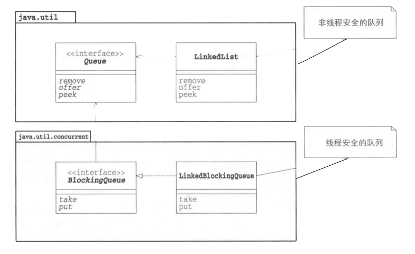

> 如果执行现在的处理会造成问题，就让执行处理的线程进行等待，这就是Guarded Suspension模式。


### 示例程序

| 名字 | 说明 |
| --- | --- |
| Request | 表示一个请求的类 |
| RequestQueue |	 依次存放请求的类 |
| ClientThread | 发送请求的类 |
| ServerThread | 接收请求的类 |
| Main | 测试程序行为的类 |


```Java tab="Request"
public class Request {
    private final String name;
    public Request(String name) {
        this.name = name;
    }
    public String getName() {
        return name;
    }
    public String toString() {
        return "[ Request " + name + " ]";
    }
}
```

```Java tab="RequestQueue"
public class RequestQueue {
    private final Queue<Request> queue = new LinkedList<Request>();
    public synchronized Request getRequest() {
        while (queue.peek() == null) {
            try { wait();} 
            catch (InterruptedException e) {}
        }
        return queue.remove();
    }
    public synchronized void putRequest(Request request) {
        queue.offer(request);
        notifyAll();
    }
}
```

```Java tab="ServerThread"
public class ServerThread extends Thread {
    private final Random random;
    private final RequestQueue requestQueue;
    public ServerThread(RequestQueue requestQueue, 
                        String name, long seed) {
        super(name);
        this.requestQueue = requestQueue;
        this.random = new Random(seed);
    }
    public void run() {
        for (int i = 0; i < 10000; i++) {
            Request request = requestQueue.getRequest();
            System.out.println(Thread.currentThread().getName() 
                                + " handles  " + request);
            try { Thread.sleep(random.nextInt(1000));
            } catch (InterruptedException e) {}
        }
    }
}
```

```Java tab="ClientThread"
import java.util.Random;

public class ClientThread extends Thread {
    private final Random random;
    private final RequestQueue requestQueue;
    public ClientThread(RequestQueue requestQueue, 
                            String name, long seed) {
        super(name);
        this.requestQueue = requestQueue;
        this.random = new Random(seed);
    }
    public void run() {
        for (int i = 0; i < 10000; i++) {
            Request request = new Request("No." + i);
            System.out.println(Thread.currentThread().getName() 
                                        + " requests " + request);
            requestQueue.putRequest(request);
            try { Thread.sleep(random.nextInt(1000));
            } catch (InterruptedException e) {}
        }
    }
}
```

* `Request`类用于表示请求
* `RequestQueue`类用于依次存放请求。
    * `getRequest`方法会取出最先存放在`RequestQueue`中的一个请求，作为返回值，如果一个请求都没有，那就一直等待，知道其他线程执行`putRequest`
    * `putRequest`方法用于添加一个请求。
    * `getRequest`和`putRequest`都是`synchronized`方法 
* ClientThread类用于表示发送请求的线程，持有`RequestQueue`实例，并连续调用该实例的`putRequest`，放入亲故。
* ServerThread类用于表示接收请求的线程，也持有`RequestQueue`实例，用`getRequest`方法接收请求。


在执行`getRequest`方法时，必须满足Guarded Suspension模式的守护条件(guard condition): `:::Java queue.peek() != null`。当守护条件不成立`:::Java queue.peek() == null`时，绝对不会继续执行getRequest方法中的while之后的语句。

那什么时候守护条件成立呢？当`putRequest`中的`notifyAll`被调用时。

#### 使用LinkedBlockingQueue

LinkedBlockingQueue与RequestQueue功能类似。由于take方法和put方法已经考虑了互斥处理，所以getRequest方法和putRequest方法也就无需声明为synchronized方法。

```Java
public class RequestQueue {
    private final BlockingQueue<Request> queue = 
                new LinkedBlockingQueue<Request>();
    public Request getRequest() {
        Request req = null;
        try { req = queue.take();
        } catch (InterruptedException e) { }
        return req;
    }
    public void putRequest(Request request) {
        try { queue.put(request);
        } catch (InterruptedException e) { }
    }
}
```



`LinkedBlockingQueue.take`使用了原子类型AtomicInteger和重入锁ReentrantLock来保证线程安全：

```Java
public E take() throws InterruptedException {
    E x;    // 定义x
    int c = -1;
    final AtomicInteger count = this.count; // 队列大小
    final ReentrantLock takeLock = this.takeLock; // 获取出队锁
    takeLock.lockInterruptibly();  // lock
    try {
        // 如果没有元素，一直阻塞
        while (count.get() == 0) {
            // 加入等待队列， 一直等待条件notEmpty（即被其他线程唤醒）
            // 唤醒其实就是，有线程将一个元素入队了，
            // 然后调用notEmpty.signal()唤醒其他等待这个条件的线程，同时队列也不空了
            notEmpty.await();
        }
        x = dequeue(); //出队
        c = count.getAndDecrement(); // 队列大小 -1
        if (c > 1) // 通知队列非空
            notEmpty.signal();
    } finally { //unlock
        takeLock.unlock();
    }
    if (c == capacity)
        signalNotFull();
    return x;
}
```


