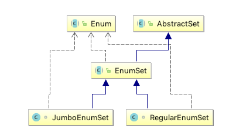

When you create an `enum`, an associated class is produced for you by the compiler. This class is automatically **inherited** from `java.lang.Enum`.

```Java
public abstract class Enum<E extends Enum<E>> extends Object
        implements Comparable<E>, Serializable 
```

The definition means that the type argument for `enum` has to derive from an `enum` which itself has the same type argument.  So if I've got an `enum` called `StatusCode`, it would be equivalent to [[ref](https://stackoverflow.com/questions/211143/java-enum-definition)]:

```Java
public class StatusCode extends Enum<StatusCode>
```


#### Using static imports with enums

The `static` import brings all the `enum` instance identifiers into the local namespace, so they don’t need to be qualified.

```Java
// Spiciness.java
public enum Spiciness {
  NOT, MILD, MEDIUM, HOT, FLAMING
}
// Burrito.java
import static Spiciness.*;
public class Burrito {
    Spiciness degree;
    public Burrito(Spiciness degree) { this.degree = degree;}
    public String toString() { return "Burrito is "+ degree;}
    public static void main(String[] args) {
        System.out.println(new Burrito(NOT));
        System.out.println(new Burrito(HOT));
    } 
}
```

#### Adding methods to an enum

Except for the fact that you can’t inherit from it, an `enum` can be treated much like a regular class. This means that you can add methods to an  `enum` . It’s even possible for an  `enum`  to have a `main()`. Notice that if you are going to define methods you must end the sequence of `enum` instances with a semicolon.

```Java
public enum OzWitch {
    // Instances must be defined first, before methods:
    WEST("Miss Gulch, aka the Wicked Witch of the West"),
    SOUTH("Good by inference, but missing");  // end with a ;
    private String description;
    // Constructor must be package or private access:
    // 定义构造器，初始化OzWitch(description)
    private OzWitch(String description) {
        this.description = description;
    }
    public String getDescription() { return description; }
    public static void main(String[] args) {
        for (OzWitch witch : OzWitch.values())
        print(witch + ": " + witch.getDescription());
    }
}
```

Also you can overriding `enum` methods.


#### The mystery of values()

The method `values()` is a static method that is added by the compiler.

> The compiler automatically adds some special methods when it creates an enum. For example, they have a static `values()` method that returns an array containing all of the values of the enum in the order they are declared. This method is commonly used in combination with the for-each construct to iterate over the values of an enum type. [[Java Tutorials - Enum Type](https://docs.oracle.com/javase/tutorial/java/javaOO/enum.html)]


#### Implements, not inherits

All `enum`s extend `java.lang.Enum`. Since Java does not support multiple inheritance, this means that you cannot create an `enum` via inheritance. However, it is possible to create an `enum` that implements one or more interfaces.


#### Using EnumSet instead of flags

The `EnumSet` was added to Java SE5 to work in concert with `enum`s to create a replacement for traditional `int`-based "bit flags." The `EnumSet` is designed for speed, because it must compete effectively with bit flags. Internally, it is represented by (if possible) a **single** `long` that is treated as a bit-vector, so it’s extremely fast and efficient.


```Java
package java.util;
public abstract class EnumSet<E extends Enum<E>> extends AbstractSet<E>
    implements Cloneable, java.io.Serializable
```

`EnumSet`s are built on top of `long`s, a `long` is 64 bits, and each `enum` instance requires one bit to indicate presence or absence. This means you can have an `EnumSet`  for an `enum` of up to 64 elements without going beyond the use of a single `long`.

`EnumSet`是一个抽象类，不能直接通过`new`新建，不过提供了若干静态工厂方法([参见Effective Java Item 1](../Effective Java/2 Creating and Destroying Objects.md))(`noneof()`, `allof()`等)。

当`EnumSet`大于64个时，其内部采用`JumboEnumSet`，否则采用`RegularEnumSet`:
（jumbo/'dʒʌmbo/是巨大的意思)

```Java
// Java JDK 10 源代码
// The class of all the elements of this set.
final Class<E> elementType;
// All of the values comprising T.  (Cached for performance.)
final Enum<?>[] universe;
// Creates an empty enum set with the specified element type.
// 静态工厂方法
public static <E extends Enum<E>> EnumSet<E> noneOf(Class<E> elementType) {
    Enum<?>[] universe = getUniverse(elementType);
    if (universe == null)
        throw new ClassCastException(elementType + " not an enum");
    if (universe.length <= 64)
        return new RegularEnumSet<>(elementType, universe);
    else
        return new JumboEnumSet<>(elementType, universe);
}
```



对于`RegularEnumSet`，它用一个`long`类型表示位向量;对于`JumboEnumSet`，它用一个`long`数组表示。

```Java
// RegularEnumSet.java
// Bit vector representation of this set.  
// The 2^k bit indicates the presence of universe[k] in this set.
private long elements = 0L;

// JumboEnumSet.java
// Bit vector representation of this set.  The ith bit of the jth
// element of this array represents the  presence of universe[64*j +i]
// in this set.
private long elements[];
```


#### Using EnumMap

An `EnumMap` is a specialized `Map` that requires that its keys be from a single `enum`. Because of the constraints on an `enum`, an `EnumMap` can be implemented internally as an array. Thus they are extremely fast, so you can freely use `EnumMaps` for enum-based lookups.

```Java
public class EnumMap<K extends Enum<K>, V> extends AbstractMap<K, V>
    implements java.io.Serializable, Cloneable
private final Class<K> keyType;
// Array representation of this map.
private transient Object[] vals;
```

`key`其实就是`Enum.ordinal()`(返回枚举项在枚举类中出现的序号)，所以实际上`EnumMaps`就是一个数组，如果要查询某个`key`是否存在：

```Java
public boolean containsKey(Object key) {
    return isValidKey(key) && vals[((Enum<?>)key).ordinal()] != null;
}
```

再来看看`put()`方法：

```Java
public V put(K key, V value) {
    typeCheck(key);

    int index = key.ordinal();
    Object oldValue = vals[index];
    vals[index] = maskNull(value);
    if (oldValue == null)
        size++;
    return unmaskNull(oldValue);
}
```