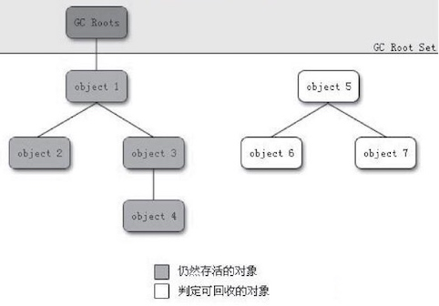
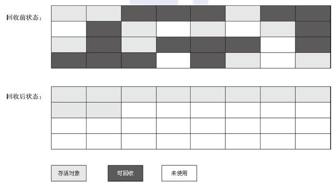
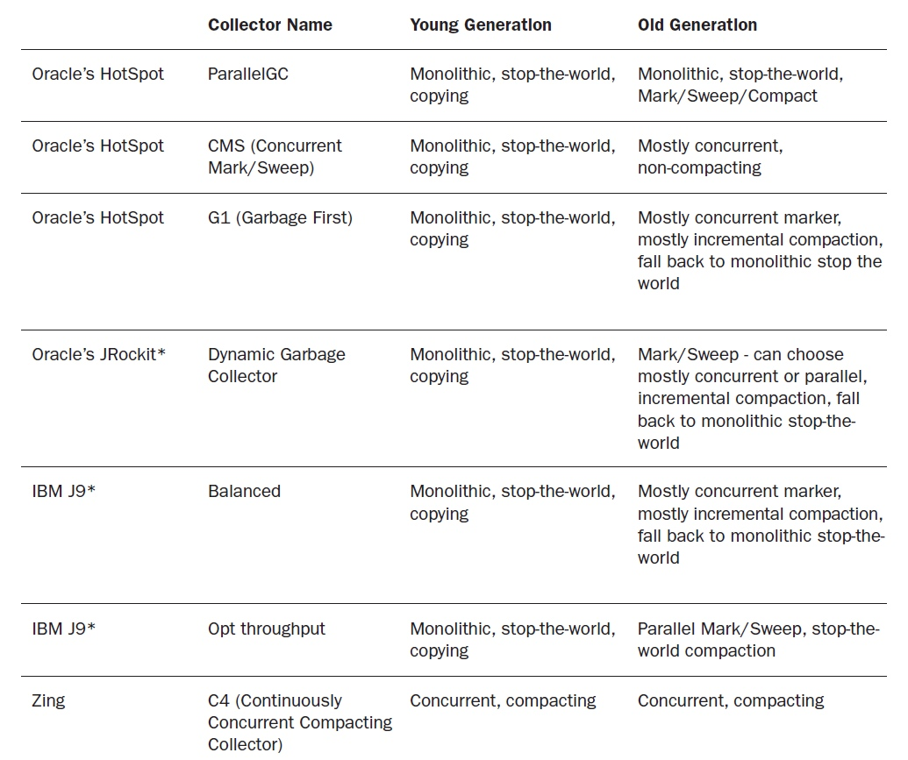
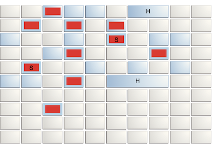

### 1概述

⽬前内存的动态分配与内存回收技术已经相当成熟，那为什么我们还要去了解GC和内存分配呢？答案很简单：当需要排查各种内存溢出、内存泄漏问题时，当垃圾收集成为系统达到更⾼并发量的瓶颈时，我们就需要对这些“⾃动化”的技术实施必要的监控和调节。


监控和调节的必要性：


以下几个区域的内存分配和回收都具备确定性，不需要过多考虑回收的问题，因为方法结束或者线程结束，内存自然就跟随着回收了。

* Java内存的程序计数器、虚拟机栈、本地方法栈3个区域随线程而生，随线程而灭
* 栈中的栈帧随着方法的进入和退出而有条不紊地执行着入栈和出栈操作。每一个栈帧中分配多少内存基本上是在类结构确定下来时就已知的


Java堆和方法区则不一样，一个接口中的多个实现类需要的内存可能不一样，一个方法中的多个实现类需要的内存可能不一样，一个方法中的多个分支需要的内存也可能不一样，只有在程序处于运行期间时才能知道会创建哪些对象，这部分内存的分配和回收是动态的，垃圾收集器所关注的是这部分的内存。

### 2 对象已死吗

垃圾收集器在对堆进⾏回收前，第⼀件事情就是要确定这些对象之中哪些还“存活”着，哪些已经“死去”（即不可能再被任何途径使⽤的对象）。

#### 引用计数算法

**引用计数**(Reference Counting)算法： 给对象中添加⼀个引⽤计数器，每当有⼀个地⽅引⽤它时，计数器值就加1；当引⽤失效时，计数器值就减1；任何时刻计数器为0的对象就是不可能再被使⽤的。它的实现简单，判定效率也很高，在大部分情况下它都是一个不错的算法。

但是至少主流的Java虚拟机里面没有选用计数算法来管理内存，其中主要原因是它很难解决对象之间互相循环引用的问题。

#### 可达性分析算法

在主流的商⽤程序语⾔(Java、C#，甚⾄包括前⾯提到的古⽼的Lisp)的主流实现中，都是称通过**可达性分析**(Reachability Analysis)来判定对象是否存活的。

通过一系列的称为"GC Roots"(Garbage Collection Roots)的对象作为起始点，从这些节点开始向下搜索，搜索所走过的路径称为**引用链**(Reference Chain)，当一个对象到GC Roots没有任何引用链相连时，则证明此对象是不可用的。


如下图所⽰，对象object 5、object 6、object 7虽然互相有关联，但是它们到GC Roots是不可达的，所以它们将会被判定为是可回收的对象。




在Java语言中，可作为GC Roots的对象包括下面几种：

*   虚拟机栈(栈帧中的本地变量表)中引用的对象。
*   方法区中类静态属性引用的对象。
*   方法区中常量引用的对象。
*   本地方法栈中JNI(Java本地接口)引用的对象。

#### 再谈引用

在JDK1.2之后，Java对引用的概念进行了扩充，将引用分为强引用(Strong Reference)、软引用(Soft Reference)、弱引用(Weak Reference)、虚引用(Phantom Reference)4种，这4种引用强度依次逐渐减弱。

* 强引用就是指在程序代码之中普遍存在的，类似`:::Java Object obj = new Object()`这类的引用，只要强引用还存在，垃圾收集器永远不会回收掉被引用的对象。
* 软引用是用来描述一些还有用但并非必需的对象。对于软引用关联着的对象，在系统将要发生内存溢出异常之前，将会把这些对象列进回收范围之中进行第二次回收。如果这次回收还没有足够的内存，才会抛出内存溢出异常。用<C>SoftReference</C>类来实现软引用。
* 弱引用也是用来描述非必需对象的，但是它的强度比软引用更弱一些，被弱引用关联的对象只能生存到下一次垃圾收集发生之前。当垃圾收集器工作时，无论当前内存是否足够，都会回收掉只被弱引用关联的对象。用<C>WeakReference</C>类来实现弱引用。
* 虚引用也称为幽灵引用或者幻影引用，它是最弱的一种引用关系。一个对象是否有虚引用的存在，完全不会对其生存时间构成影响，也无法通过虚引用来取得一个对象实例。为一个对象设置虚引用关联的唯一目的就是能在这个对象被收集器回收时收到一个系统通知。有<C>PhantomReference</C>类来实现虚引用。
    

#### 生存还是死亡

即使在可达性分析算法中不可达的对象，也并非是“非死不可”的，这时候它们暂时处于“缓刑”阶段，要真正宣告一个对象死亡，至少要经历两次标记过程：如果对象在进行可达性分析后发现没有与GC Roots相连接，那么它将会被第一次标记且进行一次刷选，刷选的条件是此对象是否有必要执行<C>finalize</C>方法。当对象没有覆盖<C>finalize</C>方法，或者<C>finalize</C>方法已经被虚拟机调用过，虚拟机将这两种情况都视为“没有必要执行”。

被判定有必要执行<C>finalize</C>方法的对象将被放置与F-Queue的队列中。并在稍后由一个虚拟机自动建立的、低优先级的<C>Finalizer</C>线程去执行它。这个执行并不会等待其运行结束，防止阻塞和崩溃。<C>finalize()</C>方法是对象逃过死亡命运的最后一次机会，稍后GC将对F-Queue中的对象进行第二次小规模的标记，如果对象要在<C>finalize</C>方法中拯救自己---只要重新与引用链上的任何一个对象建立关联即可。但是一个对象的<C>finalize()</C>方法只能被执行一次。

```Java
/**
 * 此代码演示了两点：
 * 1.对象可以在被GC时自我拯救。
 * 2.这种自救的机会只有一次，因为一个对象的finalize()方法最多只会被系统自动调用一次
 * @author zzm
 */

public class FinalizeEscapeGC {

    public static FinalizeEscapeGC SAVE_HOOK = null;

    public void isAlive() {
        System.out.println("yes, i am still alive :)");
    }

    @Override
    protected void finalize() throws Throwable {
        super.finalize();
        System.out.println("finalize method executed!");
        FinalizeEscapeGC.SAVE_HOOK = this;
    }

    public static void main(String[] args) throws Throwable {
        SAVE_HOOK = new FinalizeEscapeGC();

        //对象第一次成功拯救自己
        SAVE_HOOK = null;
        System.gc();
        // 因为Finalizer方法优先级很低，暂停0.5秒，以等待它
        Thread.sleep(500);
        if (SAVE_HOOK != null) {
            SAVE_HOOK.isAlive();
        } else {
            System.out.println("no, i am dead :(");
        }

        // 下面这段代码与上面的完全相同，但是这次自救却失败了
        SAVE_HOOK = null;
        System.gc();
        // 因为Finalizer方法优先级很低，暂停0.5秒，以等待它
        Thread.sleep(500);
        if (SAVE_HOOK != null) {
            SAVE_HOOK.isAlive();
        } else {
            System.out.println("no, i am dead :(");
        }
    }
}
// output: 
// finalize method executed!
// yes, i am still alive :)
// no, i am dead :(
```

⼤家尽量避免使⽤<C>finalize()</C>方法，因为它不是C/C++中的析构函数，⽽是Java刚诞⽣时为了使C/C++程序员更容易接受它所做出的⼀个妥协。它的运⾏代价⾼昂，不确定性⼤，⽆法保证各个对象的调⽤顺序。

#### 回收方法区

永久代的垃圾回收主要回收两部分内容：废弃常量和无用的类。

回收废弃常量与回收Java堆中的对象非常类似。以常量池中字面量的回收为例，如果没有任何对象引用常量池中的常量，也没有其他地方引用，如果这是发生内存回收，而且必要的话，就会被系统清理出常量池。

判断一个类是否是“无用的类”的条件则相对苛刻许多，需要满足下面3个条件：

*   该类所有的实例都已经被回收，也就是java堆中不存在该类的任何实例。
*   加载该类的<C>ClassLoader</C>已经被回收
*   该类对应的<C>Class</C>对象没有在任何地方被引用，无法在任何地方通过反射访问该类的方法。

虚拟机可以对满⾜上述3个条件的⽆⽤类进⾏回收，这⾥说的仅仅是“可以”，⽽并不是和对象⼀样，不使⽤了就必然会回收。

是否对类进行回收，HotSpot虚拟机提供了`-Xnoclassgc`参数进行控制，还可以使用`-verbose:class`以及`-XX:+TraceClassLoading`、`-XX:+TraceClassUnLoading`查看类加载和卸载信息，，其中`-verbose:class`和`-XX:+TraceClassLoading`可以在Product版的虚拟机中使用，`-XX:+TraceClassUnLoading`参数需要FastDebug版的虚拟机支持。

在大量使用反射、动态代理、CGLib等ByteCode框架、动态生成JSP以及OSGi这类频繁自定义<C>ClassLoader</C>的场景都需要虚拟机具备类卸载的功能，以保证永久代不会溢出。

### 3 垃圾收集算法

#### 标记-清除算法

最基础的收集算法是**标记-清除**(Mark-Sweep)算法。算法分为标记和清除两个阶段：首先标记出所有需要回收的对象，在标记完成后统一回收所有被标记的对象，它的标记过程就是使用可达性算法进行标记的。

它的主要不⾜有两个：

* 效率问题，标记和清除两个过程的效率都不高
* 空间问题，标记清除之后会产生大量不连续的内存碎片，空间碎⽚太多可能会导致以后在程序运⾏过程中需要分配较⼤对象时，⽆法找到⾜够的连续内存⽽不得不提前触发另⼀次垃圾收集动作


#### 复制算法

**复制算法**(Copying)：将可用内存按照容量分为大小相等的两块，每次只使用其中的一块。当这一块的内存用完了，就将还存活着的对象复制到另一块上面，然后把已使用过的内存空间一次清理掉。这样使得每次都是对整个半区进⾏内存回收，内存分配时也就不⽤考虑内存碎⽚等复杂情况，只要移动堆顶指针，按顺序分配内存即可，实现简单，运⾏⾼效。只是这种算法的代价是将内存缩⼩为了原来的⼀半，未免太⾼了⼀点。复制收集算法在对象存活率较⾼时就要进⾏较多的复制操作，效率将会变低。


现在的商业虚拟机都采⽤这种收集算法来回收年轻代，IBM公司的专门研究表明，年轻代中的对象98%是“朝⽣夕死”的，所以并不需要按照1:1的⽐例来划分内存空间，⽽是将内存分为⼀块较⼤的Eden空间和两块较⼩的Survivor空间，每次使⽤Eden和其中⼀块Survivor。当回收时，将Eden和Survivor中还存活着的对象⼀次性地复制到另外⼀块Survivor空间上，最后清理掉Eden和刚才⽤过的Survivor空间。HotSpot虚拟机默认Eden和Survivor的⼤⼩⽐例是8:1，也就是每次年轻代中可⽤内存空间为整个年轻代容量的90%（80%+10%），只有10%的内存会被“浪费”。

当Survivor空间不够⽤时，需要依赖其他内存(这⾥指⽼年代)进⾏分配担保(Handle Promotion)。如果另外⼀块Survivor空间没有⾜够空间存放上⼀次年轻代收集下来的存活对象时，这些对象将直接通过分配担保机制进⼊⽼年代。


#### 标记-整理算法

**标记整理算法**(Mark-Compact)，标记过程仍然和“标记-清除”一样，但后续不是直接对可回收对象进行清理，而是让所有存活对象向一端移动，然后直接清理掉端边界以外的内存。



#### 分代收集算法

当前商业虚拟机的垃圾收集都采⽤**分代收集**(Generational Collection)算法。根据对象存活周期的不同将内存分为几块。一般把Java堆分为年轻代和老年代，根据各个年代的特点采用最合适的收集算法。在年轻代中，每次垃圾收集时有大批对象死去，只有少量存活，可以选用复制算法。而老年代对象存活率高，使用标记清理或者标记整理算法。

####  当前商用实现

这是现有的商用GC对应的算法：




### 4 HotSpot的算法实现

在HotSpot虚拟机上实现垃圾回收算法时，必须对算法的执⾏效率有严格的考量，才能保证虚拟机⾼效运⾏。


#### 枚举根节点

从可达性分析中从GC Roots节点找引⽤链这个操作为例，可作为GC Roots的节点主要在全局性的引⽤（例如常量或类静态属性）与执⾏上下⽂ （例如栈帧中的本地变量表）中，现在很多应⽤仅仅⽅法区就有数百兆， 如果要逐个检查这⾥⾯的引⽤，那么必然会消耗很多时间。

可达性分析对执⾏时间的敏感还体现在GC停顿上，因为这项分析⼯作必须在⼀个能确保⼀致性的快照中进⾏——这⾥**⼀致性**的意思是指在整个分析期间整个执⾏系统看起来就像被冻结在某个时间点上，不可以出现分析过程中对象引⽤关系还在不断变化的情况，该点不满⾜的话分析结果准确性就⽆法得到保证。这点是导致GC进⾏时必须停顿所有Java执⾏线程（Sun将这件事情称为“Stop The World”）的其中⼀个重要原因，即使是在号称(⼏乎)不会发⽣停顿的CMS收集器中，**枚举根节点时也是必须要停顿的**。


在HotSpot的实现中，是使⽤⼀组称为OopMap的数据结构来达到这个⽬的的，在类加载完成的 时候，HotSpot就把对象内什么偏移量上是什么类型的数据计算出来，在JIT(即时编译器)编译过程中，也会在特定的位置记录下栈和寄存器中哪些位置是引⽤。 这样，GC在扫描时就可以直接得知这些信息了。


#### 安全点

如果为每⼀条指令都⽣成对应的OopMap，那将会需要⼤量的额外空间，这样GC的空间成本将会变得很⾼。实际上，HotSpot没有为每条指令都生成OopMap，而只是在“特定的位置”记录了这些信息，这些位置称为**安全点**(Safepoint)，**即程序执行时并非在所有地方都能停顿下来开始GC，只有在到达安全点时才能暂停**。Safepoint的选定既不能太少以至于让GC等待时间太长，也不能过于频繁以致于过分增大运行时的负荷。所以，安全点的选定基本上是以程序“是否具有让程序长时间执行的特征”为标准选定的----因为每条指令执行的时间都非常短暂，程序不太可能因为指令流长度太长这个原因而过长时间运行，“长时间执行”的最明显特征就是指令序列复用，例如方法调用、循环跳转、异常跳转等，所以具有这些功能的指令才会产生Safepoint。

由于GC时，需要所有线程在安全点中断，一种是抢占式中断；另一种是主动式中断，其中抢占式中断就是在GC发生时，首先把所有线程全部中断，如果发现有线程不在安全点，就恢复线程，让它跑到安全点上。现在⼏乎没有虚拟机实现采⽤抢先式中断来暂停线程从⽽响应GC事件。而主动式中断的思想不是直接对线程操作，仅仅是简单设置一个标志，各个线程执行时主动去轮询这个标志，发现中断标志为真时就自己中断挂起。轮询标志的地方和安全点是重合的。

#### 安全区域

有了安全点之后，也不能完美地解决GC的问题，但实际情况却不一定。当程序没有被分配cpu时间，典型的例子就是线程处于sleep或者blocked状态，这个时候线程无法响应JVM的中断请求，“走”到安全点挂起。对于这种情况，就需要安全区域来解决。

**安全区域**(Safe Region)是指在一段代码片段之中，引用关系不会发生变化。在这个区域中的任意地方开始GC都是安全的，我们也可以把Safe Region看做是被扩展的Safepoint。


### 5 垃圾收集器
    
  

    
    
    
    
如果说垃圾收集算法是内存回收的⽅法论，那么垃圾收集器就是内存回收的具体实现。下面是Sun HotSpot虚拟机1.6版本Update22包含的7种作⽤于不同分代的收集器。如果两个收集器之间存在连线，就说明它们可以搭配使⽤。虚拟机所处的区域，则表⽰它是属于年轻代收集器还是⽼年代收集器。


#### Serial Collector

Serial收集器是单线程收集器。它进行垃圾收集时，**必须暂停其他所有的工作线程，直到它收集结束**。实际上到现在为⽌，它依然是虚拟机运⾏在Client模式下的默认年轻代收集器。

它有着优于其他收集器的地⽅：简单⽽⾼效(与其他收集器的单线程⽐)，对于限定单个CPU的环境来说， Serial收集器由于没有线程交互的开销，专⼼做垃圾收集⾃然可以获得最⾼的单线程收集效率。在⽤户的桌⾯应⽤场景中，分配给虚拟机管理的内存 ⼀般来说不会很⼤，收集⼏⼗兆甚⾄⼀两百兆的年轻代(仅仅是年轻代使⽤的内存，桌⾯应⽤基本上不会再⼤了)，停顿时间完全可以控制在⼏⼗毫秒最多⼀百多毫秒以内，只要不是频繁发⽣，这点停顿是可以接受的。所以，Serial收集器对于运⾏在Client模式下的虚拟机来说是⼀个很好的选择。

Serial/Serial Old收集器运⾏⽰意图


#### ParNew收集器


ParNew收集器其实就是Serial收集器的多线程版本，除了使⽤多条线程进⾏垃圾收集之外，其余⾏为都与Serial收集器完全⼀样。


ParNew/Serial Old收集器运⾏⽰意图：
　


它是许多运⾏在Server模式下的虚拟机中⾸选的年轻代收集器，其中有⼀个与性能⽆关但很重要的原因是，除了Serial收集器外，⽬前只有它能与CMS收集器配合⼯作。

#### Parallel Scavenge收集器

Parallel Scavenge收集器的⽬标则是达到⼀个可控制的吞吐量(Throughput)。所谓吞吐量就是CPU⽤于运⾏⽤户代码的时间与CPU总消耗时间的⽐值，即吞吐量=运⾏⽤户代码时间/（运⾏⽤户代码时间+垃圾收集时间，虚拟机总共运⾏了100分钟，其中垃圾收集花掉1分钟，那吞吐量就是99%。


停顿时间越短就越适合需要与⽤户交互的程序，良好的响应速度能提升⽤户体验，⽽⾼吞吐量则可以⾼效率地利⽤CPU时间，尽快完成程序的 运算任务，主要适合在后台运算⽽不需要太多交互的任务。


#### Serial Old 收集器

Serial Old是Serial收集器的老年代版本，它同样是单线程的。使用“标记-整理”算法。

这个收集器的主要意义也是在于给Client模式下的虚拟机使⽤。如果在Server模式下，那么它主要还有两⼤⽤途：⼀种⽤途 是在JDK 1.5以及之前的版本中与Parallel Scavenge收集器搭配使⽤ ，另⼀种⽤途就是作为CMS收集器的后备预案，在并发收集发⽣Concurrent Mode Failure时使⽤。


Serial/Serial Old收集器运⾏⽰意图


#### Parallel Old收集器

Parallel Old是Parallel Scavenge收集器的老年代版本，使用多线程和“标记-整理”算法。这个收集器是在JDK1.6中才开始提供的。

#### CMS收集器

CMS(Concurrent Mark Sweep)收集器是⼀种以获取最短回收停顿时间为⽬标的收集器。⽬前很⼤⼀部分的Java应⽤集中在互联⽹站或者B/S系统的服务端上，这类应⽤尤其重视服务的响应速度，希望系统停顿时间最短，以给⽤户带来较好的体验。CMS收集器就⾮常符合这类应⽤的需求。


CMS收集器是基于“标记—清除”算法实现的，它的运作过程相对于前⾯⼏种收集器来说更复杂⼀ 些，整个过程分为4个步骤，包括：

1. 初始标记(initial mark): 标记⼀下GC Roots能直接关联到的对象，速度很快。
2. 并发标记(concurrent marking): 进⾏GC RootsTracing的过程。
3. 重新标记(remark): 为了修正并发标记期间因⽤户程序继续运作⽽导致标记产⽣变动的那⼀部分对象的标记记录
4. 并发清理(concurrent sweep): 回收所有被标记的垃圾区域。和程序同时进行。
    


CMS是⼀款优秀的收集器，有并发收集、低停顿的优点，但有三个主要缺点：


* 对CPU资源⾮常敏感。在并发阶段，它虽然不会导致⽤户线程停顿，但是会因为占⽤了⼀部分线程（或者说CPU资源）⽽导致应⽤程序变慢，总吞吐量会降低。
* ⽆法处理浮动垃圾（Floating Garbage），可能出现“Concurrent Mode Failure”失败⽽导致另⼀次Full GC的产⽣。由于CMS并发清理阶段⽤户线程还在运⾏着，伴随程序运⾏⾃然就还会有新的垃圾不断产⽣，这⼀部分垃圾出现在标记过程之后，CMS⽆法在当次收集中处理 掉它们，只好留待下⼀次GC时再清理掉。这⼀部分垃圾就称为“**浮动垃圾**”。也是由于在垃圾收集阶段⽤户线程还需要运⾏，那也就还需要预留有 ⾜够的内存空间给⽤户线程使⽤，因此CMS收集器不能像其他收集器那样 等到⽼年代⼏乎完全被填满了再进⾏收集，需要预留⼀部分空间提供并发收集时的程序运作使⽤。要是CMS运⾏期间预留的内存⽆法满⾜程序需要，就会出现⼀次“Concurrent Mode Failure”失败，这时虚拟机将启动后备预案：临时启⽤Serial Old收集器来重新进⾏⽼年代的垃圾收集，这样停顿时间就很长了。
* 有⼤量空间碎⽚产⽣。空间碎⽚过多时，将会给⼤对象分配带来很⼤⿇烦，往往会出现⽼年代还有很⼤空间剩余，但是⽆法找到⾜够⼤的连续空间来分配当前对象，不得不提前触发⼀次Full GC。

#### G1收集器

详见[Oracle G1收集器入门](https://www.oracle.com/technetwork/tutorials/tutorials-1876574.html)

G1收集器(Garbage-First Garbage Collector)是当今收集器技术发展的最前沿成果之一。G1是一款面向服务端应用的垃圾收集器。HotSpot开发团队赋予它的使命是在未来替换CMS。

它具有以下几个特点：

* 并⾏与并发：G1能充分利⽤多CPU、多核环境下的硬件优势，使⽤多个CPU(CPU或者CPU核⼼)来缩短Stop-The-World停顿的时间，部分其他收集器原本需要停顿Java线程执⾏的GC动作，G1收集器仍然可以通过并发的⽅式让Java程序继续执⾏。
* 分代收集：与其他收集器⼀样，分代概念在G1中依然得以保留。虽然G1可以不需要其他收集器配合就能独⽴管理整个GC堆，但它能够采⽤不同的⽅式去处理新创建的对象和已经存活了⼀段时间、熬过多次GC的旧对 象以获取更好的收集效果。
* 空间整合：与CMS的"标记—清理"算法不同，G1从整体来看是基于"标记—整理"算法实现的收集器，从局部(两个Region之间)上来看是基于“复制”算法实现的，但⽆论如何，这两种算法都意味着G1运作期间不会产⽣内存空间碎⽚，收集后能提供规整的可⽤内存。这种特性有利于程序长时间运⾏，分配⼤对象时不会因为⽆法找到连续内存空间⽽提前触发下⼀次GC。
* 可预测的停顿：这是G1相对于CMS的另⼀⼤优势，降低停顿时间是G1和CMS共同的关注点，但G1除了追求低停顿外，还能建⽴可预测的停顿时间模型，能让使⽤者明确指定在⼀个长度为M毫秒的时间⽚段内，消耗在垃圾收集上的时间不得超过N毫秒，这⼏乎已经是实Java(RTSJ)的垃圾收集器的特征了。

在G1之前的其他收集器进⾏收集的范围都是整个年轻代或者⽼年代， ⽽G1不再是这样。使⽤G1收集器时，Java堆的内存布局就与其他收集器有很⼤差别，它将整个Java堆划分为多个⼤⼩相等的独⽴区域(Region)， 虽然还保留有年轻代和⽼年代的概念，但年轻代和⽼年代不再是物理隔离 的了，它们都是⼀部分Region(不需要连续)的集合。




> G1 partitions the heap into a set of equally sized heap regions, each a contiguous range of virtual memory. A region is the unit of memory allocation and memory reclamation. At any given time, each of these regions can be empty (light gray), or assigned to a particular generation, young or old. As requests for memory comes in, the memory manager hands out free regions. The memory manager assigns them to a generation and then returns them to the application as free space into which it can allocate itself.
> The young generation contains eden regions (red) and survivor regions (red with "S"). These regions provide the same function as the respective contiguous spaces in other collectors, with the difference that in G1 these regions are typically laid out in a noncontiguous pattern in memory. Old regions (light blue) make up the old generation. Old generation regions may be humongous (light blue with "H") for objects that span multiple regions.
> An application always allocates into a young generation, that is, eden regions, with the exception of humongous, objects that are directly allocated as belonging to the old generation. <small>[[HotSpot Virtual Machine Garbage Collection Tuning Guide](https://docs.oracle.com/javase/9/gctuning/JSGCT.pdf)]</small>


[HotSpot Virtual Machine Garbage Collection Tuning Guide](https://docs.oracle.com/javase/9/gctuning/JSGCT.pdf)

The following list describes the phases, their pauses and the transition between the phases of the G1 garbage collection cycle in detail:

1. Young-only phase: This phase starts with a few young-only collections that promote objects into the old generation. The transition between the young-only phase and the space-reclamation phase starts when the old generation occupancy reaches a certain threshold, the Initiating Heap Occupancy threshold. At this time, G1 schedules an Initial Mark young-only collection instead of a regular young-only collection.
    * Initial Mark : This type of collection starts the marking process in addition to performing a regular young-only collection. Concurrent marking determines all currently reachable (live) objects in the old generation regions to be kept for the following space-reclamation phase. While marking hasn’t completely finished, regular young collections may occur. Marking finishes with two special stop-the-world pauses: Remark and Cleanup.
    * Remark: This pause finalizes the marking itself, and performs global reference processing and class unloading. Between Remark and Cleanup G1 calculates a summary of the liveness information concurrently, which will be finalized and used in the Cleanup pause to update internal data structures.
    * Cleanup: This pause also reclaims completely empty regions, and determines whether a space-reclamation phase will actually follow. If a space-reclamation phase follows, the young-only phase completes with a single young-only collection.
2. Space-reclamation phase: This phase consists of multiple mixed collections that in addition to young generation regions, also evacuate live objects of sets of old generation regions. The space-reclamation phase ends when G1 determines that evacuating more old generation regions wouldn't yield enough free space worth the effort.

After space-reclamation, the collection cycle restarts with another young-only phase. As backup, if the application runs out of memory while gathering liveness information, G1 performs an in-place stop-the-world full heap compaction (Full GC) like other collectors.

#### 理解GC日志

我们先看一段GC日志：

!!! example "GC日志"

    ```text
    [GC [PSYoungGen: 8987K->1016K(9216K)] 9984K->5056K(19456K), 0.0569611 secs]
    [GC [PSYoungGen: 8038K->1000K(9216K)] 12078K->10425K(19456K), 0.0709523 secs][Times：user=0.01 sys=0.00，real=0.02 secs]
    [Full GC [PSYoungGen: 1000K->0K(9216K)] [ParOldGen: 9425K->8418K(10240K)] 10425K->8418K(19456K) [PSPermGen: 9678K->9675K(21504K)], 0.3152834 secs] 
    [Full GC [PSYoungGen: 8192K->3583K(9216K)] [ParOldGen: 8418K->9508K(10240K)] 16610K->13092K(19456K) [PSPermGen: 9675K->9675K(22016K)], 0.1913859 secs] 
    [Full GC [PSYoungGen: 7716K->7702K(9216K)] [ParOldGen: 9508K->9508K(10240K)] 17224K->17210K(19456K) [PSPermGen: 9675K->9675K(21504K)], 0.2769775 secs] 
    [Full GC [PSYoungGen: 7702K->7702K(9216K)] [ParOldGen: 9508K->9409K(10240K)] 17210K->17111K(19456K) [PSPermGen: 9675K->9675K(21504K)], 0.2491993 secs] 
    ```

*   “\[GC”和“\[full DC”说明了这次垃圾回收的停顿类型。如果是调用<C>System.gc()</C>方法所触发的收集，那么这里显示“\[Full DC(System)”.
*   \[DefNew、\[Tenured、\[Perm 表示GC发生的区域。\[DefNew表示年轻代使用Serial串行GC垃圾收集器。如果是ParNew收集器，年轻代名为“\[ParNew”。如果采用Parallel Scavenge收集器，那它配套的年轻代名为"\[PSYoungGen"。对于老年代和永久代同理。
*   \[PSYoungGen: 8987K->1016K(9216K)\] 9984K->5056K(19456K), 0.0569611 secs\]中后面的数字含义是：GC前该内存区域已使用容量->GC后Java堆已使用容量（Java堆总容量）。后面的时间是该区域GC所占用的时间，单位是秒。
*   \[Times: user=0.03 sys=0.02, real=0.06 secs\] 这里的user、sys和real与Linux的time命令所输出的时间含义一，分别代表用户态消耗的CPU时间，内核态消耗的CPU时间和操作从开始到结束所经过的墙钟时间。


### 6 内存分配与回收策略

Java技术体系中所提倡的⾃动内存管理最终可以归结为⾃动化地解决了两个问题：给对象分配内存以及回收分配给对象的内存。

对象的内存分配，往大方向讲，就是在堆上分配（但也可能经过JIT编译后被拆散为标量类型并间接地栈上分配），对象主要分配在年轻代的Eden区上，如果启动了本地线程分配缓冲，将按线程优先在TLAB上分配。少数情况下也可能会直接分配在老年代中，分配的规则并不是百分之百固定的，其细节取决于当前使用的是哪一种垃圾收集器组合，还有虚拟机中与内存相关的参数的设置。

接下来我们将会讲解几条最普遍的内存分配规则，并通过代码去验证这些规则。本节下面的代码在测试时使用Client模式虚拟机运行，没有手工指定收集器组合，换句话说，验证的是在使用Serial/Serial Old收集器下(ParNew/Serial Old收集器组合的规则也基本一致)的内存分配和回收的策略。

#### 对象优先在Eden分配

大多数情况下，对象在年轻代Eden区中分配。当Eden区没有足够空间进行分配时，虚拟机将发起一次**Minor GC**。

虚拟机提供了`-Xlog:gc*`这个收集器日志参数(`-XX：+PrintGCDetails`已过时)，告诉虚拟机在发生垃圾收集行为时打印内存回收日志，并且在进程退出的时候输出当前的内存各区域分配情况。

!!! example 
    
    例子中的<C>testAllocation()</C>方法中，尝试分配3个2MB大小和1个4MB大小的对象，在运行时通过`-Xms20M`、 `-Xmx20M`、` -Xmn10M`这3个参数限制了Java堆大小为20MB，不可扩展，其中10MB分配给年轻代，剩下的10MB分配给老年代。`-XX:SurvivorRatio=8`决定了年轻代中Eden区与一个Survivor区的空间比例是8∶1，从输出的结果也可以清晰地看到"eden space 8192K、from space 1024K、to space 1024K"的信息，年轻代总可用空间为9216KB（Eden区+1个Survivor区的总容量）。

    ```Java tab="java"
    //VM参数: -Xms20M -Xmx20M -Xmn10M -Xlog:gc* -XX:SurvivorRatio=8 -XX:+UseSerialGC
    public class TestAllocation {
        private static final int _1MB = 1024 * 1024;
    
        public static void main(String[] args) {
            byte[] allocation1, allocation2, allocation3, allocation4;
            allocation1 = new byte[2 * _1MB];
            allocation2 = new byte[2 * _1MB];
            allocation3 = new byte[2 * _1MB];
            allocation4 = new byte[4 * _1MB];  // 出现一次Minor GC
        }
    }
    ```

    ```text tab="log"
    [0.035s][info][gc] Using Serial
    [0.035s][info][gc,heap,coops] Heap address: 0x00000007bec00000, size: 20 MB, Compressed Oops mode: Zero based, Oop shift amount: 3
    [0.317s][info][gc,start     ] GC(0) Pause Young (Allocation Failure)
    [0.327s][info][gc,heap      ] GC(0) DefNew: 6657K->865K(9216K)
    [0.327s][info][gc,heap      ] GC(0) Tenured: 0K->4096K(10240K)
    [0.327s][info][gc,metaspace ] GC(0) Metaspace: 4995K->4995K(1056768K)
    [0.327s][info][gc           ] GC(0) Pause Young (Allocation Failure) 6M->4M(19M) 9.499ms
    [0.327s][info][gc,cpu       ] GC(0) User=0.01s Sys=0.01s Real=0.01s
    [0.330s][info][gc,heap,exit ] Heap
    [0.330s][info][gc,heap,exit ]   def new generation   total 9216K, used 7301K [0x00000007bec00000, 0x00000007bf600000, 0x00000007bf600000)
    [0.330s][info][gc,heap,exit ]   eden space 8192K,  78% used [0x00000007bec00000, 0x00000007bf2491f0, 0x00000007bf400000)
    [0.330s][info][gc,heap,exit ]   from space 1024K,  84% used [0x00000007bf500000, 0x00000007bf5d8568, 0x00000007bf600000)
    [0.330s][info][gc,heap,exit ]   to space 1024K,   0% used [0x00000007bf400000, 0x00000007bf400000, 0x00000007bf500000)
    [0.330s][info][gc,heap,exit ]   tenured generation total 10240K, used 4096K [0x00000007bf600000, 0x00000007c0000000, 0x00000007c0000000)
    [0.330s][info][gc,heap,exit ]   the space 10240K,  40% used [0x00000007bf600000, 0x00000007bfa00020, 0x00000007bfa00200, 0x00000007c0000000)
    [0.330s][info][gc,heap,exit ]  Metaspace used 5035K, capacity 5096K, committed 5376K, reserved 1056768K
    [0.330s][info][gc,heap,exit ]   class space used 448K, capacity 460K, committed 512K, reserved 1048576K
    ```

执行<C>testAllocation()</C>中分配<C>allocation4</C>对象的语句时会发生一次Minor GC，这次GC的结果是年轻代6657KB变为865K，而总内存占用量则几乎没有减少（因为<C>allocation1</C>、<C>allocation2</C>、<C>allocation3</C>三个对象都是存活的，虚拟机几乎没有找到可回收的对象）。这次GC发生的原因是给<C>allocation4</C>分配内存的时候，发现Eden已经被占用了6MB，剩余空间已不足以分配<C>allocation4</C>所需的4MB内存，因此发生Minor GC。GC期间虚拟机又发现已有的3个2MB大小的对象全部无法放入Survivor空间（Survivor空间只有1MB大小），所以只好通过分配担保机制提前转移到老年代去。

这次GC结束后，4MB的<C>allocation4</C>对象顺利分配在Eden中，因此程序执行完的结果是Eden占用4MB（被<C>allocation4</C>占用），Survivor空闲，老年代被占用6MB（被<C>allocation1</C>、<C>allocation2</C>、<C>allocation3</C>占用）。通过GC日志可以证实这一点。


    
#### 大对象直接进入老年代

所谓的大对象是指，需要大量连续内存空间的Java对象，最典型的大对象就是那种很长的字符串以及数组。大对象对虚拟机的内存分配来说就是一个坏消息(替Java虚拟机抱怨一句，比遇到一个大对象更加坏的消息就是遇到一群“朝生夕灭”的“短命大对象”，写程序的时候应当避免)，经常出现大对象容易导致内存还有不少空间时就提前触发垃圾收集以获取足够的连续空间来“安置”它们。

虚拟机提供了一个`-XX:PretenureSizeThreshold`参数，令大于这个设置值的对象直接在老年代分配。这样做的目的是避免在Eden区及两个Survivor区之间发生大量的内存复制（年轻代采用复制算法收集内存）。


Note
    <C>PretenureSizeThreshold</C>参数只对Serial和ParNew两款收集器有效，Parallel Scavenge收集器不认识这个参数，Parallel Scavenge收集器一般并不需要设置。如果遇到必须使用此参数的场合，可以考虑ParNew加CMS的收集器组合。

!!! example 

    例子中的Eden空间几乎没有被使用，而老年代的10MB空间被使用了40%，也就是4MB的<C>allocation</C>对象直接就分配在老年代中，这是因为<C>PretenureSizeThreshold</C>被设置为3MB（就是3145728，这个参数不能像`-Xmx`之类的参数一样直接写3MB），因此超过3MB的对象都会直接在老年代进行分配。


    ```Java tab="Java"
    /**
     * VM参数: -Xms20M -Xmx20M -Xmn10M -XX:SurvivorRatio=8 -Xlog:gc* 
     * -XX:+UseSerialGC -XX:PretenureSizeThreshold=3145728
     */
    
    public class TestPretenureSIzeThreadhold {
    
        private static final int _1MB = 1024 * 1024;
    
        public static void main(String[] args){
            byte[] allocation;
            allocation = new byte[4 * _1MB];  //直接分配在老年代中
        }
    }
    ```  
    
    ```text tab="log"
    [0.028s][info][gc] Using Serial
    [0.029s][info][gc,heap,coops] Heap address: 0x00000007bec00000, size: 20 MB, Compressed Oops mode: Zero based, Oop shift amount: 3
    [0.309s][info][gc,heap,exit ] Heap
    [0.310s][info][gc,heap,exit ]  def new generation   total 9216K, used 2725K [0x00000007bec00000, 0x00000007bf600000, 0x00000007bf600000)
    [0.310s][info][gc,heap,exit ]   eden space 8192K,  33% used [0x00000007bec00000, 0x00000007beea95a0, 0x00000007bf400000)
    [0.310s][info][gc,heap,exit ]   from space 1024K,   0% used [0x00000007bf400000, 0x00000007bf400000, 0x00000007bf500000)
    [0.310s][info][gc,heap,exit ]   to   space 1024K,   0% used [0x00000007bf500000, 0x00000007bf500000, 0x00000007bf600000)
    [0.310s][info][gc,heap,exit ]  tenured generation   total 10240K, used 4096K [0x00000007bf600000, 0x00000007c0000000, 0x00000007c0000000)
    [0.310s][info][gc,heap,exit ]    the space 10240K,  40% used [0x00000007bf600000, 0x00000007bfa00010, 0x00000007bfa00200, 0x00000007c0000000)
    [0.310s][info][gc,heap,exit ]  Metaspace       used 4968K, capacity 5032K, committed 5120K, reserved 1056768K
    [0.310s][info][gc,heap,exit ]   class space    used 442K, capacity 460K, committed 512K, reserved 1048576K
    ```
    

#### 长期存活的对象将进入老年代

既然虚拟机采用了分代收集的思想来管理内存，那么内存回收时就必须能识别哪些对象应放在年轻代，哪些对象应放在老年代中。为了做到这点，虚拟机给每个对象定义了一个对象年龄(Age)计数器。如果对象在Eden出生并经过第一次Minor GC后仍然存活，并且能被Survivor容纳的话，将被移动到Survivor空间中，并且对象年龄设为1。对象在Survivor区中每“熬过”一次Minor GC，年龄就增加1岁，当它的年龄增加到一定程度（默认为15岁），就将会被晋升到老年代中。对象晋升老年代的年龄阈值，可以通过参数`-XX:MaxTenuringThreshold`设置。


!!! example 

    这个例子分别以`-XX:MaxTenuringThreshold=1`和`-XX:MaxTenuringThreshold= 15`两种设置来<C>testTenuringThreshold()</C>方法，此方法中的<C>allocation1</C>对象需要256KB内存，Survivor空间可以容纳。当`MaxTenuringThreshold=1`时，<C>allocation1</C>对象在第二次GC发生时进入老年代，年轻代已使用的内存GC后非常干净地变成0KB。而`MaxTenuringThreshold=15`时，第二次GC发生后，<C>allocation1</C>对象则还留在年轻代Survivor空间，这时年轻代仍然有404KB被占用。


    ```Java tab="测试TenuringThreshold" 
    /**
     * VM参数: -Xms20M -Xmx20M -Xmn10M -XX:SurvivorRatio=8 
     * -XX:MaxTenuringThreshold=1 -Xlog:gc* -XX:+UseSerialGC
     */
    
    public class testTenuringThreshold {
        private static final int _1MB = 1024 * 1024;
    
        @SuppressWarnings("unused")
        public static void main(String[] args) {
            byte[] allocation1, allocation2, allocation3;
            allocation1 = new byte[_1MB / 4];
            // 什么时候进入老年代取决于XX:<C>MaxTenuringThreshold</C>设置
            allocation2 = new byte[4 * _1MB];
            allocation3 = new byte[4 * _1MB];
            allocation3 = null;
            allocation3 = new byte[4 * _1MB];
        }
    }
    ```
        
      
    ```text tab="MaxTenuringThreshold=1"
    [0.030s][info][gc] Using Serial
    [0.030s][info][gc,heap,coops] Heap address: 0x00000007bec00000, size: 20 MB, Compressed Oops mode: Zero based, Oop shift amount: 3
    [0.276s][info][gc,start     ] GC(0) Pause Young (Allocation Failure)
    [0.288s][info][gc,heap      ] GC(0) DefNew: 6913K->1024K(9216K)
    [0.288s][info][gc,heap      ] GC(0) Tenured: 0K->4192K(10240K)
    [0.288s][info][gc,metaspace ] GC(0) Metaspace: 4971K->4971K(1056768K)
    [0.288s][info][gc           ] GC(0) Pause Young (Allocation Failure) 6M->5M(19M) 11.650ms
    [0.288s][info][gc,cpu       ] GC(0) User=0.01s Sys=0.01s Real=0.01s
    [0.291s][info][gc,start     ] GC(1) Pause Young (Allocation Failure)
    [0.295s][info][gc,heap      ] GC(1) DefNew: 5204K->0K(9216K)
    [0.295s][info][gc,heap      ] GC(1) Tenured: 4192K->5216K(10240K)
    [0.295s][info][gc,metaspace ] GC(1) Metaspace: 4973K->4973K(1056768K)
    [0.295s][info][gc           ] GC(1) Pause Young (Allocation Failure) 9M->5M(19M) 4.475ms
    [0.295s][info][gc,cpu       ] GC(1) User=0.00s Sys=0.00s Real=0.01s
    [0.297s][info][gc,heap,exit ] Heap
    [0.297s][info][gc,heap,exit ]  def new generation   total 9216K, used 4234K [0x00000007bec00000, 0x00000007bf600000, 0x00000007bf600000)
    [0.297s][info][gc,heap,exit ]   eden space 8192K,  51% used [0x00000007bec00000, 0x00000007bf0225e0, 0x00000007bf400000)
    [0.297s][info][gc,heap,exit ]   from space 1024K,   0% used [0x00000007bf400000, 0x00000007bf400270, 0x00000007bf500000)
    [0.297s][info][gc,heap,exit ]   to   space 1024K,   0% used [0x00000007bf500000, 0x00000007bf500000, 0x00000007bf600000)
    [0.297s][info][gc,heap,exit ]  tenured generation   total 10240K, used 5216K [0x00000007bf600000, 0x00000007c0000000, 0x00000007c0000000)
    [0.297s][info][gc,heap,exit ]    the space 10240K,  50% used [0x00000007bf600000, 0x00000007bfb18188, 0x00000007bfb18200, 0x00000007c0000000)
    [0.297s][info][gc,heap,exit ]  Metaspace       used 4996K, capacity 5032K, committed 5120K, reserved 1056768K
    [0.297s][info][gc,heap,exit ]   class space    used 443K, capacity 460K, committed 512K, reserved 1048576K
    ```
    
    ```text tab="MaxTenuringThreshold=15"
    [0.033s][info][gc] Using Serial
    [0.033s][info][gc,heap,coops] Heap address: 0x00000007bec00000, size: 20 MB, Compressed Oops mode: Zero based, Oop shift amount: 3
    [0.322s][info][gc,start     ] GC(0) Pause Young (Allocation Failure)
    [0.333s][info][gc,heap      ] GC(0) DefNew: 6913K->1023K(9216K)
    [0.333s][info][gc,heap      ] GC(0) Tenured: 0K->4195K(10240K)
    [0.333s][info][gc,metaspace ] GC(0) Metaspace: 5020K->5020K(1056768K)
    [0.333s][info][gc           ] GC(0) Pause Young (Allocation Failure) 6M->5M(19M) 10.971ms
    [0.333s][info][gc,cpu       ] GC(0) User=0.01s Sys=0.01s Real=0.01s
    [0.336s][info][gc,start     ] GC(1) Pause Young (Allocation Failure)
    [0.341s][info][gc,heap      ] GC(1) DefNew: 5204K->4K(9216K)
    [0.341s][info][gc,heap      ] GC(1) Tenured: 4195K->5219K(10240K)
    [0.341s][info][gc,metaspace ] GC(1) Metaspace: 5063K->5063K(1056768K)
    [0.341s][info][gc           ] GC(1) Pause Young (Allocation Failure) 9M->5M(19M) 5.095ms
    [0.341s][info][gc,cpu       ] GC(1) User=0.00s Sys=0.00s Real=0.01s
    [0.343s][info][gc,heap,exit ] Heap
    [0.343s][info][gc,heap,exit ]  def new generation   total 9216K, used 4238K [0x00000007bec00000, 0x00000007bf600000, 0x00000007bf600000)
    [0.343s][info][gc,heap,exit ]   eden space 8192K,  51% used [0x00000007bec00000, 0x00000007bf0227a8, 0x00000007bf400000)
    [0.343s][info][gc,heap,exit ]   from space 1024K,   0% used [0x00000007bf400000, 0x00000007bf401218, 0x00000007bf500000)
    [0.343s][info][gc,heap,exit ]   to   space 1024K,   0% used [0x00000007bf500000, 0x00000007bf500000, 0x00000007bf600000)
    [0.343s][info][gc,heap,exit ]  tenured generation   total 10240K, used 5219K [0x00000007bf600000, 0x00000007c0000000, 0x00000007c0000000)
    [0.343s][info][gc,heap,exit ]    the space 10240K,  50% used [0x00000007bf600000, 0x00000007bfb18ea0, 0x00000007bfb19000, 0x00000007c0000000)
    [0.343s][info][gc,heap,exit ]  Metaspace       used 5074K, capacity 5096K, committed 5376K, reserved 1056768K
    [0.343s][info][gc,heap,exit ]   class space    used 456K, capacity 460K, committed 512K, reserved 1048576K
    ```


#### 动态对象年龄判定

为了能更好地适应不同程序的内存状况，虚拟机并不是永远地要求对 象的年龄必须达到了<C>MaxTenuringThreshold</C>才能晋升⽼年代，如果在Survivor空间中相同年龄所有对象⼤⼩的总和⼤于Survivor空间的⼀半，年龄⼤于或等于该年龄的对象就可以直接进⼊⽼年代，⽆须等到 <C>MaxTenuringThreshold</C>中要求的年龄。    

#### 空间分配担保

在发⽣Minor GC之前，虚拟机会先检查⽼年代最⼤可⽤的连续空间是否⼤于年轻代所有对象总空间，如果这个条件成⽴，那么Minor GC可以确保是安全的。如果不成⽴，则虚拟机会查看HandlePromotionFailure设置值是否允许担保失败。如果允许，那么会继续检查⽼年代最⼤可⽤的连续空间是否⼤于历次晋升到⽼年代对象的平均⼤⼩，如果⼤于，将尝试着进⾏⼀次Minor GC，尽管这次Minor GC是有风险的；如果⼩于，或者HandlePromotionFailure设置不允许冒险，那这时也要改为进⾏⼀次Full GC。


#### Minor/Major/Full GC

Minor GC vs Major GC vs Full GC
    
* Minor GC： 清理年轻代(Young Generation, consisting of Eden and Survivor spaces)时。
* Major GC: 清理老年代(Old generation, also tenured space)。
* Full GC: 清理整个堆空间—包括年轻代和老年代。

