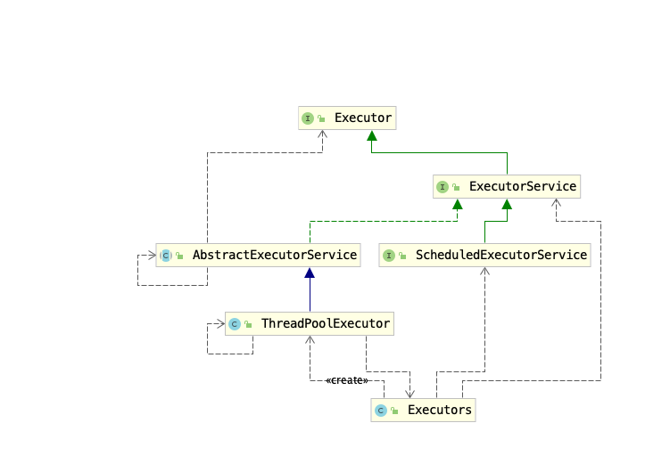

### 1 同步控制

#### Reentrantlock

sychronized重入锁 重入锁是可以反复进入的


```java
lock.lock(); 
lock.lock(); 
try{
    i++; 
}finally{
    lock.unlock();
    lock.unlock(); 
}
```

大多数情况下，锁的申请都是非公平的。公平锁会按照时间的先后顺序，保证先到先得，它不会产生饥饿现象。重入锁允许是公平的，

```
public ReentrantLock(boolean fair)
```

实现公平锁必然要求系统维护一个有序队列，因此公平锁的实现成本较高，性能相对也非常低下。

ReentrantLock的几个重要方法整理如下：

* lock()： 获得锁，如果锁已经被占用，则等待。
* lockInterruptibly(): 获得锁，但优先响应中断
* tryLock(): 尝试获得锁，如果成功，返回true，失败返回false。该方法不等待，立即返回
* tryLock(long time, TimeUnit unit): 在给定时间内尝试获得锁
* unlock(): 释放锁


lock 与 lockInterruptibly比较区别在于：
lock 优先考虑获取锁，待获取锁成功后，才响应中断。
lockInterruptibly 优先考虑响应中断，而不是响应锁的普通获取或重入获取。

#### Condition

`Condition`与重入锁相关联。利用`Condition`对象，就可以让线程在合适的时间等待，或者在某一个特定的时刻得到通知，继续执行。`Condition`与`ReentrantLock`的关系类似于Object和监视器的关系。


| 对比项 | Object监视器 | Condition | 
| --- | --- | --- |
| 前置条件 | 获取对象的锁 | 调用Lock.lock获取锁，调用Lock.newCondition获取Condition对象 | 
| 调用方式 | 直接调用，比如object.notify() | 直接调用，比如condition.await() | 
| 等待队列的个数 | 一个 | 多个 | 
| 当前线程释放锁进入等待状态 | 支持 | 支持 | 
| 当前线程释放锁进入等待状态，在等待状态中不响应中断 | 不支持 | 支持 | 
| 当前线程释放锁并进入超时等待状态 | 支持 | 支持 | 
| 当前线程释放锁并进入等待状态直到将来的某个时间 | 不支持 | 支持 | 
| 唤醒等待队列中的一个线程 | 支持 | 支持 | 
| 唤醒等待队列中的全部线程 | 支持 | 支持 | 


```Java
void await() throws InterruptedException; 
void awaitUninterruptibly(); 
long awaitNanos(long nanosTimeout) throws InterruptedException; 
boolean await(long time, TimeUnit unit) throws InterruptedException; 
boolean awaitUntil(Date deadline) throws InterruptedException;
void signal(); 
void signalAll();
```

* `await()`⽅法会使当前线程等待，同时释放当前锁，当其他线程中使⽤`signal()`或者`signalAll()`⽅法时，线程会重新获得锁并继续执⾏。或者当线程被中断时，也能跳出等待。这和`Object.wait()`⽅法很相似。 
* `awaitUninterruptibly()`⽅法与`await()`⽅法基本相同，但是它并不会在等待过程中响应中断。 
* `singal()`⽅法⽤于唤醒⼀个在等待中的线程。 这和`Object.nofity()`方法很类似
* `singalAll()`⽅法会唤醒所有在等待中的线程。这和 `Obejct.notifyAll()`⽅法很类似。


和`Object.wait()`和`notify()`⽅法⼀样，当线程使⽤`Condition.await()`时，要求线程持有相关的重⼊锁，在`Condition.await()`调⽤后，这个线程会释放这把锁。同理，在`Condition.signal()`⽅法调⽤时，也要求线程先获得相关的锁。在`signal()`⽅法调⽤后，系统会从当前`Condition`对象的等待队列中，唤醒⼀个线程。⼀旦线程被唤醒，它会重新尝试获得与之绑定的重⼊锁，⼀旦成功获取，就可以继续执⾏了。

#### 信号量

无论是`synchronized`还是`ReentrantLock`，一次都只允许一个线程访问一个资源。而信号量却可以指定多个线程，同时访问某一个资源。信号量主要提供了以下构造函数：

```java
public Semaphore(int permits)
public Semaphore(int permits, boolean fair) //第二个参数可以指定是否公平
```
方法

```java
public void acquire()
public void acquireUninterruptibly() 
public boolean tryAcquire() 
public boolean tryAcquire(long timeout, TimeUnit unit) 
public void release()
```


#### ReadWriteLock


`ReadWriteLock`是JDK5中提供的读写分离锁。如果在系统中，读操作次数远远⼤于写操作，则读写锁就可以发挥最⼤的功效，提升系统的性能。


#### CountDownLatch

`CountDownLatch`通常用来控制线程等待，它可以让某一个线程等待直到倒计时结束，再开始执行。


### 2 线程池

为了避免频繁的创建和销毁线程，可以让创建的线程进行服用。在使⽤线程池后，创建线程变成了从线程池获得空闲线程，关闭线程变成了向池⼦归还线程。



`ThreadPoolExecutor`表示一个线程池。`Executors`类则扮演着线程工厂的角色，通过`Executors`可以取得一个拥有特定功能的线程池。在提交完成后，调⽤`shutdown()`⽅法关闭线程池。这是⼀个⽐较安全的⽅法，如果当前正有线程在执⾏， `shutdown()`⽅法并不会⽴即暴⼒地终⽌所有任务，它会等待所有任务执⾏完成后，再关闭线程池。


### 2 队列


| 类 | 解释 |
| --- | --- |
| BlockingQueue<E> | 添加和取出元素时发生阻塞的队列 |
| ArrayBlockingQueue<E> | 以数组为基础的BlockingQueue |
| LinkedBlockingQueue<E> | 以链表为基础的BlockingQueue |
| PriorityBlockingQueue<E> | 带有优先级的BlockingQueue |
| ConcurrentLinkedQueue<E> | 元素数量没有上限的线程安全的Queue |


#### Blocking Queue

Blocking Queue适合作为数据共享的通道，当线程向队列中添加或取出元素时，在队列变为正常状态前会阻塞线程的Queue。

#### LinkedBlockingQueue

`LinkedBlockingQueue.take`使用了原子类型`AtomicInteger`和重入锁`ReentrantLock`来保证线程安全：

```Java
public E take() throws InterruptedException {
    E x;    // 定义x
    int c = -1;
    final AtomicInteger count = this.count; // 队列大小
    final ReentrantLock takeLock = this.takeLock; // 获取出队锁
    takeLock.lockInterruptibly();  // lock
    try {
        // 如果没有元素，一直阻塞
        while (count.get() == 0) {
            // 加入等待队列， 一直等待条件notEmpty（即被其他线程唤醒）
            // 唤醒其实就是，有线程将一个元素入队了，
            // 然后调用notEmpty.signal()唤醒其他等待这个条件的线程，同时队列也不空了
            notEmpty.await();
        }
        x = dequeue(); //出队
        c = count.getAndDecrement(); // 队列大小 -1
        if (c > 1) // 通知队列非空
            notEmpty.signal();
    } finally { //unlock
        takeLock.unlock();
    }
    if (c == capacity)
        signalNotFull();
    return x;
}
```
