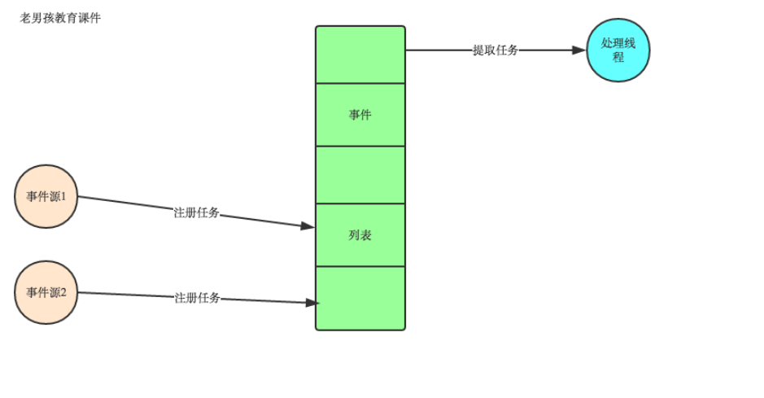
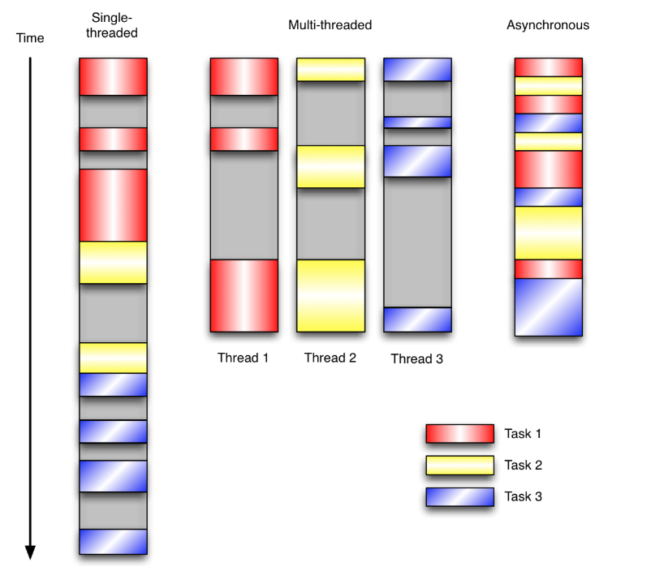

在UI编程中，常常要对鼠标点击进行相应，首先如何获得鼠标点击呢？
方式一：创建一个线程，该线程一直循环检测是否有鼠标点击，那么这个方式有以下几个缺点：
1. CPU资源浪费，可能鼠标点击的频率非常小，但是扫描线程还是会一直循环检测，这会造成很多的CPU资源浪费；如果扫描鼠标点击的接口是阻塞的呢？
2. 如果是堵塞的，又会出现下面这样的问题，如果我们不但要扫描鼠标点击，还要扫描键盘是否按下，由于扫描鼠标时被堵塞了，那么可能永远不会去扫描键盘；
3. 如果一个循环需要扫描的设备非常多，这又会引来响应时间的问题；
所以，该方式是非常不好的。

方式二：就是事件驱动模型
目前大部分的UI编程都是事件驱动模型，如很多UI平台都会提供onClick()事件，这个事件就代表鼠标按下事件。事件驱动模型大体思路如下：
1. 有一个事件（消息）队列；
2. 鼠标按下时，往这个队列中增加一个点击事件（消息）；
3. 有个循环，不断从队列取出事件，根据不同的事件，调用不同的函数，如onClick()、onKeyDown()等；
4. 事件（消息）一般都各自保存各自的处理函数指针，这样，每个消息都有独立的处理函数；

 

 

 

事件驱动编程是一种编程范式，这里程序的执行流由外部事件来决定。它的特点是包含一个事件循环，当外部事件发生时使用回调机制来触发相应的处理。另外两种常见的编程范式是（单线程）同步以及多线程编程。

让我们用例子来比较和对比一下单线程、多线程以及事件驱动编程模型。下图展示了随着时间的推移，这三种模式下程序所做的工作。这个程序有3个任务需要完成，每个任务都在等待I/O操作时阻塞自身。阻塞在I/O操作上所花费的时间已经用灰色框标示出来了。

 

 

在单线程同步模型中，任务按照顺序执行。如果某个任务因为I/O而阻塞，其他所有的任务都必须等待，直到它完成之后它们才能依次执行。这种明确的执行顺序和串行化处理的行为是很容易推断得出的。如果任务之间并没有互相依赖的关系，但仍然需要互相等待的话这就使得程序不必要的降低了运行速度。

在多线程版本中，这3个任务分别在独立的线程中执行。这些线程由操作系统来管理，在多处理器系统上可以并行处理，或者在单处理器系统上交错执行。这使得当某个线程阻塞在某个资源的同时其他线程得以继续执行。与完成类似功能的同步程序相比，这种方式更有效率，但程序员必须写代码来保护共享资源，防止其被多个线程同时访问。多线程程序更加难以推断，因为这类程序不得不通过线程同步机制如锁、可重入函数、线程局部存储或者其他机制来处理线程安全问题，如果实现不当就会导致出现微妙且令人痛不欲生的bug。

在事件驱动版本的程序中，3个任务交错执行，但仍然在一个单独的线程控制中。当处理I/O或者其他昂贵的操作时，注册一个回调到事件循环中，然后当I/O操作完成时继续执行。回调描述了该如何处理某个事件。事件循环轮询所有的事件，当事件到来时将它们分配给等待处理事件的回调函数。这种方式让程序尽可能的得以执行而不需要用到额外的线程。事件驱动型程序比多线程程序更容易推断出行为，因为程序员不需要关心线程安全问题。

当我们面对如下的环境时，事件驱动模型通常是一个好的选择：

程序中有许多任务，而且…
任务之间高度独立（因此它们不需要互相通信，或者等待彼此）而且…
在等待事件到来时，某些任务会阻塞。
当应用程序需要在任务间共享可变的数据时，这也是一个不错的选择，因为这里不需要采用同步处理。

网络应用程序通常都有上述这些特点，这使得它们能够很好的契合事件驱动编程模型。

