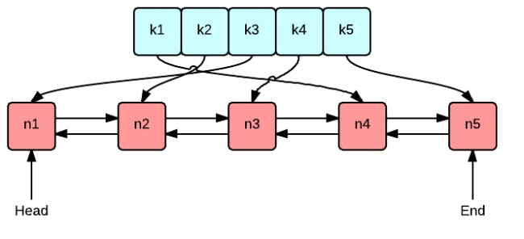

Design and implement a data structure for [Least Recently Used (LRU) cache](https://en.wikipedia.org/wiki/Cache_replacement_policies#LRU). It should support the following operations: `get` and `put`.

* `get(key)` - Get the value (will always be positive) of the key if the key exists in the cache, otherwise return -1.
* `put(key, value)` - Set or insert the value if the key is not already present. When the cache reached its capacity, it should invalidate the least recently used item before inserting a new item.

Follow up:

* Could you do both operations in $O(1)$ time complexity?

Example:

```
LRUCache cache = new LRUCache( 2 /* capacity */ );

cache.put(1, 1);
cache.put(2, 2);
cache.get(1);       // returns 1
cache.put(3, 3);    // evicts key 2
cache.get(2);       // returns -1 (not found)
cache.put(4, 4);    // evicts key 1
cache.get(1);       // returns -1 (not found)
cache.get(3);       // returns 3
cache.get(4);       // returns 4
```


#### 分析

涉及最近最不常使用缓存。这道题目的难点在于LRUCache的存取时间复杂度必须为$O(1)$。一种常见的做法是将哈希表和双向链表结合起来。对于`put(key, value)`操作，将对应键`key`和包含该键值对的双向链表节点`ListNode(key, value)`加入到哈希表中，实现了键和链表节点的一一对应。使用双向链表的原因是，双向链表的插入、删除比较简单，由于缓存使用最近最不常使用(LRU)算法，那么可以将访问过的节点，放到链表首部，永远将节点插入链表首部。为了方便插入和删除，在开始时，加入虚拟的头部、尾部。当链表中元素大于规定的容量时，自动删除链表尾部元素。对于`get(key)`操作，通过哈希表中获取链表节点，得到对应的值，然后将该链表节点移动到链表头部。

简单来说，链表维护了LRU的顺序，始终将刚访问过的键值对放在链表头部，将最近不访问的键值对放在后面。而哈希表维护了键和链表节点的对应关系，可以通过键找到节点。




```Java
class LRUCache {
    private Map<Integer, ListNode> cache;
    private int size;      // 元素个数
    private int capacity;  // 容量
    private ListNode head, tail;


    public LRUCache(int capacity) {
        cache = new HashMap<>();
        size = 0;
        this.capacity = capacity;

        head = new ListNode();
        tail = new ListNode();

        head.next = tail;
        tail.prev = head;
    }

    public int get(int key) {

        ListNode node = cache.get(key);
        if (node == null)
            return -1; // should raise exception here.
        // move the accessed node to the head;
        afterNodeAccess(node);
        return node.val;
    }


    public void put(int key, int value) {
        ListNode node = cache.get(key);
        if (node == null) {
            ListNode newNode = new ListNode(key, value);
            cache.put(key, newNode);
            size++;
            insertNode(newNode);
        } else {
            // update the val.
            node.val = value;
            afterNodeAccess(node);
        }

    }

    /**
     * Always add the new node right after head;
     */
    private void insertNode(ListNode node) {
        node.prev = head;
        node.next = head.next;

        head.next.prev = node;
        head.next = node;

        if (size > capacity) {
            // pop the tail
            ListNode tail = removeNode();
            cache.remove(tail.key);
            size--;
        }
    }

    /**
     * Remove an existing node from the linked list.
     */
    private void removeNode(ListNode node) {
        ListNode pre = node.prev;
        ListNode post = node.next;

        pre.next = post;
        post.prev = pre;
    }

    /**
     * Move certain node in between to the head.
     */
    private void afterNodeAccess(ListNode node) {
        removeNode(node);
        insertNode(node);
    }

    // pop the current tail.
    private ListNode removeNode() {
        ListNode res = tail.prev;
        removeNode(res);
        return res;
    }

    static class ListNode {
        int key;
        int val;
        ListNode prev;
        ListNode next;

        ListNode(int key, int val){
            this.key = key;
            this.val = val;
        }

        ListNode() {
            this(0, 0);
        }
    }

}
```

对于Java来说，有更方便的解决方案：使用`LinkedHashMap`。`LinkedHashMap`是`HashMap`的子类，内部有一个双向链表维持键值对的顺序。键值对可以是插入顺序，也可以是访问顺序。如果是访问顺序，其实就是LRU Cache。


```Java
public class LRUCache extends LinkedHashMap<Integer, Integer> {
    private final int CAPACITY;
    public LRUCache(int capacity) {
        super(capacity, 0.75f, true);
        this.CAPACITY = capacity;
    }
    public int get(int key) {
        return super.getOrDefault(key, -1);
    }
    public void put(int key, int value) {
        super.put(key, value);
    }
    
    @Override
    protected boolean removeEldestEntry(Map.Entry eldest) {
        return size() > CAPACITY;
    }
}
```