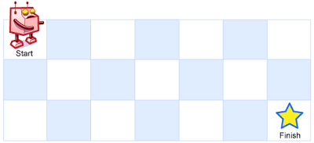

A robot is located at the top-left corner of a $m \times n$ grid (marked 'Start' in the diagram below).

The robot can only move either down or right at any point in time. The robot is trying to reach the bottom-right corner of the grid (marked 'Finish' in the diagram below).

Now consider if some obstacles are added to the grids. How many unique paths would there be?



An obstacle and empty space is marked as `1` and `0` respectively in the grid.

Note: $m$ and $n$ will be at most 100.

Example 1:

```
Input:
[
  [0,0,0],
  [0,1,0],
  [0,0,0]
]
Output: 2
Explanation:
There is one obstacle in the middle of the 3x3 grid above.
There are two ways to reach the bottom-right corner:
1. Right -> Right -> Down -> Down
2. Down -> Down -> Right -> Right
```


#### 分析

在[LeetCode 62. Unique Paths](62. Unique Paths.md)的基础上加了一个限制条件，路径上可能有障碍。其实代码也只需要增加一行：判断有没有障碍。

```Java
public int uniquePathsWithObstacles(int[][] obstacleGrid) {
    if (obstacleGrid == null || obstacleGrid.length == 0 
            || obstacleGrid[0].length == 0) 
        return 0;
    if (obstacleGrid[0][0] == 1) return 0;
    int m = obstacleGrid.length, n = obstacleGrid[0].length;
    int[][] numPaths = new int[m + 1][n + 1];
    numPaths[1][1] = 1;
    for (int i = 1; i < m + 1; i++)
        for (int j = 1; j < n + 1; j++) {
            if (i == 1 && j == 1) continue;
            if (obstacleGrid[i - 1][j - 1] == 1) numPaths[i][j] = 0;
            else numPaths[i][j] = numPaths[i][j - 1] + numPaths[i - 1][j];
        }
    return numPaths[m][n];
}
```