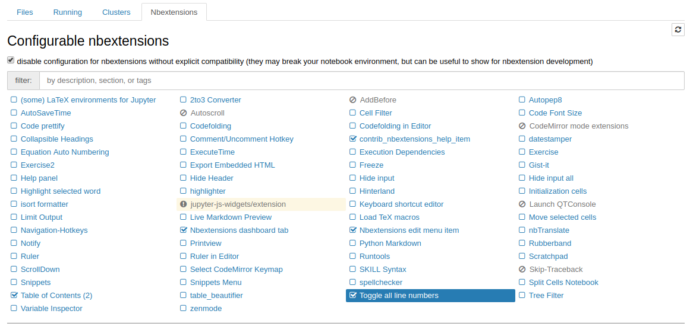

[Anaconda](../Python/Python配置.md)默认自带`Jupyter Notebook`，可以很方便的运行Python代码、记录笔记。在terminal输入`jupyter-notebook`，会自动新建浏览器页面，即打开jupyter notebook。


### 1 安装kernel

Jupyter NoteBook支持多种Kernel，也就是说在notebook中可以使用多种语言。下面是常见编程语言的kernel安装方法。


#### Bash Kernel

`Bash kernel`([Project Link](https://github.com/takluyver/bash_kernel))可以通过pip安装。

```bash
pip install bash_kernel
python -m bash_kernel.install
```

#### Python2/3 Kernel

通过`ipykernel`可以安装Python2/3 Kernel。

```bash
python3 -m pip install ipykernel
python3 -m ipykernel install --user
```

#### Scala Kernel

通过`spylon-kernel`，可以在notebook上写scala和Spark程序。

```bash
pip install spylon-kernel
python -m spylon_kernel install
```

### 2 安装插件

[nbextensions](https://jupyter-contrib-nbextensions.readthedocs.io/en/latest/install.html)为Jupyter notebook提供了各种各样的插件。

```Python
pip install jupyter_contrib_nbextensions
jupyter contrib-nbextension install --user
```

在启动notebook后，网址`http://localhost:8888/nbextensions`对应的是nbextensions的配置页面。也可以在启动notebook页面中寻找nbextension配置(最右侧标签页)。





#### 守护进程

```bash
nohup jupyter notebook &> /dev/null &
```

* `nohup`: 不挂断地运行命令， 忽略SIGHUP信号
* `&`： 后台运行

在Mac上选择System Preferences - Users&Groups - Login Items添加shell脚本，使脚本开机启动。