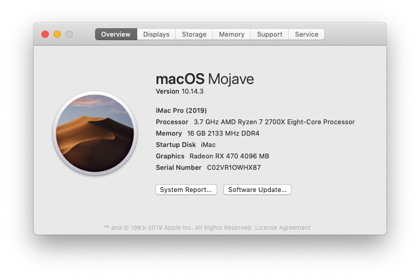
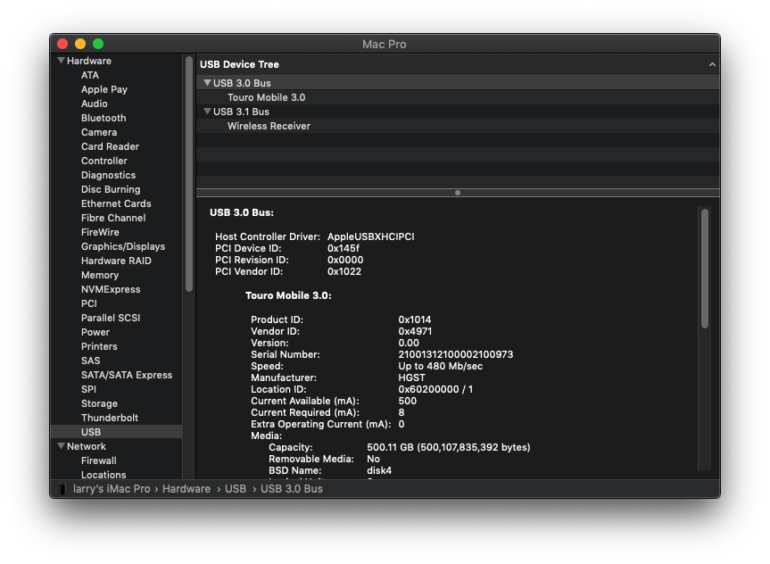
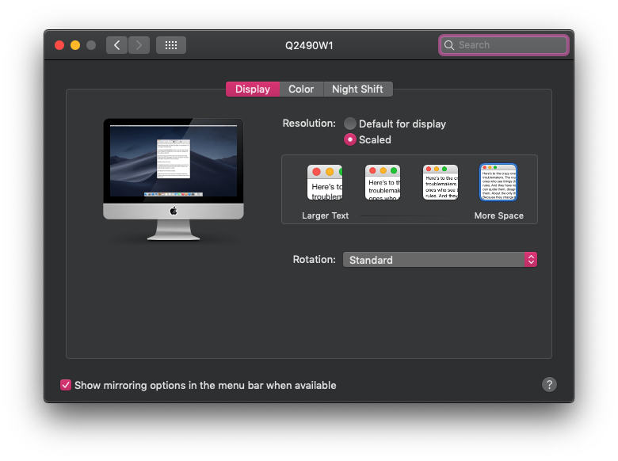
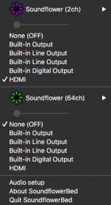

最近配置了一台电脑，配置如下。

* CPU：AMD Ryzen瑞龙 2700x
* 显卡：MAD Radeon RX 470 4G
* 主板：微星MSI B450M 军火库
* 内存：美商海盗船 8G 3000Hz x2
* M2: 三星970 EVO 256GB
* SSD: 东芝TR200 256GB


已经在该设备上安装苹果系统Mojave，所有设备都能正常使用，而且能够正常睡眠，非常完美。



黑苹果的安装是非常快的，网上有大量资源，大概一个小时就可以。主要是完善比较费时间，因为需要大量的配置，这些配置因机器差异往往不同，需要不同的尝试达到完美的效果。


#### 安装Mac OS

使用的[聆曦制作的镜像](https://www.c4dlx.com/thread-654-1-1.html)。主要是安装非常方便，把相关脚本已经安放好了，需要在安装的时候执行这些脚本即可。

```text
下载链接： https://pan.baidu.com/share/init?surl=BEdGgVc4MUZZDD1Motlykw
提取码：nuat
解压密码：lingxi147170373User
```


#### Ryzen性能损失

#### 打USB补丁

往往USB，特别是USB3.0以上的接口在黑苹果中不能被识别，所以一般都需要在安装完了以后打补丁。

打补丁的具体教程可以参见[AMD-MAC论坛](https://forum.amd-osx.com/viewtopic.php?f=24&t=4986&hilit=native+usb)。

直接在终端中输入以下命令安装

```bash
curl -s -o ~/Desktop/ryzenusbfix.sh https://raw.githubusercontent.com/XLNCs/ryzenusbfix/master/ryzenusbfix.sh && chmod +x ~/Desktop/ryzenusbfix.sh && ~/Desktop/ryzenusbfix.sh
```

重启以后在系统报告的USB信息中可以看到连接的USB设备



#### 开启HDPI

苹果的系统显示非常好，得意于HDPI这项技术。HDPI可以通过相关命令开启，详见[HDPI](https://github.com/xzhih/one-key-hidpi)

同样的，输入以下脚本即可开启。

```BASH
sh -c "$(curl -fsSL https://raw.githubusercontent.com/xzhih/one-key-hidpi/master/hidpi.sh)"
```

重新启动系统后，在系统设置-显示中可以设置显示的效果：




#### 温度/风扇显示

如果对于系统监控有要求，往往还需要了解电脑各个部件的温度、风扇转速等情况。幸运的是，AMD平台的相关驱动已经比较完善了，直接可以在Clover中使用。详见[教程](https://hackintosher.com/guides/amd-hackintosh-monitoring-guide/)


#### 正确显示CPU型号

很多CPU在黑苹果中不能正确识别，虽然不影响系统运行，但终归是不完美的。幸运的是，还是有好心人制作了相关脚本，直接运行即可，详见[GITHUB](https://github.com/corpnewt/CPU-Name)。

```bash
git clone https://github.com/corpnewt/CPU-Name
cd CPU-Name
chmod +x CPU-Name.command
./CPU-Name.command
```


#### 亮度调节

直接使用现成的软件[MonitorControl](https://github.com/the0neyouseek/MonitorControl)实现显示器的亮度调节。


#### 显示器声音

一般来说，显示器的播放器使用AppleAPL就能够正确使用。但是往往不能调节音量。使用Soundflower软件可以实现音量调节功能。具体参考[Enable macOS Volume Controls for HDMI and DisplayPort Audio Devices](http://tarikfayad.com/enable-macos-volume-controls-for-hdmi-and-displayport-audio-devices/).




#### 备份

最后一步，当系统完全安装准备好以后，最好备份一份，以免数据丢失，方便系统重装。推荐使用CCC做全盘备份，一见傻瓜式操作。详细教程见[使用CCC做全盘备份](http://mac.orsoon.com/news/250665.html)。


#### 参考

https://mtwstudio.gitbook.io/ryzentosh/