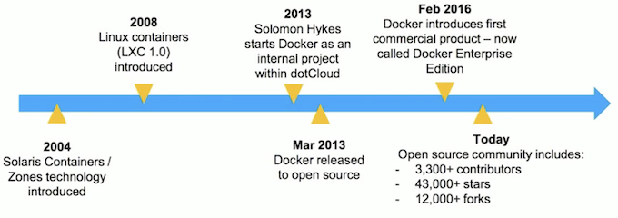
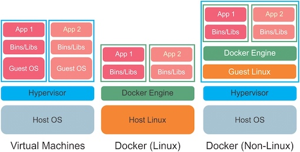
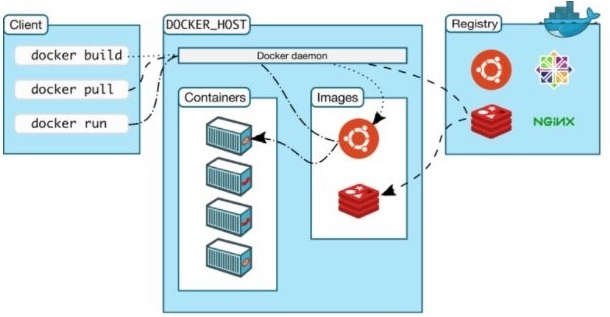
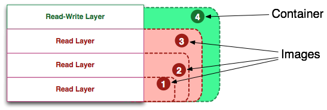
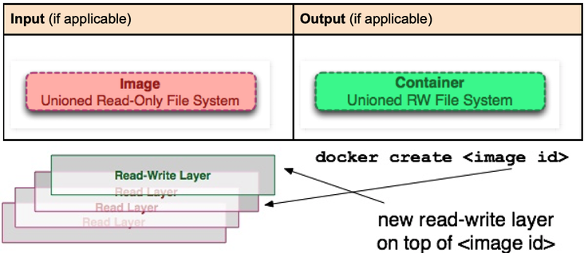
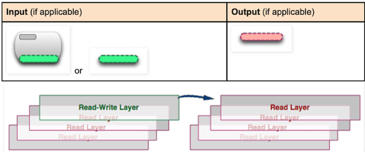
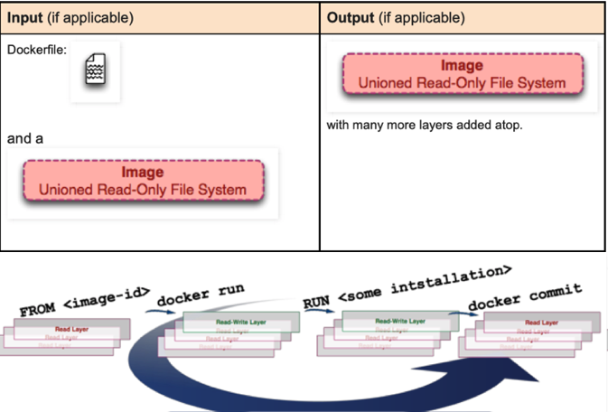
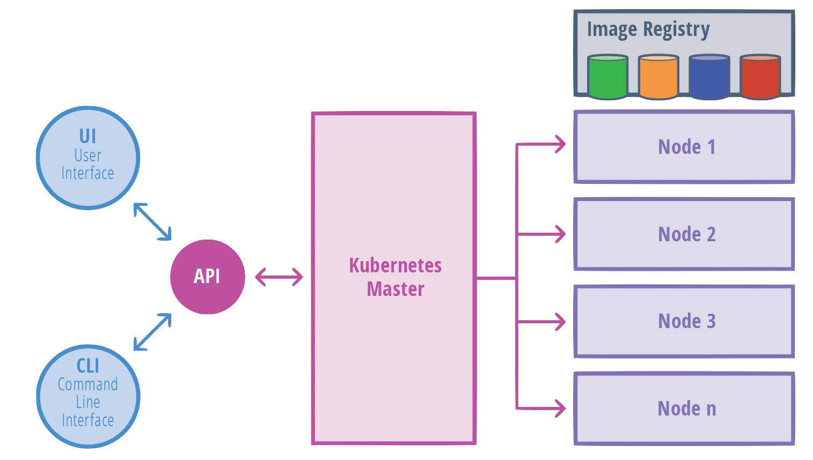

> Docker is a platform for developers and sysadmins to build, run, and share applications with containers.



A container is a standard unit of software that packages up code and all its dependencies so the application runs quickly and reliably from one computing environment to another.  Multiple containers can run on the same machine and share the OS kernel with other containers, each running as isolated processes in user space. 


!!! note "docker v.s. virtual machine"

    
    
    A comparison of the architecture of virtual machines and Docker software containers. Virtual machines are denoted by cyan boxes and software containers are denoted by green boxes. The left stack is a Type-2 virtual machine (VM) which uses a hypervisor to emulate the guest OS(more Virtual Machine [here](操作系统概念/18 Virtual Machines.md))). The application software, dependences, and the guest OS are all contained inside the VM. A separate VM, dependencies and guest OS are required for each application stack that is to be deployed. The middle stack depicts Docker container software on a Linux host. Docker uses the host Linux system and packages the application and dependencies into modular containers. No VM is necessary and the OS resources for the two application stacks are shared between different containers. The right stack depicts Docker on a non-Linux system. Because Docker requires Linux, a lightweight VM with a mini-Linux Guest OS is necessary to run Docker and encapsulate the software containers. This still has the advantage that only a single VM and Guest Linux system is required regardless of the number of containers.

### 1 Docker Architecture




Docker's architecture is client-server based.  It consists of several main parts:

* Client: a user interface for Docker.
* Daemon: a background process responsible for receiving commands and passing them to the containers via command line.
* Images: used to create new containers.
* Containers: standard unit of software that packages up code and all its dependencies.
* Registry: where container images are stored and retrieved.


<!--!!! note "Images v.s. Containers"
    
    Fundamentally, a container is nothing but a running process, with some added encapsulation features applied to it in order to keep it isolated from the host and from other containers. One of the most important aspects of container isolation is that each container interacts with its own private filesystem; this filesystem is provided by a Docker image. An image includes everything needed to run an application - the code or binary, runtimes, dependencies, and any other filesystem objects required.-->


docker底层技术支持

* Namespaces：做隔离pid， net，ipdc， mnt， uts
* Control groups： 做资源限制
* Union file systems： container和image的分层

#### Docker Image/Container

A Docker image is built up from a series of layers. Each layer represents an instruction in the image’s Dockerfile. The major difference between a container and an image is the top writable layer. All writes to the container that add new or modify existing data are stored in this writable layer. When the container is deleted, the writable layer is also deleted. The underlying image remains unchanged.




The metadata is additional information about the layer that allows docker to capture runtime and build-time information, but also hierarchical information on a layer's parent. Additionally, each layer contains a pointer to a parent layer using the Id.


A *running container* is defined as a read-write "union view" and the the isolated process-space and processes within. The below visual shows the read-write container surrounded by this process-space.


The `docker create` command adds a read-write layer to the top stack based on the image id. It does not run this container.



The command `docker start` creates a process space around the union view of the container's layers. There can only be one process space per container. The `docker run` command starts with an image, creates a container, and starts the container (turning it into a running container).


The `docker commit` command takes a container's top-level read-write layer and burns it into a read-only layer. This effectively turns a container (whether running or stopped) into an immutable image.




The `docker build` command uses the `FROM` directive in the Dockerfile file as the starting image and iteratively 1) runs (create and start) 2) modifies and 3) commits.




其他命令可以参见[这里](http://merrigrove.blogspot.com/2015/10/visualizing-docker-containers-and-images.html)。

#### Dockerfile

使用Dockerfile可以用来创建镜像。下面是Dockerfile的语法及示例。

##### FROM

尽量使用官方镜像作为base image

```
FROM scratch #制作base image，不依靠别的镜像
FROM centos #使用base image
FROM ubuntu:14.04 #使用base image
```

##### LABEL

设置Metadata

```
LABEL maintainer="xiaoquwl@gmail.com"
LABEL version="1.0"
LABEL description="This is description"
```

##### RUN

run命令为了美观，最好使用反斜杠换行。
每运行一次run，image都会生成新的一层，所以尽量合并多条命令成为一行

```
# 使用反斜杠换行
RUN yum update && yum install -y vim \
    python-dev   
# 主要清理cache
RUN apt-get update && apt-get install -y perl \
    pwgen --no-install-recommends && rm -rf \
    /var/lib/apt/lists/*
```

##### WORKDIR

能用WORKDIR的就用WORKDIR，不要用RUN去运行cd命令。
WORKDIR后面跟的路径也可以尽量使用绝对路径

```
# 切换到/root路径
WORKDIR /root
# 如果没有会自动创建test文件夹
WORKDIR /test 
WORKDIR demo
# 输出结果是/test/demo
RUN pwd
```

##### ADD and COPY

大部分情况下COPY是要优于ADD的，但是ADD有一个解压缩的功能。
要是想添加远程文件的话，可以用RUN命令来运行curl或者wget

```
# 把hello这个可执行文件添加到/路径下
ADD hello /
# 添加到根目录下并且解压test.tar.gz
ADD test.tar.gz /
# 文件应该是在/root/test/hello
WORKDIR /root
ADD hello test/
# copy版本
WORKDIR /root
COPY hello test/
```

##### ENV

使用ENV可以增加可维护性

```
# 设置ENV
ENV MYSQL_VERSION 5.6
# 使用ENV
RUN apt-get install -y mysql-server= "${MYSQL_VERSION}" \
    && rm -rf /var/lib/apt/lists/*
```


#### Docker Installation

在Mac和Windows上直接下载[安装包](https://www.docker.com/products/docker-desktop)点击安装即可。Linux平台以centos7为例。

```bash
# Install required packages. 
sudo yum install -y yum-utils \
  device-mapper-persistent-data \
  lvm2
#加入国内源，加速安装
sudo yum-config-manager --add-repo \
    https://mirrors.aliyun.com/docker-ce/linux/centos/docker-ce.repo
sudo yum makecache fast
sudo yum -y install docker-ce docker-ce-cli containerd.io
# 启动docker
sudo systemctl start docker
# 运行一个hello-world的镜像
sudo docker run hello-world
```

由于Docker镜像服务器部署在国外，启动国内的镜像加速器可以加快Docker镜像下载速度。在`/etc/docker/daemon.json`中写入如下内容

```json
{
  "registry-mirrors": [
    "https://dockerhub.azk8s.cn",
    "https://hub-mirror.c.163.com"
  ]
}
```

之后重启docker(命令`sudo systemctl restart docker`)。

### 2 容器编排

#### Docker Swarm

#### Kubenetes



