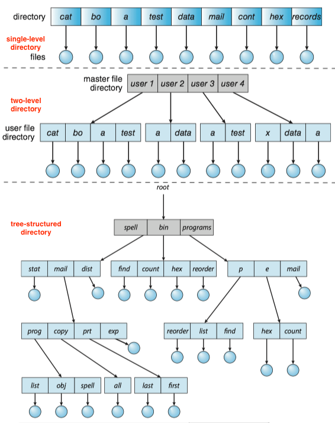
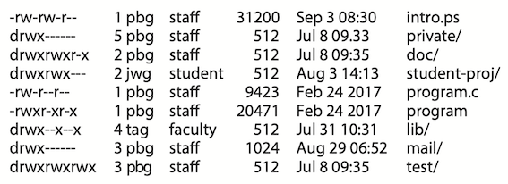
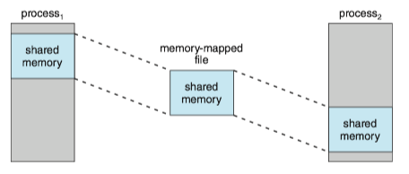

The file system consists of two distinct parts: a collection of **files**, each storing related data, and a **directory** structure, which organizes and provides information about all the files in the system.

### 1 File Concept

A **file** is named collection of related information that is recorded on secondary storage.(文件是记录在外存上的相关信息的具有名称的集合)。

A file is a sequence of **logical** records. A logical record may be a byte, a line (of fixed or variable length), or a more complex data item.

#### File Attributes

A file's attributes vary from one operating system to another but typically consist of these:

* **Name**. The symbolic file name is the only information kept in human-readable form.
* **Identifier**. This unique tag, usually a number, Identifier the file within the file system; it is the non-human-readable name for the file.
* **Type**. This information is needed for systems that support different types of files.
* **Location**. This information is a pointer to a device and to the location of the file on that device.
* **Size**. The current size of the file (in bytes, words, or blocks) and possibly the maximum allowed size are included in this attribute.
* **Protection**. Access-control information determines who can do reading, writing, executing, and so on.
* **Timestamps and user identification**. This information may be kept for creation, last modification, and last use. These data can be useful for protection, security, and usage monitoring.

#### File Operations

The operating system must do to perform each of these seven basic file operations.

* **Creating a file**. First, space must be allocated for the file. Second, an entry for the new file must be made in a directory.
* **Opening a file**. Check access permissions, and if successful, the open call returns a file handle that is used as an argument in the other calls.
* **Writing a file**: The system keeps a _write pointer_ to the location in the file where the next write is to take place if it is sequential.
* **Repositioning within a file**: The _current-file-position pointer_ of the open file is repositioned to a given value.
* **Deleting a file**: Release all file space.
* **Truncating a file**: The length of a file can be reset to zero, and its file space be released with all  other attributes remain unchanged.

These seven basic operations comprise the minimal set of required file operations. These primitive operations can then be combined to perform other file operations.


The operating system keeps a table, called the **open-file-table**, containing information about all open files.

* When a file operation is requested, the file is specified via an index into this table.
* When the file is no longer being actively used, it is closed by the process, and the operating system removes its entry from the open-file table, potentially releasing locks.


ISSUES: Several different applications open the same file at the same time.

SOLUTION: The operating system uses two levels of internal tables: a per-process table and a system-wide table.[参见 内核数据结构](../深入了解计算机系统/10 系统级IO.md)

* The per-process table tracks all files that a process has open.
    *  It Stores information regarding the process's use of the file (e.g. the current file pointer for each file, access rights to the file and accounting information)
* Each entry in the per-process table in turn points to a system-wide open-file table. 
    * It contains process-independent information(e.g. the location of the file on disk, access dates, and file size).
    * Once a file has been opened by one process, it includes an entry for the file.
    * It also has an **open count** associated with each file to indicate how many processes have the file open.

<red>File locks</red>(文件锁) are useful for files that are shared by several processes. For example, a system log file that can be accessed and modified by a number of processes in the system.

File locks provide functionality similar to reader-writer locks in [7 Synchronization Examples](7 Synchronization Examples.md). A **shared lock**(共享锁) is akin to a reader lock in that several processes can acquire the lock concurrently. An **exclusive lock**(排斥锁) is akin to a writer lock in that only one process at a time can acquire such a lock.

Furthermore, operating systems(e.g. Linux) may provide either **mandatory**  or **advisory** file-locking mechanisms.

* With mandatory locking, once a process acquires an exclusive lock, the operating system will prevent any other process from accessing the locked file.
* with advisory locking, the operating system will not prevent other process from accessing to the locked file.
* For advisory locking, it is up to software developers to ensure that locks are appropriately acquired and released.

!!! example "File Locking in Java"

    The simple program in Java as follows demonstrating file locking. The program acquires an exclusive lock on the first half of the file and a shared lock on the second half.
 
    ```Java
    import java.io.*;
    import java.nio.channels.*;
    
    public class LockingExample {
    	public static final boolean EXCLUSIVE = false;
    	public static final boolean SHARED = true;
    
       public static void main(String args[]) throws IOException {
        	if (args.length != 1) {
        		System.err.println("Usage: java LockingExample <input file>");
        		System.exit(0);
    	   }
    
    	FileLock sharedLock = null;
    	FileLock exclusiveLock = null;
    
    	try {
    	   RandomAccessFile raf = new RandomAccessFile(args[0], "rw"); 
    
    		// get the channel for the file
         	FileChannel channel = raf.getChannel();
    
    		System.out.println("trying to acquire lock ...");
    		// this locks the first half of the file - exclusive
    		exclusiveLock = channel.lock(0, raf.length()/2, EXCLUSIVE);
    		System.out.println("lock acquired ...");
    
    		/**
    		 * Now modify the data  . . .
    		 */
    
    		try {
    			// sleep for 10 seconds
    			Thread.sleep(10000);
    		}
    		catch (InterruptedException ie) { }
    
    		// release the lock
    		exclusiveLock.release();
    		System.out.println("lock released ...");
    
    		// this locks the second half of the file - shared 
    		sharedLock = channel.lock(raf.length()/2 + 1, raf.length(), SHARED);
    		
    		/**
    		 * Now read the data  . . .
    		 */
    
    		// release the lock
    		exclusiveLock.release();
    	} catch (java.io.IOException ioe) {
    		System.err.println(ioe);
    	}
          	finally {
    		if (exclusiveLock != null)
           			exclusiveLock.release();
    		if (sharedLock != null)
           			sharedLock.release();
         	}
       }
    }
    ```

#### File Types

A common technique for implementing file types is to include the type as part of the file name. 

* The name is split into two parts—a *name* and an *extension*, usually separated by a period;
* The system uses the extension to indicate the type of the file and the type of operations that can be done on that file;
* The UNIX system uses a **magic number**([Wikipedia](https://en.wikipedia.org/wiki/Magic_number_(programming)), 魔数) stored at the beginning of some binary files to indicate the type of data in the file (for example, the format of an image file). Not all files have magic numbers.

#### File Structure

Certain files must conform to a required structure that is understood by the operating system. 

* For example, the operating system requires that an executable file have a specific structure so that it can determine where in memory to load the file and what the location of the first instruction is.
* One of the disadvantage of having the operating system support multiple file structures: it makes the operating system large and cumbersome.
* Some operating systems(UNIX, Windows) impose (and support) a minimal number of file structures.
* However, all operating systems must support at least one structure —that of an executable file — so that the system is able to load and run programs.

#### Internal File Structure

ISSUE: All disk I/O is performed in units of one block (physical record), and all blocks are the same size. It is unlikely that the physical record size will exactly match the length of the desired logical record.

SOLUTION:**Packing a number of logical records into physical blocks**.

EXAMPLE: The UNIX operating system defines all files to be simply streams of bytes. Each byte is individually addressable by its offset from the beginning (or end) of the file. In this case, the logical record size is 1 byte. The file system automatically packs and unpacks bytes into physical disk blocks - say, 512 bytes per block — as necessary.


### 2 Access Methods

Files store information. The information in the file can be accessed in several ways.

#### Sequential Access

The simplest access method is **sequential access**(顺序访问). 

* Information in the file is processed in order, one record after the other.
* It is by far the most common access method.


#### Direct Access

For **direct access**(直接访问) or **relative access**(相对访问), a file is made up of fixed-length logical records that allow programs to read and write records rapidly in no particular order.

* The file is viewed as a *numbered* sequence of blocks or records.
* Direct-access files are of great use for immediate access to large amounts of information. (e.g. databases, we compute which block contains the answer and then read that block directly when querying)
* A **relative block number** is provided by the user to the operating system. It is an index relative to the beginning of the file.

#### Other Access Methods

Other access methods generally involve the construction of an index for the file. The **index** contains pointers to the various blocks. To find a record in the file, we first search the index and then use the pointer to access the file directly and to find the desired record.

### 3 Directory Structure

The directory can be viewed as a symbol table that translates file names into their file control blocks.

The directory can be **single-level**(单层), **two-level**(双层), and **tree-structured**(树状).



Within a file system, it is useful to create directories to allow files to be organized. 

* A **single-level directory** in a multiuser system causes naming problems, since each file must have a unique name. 
* A **two-level directory **solves this problem by creating a separate directory for each user’s files. The directory lists the files by name and includes the file’s location on the disk, length, type, owner, time of creation, time of last use, and so on.
* The natural generalization of a two-level directory is a **tree-structured directory**. A tree-structured directory allows a user to create subdirectories to organize files. 
* **Acyclic-graph directory** structures enable users to share subdirectories and files but complicate searching and deletion.
* **A general graph** structure allows complete flexibility in the sharing of files and directories but sometimes requires garbage collection to recover unused disk space.


### 4 Protection

When information is stored in a computer system, we want to keep it safe from physical damage (the issue of **reliability**) and improper access (the issue of **protection**).

#### Types of Access

Protection mechanisms provide *_controlled access_* by limiting the *_types of file_* access that can be made. Access is permitted or denied depending on several factors, one of which is the type of access requested. Several different types of operations may be controlled:

* **Read**. Read from the file.
* **Write**. Write or rewrite the file.
* **Execute**. Load the file into memory and execute it.
* **Append**. Write new information at the end of the file.
* **Delete**. Delete the file and free its space for possible reuse.
* **List**. List the name and attributes of the file.
* **Attribute change**. Changing the attributes of the file.

Many protection mechanism have been proposed and we have a more detailed description in [7 Synchronization Examples](7 Synchronization Examples.md).


#### Access Control

The most common approach to the protection problem is to make access dependent on the identity of the user. 

* Different users may need different types of access to a file or directory. 

The most general scheme to implement identity dependent access is to associate with each file and directory an **access-control list**(==ACL==, 访问控制列表) specifying user names and the types of access allowed for each user.

* If a user is listed for the requested access, the access is allowed.
* Otherwise, a protection violation occurs, and the user job is denied access to the file.

ISSUES: If we want to allow everyone to read a file, we must list all users with read accesses.

SOLUTION: A condensed version of the access list, many system recognize three classifications of users in connection with each file:

* *Owner*. The user who created the file is the owner.
* *Group*. A set of users who are sharing the file and need similar access is a group, or work group
* *Other*. All other users in the system.

#### Other Protection Approaches

Another approach to the protection problem, is to associate a password with each file.

#### Permissions in UNIX

In the UNIX system, directory protection and file protection are handled similarly. Associated with each file and directory are three fields - owner, group, and universe -- each consisting of the three bits **rwx**, where **r** controls read access, **w** controls write access, and **x** controls execution.

A sample directory listing from a UNIX environment is shown in below:




### 5 Memory-Mapped Files

**Memory mapping**(内存映射) a file is accomplished by mapping a disk block to a page in memory.

* Initial access to the file, results in a page fault.
* A page-sized portion of the file is read from the file system into a physical page.
* Subsequent reads and writes to the file are handled as routine memory accesses.

Advantage

* Manipulating files through memory rather than incurring the overhead of using `read()` and `write()` system calls <hh>simplifies and speeds up file access and usage</hh>.

Multiple processes may be allowed to map the same file concurrently, to allow sharing of data. The virtual memory map of each sharing process points to the same page of physical memory. The memory-mapping system calls can also support **copy-on-write** functionality, allowing processes to share a file in read-only mode but to have their own copies of any data they modify.

Quite often, shared memory is in fact implemented by memory mapping files. Under this scenario, processes can communicate using shared memory by having the communicating processes memory-map the same file into their virtual address spaces(e.g. [POSIX shared memory](3 Processes.md)). 


