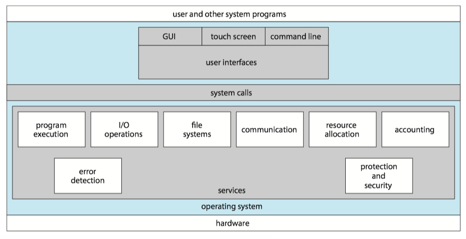
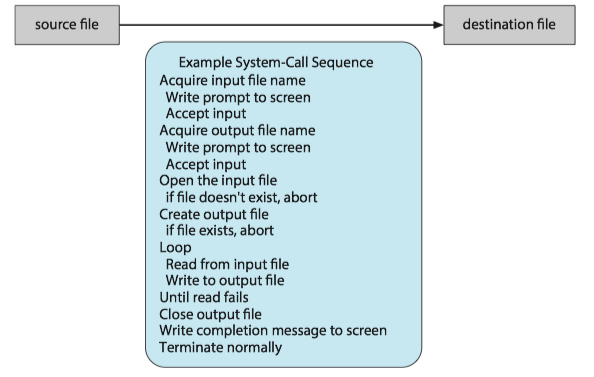
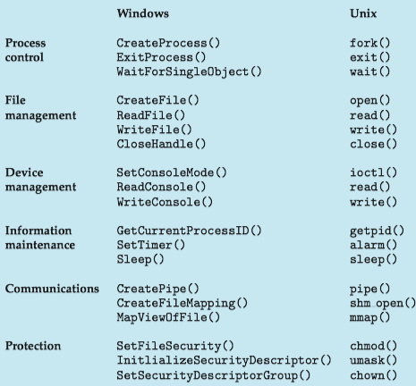
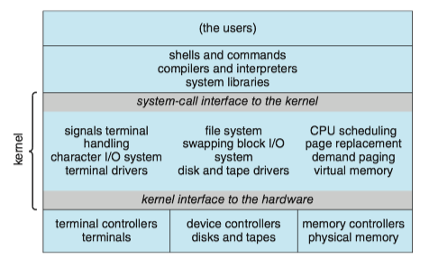
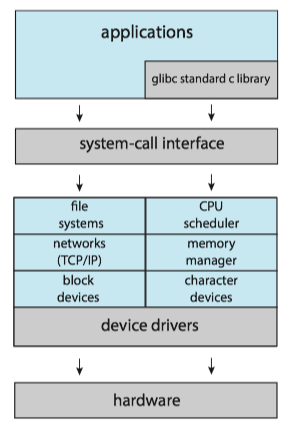
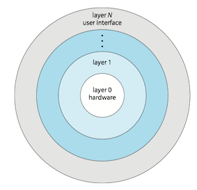
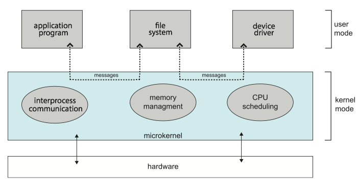
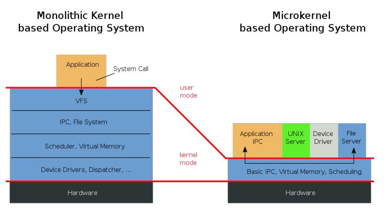
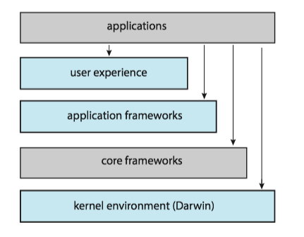
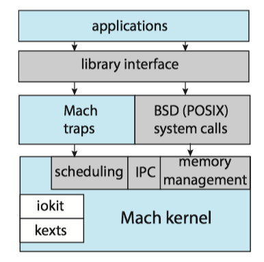

### 1 Operating system service

The figure below is a view of the various operating-system services and how they interrelate.

<small></small>

### 2 User and Operating System interface

There're mainly three ways for users to interface with the operating system:

* command interpreter
* graphical user interface
* touch-screen interface

### 3 System calls

Purpose of System Call: System calls provide an **interface to the services** made available by an operating system.

!!! Example
    A simple program to read data from one file and copy them to another file: `cp in.txt out.txt`. As you can see, even simple programs may make heavy use of the operating system.

    
    

####  API

Typically, application developers design programs according to an application programming interface(**API**, 应用程序编程接口) rather than invoking **actual system call**.

* because even simple program may make heavy use of system call.
* **program portabilit**y: expect programs to compile and run other system that supports the same API
* **run-time environment**(RTE, 运行时环境) - the full suit of software needed to execute applications, including its compilers, interpreters, libraries, loaders.

#### Types of system calls

System calls can be grouped roughly into six major categories:
系统调用可分成六大类：进程控制，文件管理，设备管理，信息维护，通信和保护。

* process control
* file management
* device management
* information maintenance
* communications
* protection

!!! example
    The following illustrates various equivalent system calls for Windows and UNIX operating systems.
    
    

Three ways to pass parameters to the operating system:

* when less than five parameters, passing the parameters in registers
* when more than five parameters, parameters are stored in a block, passing the address of the block in a register
* using stack

### 4 System Services

**System services**, also known as **system utilities**, provide a convenient environment for program development and execution.

They can be divided into these categories:

* File management
* Status information
* File modification
* Program loading and execution
* Communications
* Background services

### 7 OS Design and Implementation

One important principle of OS design is _the separation of **policy** from **mechanism**_ . Mechanisms determine **how** to do something; policies determine **what** will be done.
操作系统设计的一个重要原则是策略（policy）和机制（mechanism）的分离。机制决定如何做，策略决定做什么。

* The separation of policy and mechanism is important for **flexibility**.

### 8 Operating system structure

#### Monolithic structure

Operating systems with **monolithic structure** (单体结构) place all of the functionality of kernel into a **single**, **static** binary file that runs in a **single** address space.

* a common technique for designing operating system
* e.g. original Unix operating system ( figure below)

* e.g. Linux is based on Unix and is structured similarly, as shown in figure below.

pros:

* simplicity of kernels
* a distinct performance advantage
* very little overhead in the system-call interface
* fast communication within the kernel

cons

* difficult to implement and extend

#### Layered 

A **loosely coupled** (松耦合) system is divided into separate, smaller components that have specific and limited functionality (**modular** approach). All these components together comprise the kernel.

* changes in one component affect only that component

A system can be made modular in many ways.

* one way is the layered approach.

For the **layered operating system** (层次式操作系统), it is broken into a number of layers.

* The bottom layer is the hardware; the highest is the user interface.
* low-level layers can be invoked by higher-level layers

pros:

* Simplicity of construction and debugging
    * Each layer is implemented only with operations provided by lower-level layers. 
    * Higher-level layers can be debugged without any concern for the lower-level layers

cons:

* Difficulty of defining the functionality of each layer
* Poor performance
    * Overhead of requiring a user program to traverse through multiple layers to obtain an operating-system service

Layered systems have been successfully used in computer networks (such as TCP/IP) and web applications.

#### Microkernel

Another way to modularized the kernel is using **microkernel**(微内核) approach.

* **Removing all nonessential** components from the kernel and implementing them as **user-level** programs the reside in **separate** address spaces.
* A smaller kernel.

A typical microkernel shown below.

Monolithic Kernels VS Microkernels:

**Pros**:

* Easy to extend the os
    * All new services added to user space do not require modification of the kernel.
    * When modification of kernel needed, changes tend to be fewer because of small kernel
* more security and reliability
    * since most services are running as user

**Cons**:

* Performance may suffer due to increased system function overhead. 
    * Because messages of user-level services to communicate must be copied between the services, which reside in separate space.
    * The os may have to switch from one process to the next to exchange the messages.

Best-known microkernel os is **Darwin**, the kernel component of the macOS and iOS.  

#### Modules

Perhaps the best current methodology for operating system design involves using **loadable kernel modules**(LVMs, 可装载内核模块). Here, the kernel has a set of core components and can link in additional services via modules, either at boot time or during run time.

* design purpose: for the kernel to provide core services, while other services are implemented **dynamically**, as the kernel is running

!!! example
    You can list all Linux kernel modules that are currently loaded, by entering the command `lsmod`(lists name, size, and where the module is being used). 
    
    Linux kernel modules are loaded(inserted) using the `insmod` command, and are removed using the `rmmod` command.

#### Hybrid systems

In practice, **very few** operating system adopt a single, strictly defined structure. Instead, they **combine different structures**, resulting in **hybrid systems** that address performance, security, and usability issues.

Architecture of Apple’s macOS and iOS operating systems:

Darwin provides two system-call interfaces: Mach system calls and BSD system calls.

The structure of Darwin:

To address such performance problems, Darwin combines Mach, BSD, the I/O kit, and any kernel extensions into a **single** address space.

### 9 System boot

The process of starting a computer by loading the kernel is known as **booting** the system.

1. A small piece of code known as the **bootstrap program**(引导程序) or boot loader locates the kernel.
2. The kernel is loaded into memory and started.
3. The kernel initializes hardware.
4. The root file system is mounted.

Bootstrap program:

* usually, bootstrap program located in BIOS( nonvolatile firmware(固件) on motherboard, [wiki](https://en.wikipedia.org/wiki/BIOS))
* **GRUB** is an open-source bootstrap program for Linux and Unix systems [wiki](https://en.wikipedia.org/wiki/GNU_GRUB).