### 1 物理/虚拟寻址

主存是由连续的**字节大小**的单元组成的数组，每字节都有一个唯一的**物理地址**(Physical Adress)。CPU使用物理地址访问内存的方式称为**物理寻址**(Physical adressing)。

早期的PC以及数字信号处理器等使用物理寻址，下面是物理寻址的示意图：

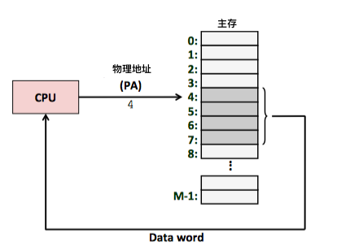


现代处理器通过生成一个**虚拟地址**(Virtual Address)来访问主存，虚拟地址经过**地址翻译**(Address Translation)转换为物理地址。地址翻译由CPU内的**内存管理单元**(Memory Management Unit, `MMU`)负责.


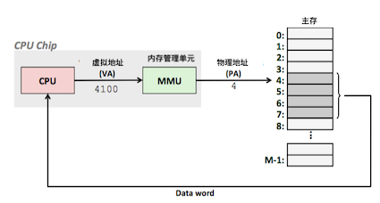


虚拟内存充当着三个角色：

* 作为缓存的工具，可以更有效率的使用内存：使用DRAM当做部分的虚拟地址空间的缓存
* 作为内存管理的工具，简化内存管理：每个进程都有统一的线性地址空间
* 作为内存保护的工具，分隔地址空间：进程的内存不会相互影响；用户程序不能访问保密的内核信息和代码

下面一节具体讲解虚拟内存的这三个角色。


### 2 虚拟内存的三个角色

#### 2.1 作为缓存的工具

可以把主存DRAM看作是虚拟内存的缓存，类似于L1、L2、L3高速缓存是DRAM内存的缓存。也就是说可以把虚拟内存看成是存储器层次结构的一部分。


和其他存储器层次结构中的缓存一样，较低层上的数据被分割成块，作为与较高层之间的传输单元。

* 这里较低层是虚拟内存，分割成**虚拟页**(Virtual Page, VP)，虚拟页大小为\(P=2^p \)字节。
* 类似的，这里的较高层，物理内存DRAM，被分割为**物理页**(Physical Page, PP)，大小也为\(P\)，也叫做页桢(page frame)。

虚拟页的状态分为三种：

* **未分配**(Unallocated): 系统还未分配(创建)的页，不占用磁盘空间。
* **缓存的**(Cached): 当前已缓存在物理内存中的已分配页。
* **未缓存的**(Uncached): 未缓存在物理内存中的已分配页。


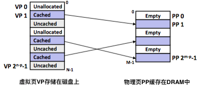


那么具体是怎么判断一个虚拟页的状态呢？怎么知道虚拟页放在哪个物理页中呢？

物理内存中存在一个叫**页表**(page table)的数据结构，由操作系统负责。页表将虚拟页映射到物理页，每次内存管理单元中的**地址翻译硬件**将虚拟地址转换为物理地址时都会读取页表。

页表其实是一个**页表条目**(Page Table Entry, PTE)的数组。页表条目包含一个*有效位(*valid bit)和一个\(n\)位地址字段。


在虚拟内存的习惯说法中，DRAM缓存命中/不命中，特称为**页命中**/**缺页**(Page Hit/ Fault)。

#### 2.2 作为内存管理的工具

操作系统为每个进程提供了一个独立的页表，也就是提供了一个独立的虚拟地址空间。多个虚拟页面可以映射到同一个共享物理页面上。虚拟内存简化了链接和加载、代码和数据共享、以及应用程序的内存分配。


#### 2.3 作为内存保护的工具

一方面，每个进程拥有独立的地址空间使得区分不同进程的私有内存变得容易。另一方面在每个页表条目PTE中，添加了额外的**许可位**(SUP, READ, WRITE, EXEC)来控制对一个虚拟页面内容的访问：

* SUP位表示进程是否运行在超级用户模式下才能访问
* READ/WRITE位控制读和写的访问
* EXEC位控制执行的访问

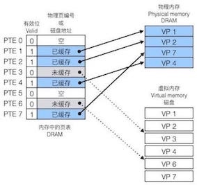


如果违反许可条件，那么就触发段错误(segmentation fault)。

### 3 地址翻译

地址翻译是虚拟地址空间和物理地址空间之间的映射。CPU中的**页表基址寄存器**(Page Table Base Register, PTBR)指向当前页表。

* \(n\)位的虚拟地址包含两个部分：一个\(p\)位的**虚拟页面偏移**(Virtual Page Offset, VPO)和一个\(n-p\)位的**虚拟页号**(Virtual Page Number, VPN)。
* \(m\)位的物理地址包含两个部分：一个\(p\)位的**物理页面偏移**(Physical Page Offset, PPO)和一个\(m-p\)位的**物理页号**(Physical Page Number, PPN)。
* 物理页面偏移和虚拟页面偏移是相通的。


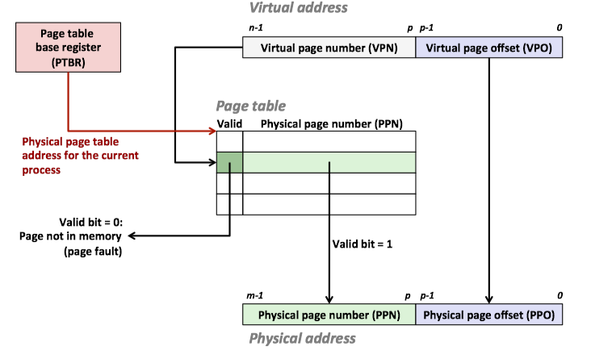

#### 利用TLB加速地址翻译

每次CPU产生一个虚拟地址，MMU就必须查阅一个PTE。为了试图消除这种开销，在MMU中包含了一个关于PTE的缓存，称为**转译后备缓冲器**(Translation Lookaside Buffer, TLB)

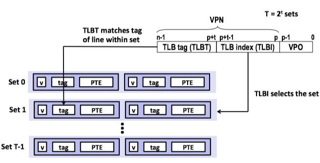

#### 多级页表

用来压缩页表的常用方法是使用层次结构的页表。

* 虚拟地址被划分为\(k\)个VPN和1个VPO。
* 每个VPN \(i\)都是一个到第\(i\)级页表的索引，其中\(\le i \le k\)。
* 第\(j\)级页表中的每个PTE都指向第\(j+1\)级的某个页表的基址。
* 第\(k\)级页表中的每个PTE包含某个物理页面的PPN。

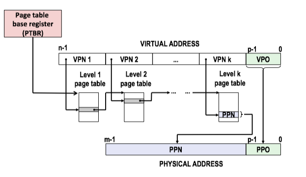


### 4 core i7内存系统

#### Core i7简介


Core i7在2008年冬季发布，基于全新Nehalem(/nəˈheɪləm/)架构，它的芯片结构如下所示：

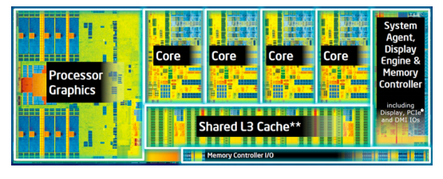

现在的Core i7支持48位(256TB)虚拟地址空间和52位(4PB)物理地址空间。

下图给出了Core i7内存系统的重要部分。处理器封装(Processor package)包括四个核、一个大的所有核共享的L3高速缓存，以及一个DDR3内存控制器。 每一个核包含一个层次结构的TLB、一个层次结构的数据核指令高速缓存，以及一组快速的点到点链路(基于QuickPath技术)。

* TLB是四路组相联的
* L1、L2、L3高速缓存，块大小为64字节。
* L1、L2是8路组相联的，L3是16组相联的。

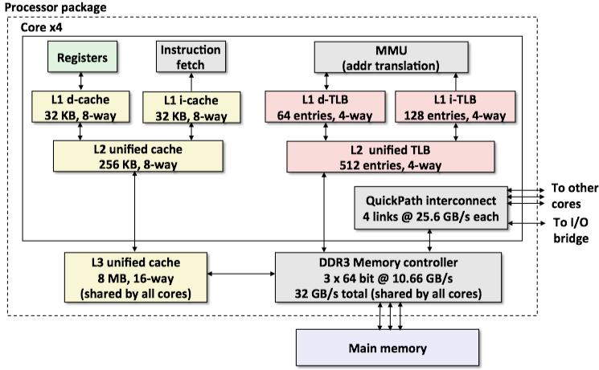

#### Core i7地址翻译

Core i7采用四级页表层次结构。每个进程都有它自己私有的页表层次结构。CR3控制寄存器指向第一级页表(L1)的起始位置。

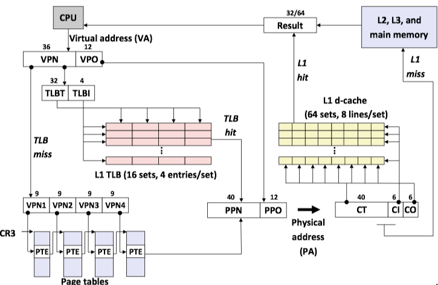


Core i7第1-3级页表条目格式：


Each entry references a 4K child page table. **Significant fields**:

* **P**: Child page table present in physical memory (1) or not (0).
* **R/W**: Read-­‐only or read-­‐write access access permission for all reachable pages. 
* **U/S**: user or supervisor (kernel) mode access permission for all reachable pages.
* **WT**: Write-­‐through or write-­‐back cache policy for the child page table.
* **A**: _Reference bit_ (引用位，set by MMU on reads and writes, cleared by software).
* **PS**: Page size either 4 KB or 4 MB (defined for Level 1 PTEs only).
* **Page table physical base address**: 40 *most significant bits*(最高[有效位](https://chortle.ccsu.edu/AssemblyTutorial/Chapter-14/ass14_4.html)) of physical page table address (forces page tables to be 4KB aligned) 
* **XD**: Disable or enable instruction fetches from all pages reachable from this PTE.

Core i7第4级页表条目格式：


* **Page physical base address**: 40 *most significant bits* of physical page address (forces pages to be 4KB aligned)
* **D**: _Dirty bit_ (脏位, or modify bit，set by MMU on *writes*, cleared by software)

下图给出了Core i7 MMU如何使用四级页表将虚拟地址翻译成物理地址。36位VPN被划分为四个9位的片，每个片被用作一个页表的偏移量。VPN1提供到一个L1 PET的偏移量，这个PTE包含L2页表的基地址。VPN2提供到一个L2 PET的偏移量，以此类推。

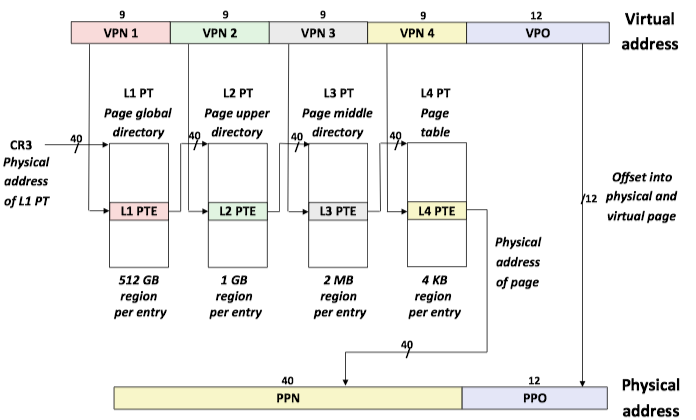


### 5 Linux虚拟内存系统

Linux为每个进程维护了一个单独的虚拟地址空间。Linux将虚拟内存组织成一些**区域**的集合。一个区域就是已分配的虚拟内存的连续片。


Linux虚拟地址空间由如下几个区域组成：

* 代码（`.text`）: 这里存放的是CPU要执行的指令。代码段是可共享的，相同的代码在内存中只会有一个拷贝，同时这个段是只读的，防止程序由于错误而修改自身的指令。
* 初始化数据段（`.data`）: 这里存放的是程序中需要明确赋初始值的变量，例如位于所有函数之外的全局变量：`int val="100`。需要强调的是，以上两段都是位于程序的可执行文件中，内核在调用`exec`函数启动该程序时从源程序文件中读入。
* 未初始化数据段（`.bss`）: 位于这一段中的数据，内核在执行该程序前，将其初始化为0或者`null`。例如出现在任何函数之外的全局变量：int sum;
* 堆（`Heap`）: 这个段用于在程序中进行动态内存申请，例如经常用到的`malloc`，`new`系列函数就是从这个段中申请内存。
* 共享库(`Shared Library`): 用来存放像C标准库和数学哭这样的共享库的代码和数据的区域。
* 栈（`Stack`）: 函数中的局部变量以及在函数调用过程中产生的临时变量都保存在此段中，具体见下面一节。
* 内核虚拟内存：包含内核中的代码和数据结构。

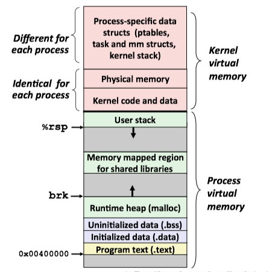

下面是程序示意：

```C
 #include<stdio.h>    
 #include <malloc.h>    
     
 void print(char *,int);    
 int main()    
{    
     char *s1 = "abcde";  //"abcde"作为字符串常量存储在常量区 s1、s2、s5拥有相同的地址  
     char *s2 = "abcde";    
     char s3[] = "abcd";    
     long int *s4[100];    
     char *s5 = "abcde";    
     int a = 5;    
     int b =6;//a,b在栈上，&a>&b地址反向增长    
     
     printf("variables address in main function: 
     s1=%p  s2=%p s3=%p s4=%p s5=%p a=%p b=%p \n", s1,s2,s3,s4,s5,&a,&b);   
     printf("variables address in processcall:n");    
     print("ddddddddd",5);//参数入栈从右至左进行,p先进栈,str后进 &p>&str    
     printf("main=%p print=%p \n",main,print);    
     //打印代码段中主函数和子函数的地址，编译时先编译的地址低，后编译的地址高main<print    
 }    
  
 void print(char *str,int p)    
{    
     char *s1 = "abcde";  //abcde在常量区，s1在栈上    
     char *s2 = "abcde";  //abcde在常量区，s2在栈上 s2-s1=6可能等于0，编译器优化了相同的常量，只在内存保存一份    
     //而&s1>&s2    
     char s3[] = "abcdeee";//abcdeee在常量区，s3在栈上，数组保存的内容为abcdeee的一份拷贝    
     long int *s4[100];    
     char *s5 = "abcde";    
     int a = 5;    
     int b =6;    
     int c;    
     int d;           //a,b,c,d均在栈上，&a>&b>&c>&d地址反向增长    
     char *q=str;   
     int m=p;           
     char *r=(char *)malloc(1);    
     char *w=(char *)malloc(1) ;  // r<w 堆正向增长    
    
     printf("s1=%p s2=%p s3=%p s4=%p s5=%p a=%p b=%p c=%p d=%p str=%p q=%p p=%p m=%p r=%p w=%p \n", s1,s2,s3,s4,s5,&a,&b,&c,&d,&str,q,&p,&m,r,w);   
     /* 栈和堆是在程序运行时候动态分配的，局部变量均在栈上分配。 
        栈是反向增长的，地址递减；malloc等分配的内存空间在堆空间。堆是正向增长的，地址递增。   
        r,w变量在栈上(则&r>&w)，r,w所指内容在堆中(即r<w)。*/   
 }    
```


#### Linux是如何组织虚拟内存的


那么Linux具体是怎么组织虚拟内存的呢？Linux内核为系统中的每个进程维护一个单独的任务结构体(`task_struct`, 在`sched.h`头文件中)。`task_struct`中的元素包含运行该进程所需要的所有信息(PID、指向用户栈的指针、可执行目标文件的名字、以及程序计数器)。


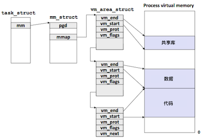

`task_struct`中的一个元素指向`mm_struct`，它描述了虚拟内存的当前状态。`pgd`指向第一级页表的基址，而`mmap`指向一个`vm_area_struct`(区域结构, 定义在`mm_types.h`)的链表。每个区域结构链表都描述了虚拟地址空间的一个区域，包含以下字段：

* `vm_start`: 指向区域的起始处
* `vm_end`: 指向区域的结束处
* `vm_prot`: 描述着区域内包含的所有页的读写许可权限
* `vm_flags`: 描述进程共享/私有
* `vm_next`: 下一个区域结构


#### Linux 缺页异常处理

内存管理单元MMU在试图翻译某个虚拟地址A时，触发了一个缺页异常，引起缺页异常处理程序：

* 虚拟地址A是合法的吗？-> 段错误(segment fault)
* 试图进行的内存访问是合法的吗？ -> 保护异常(也引发段错误)

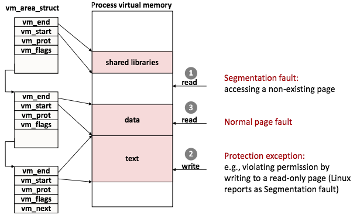


### 6 内存映射

Linux 通过将一个虚拟内区域与一个磁盘上的*对象*(object)关联起来，以初始化这个虚拟内存区域的内容，这个过程称为**内存映射**(memory mapping).

一旦一个虚拟页面被初始化了，它就在一个由内核维护的专门的**交换文件**(swap file)之间换来换去。交换文件也叫做**交换空间**(swap space)或交换区域(swap area)。

#### 再看共享对象

一个对象可以被映射到虚拟内存的一个区域，要么作为**共享对象**，要么作为**私有对象**。

* 如果一个进程将一个共享对象映射到它的虚拟空间的一个区域内，那么这个进程对这个区域的任何写操作，对于那些也把这个共享对象映射到它们虚拟内存的其他进程而言，也是可见的。而且，这些变化也会反映在磁盘上的原始对象中。
* 对于一个映射到私有对象的区域做的改变，对于其他进程来说是不可兼得。
* 即使对象被映射到了多个共享区域，物理内存中也只需要存放共享对象的一个副本。
* 私有对象使用**写时复制**(copy-on-write)的巧妙技术被映射到虚拟内存中。对于每个映射私有对象的进程，相应私有区域的页表条目都被标记为只读，并且区域结构被标记为**私有的写时复制**。
    * 只要没有进程时图写它的私有区域，它们就可以继续共享物理内存中对象的一个单独副本。
    * 只要有一个进程试图写私有区域的某个页面，故障处理程序就会在物理内存中创建这个页面的一个新副本，更新页表条目指向这个新的副本，然后恢复这个页面的可写权限。

    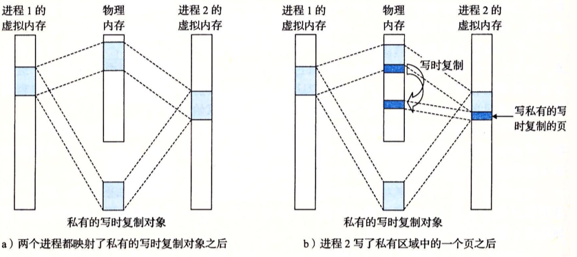

#### 再看fork函数

当fork函数被当前进程调用时，内核为新进程创建各种数据结构，并分配给它一个唯一的PID。

* 为了给这个新进程创建虚拟内存，它创建了当前进程的`mm_struct`、区域结构`vm_area_struct`和页表的原样副本。
* 内核将两个进程中的每个页面都标记为只读，并将两个进程中的每个区域结构都标记为私有的写时复制。
* 当这两个进程中的任何一个进行写操作时，写时复制机制就会创建新页面。

#### 再看execve函数

execve函数在当前进程中加载并运行新程序：

* 删除已存在的用户区域。
* 映射私有区域。
* 映射共享区域。
* 设置程序计数器。


#### 用户级内存映射

Linux进程可以使用mmap函数来创建新的虚拟内存区域，并将对象映射到这些区域中。

```C
void *mmap(void *start, int len, int prot, int flags, int fd, int offset)
```

mmap函数要求内核创建一个新的虚拟内存区域，最好是从地址start开始的一个区域，并将文件描述符fd制定的对象的一个连续的片(chunk)映射到这个新的区域。连续的对象片大小为len字节，从距文件开始处偏移量为offset字节的地方开始。其参数：

* `start`: may be 0 for “pick an address”
* `prot`: PROT_READ, PROT_WRITE, ...
* `flags`: MAP_ANON, MAP_PRIVATE, MAP_SHARED, ...
* Return a pointer to start of mapped area 

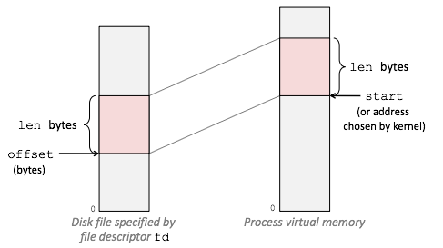


### 7 动态内存分配

程序使用动态内存分配的最重要的原因是经常直到程序实际运行时，才知道某些数据结构的大小。一般使用动态内存分配器(dynamic memeory allocator)来分配动态内存。

分配器根据哪个实体来负责释放已分配的块，分为两种：

* **显示分配器**(explicit allocator)：要求程序显示地释放任何已分配的块。例如C中的malloc/free，C++中的new/delete。
* **隐式分配器**(implicit allocator): 除此之外，自动释放未使用的已分配块(垃圾收集，garbage collection)。


#### 7.2 显式分配器的要求和目标

#### 7.2.1 分配器的要求

分配器有如下的要求：

* 处理任意请求序列
* 立即相应请求
* 只使用堆
* 对齐块(对齐要求)
* 不修改已分配的块

#### 7.2.2 分配器的目标

分配器试图最大化吞吐率和内存利用率

* 最大化吞吐率(吞吐率：每个单位时间里完成的请求数)
* 最大化内存利用率

最大化吞吐率和最大化利用率之间是相互 _牵制_ 的，分配器设计的目标是在这两者之间找到一个适当的平衡。

造成利用率很低的主要原因是**碎片**(fragmentation)现象。当有效载荷比块要小时，发生**内部碎片**(Internal fragmentation)，引起的原因有：对齐等。


当即使有足够的累积的块内存，但是没有单一块能够满足需求时，发生**外部碎片**(external fragmentation)：

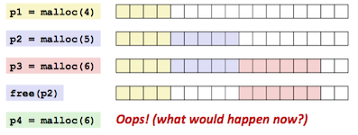


外部碎片还取决于将来的请求，例如上图，如果最后的p4请求4个字节呢？也就不会发生碎片。正因为外部碎片难以量化且不可能预测，所以分配器通常采用启发式策略来试图维持少量的大空闲块，而不是维持大量的小空闲块。

#### 7.2.3 放置已分配的块

当一个应用请求一个\(k\)字节的块时，分配器搜索空闲链表，查找一个足够大可以放置所请求块的空闲块。分配器的**放置策略**(placement policy)有**首次适配**(first fit)、**下一次适配**(next fit)和**最佳适配**(best fit)。

* *首次适配*从头开始搜索空闲链表，选择第一个适合的空闲块。
* *下一次适配*从上一次查询结束的地方开始。
* *最佳适配*检查每个空闲块，选择适合所需请求大小的最小空闲块。

#### 7.3 实现方法

* 隐式空闲列表 Implicit Free List
* 显式空闲列表 Explicit Free List
* 分离式空闲列表 Segregated Free List

#### 7.3.1 隐式空闲列表


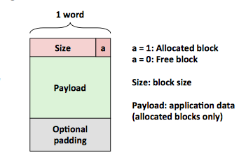


隐式空闲链表优点是简单，缺点是操作开销大。因为无论是分配还是释放块，都需要对隐式空闲列表进行搜索，复杂度是\(O(n)\)，\(n\)是已分配块和空闲块的总数。


#### 7.3.2 显式空闲列表

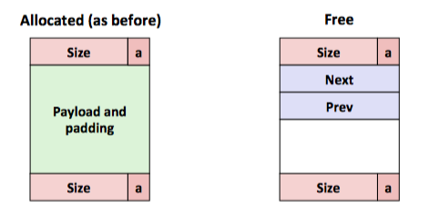


#### 7.3.3 分离式空闲列表


### 8 垃圾收集

**垃圾收集器**(garbage collector)是一种动态内存分配器，它自动释放程序不再需要的已分配块。这些块被称作*垃圾*(garbage)。自动回收存储的过程叫做*垃圾收集*(garbage collection)。

[Java Garbage Collection](../hfj/ch9/#object-lifecycle)

垃圾收集器将内存视为一张有向*可达图*(reachability graph)。

* 图的节点被分成一组*根节点*(root node)和一组*堆节点*(heap node). 
* 有向边\(p\rightarrow q\)意味着块\(p\)中的某个位置指向块\(q\)中的某个位置。
* 根节点不在堆中，包含指向堆中的指针。
* 当存在一条从任意根节点出发并到达\(p\)的有向路径时，节点\(p\)是*可达*的。
* 垃圾收集器维护可达图的某种表示，并释放不可达节点。

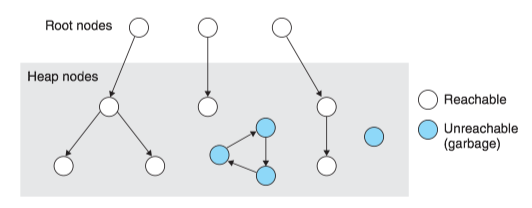

### 9 C程序中常见的与内存有关的错误

#### 间接引用坏指针

这是非常常见的例子，没有引用对应的地址，少了 &

```C
int val;
scanf("%d", val); // 正确应该是scanf("%d, &val);
```

#### 读未初始化的内存

**堆内存是没有被初始化为0的**：

```C
/* return y = Ax */
int *matvec(int **A, int *x) {
    int *y = malloc(N * sizeof(int));
    int i, j;
    
    for (i = 0; i < N; i++)
        for (j = 0; j < N; j++)
            y[i] += A[i][j] * x[j];
    return y;
}
```

正确的方法是显式地将y[i]设置为0，或者使用`calloc`。


#### 允许栈缓冲区溢出

没有检查字符串的长度（经典的缓冲区溢出攻击也是利用相同的机制）

```C
char s[8];
int i;
gets(s); /* stack buffer overflow, reads "123456789" from stdin */
```

#### 引用不存在的变量

尽管指针仍然指向一个合法的内存地址，但是已经不再指向一个合法的变量了。以后在程序中调用其他函数时，内存将重用它们的栈针。

```C
int *foo() {
    int val;
    
    return &val;
}
```

#### 多次释放

这个不用多说，不能重复搞两次

```C
x = malloc(N * sizeof(int));
//  <manipulate x>
free(x);
y = malloc(M * sizeof(int));
//  <manipulate y>
free(x);
```

#### 引用已经被释放的堆块中的数据

同样是很明显的错误，不要犯

```C
x = malloc(N * sizeof(int));
//  <manipulate x>
free(x);
//  ....
y = malloc(M * sizeof(int));
for (i = 0; i < M; i++)
    y[i] = x[i]++;
```

#### 忘记释放已分配块：

```C
foo() {
    int *x = malloc(N * sizeof(int));
    // ...
    return ;
}
```

或者只释放了数据结构的一部分：

```C
struct list {
    int val;
    struct list *next;
};
foo() {
    struct list *head = malloc(sizeof(struct list));
    head->val = 0;
    head->next = NULL;
    //...
    free(head);
    return;
}
```


