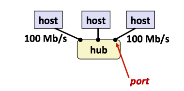
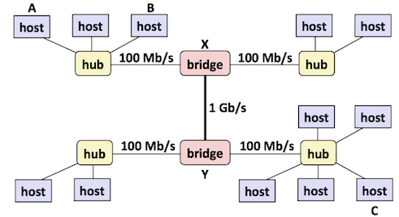
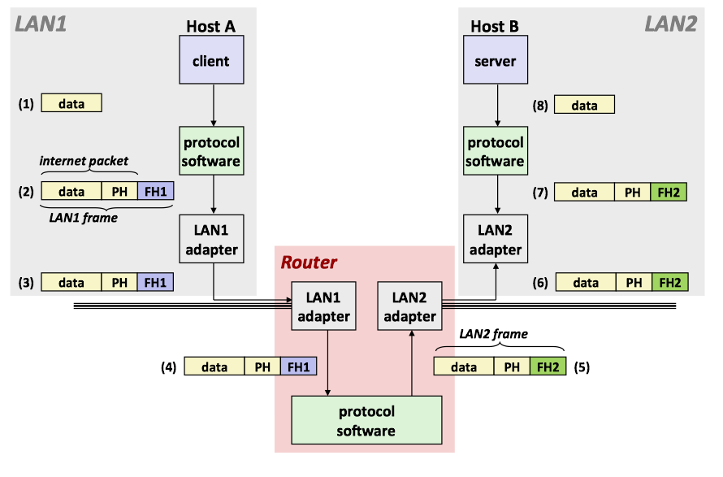
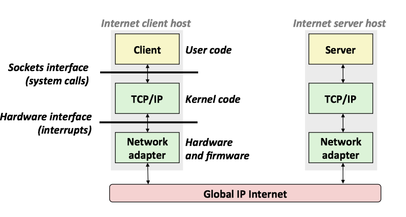
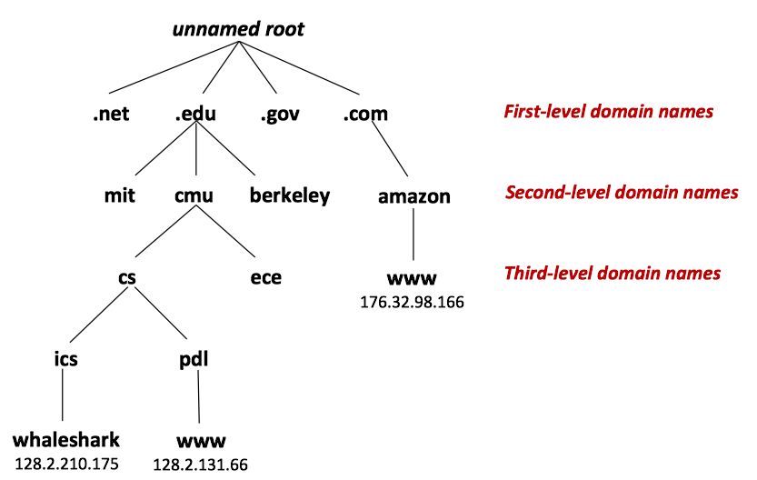
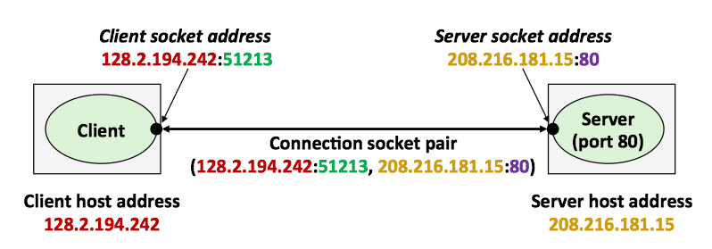
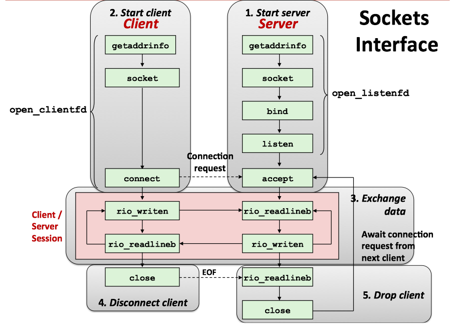
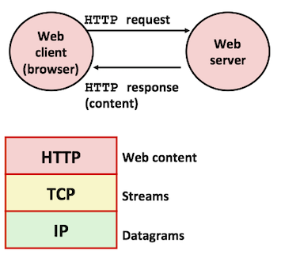
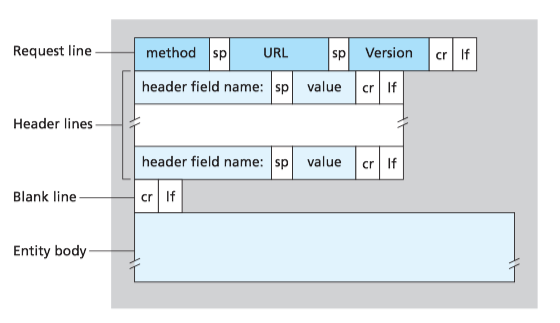

### 1 客户端-服务器编程模型

每个网络应用都是基于**客户端-服务器**模型的。

客户端-服务器模型中的基本操作是**事务**(transaction)。一个客户端-服务器事务由以下四步组成：

1. 当一个客户端需要服务时，它向服务器发送一个请求，发起一个事务。
2. 服务器收到请求后，解释它，并以适当的方式操作它的资源。
3. 服务器给客户端发送一个响应，并等待下一个请求。
4. 客户端收到响应并处理它。


**客户端和服务器是进程**，而不是常提到的机器或者主机。

* 一台主机可以同时运行许多不同的客户端和服务器
* 一个客户端和服务器的事务可以在同一台或是不同的主机上。

### 2 网络

对主机而言，网络只是又一种I/O设备，是数据源和数据接收方。物理上而言，网络是一个按照地理远近组成的层次系统。

#### 网络层次系统

(1) 最底层：以太网段
**局域网**(LAN, Local Area Network)的范围一般限制在一个建筑或者校园内。最流行的局域网技术是**以太网**(Ethernet)，由电缆和集线器(hub)组成一个以太网段。



(2) 桥接以太网
**桥接以太网**(bridged Ethernet)是将以太网段用电缆和网桥(bridge)连接成的较大的局域网。


(3) 互联网络
多个不兼容的局域网可以通过路由器(routers)连接成互联网络(internets)。


#### 网络协议

互联网络是由各种局域网和广域网组成，它们采用完全不同且不兼容的技术。那么如何能让某台主机跨过所有不兼容的网络发送数据位到另一台目的主机呢？

解决方法：一层运行在每台主机和路由器上的**协议**软件，它消除了不同网络之间的差异。协议提供了两种基本能力：
* 提供了命名机制
    * 定义一致的**主机地址**(host adress)格式
    * 每台主机会被分配至少一个**互联网络地址**(internet address)，地址唯一地标识了主机
* 提供了传送机制
    * 定义了统一的基本传送单位-**包**(packet)
    * 包由**包头**(header)和**有效载荷**(payload)组成
        * 包头包括包的大小以及源主机和目的主机的地址
        * 有效载荷包括从源主机发出的数据位
    
    

PH: Internet packet header, 互联网络包头
FH: LAN frame header, 局域网帧头


### 3 全球IP因特网

全球IP因特网(Global IP Internet)是最著名和最成功的互联网络(internet)实现。每台因特网主机都运行实现TCP/IP协议的软件，使用套接字接口(sockets interface)函数和Unix I/O函数来通信。



从程序员的角度：
* 主机被映射为一组32位的**IP地址**(IP addresses)
    * 128.2.203.179
* IP地址被映射为一组标识符，叫做**域名**(domain name)
* 因特网主机上的进程能够通过**连接**和任何其他因特网主机上的进程通信。

#### IP地址

32位IP地址存在一个IP地址结构(`in_addr`)中
* IP地址在内存中是以**网络字节顺序**(network byte order, 大端法)存放的

```c
/* Internet address structure */ 
struct in_addr { 
    uint32_t s_addr; /* network byte order (big-endian) */ 
};
```

#### 域名

**域名**(domain names)是一串用句点分隔的单词(字母、数字和破折号)。域名集合形成了一个层次结构，可以表示为一棵树。




**域名系统**(Domain Naming System, DNS)是映射IP地址和域名的数据库。可以把DNS数据库视为上百万的**主机条目结构**(host entry structure)的集合，其中每条定义了一组域名和一组IP地址之间的映射。

* DNS映射，可以通过`nsloopup`查看
* 在最简单的情况中，一个域名和一个IP地址之间是一一映射
    * `nslookup whaleshark.ics.cs.cmu.edu` - `Address: 128.2.210.175`
* 然而，在某些情况下，多个域名可以映射为同一个IP地址
    * `nslookup cs.mit.edu/ nslookup eecs.mit.edu` - `Address: 18.62.1.6`
* 在最通常的情况下，多个域名可以映射到同一组的多个IP地址
    * `nslookup www.twitter.com` - `Address: 199.16.156.6`, `Address:199.16.156.70`
       
#### 因特网连接

客户端和服务器通过**连接**(connections)发送字节流来通信，每一个连接都有如下特点：

* 点对点(point-to-point)：连接一对进程
* 全双工(full-duplex)：数据可以同时在两个方向传送
* 可靠性(reliable)：发送和接收的字节流顺序相同

套接字(sockets)是连接的端点，套接字地址用 "地址：端口"来表示。

* 端口(port)是一个16位整数，标识了一个进程。
    * 临时端口：当可会淡发起连接请求时，内核自动分配的端口
    * 知名端口：和服务器提供的服务有短的端口 (
        * Web服务器使用端口80
        * ssh服务器使用端口22
        * email服务器使用端口25

一个连接是由它两端的套接字地址唯一确定的（套接字对, socket pair）。



使用端口来识别服务


### 4 套接字接口

什么是套接字？
* 对于内核来说，套接字是通信的端点。 To the kernel, a socket is an endpoint of communication
* 对于应用来说，套接字是让应用从网络读写的文件描述符。 To an application, a socket is a file descriptor that lets the application read/write from/to the network.

客户端和服务器通过对套接字描述符读写进行通信：


(1) 通用套接字地址(generic socket address)：
* 以套接字地址作为`connect()`, `bind()`, `accept`的实参
* 仅仅因为那时的C不存在`void *`指针，所以套接字接口被设计成这样。

```c
struct sockaddr { 
    uint16_t sa_family; /* Protocol family */
    char sa_data[14]; }; /* Address data. */
```
(2) 因特网的套接字地址
* 必须将`struct sockaddr_in *` 转换为 `struct sockaddr *`才能以套接字地址作为函数实参

```C
struct sockaddr_in {
    uint16_t sin_family;
    uint16_t sin_port;
    struct in_addr sin_addr;
    unsigned char sin_zero[8];
    };
```




1. 开启服务器(start server)
    * `getaddrinfo`: 把主机名(hostname）、主机地址(host addresses)、端口(ports)和服务名(service names)转换为套接字地址结构。
    * `socket`: 创建一个套接字描述符(socket descriptor)，也就是之后用来读写的 file descriptor
    * `bind`: 请求内核把套接字地址和套接字描述符绑定
    * `listen`: 将套接字描述符从一个主动套接字转换为监听套接字(listening socket)，该套接字可以接受来自客户端的连接请求
    * `accept`: 等待来自客户端的连接请求
2. 开启客户端(start client)
    * `getaddrinfo`, `socket`与开启服务器相同
    * `connect`: 试图与服务器建立连接

#### Echo客户端和服务器示例

在和服务器建立连接之后，客户端进入一个循环，反复从标准输入读取文本行，发送文本行给服务器，从服务器读取回送的行，并输出结果到接准输出。

```c
#include "csapp.h"
int main (int argc, char **argv) {
    int clientfd;
    char *host, *port, buf[MAXLINE];
    rio_t rio;
    
    host = argv[1];
    port = argv[2];
    
    //和服务器建立连接
    clientfd = Open_clientfd(host, port);
    Rio_readinitb(&rio, clientfd);
    
    while (Fgets(buf, MAXLINE, stdin) != NULL) {
        // 写入，也就是向服务器发送信息
        Rio_writen(clientfd, buf, strlen(buf));
        // 读取，也就是从服务器接收信息
        Rio_readlineb(&rio, buf, MAXLINE);
        // 把从服务器接收的信息显示在输出中
        Fputs(buf, stdout);
    }
    Close(clientfd);
    exit(0);
}
```

服务器在打开监听描述符后，进入一个无限循环。每次循环都等待一个来自客户端的连接请求，输出已连接客户端的域名和IP地址，并调用`echo`函数为这些客户端服务。在`echo`程序返回后，主程序关闭已连接描述符。

```c
#include "csapp.h"
void echo(int connfd);
int main(int argc, char **argv){
    int listenfd, connfd;
    socklen_t clientlen;
    struct sockaddr_storage clientaddr; // Enough room for any addr
    char client_hostname[MAXLINE], client_port[MAXLINE];
    
    // 开启监听端口，注意只开这么一次
    listenfd = Open_listenfd(argv[1]);
    while (1) {
        // 需要具体的大小
        clientlen = sizeof(struct sockaddr_storage); // Important!
        // 等待连接
        connfd = Accept(listenfd, (SA *)&clientaddr, &clientlen);
        // 获取客户端相关信息
        Getnameinfo((SA *) &clientaddr, clientlen, client_hostname,
                     MAXLINE, client_port, MAXLINE, 0);
        printf("Connected to (%s, %s)\n", client_hostname, client_port);
        // 服务器具体完成的工作
        echo(coonfd);
        Close(connfd);
    }
    exit(0);
}
void echo(int connfd) {
    size_t n;
    char buf[MAXLINE];
    rio_t rio;
    
    // 读取从客户端传输过来的数据
    Rio_readinitb(&rio, connfd);
    while((n = Rio_readlineb(&rio, buf, MAXLINE)) != 0) {
        printf("server received %d bytes\n", (int)n);
        // 把从 client 接收到的信息再写回去
        Rio_writen(connfd, buf, n);
    }
}
```


### 5 Web服务器

#### Web基础

Web客户端和服务器之间的交互用的是**HTTP协议**(超文本传输协议)，交互的基本过程为：

* 客户端和服务器建立TCP连接
* 客户端请求内容
* 服务器响应请求的内容
* 服务器和客户端最终关闭 连接



#### Web内容

Web服务器返回内容给客户端，内容是与一个**MIME**类型相关的字节序列。(MIME -  Multipurpose Internet Mail Extensions)

HTTP响应返回的类型可以是静态的，也可以是动态的：

* 静态内容：内容存储在文件中，响应HTTP请求后返回给客户端
    * 例如HTML文件，图片，声音
* 动态内容：运行一个可执行文件产生输出，返回给客户端

#### HTTP消息结构

一个**HTTP请求**(request)是一个**请求行**(request line)，后面跟随着零个或多个**请求报头**(request header)，再跟随一个终止报头的空行。

**请求行**的格式是`<method> <uri> <version>`。

* `<method>`请求方法：可以是GET, POST, OPTIONS, HEAD, PUT, DELETE, TRAXE
* `<uri>`统一资源标识符(uniform resource identifier)：是响应的URL的后缀，包括文件名和可选的参数
* `<version>`该请求遵循的HTTP的版本：HTTP/1.0或者HTTP/1.1
    


**请求报头**的格式是`<header name>:<header data>`

* 为服务器提供额外信息，例如浏览器的商标名




**HTTP响应**与HTTP请求类似，是一个**响应行**(response line)，后面跟着零个或者多个**响应报头**(response header)，再跟随一个终止报头的空行，再跟随一个响应主体(response body)。

**响应行**的格式是`<version> <status code> <status message>`

* `<version>`是响应所遵循的HTTP版本
* `<status-code>`是一个3位的正整数，指明对请求的处理
* `<status-message>` 英文描述

**响应报头**的格式是`<header name>:<header data>`

下面是HTTP请求的一个实例:

```text
GET /somedir/page.html HTTP/1.1 
Host: www.someschool.edu
Connection: close 
User-agent: Mozilla/5.0 
Accept-language: fr
```

一个Java的例子：

```Java
import java.io.BufferedReader;
import java.io.InputStreamReader;
import java.io.PrintWriter;
import java.net.Socket;

public class MyBlogClient {
    public void http_request(){
        try{
            Socket s = new Socket("192.30.252.153", 80);
            PrintWriter writer = new PrintWriter(s.getOutputStream());
            InputStreamReader streamReader = new InputStreamReader(s.getInputStream());
            BufferedReader br = new BufferedReader(streamReader);

            //注意换行符是\r\n
            writer.println("GET /index.html HTTP/1.0 \r\n Host: larryim.cc  \r\n   \r\n ");

            String line = null;

            while ((line= br.readLine())!= null){
                System.out.println(line);
            }

            br.close();
            writer.close();


        } catch (Exception ex){
            ex.printStackTrace();
        }
    }

    public static void main(String[] args){
        MyBlogClient client = new MyBlogClient();
        client.http_request();
    }

}
```

#### HTTP请求方法

| 请求方法 | 描述 | 
| --- | --- |
| GET	| 请求指定的页面信息，并返回实体主体。| 
| HEAD	| 类似于get请求，只不过返回的响应中没有具体的内容，用于获取报头。| 
| POST | 向指定资源提交数据进行处理请求（例如提交表单或者上传文件）。数据被包含在请 | 求体中。POST请求可能会导致新的资源的建立和/或已有资源的修改。| 
| PUT	| 从客户端向服务器传送的数据取代指定的文档的内容。| 
| DELETE	| 请求服务器删除指定的页面。
| CONNECT	| HTTP/1.1协议中预留给能够将连接改为管道方式的代理服务器。| 
| OPTIONS	| 允许客户端查看服务器的性能。| 
| TRACE	| 回显服务器收到的请求，主要用于测试或诊断。| 


