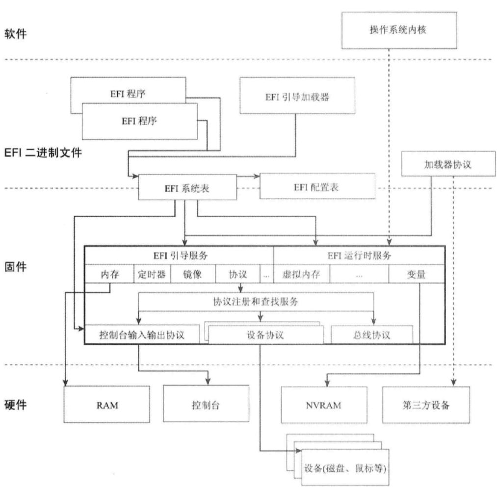

### 2 架构


* 用户体验层(user experience)：包括Aqua, Dashboard、Spotlight和Accessibility等
* 应用框架层(application frameworks)：包括Cocoa和Java，提供了Objective-C和Swift语言的API支持
* 核心框架层(core frameworks)：提供了图形和媒体的支持
* Darwin：包括内核和Unix Shell环境

#### 用户体验层

Aqua有很多特性，例如半透明窗口和图形特效。

QuickLook允许在Finder中快速预览多种不同类型的文件。QuickLook采用的是可扩展的架构，使得大部分工作都由插件完成。这些插件是后缀`.qlgenerator`的bundle，只要将这些bundle文件拖放到QuickLook目录(/System/Library/QuickLook)即可完成插件的安装。

Spotlight是一项快速搜索技术，其背后是一个索引服务器mds，mds在MetaData框架中，而这个框架是系统核心服务的一部分。mds是一个没有GUI的后台服务程序。每当有任何文件操作时，内核都会通知这个后台服务程序。当mds收到通知时，mds会通过工作进程(mdworker)将各种元数据信息导入数据库。mdworker进程可以加载一个具体的Spotlight Importer从文件中提取元数据信息。

#### Darwin

OS X中的Darwin时一个完全成熟的UNIX实现，通过了UNIX认证。然而，UNIX洁面对于大多数用户来说是隐藏的。

OS X也有那些标准UNIX具有的目录结构：

* `/bin`：UNIX中的二进制程序。这是常用UNIX命令(例如ls, rm, mv, df等)所在的地方
* `/sbin`: 系统程序。这些二进制程序用于系统管理，例如文件系统管理和网络配置等
* `/usr`: User目录，但并不是给用户用的，第三方的软件可以安装在这里。`/usr/lib`用于存放共享的目标文件
* `/etc`: 包含大部分系统配置文件
* `/dev`: 设备文件
* `/tmp`: 临时目录
* `/var`: 各种杂项文件

OS X在UNIX目录树中添加了自己特有的目录。在系统根目录下，这些目录包括

* `/Applications`: 系统中所有应用程序的默认目录
* `/Library`: 系统应用的数据文件、帮助和文档等数据
* `/System`：系统文件目录，几乎包含了系统中的所有重要组件，例如框架(`/System/Library/Framework`)， 内核模块(`/System/Library/Extensions`)和字体。
* `/Users`: 所有用户的主目录
* `/Volumes`: 文件系统的挂载点

#### bundle

苹果对bundle的定义是"一种标准化的层次结构，保存了可执行代码以及代码所需要的资源"。所有的bundle都有同样的基本目录结构：


```text
Contents/
    Info.plist      元数据信息
    MacOS/          包的二进制文件内容
    PkgInfo         包的8字节标识符
    Resources/      .nib文件和.lproj文件
    Version.plist   包版本信息
    _CodeSinature/
```

#### 应用程序

应用程序整洁地包装在bundle中。Resources目录包含应用程序要求使用的所有文件。


#### 框架

框架(framework)其实就是bundle，包含一个或多个共享库以及相关的支持文件。框架是苹果系统特有的，所以不可移植。

### 6 引导

引导过程指的是从计算机通电那一瞬间到CPU开始执行操作系统代码时的整个过程。其他操作系统用的都是默认(通用)的引导加载器(boot loader)，而OS X使用的则是自己的引导加载器。

EFI规范了一组应用程序接口，基于EFI的程序可以利用这些接口实现功能。EFI程序通常是引导加载器(例如Linux的GRUB，苹果的boot.efi和BootCamp)，也可以是一些诊断程序(例如是苹果的硬件测试工具)。




EFI提供了EFI二进制程序使用的API接口，程序可以通过这些接口访问基本的硬件功能。这些服务分为两类 -- 引导服务和运行时服务。 NVRAM提供环境变量的功能，它在系统范围内存在，操作系统和固件本身都可以访问


### 7 launchd

在OS X中，整个用户环境都必须从launchd启动。作为系统中的第一个用户态进程，负责或间接地启动系统中的其他进程。这有点类似于UNIX系统中的init进程。

launchd是由内核直接启动的，PID为1。launchctl命令用来和launchd交互，指示launchd启动或停止各种后台守护程序。launchd的核心职责是根据预定的安排或实际的需要加载其他应用程序或作业。launchd区分两种类型的后台作业：

* 守护程序(daemon): 守护程序由系统自动启动，不考虑是否有用户登陆进系统。后台服务，通常和用户没有交互。
* 代理程序(agent): 只有在用户登陆时才启动。可以和用户交互，有的还有GUI。

守护程序和代理程序都是通过自己的属性列表文件(.plist)声明的。 下表列出了各种守护程序和代理程序保存的位置。

| 目录 | 用途 |
| ---  | ---  |
| `~/Library/LaunchAgents` | 用户的代理程序，只有对应的用户才会执行 |
| `/Library/LaunchAgents`   |  第三方程序的代理程序 |
| `/Library/LaunchDaemons`   | 第三方程序的守护程序 |
| `/System/Library/LaunchAgents` | 系统本身的代理程序 |
| `/System/Library/LaunchDaemons` |  系统本身的守护程序 |


`lanuchd`可以实现守护进程的加载/启动/查看:

```bash
launchctl load/unload *.plist # 加载/卸载
launchctl start/stop *.plist # 启动/停止
launchctl list # 查看
```

!!! example "Redis守护进程"
    
    需要一个plist文件配置开机启动的程序。然后使用launchctl命令加载。
    
    ```bash tab="bash"
    # 加载守护进程
    sudo launchctl load /Library/LaunchDaemons/io.redis.redis-server.plist
    # 启动守护进程
    sudo launchctl start io.redis.redis-server
    ```
    
    ```xml tab="io.redis.redis-server.plist"
    <?xml version="1.0" encoding="UTF-8"?>
    <!DOCTYPE plist PUBLIC "-//Apple//DTD PLIST 1.0//EN" "http://www.apple.com/DTDs/PropertyList-1.0.dtd">
    <plist version="1.0">
    <dict>
        <key>Label</key>
        <string>io.redis.redis-server</string>
        <key>ProgramArguments</key>
        <array>
            <string>/usr/local/bin/redis-server</string>
            <string>/usr/local/etc/redis.conf</string>
        </array>
        <key>RunAtLoad</key>
        <true/>
    </dict>
    </plist>
    ```

### 8 内核架构
