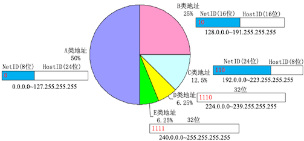

### 1 概述

### 2 虚电路和数据报网络

### 3 路由器工作原理

### 4 网际协议
#### 数据报格式

* 版本号：IP协议的版本号
* 首部长度：IP分组首部的长度，以4字节为单位
* 服务类型(TOS)：指示期望获得哪种类型的服务
* 总长度：IP分组的总字节数(首部+数据)
* 生存时间(TTL)：IP分组在网络中可以通过的路由器数
    * 路由器转发一次分组，TTL减1
    * 如果TTL=0，路由器则丢弃该IP分组
* 协议：指示IP分组封装的是哪个协议的数据包
    * 6为TCP，17为UDP 
* 首部校验和：实现对IP分组首部的差错检测
* 源IP地址、目的IP地址
* 选项字段：携带安全、源选路径、时间戳和路由记录等内容
* 填充字段：补齐整个首部，符合32位对齐

#### IPv4地址

### 5 路由选择算法

### 6 因特网中的路由选择
### 7 广播和多播路由选择
